Data Analysis and Visualization
================
Last updated: June 12, 2024

## Package Loading

``` r
library(tidyverse)
```

    ## ── Attaching packages ─────────────────────────────────────── tidyverse 1.3.2 ──
    ## ✔ ggplot2 3.4.1      ✔ purrr   0.3.4 
    ## ✔ tibble  3.1.8      ✔ dplyr   1.0.10
    ## ✔ tidyr   1.2.1      ✔ stringr 1.4.1 
    ## ✔ readr   2.1.2      ✔ forcats 0.5.2 
    ## ── Conflicts ────────────────────────────────────────── tidyverse_conflicts() ──
    ## ✖ dplyr::filter() masks stats::filter()
    ## ✖ dplyr::lag()    masks stats::lag()

``` r
library(viridis)
```

    ## Loading required package: viridisLite

``` r
library(RColorBrewer)
library(colorspace)
library(ggpubr)
library(ggridges)
library(forcats)
library(lazyeval)
```

    ## 
    ## Attaching package: 'lazyeval'
    ## 
    ## The following objects are masked from 'package:purrr':
    ## 
    ##     is_atomic, is_formula

## Data Loading

``` r
impact_data <- read.csv("/Users/kenjinchang/github/university-impact-model/data/model-output/university-impact-model.csv")
spatial_impact_data <- read.csv("/Users/kenjinchang/github/university-impact-model/data/model-output/university-impact-model-shapefile.csv")
```

## Nation-State Inclusion

``` r
spatial_impact_data %>%
  mutate(inclusion=ifelse(university_enrollment>0,country)) %>%
  ggplot(aes(x=long,y=lat,fill=inclusion,group=group)) + 
  geom_polygon(color="black",size=0.125,alpha=0.75) +
  scale_fill_discrete(h=c(260,260),na.value="white") +
  guides(fill="none") +
  xlab("") + 
  ylab("") +
  labs(caption="") +
  ggtitle("Figure X. Choropleth map indicating the 120 nation-states included in our analyses.") +
  theme(legend.position="bottom",legend.justification="right",legend.box.spacing=unit(-15,"pt"),legend.key.size=unit(10,"pt"),panel.grid=element_blank(),panel.background=element_rect(fill="white"),panel.border=element_rect(fill=NA),axis.text=element_blank(),axis.ticks=element_blank(),legend.title=element_text(size=10),legend.text=element_text(size=10),plot.title=element_text(size=10))
```

    ## Warning: Using `size` aesthetic for lines was deprecated in ggplot2 3.4.0.
    ## ℹ Please use `linewidth` instead.

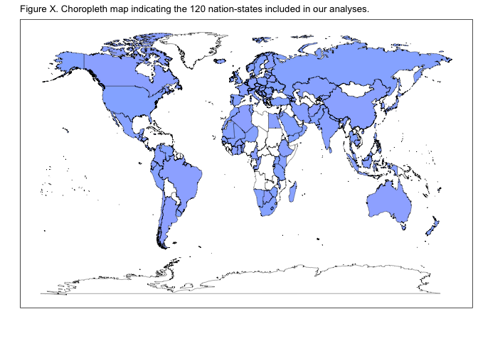<!-- -->

## Lending- and Development-Group Membership

``` r
impact_data %>%
  count(lending_group)
```

    ##   lending_group  n
    ## 1          High 46
    ## 2           Low 13
    ## 3  Lower-Middle 30
    ## 4  Upper-Middle 31

``` r
lending_group_membership <- spatial_impact_data %>%
  ggplot(aes(x=long,y=lat,group=group,fill=factor(lending_group,levels=c("Low","Lower-Middle","Upper-Middle","High","NA")))) + 
  geom_polygon(color="black",size=0.125) +
  scale_fill_brewer(palette="Set2",na.value="white",name="Lending Group",labels=c("Low (n=13)","Lower Middle (n=30)","Upper Middle (n=31)","High (n=46)","NA")) +
  xlab("") + 
  ylab("") +
  labs(caption="") +
  theme(legend.position="bottom",legend.justification="right",legend.box.spacing=unit(-15,"pt"),legend.key.size=unit(10,"pt"),panel.grid=element_blank(),panel.background=element_rect(fill="white"),panel.border=element_rect(fill=NA),axis.text=element_blank(),axis.ticks=element_blank(),legend.title=element_text(size=10),legend.text=element_text(size=10),plot.title=element_text(size=10))
```

``` r
impact_data %>%
  count(development_group)
```

    ##   development_group  n
    ## 1              High 30
    ## 2               Low 16
    ## 3            Medium 16
    ## 4         Very High 58

``` r
development_group_membership <- spatial_impact_data %>%
  ggplot(aes(x=long,y=lat,group=group,fill=factor(development_group,levels=c("Low","Medium","High","Very High","NA")))) + 
  geom_polygon(color="black",size=0.125) +
  scale_fill_brewer(palette="Set3",na.value="white",name="Development Group",labels=c("Low (n=16)","Medium (n=16)","High (n=30)","Very High (n=58)","NA")) +
  xlab("") + 
  ylab("") +
  labs(caption="") +
  theme(legend.position="bottom",legend.justification="right",legend.box.spacing=unit(-15,"pt"),legend.key.size=unit(10,"pt"),panel.grid=element_blank(),panel.background=element_rect(fill="white"),panel.border=element_rect(fill=NA),axis.text=element_blank(),axis.ticks=element_blank(),legend.title=element_text(size=10),legend.text=element_text(size=10),plot.title=element_text(size=10))
```

ggtitle(“Figure X. Choropleth map sorting the 120 nation-states included
in our analyses into their corresponding lending- and development-group
categories.”) +

``` r
ggarrange(lending_group_membership,development_group_membership,
          nrow=2,
          labels=c("A","B"))
```

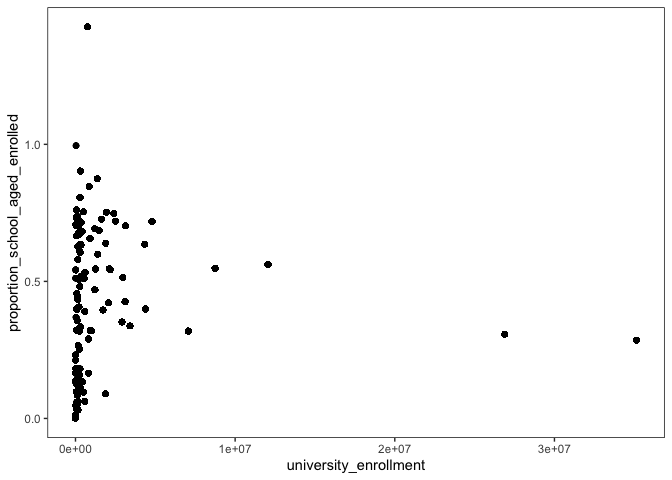<!-- -->

## Lending- and Development-Group Distributions

First, change population figures to millions kg Co2e

``` r
impact_data <- impact_data %>%
  mutate(baseline_population_kg_co2e=baseline_population_kg_co2e/1000000) %>%
  mutate(baseline_adjusted_population_kg_co2e=baseline_adjusted_population_kg_co2e/1000000) %>%
  mutate(baseline_oecd_population_kg_co2e=baseline_oecd_population_kg_co2e/1000000) %>%
  mutate(meatless_day_population_kg_co2e=meatless_day_population_kg_co2e/1000000) %>%
  mutate(low_red_meat_population_kg_co2e=low_red_meat_population_kg_co2e/1000000) %>%
  mutate(no_red_meat_population_kg_co2e=no_red_meat_population_kg_co2e/1000000) %>%
  mutate(no_dairy_population_kg_co2e=no_dairy_population_kg_co2e/1000000) %>%
  mutate(pescetarian_population_kg_co2e=pescetarian_population_kg_co2e/1000000) %>%
  mutate(lacto_ovo_vegetarian_population_kg_co2e=lacto_ovo_vegetarian_population_kg_co2e/1000000) %>%
  mutate(eat_lancet_population_kg_co2e=eat_lancet_population_kg_co2e/1000000) %>%
  mutate(two_thirds_vegan_population_kg_co2e=two_thirds_vegan_population_kg_co2e/1000000) %>%
  mutate(vegan_population_kg_co2e=vegan_population_kg_co2e/1000000) %>%
  mutate(baseline_adjusted_population_reduction_kg_co2e=baseline_adjusted_population_reduction_kg_co2e/1000000) %>%
  mutate(baseline_oecd_population_reduction_kg_co2e=baseline_oecd_population_reduction_kg_co2e/1000000) %>%
  mutate(meatless_day_population_reduction_kg_co2e=meatless_day_population_reduction_kg_co2e/1000000) %>%
  mutate(low_red_meat_population_reduction_kg_co2e=low_red_meat_population_reduction_kg_co2e/1000000) %>%
  mutate(no_red_meat_population_reduction_kg_co2e=no_red_meat_population_reduction_kg_co2e/1000000) %>%
  mutate(no_dairy_population_reduction_kg_co2e=no_dairy_population_reduction_kg_co2e/1000000) %>%
  mutate(pescetarian_population_reduction_kg_co2e=pescetarian_population_reduction_kg_co2e/1000000) %>%
  mutate(lacto_ovo_vegetarian_population_reduction_kg_co2e=lacto_ovo_vegetarian_population_reduction_kg_co2e/1000000) %>%
  mutate(eat_lancet_population_reduction_kg_co2e=eat_lancet_population_reduction_kg_co2e/1000000) %>%
  mutate(two_thirds_vegan_population_reduction_kg_co2e=two_thirds_vegan_population_reduction_kg_co2e/1000000) %>%
  mutate(vegan_population_reduction_kg_co2e=vegan_population_reduction_kg_co2e/1000000)
```

``` r
lending_group_baseline_distribution <- impact_data %>%
  ggplot(aes(baseline_population_kg_co2e,fill=factor(lending_group,levels=c("Low","Lower-Middle","Upper-Middle","High","NA")),color=factor(lending_group,levels=c("Low","Lower-Middle","Upper-Middle","High","NA")))) + 
  geom_density(alpha=0.75) +
  scale_color_brewer(palette="Set2",name="Lending Group",labels=c("Low (n=13)","Lower Middle (n=30)","Upper Middle (n=31)","High (n=46)","NA")) +
  scale_fill_brewer(palette="Set2",name="Lending Group",labels=c("Low (n=13)","Lower Middle (n=30)","Upper Middle (n=31)","High (n=46)","NA")) + 
  xlim(-800,2500) + 
  xlab(bquote('Annual Population-Level, Diet-Attributable Emissions at Baseline (Million kg CO'[2]*'e)')) +
  ylab("Density") +
  theme(legend.position="bottom",legend.justification="right",legend.box.spacing=unit(0,"pt"),legend.key.size=unit(10,"pt"),panel.grid=element_blank(),panel.background=element_rect(fill="white"),panel.border=element_rect(fill=NA),legend.title=element_text(size=10),legend.text=element_text(size=10),plot.title=element_text(size=10))
```

``` r
development_group_baseline_distribution <- impact_data %>%
  ggplot(aes(baseline_population_kg_co2e,fill=factor(development_group,levels=c("Low","Medium","High","Very High","NA")),color=factor(development_group,levels=c("Low","Medium","High","Very High","NA")))) + 
  geom_density(alpha=0.75) +
  scale_color_brewer(palette="Set3",name="Development Group",labels=c("Low (n=16)","Medium (n=16)","High (n=30)","Very High (n=58)","NA")) +
  scale_fill_brewer(palette="Set3",name="Development Group",labels=c("Low (n=16)","Medium (n=16)","High (n=30)","Very High (n=58)","NA")) + 
  xlim(-400,1500) +
  xlab(bquote('Annual Population-Level, Diet-Attributable Emissions at Baseline (Million kg CO'[2]*'e)')) +
  ylab("Density") +
  theme(legend.position="bottom",legend.justification="right",legend.box.spacing=unit(0,"pt"),legend.key.size=unit(10,"pt"),panel.grid=element_blank(),panel.background=element_rect(fill="white"),panel.border=element_rect(fill=NA),legend.title=element_text(size=10),legend.text=element_text(size=10),plot.title=element_text(size=10))
```

``` r
ggarrange(lending_group_baseline_distribution,development_group_baseline_distribution,
          nrow=2,
          labels=c("A","B"))
```

    ## Warning: Removed 23 rows containing non-finite values (`stat_density()`).

    ## Warning: Removed 29 rows containing non-finite values (`stat_density()`).

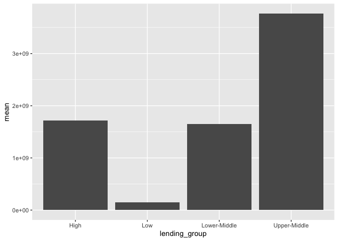<!-- -->

## Lending- and Development-Group Membership, Dichotomized

``` r
impact_data %>%
  count(lending_group_dichotomy)
```

    ##   lending_group_dichotomy  n
    ## 1                  Higher 77
    ## 2                   Lower 43

``` r
lending_group_membership_dichotomized <- spatial_impact_data %>%
  ggplot(aes(x=long,y=lat,group=group,fill=factor(lending_group_dichotomy,levels=c("Lower","Higher","NA")))) + 
  geom_polygon(color="black",size=0.125) +
  scale_fill_brewer(palette="Set2",na.value="white",name="Lending Group",labels=c("Lower (n=43)","Higher (n=77)","NA")) +
  xlab("") + 
  ylab("") +
  labs(caption="") +
  theme(legend.position="bottom",legend.justification="right",legend.box.spacing=unit(-15,"pt"),legend.key.size=unit(10,"pt"),panel.grid=element_blank(),panel.background=element_rect(fill="white"),panel.border=element_rect(fill=NA),axis.text=element_blank(),axis.ticks=element_blank(),legend.title=element_text(size=10),legend.text=element_text(size=10),plot.title=element_text(size=10))
```

``` r
impact_data %>%
  count(development_group_dichotomy)
```

    ##   development_group_dichotomy  n
    ## 1                Global North 58
    ## 2                Global South 62

``` r
development_group_membership_dichotomized <- spatial_impact_data %>%
  ggplot(aes(x=long,y=lat,group=group,fill=factor(development_group_dichotomy,levels=c("Global South","Global North","NA")))) + 
  geom_polygon(color="black",size=0.125,alpha=0.75) +
  scale_fill_brewer(palette="Set3",na.value="white",name="Development Group",labels=c("Global South (n=62)","Global North (n=58)","NA")) +
  xlab("") + 
  ylab("") +
  labs(caption="") +
  theme(legend.position="bottom",legend.justification="right",legend.box.spacing=unit(-15,"pt"),legend.key.size=unit(10,"pt"),panel.grid=element_blank(),panel.background=element_rect(fill="white"),panel.border=element_rect(fill=NA),axis.text=element_blank(),axis.ticks=element_blank(),legend.title=element_text(size=10),legend.text=element_text(size=10),plot.title=element_text(size=10))
```

``` r
ggarrange(lending_group_membership_dichotomized,development_group_membership_dichotomized,
          nrow=2,
          labels=c("A","B"))
```

<!-- -->

## Lending- and Development-Group Distributions, Dichotomized

lending_group_distribution_dichotomized

``` r
lending_group_baseline_distribution_dichotomized <- impact_data %>%
  ggplot(aes(baseline_population_kg_co2e,fill=factor(lending_group_dichotomy,levels=c("Lower","Higher","NA")),color=factor(lending_group_dichotomy,levels=c("Lower","Higher","NA")))) + 
  geom_density(alpha=0.75) +
  scale_color_brewer(palette="Set2",name="Lending Group",labels=c("Lower (n=43)","Higher (n=77)","NA")) +
  scale_fill_brewer(palette="Set2",name="Lending Group",labels=c("Lower (n=43)","Higher (n=77)","NA")) + 
  xlim(-800,2500) + 
  xlab(bquote('Annual Population-Level, Diet-Attributable Emissions at Baseline (Millions of kg CO'[2]*'e)')) +
  ylab("Density") +
  theme(legend.position="bottom",legend.justification="right",legend.box.spacing=unit(0,"pt"),legend.key.size=unit(10,"pt"),panel.grid=element_blank(),panel.background=element_rect(fill="white"),panel.border=element_rect(fill=NA),legend.title=element_text(size=10),legend.text=element_text(size=10),plot.title=element_text(size=10))
```

``` r
development_group_baseline_distribution_dichotomized <- impact_data %>%
  ggplot(aes(baseline_population_kg_co2e,fill=factor(development_group_dichotomy,levels=c("Global South","Global North","NA")),color=factor(development_group_dichotomy,levels=c("Global South","Global North","NA")))) + 
  geom_density(alpha=0.75) +
  scale_color_brewer(palette="Set3",name="Development Group",labels=c("Global South (n=62)","Global North (n=58)","NA")) +
  scale_fill_brewer(palette="Set3",name="Development Group",labels=c("Global South (n=62)","Global North (n=58)","NA")) + 
  xlim(-400,1500) +
  xlab(bquote('Annual Population-Level, Diet-Attributable Emissions at Baseline (Millions of kg CO'[2]*'e)')) +
  ylab("Density") +
  theme(legend.position="bottom",legend.justification="right",legend.box.spacing=unit(0,"pt"),legend.key.size=unit(10,"pt"),panel.grid=element_blank(),panel.background=element_rect(fill="white"),panel.border=element_rect(fill=NA),legend.title=element_text(size=10),legend.text=element_text(size=10),plot.title=element_text(size=10))
```

``` r
ggarrange(lending_group_baseline_distribution_dichotomized,development_group_baseline_distribution_dichotomized,
          nrow=2,
          labels=c("A","B"))
```

    ## Warning: Removed 23 rows containing non-finite values (`stat_density()`).

    ## Warning: Removed 29 rows containing non-finite values (`stat_density()`).

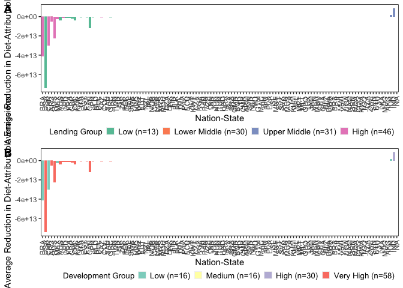<!-- -->

## Descriptive Results

``` r
impact_data %>%
  mutate(mean_population_percent_reduction_kg_co2e=(meatless_day_population_percent_reduction_kg_co2e+low_red_meat_population_percent_reduction_kg_co2e+no_red_meat_day_population_percent_reduction_kg_co2e+no_dairy_population_percent_reduction_kg_co2e+pescetarian_population_percent_reduction_kg_co2e+lacto_ovo_vegetarian_population_percent_reduction_kg_co2e+eat_lancet_population_percent_reduction_kg_co2e+two_thirds_vegan_population_percent_reduction_kg_co2e+vegan_population_percent_reduction_kg_co2e)/9) %>%
  ggplot(aes(x=fct_reorder(country_alpha_three,mean_population_percent_reduction_kg_co2e),y=mean_population_percent_reduction_kg_co2e)) +
  geom_col(fill="black") + 
  theme(axis.text.x=element_text(angle=90,vjust=0.5,hjust=1))
```

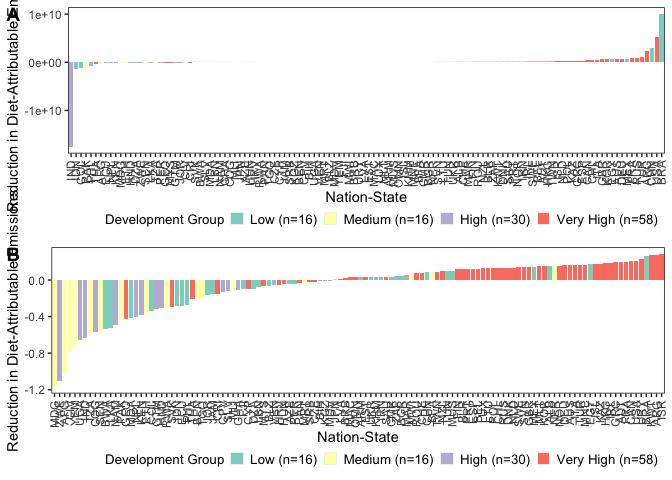<!-- -->

``` r
impact_data %>%
  mutate(mean_population_reduction_kg_co2e=(meatless_day_population_reduction_kg_co2e+low_red_meat_population_reduction_kg_co2e+no_red_meat_population_reduction_kg_co2e+no_dairy_population_reduction_kg_co2e+pescetarian_population_reduction_kg_co2e+lacto_ovo_vegetarian_population_reduction_kg_co2e+eat_lancet_population_reduction_kg_co2e+two_thirds_vegan_population_reduction_kg_co2e+vegan_population_reduction_kg_co2e)/9) %>%
  ggplot(aes(x=fct_reorder(country_alpha_three,mean_population_reduction_kg_co2e),y=mean_population_reduction_kg_co2e)) +
  geom_col() + 
  theme(axis.text.x=element_text(angle=90,vjust=0.5,hjust=1))
```

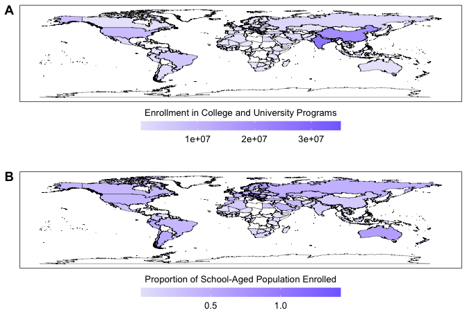<!-- -->

should also find which scneario greatest reduction by country - should
spot check this

``` r
impact_data <- impact_data %>%
  mutate(greatest_population_reduction_kg_co2e=pmax(meatless_day_population_reduction_kg_co2e,low_red_meat_population_reduction_kg_co2e,no_red_meat_population_reduction_kg_co2e,no_dairy_population_reduction_kg_co2e,pescetarian_population_reduction_kg_co2e,lacto_ovo_vegetarian_population_reduction_kg_co2e,eat_lancet_population_reduction_kg_co2e,two_thirds_vegan_population_reduction_kg_co2e,vegan_population_reduction_kg_co2e))
```

``` r
impact_data <- impact_data %>%
  mutate(greatest_reduction_diet=case_when(greatest_population_reduction_kg_co2e==meatless_day_population_reduction_kg_co2e~"Meatless Day",
                                           greatest_population_reduction_kg_co2e==low_red_meat_population_reduction_kg_co2e~"Low Red Meat",
                                           greatest_population_reduction_kg_co2e==no_red_meat_population_reduction_kg_co2e~"No Red Meat",
                                           greatest_population_reduction_kg_co2e==no_dairy_population_reduction_kg_co2e~"No Dairy",
                                           greatest_population_reduction_kg_co2e==pescetarian_population_reduction_kg_co2e~"Pescetarian",
                                           greatest_population_reduction_kg_co2e==lacto_ovo_vegetarian_population_reduction_kg_co2e~"Lacto-Ovo Vegetarian",
                                           greatest_population_reduction_kg_co2e==eat_lancet_population_reduction_kg_co2e~"EAT Lancet",
                                           greatest_population_reduction_kg_co2e==two_thirds_vegan_population_reduction_kg_co2e~"Two-Thirds Vegan",
                                           greatest_population_reduction_kg_co2e==vegan_population_reduction_kg_co2e~"Vegan"))
```

``` r
impact_data %>%
  summarize(sum(greatest_population_reduction_kg_co2e))
```

    ##   sum(greatest_population_reduction_kg_co2e)
    ## 1                                     190528

estimates the total global impact if the most ideal dietary change
occurred

``` r
impact_data %>%
  ggplot(aes(x=fct_reorder(country_alpha_three,greatest_population_reduction_kg_co2e),y=greatest_population_reduction_kg_co2e)) +
  geom_col(fill="black") + 
  theme(axis.text.x=element_text(angle=90,vjust=0.5,hjust=1))
```

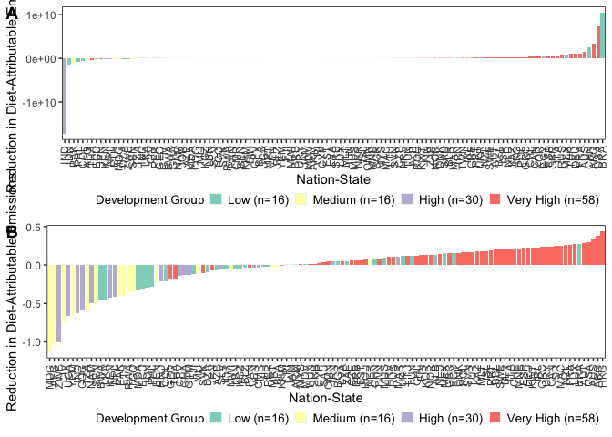<!-- -->

## Groupwise Comparisons

``` r
impact_data %>%
  group_by(lending_group) %>%
  summarize(mean=mean(greatest_population_reduction_kg_co2e),sd=sd(greatest_population_reduction_kg_co2e))
```

    ## # A tibble: 4 × 3
    ##   lending_group  mean    sd
    ##   <chr>         <dbl> <dbl>
    ## 1 High          1438. 3267.
    ## 2 Low            104.  115.
    ## 3 Lower-Middle  1047. 3009.
    ## 4 Upper-Middle  2956. 7229.

``` r
impact_data %>%
  group_by(development_group) %>%
  summarize(mean=mean(greatest_population_reduction_kg_co2e),sd=sd(greatest_population_reduction_kg_co2e))
```

    ## # A tibble: 4 × 3
    ##   development_group  mean    sd
    ##   <chr>             <dbl> <dbl>
    ## 1 High              2661. 7274.
    ## 2 Low                202.  495.
    ## 3 Medium            1184. 4062.
    ## 4 Very High         1526. 3115.

``` r
lending_group_reductions_optimized <- impact_data %>%
  ggplot(aes(greatest_population_reduction_kg_co2e,fill=factor(lending_group,levels=c("Low","Lower-Middle","Upper-Middle","High","NA")),color=factor(lending_group,levels=c("Low","Lower-Middle","Upper-Middle","High","NA")))) + 
  geom_density(alpha=0.75) +
  scale_color_brewer(palette="Set2",name="Lending Group",labels=c("Low (n=13)","Lower Middle (n=30)","Upper Middle (n=31)","High (n=46)","NA")) +
  scale_fill_brewer(palette="Set2",name="Lending Group",labels=c("Low (n=13)","Lower Middle (n=30)","Upper Middle (n=31)","High (n=46)","NA")) + 
  xlim(-300,3000) + 
  xlab(bquote('Optimized Annual Population-Level Reductions in Diet-Attributable Emissions (Million kg CO'[2]*'e)')) +
  ylab("Density") +
  theme(legend.position="bottom",legend.justification="right",legend.box.spacing=unit(0,"pt"),legend.key.size=unit(10,"pt"),panel.grid=element_blank(),panel.background=element_rect(fill="white"),panel.border=element_rect(fill=NA),legend.title=element_text(size=10),legend.text=element_text(size=10),plot.title=element_text(size=10))
```

``` r
development_group_reductions_optimized <- impact_data %>%
  ggplot(aes(greatest_population_reduction_kg_co2e,fill=factor(development_group,levels=c("Low","Medium","High","Very High","NA")),color=factor(development_group,levels=c("Low","Medium","High","Very High","NA")))) + 
  geom_density(alpha=0.75) +
  scale_color_brewer(palette="Set3",name="Development Group",labels=c("Low (n=16)","Medium (n=16)","High (n=30)","Very High (n=58)","NA")) +
  scale_fill_brewer(palette="Set3",name="Development Group",labels=c("Low (n=16)","Medium (n=16)","High (n=30)","Very High (n=58)","NA")) + 
  xlim(-300,3000) +
  xlab(bquote('Optimized Annual Population-Level Reductions in Diet-Attributable Emissions (Million kg CO'[2]*'e)')) +
  ylab("Density") +
  theme(legend.position="bottom",legend.justification="right",legend.box.spacing=unit(0,"pt"),legend.key.size=unit(10,"pt"),panel.grid=element_blank(),panel.background=element_rect(fill="white"),panel.border=element_rect(fill=NA),legend.title=element_text(size=10),legend.text=element_text(size=10),plot.title=element_text(size=10))
```

``` r
ggarrange(lending_group_reductions_optimized,development_group_reductions_optimized,
          nrow=2,
          labels=c("A","B"))
```

    ## Warning: Removed 13 rows containing non-finite values (`stat_density()`).
    ## Removed 13 rows containing non-finite values (`stat_density()`).

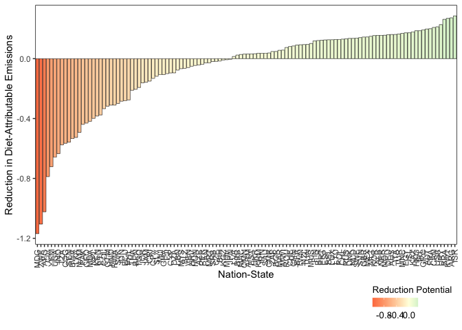<!-- -->

``` r
lending_group_reductions_distribution_dichotomized <- impact_data %>%
  ggplot(aes(greatest_population_reduction_kg_co2e,fill=factor(lending_group_dichotomy,levels=c("Lower","Higher","NA")),color=factor(lending_group_dichotomy,levels=c("Lower","Higher","NA")))) + 
  geom_density(alpha=0.75) +
  scale_color_brewer(palette="Set2",name="Lending Group",labels=c("Lower (n=43)","Higher (n=77)","NA")) +
  scale_fill_brewer(palette="Set2",name="Lending Group",labels=c("Lower (n=43)","Higher (n=77)","NA")) + 
  xlim(-300,3000) + 
  xlab(bquote('Optimized Annual Population-Level Reductions in Diet-Attributable Emissions (Million kg CO'[2]*'e)')) +
  ylab("Density") +
  theme(legend.position="bottom",legend.justification="right",legend.box.spacing=unit(0,"pt"),legend.key.size=unit(10,"pt"),panel.grid=element_blank(),panel.background=element_rect(fill="white"),panel.border=element_rect(fill=NA),legend.title=element_text(size=10),legend.text=element_text(size=10),plot.title=element_text(size=10))
```

``` r
development_group_reductions_distribution_dichotomized <- impact_data %>%
  ggplot(aes(greatest_population_reduction_kg_co2e,fill=factor(development_group_dichotomy,levels=c("Global South","Global North","NA")),color=factor(development_group_dichotomy,levels=c("Global South","Global North","NA")))) + 
  geom_density(alpha=0.75) +
  scale_color_brewer(palette="Set3",name="Development Group",labels=c("Global South (n=62)","Global North (n=58)","NA")) +
  scale_fill_brewer(palette="Set3",name="Development Group",labels=c("Global South (n=62)","Global North (n=58)","NA")) + 
  xlim(-300,3000) +
  xlab(bquote('Optimized Annual Population-Level Reductions in Diet-Attributable Emissions (Million kg CO'[2]*'e)')) +
  ylab("Density") +
  theme(legend.position="bottom",legend.justification="right",legend.box.spacing=unit(0,"pt"),legend.key.size=unit(10,"pt"),panel.grid=element_blank(),panel.background=element_rect(fill="white"),panel.border=element_rect(fill=NA),legend.title=element_text(size=10),legend.text=element_text(size=10),plot.title=element_text(size=10))
```

``` r
ggarrange(lending_group_reductions_distribution_dichotomized,development_group_reductions_distribution_dichotomized,
          nrow=2,
          labels=c("A","B"))
```

    ## Warning: Removed 13 rows containing non-finite values (`stat_density()`).
    ## Removed 13 rows containing non-finite values (`stat_density()`).

<!-- -->

impact_data %\>%
mutate(optimal_pattern=case_when(meatless_day_population_reduction_kg_co2e\>low_red_meat_population_reduction_kg_co2e&no_red_meat_population_reduction_kg_co2e&no_dairy_population_reduction_kg_co2e&pescetarian_population_reduction_kg_co2e&lacto_ovo_vegetarian_population_reduction_kg_co2e&eat_lancet_population_reduction_kg_co2e&two_thirds_vegan_population_reduction_kg_co2e&vegan_population_reduction_kg_co2e~“Meatless
Day”,
low_red_meat_population_reduction_kg_co2e\>meatless_day_population_reduction_kg_co2e&no_red_meat_population_reduction_kg_co2e&no_dairy_population_reduction_kg_co2e&pescetarian_population_reduction_kg_co2e&lacto_ovo_vegetarian_population_reduction_kg_co2e&eat_lancet_population_reduction_kg_co2e&two_thirds_vegan_population_reduction_kg_co2e&vegan_population_reduction_kg_co2e~“Low
Red Meat”,
no_red_meat_population_reduction_kg_co2e\>meatless_day_population_reduction_kg_co2e&low_red_meat_population_reduction_kg_co2e&no_dairy_population_reduction_kg_co2e&pescetarian_population_reduction_kg_co2e&lacto_ovo_vegetarian_population_reduction_kg_co2e&eat_lancet_population_reduction_kg_co2e&two_thirds_vegan_population_reduction_kg_co2e&vegan_population_reduction_kg_co2e~“No
Red Meat”,
no_dairy_population_reduction_kg_co2e\>meatless_day_population_reduction_kg_co2e&low_red_meat_population_reduction_kg_co2e&no_red_meat_population_reduction_kg_co2e&pescetarian_population_reduction_kg_co2e&lacto_ovo_vegetarian_population_reduction_kg_co2e&eat_lancet_population_reduction_kg_co2e&two_thirds_vegan_population_reduction_kg_co2e&vegan_population_reduction_kg_co2e~“No
Dairy”,
pescetarian_population_reduction_kg_co2e\>meatless_day_population_reduction_kg_co2e&low_red_meat_population_reduction_kg_co2e&no_red_meat_population_reduction_kg_co2e&no_dairy_population_reduction_kg_co2e&lacto_ovo_vegetarian_population_reduction_kg_co2e&eat_lancet_population_reduction_kg_co2e&two_thirds_vegan_population_reduction_kg_co2e&vegan_population_reduction_kg_co2e~“Pescetarian”,
lacto_ovo_vegetarian_population_reduction_kg_co2e\>meatless_day_population_reduction_kg_co2e&low_red_meat_population_reduction_kg_co2e&no_red_meat_population_reduction_kg_co2e&no_dairy_population_reduction_kg_co2e&pescetarian_population_reduction_kg_co2e&eat_lancet_population_reduction_kg_co2e&two_thirds_vegan_population_reduction_kg_co2e&vegan_population_reduction_kg_co2e~“Lacto-Ovo
Vegetarian”,
eat_lancet_population_reduction_kg_co2e\>meatless_day_population_reduction_kg_co2e&low_red_meat_population_reduction_kg_co2e&no_red_meat_population_reduction_kg_co2e&no_dairy_population_reduction_kg_co2e&pescetarian_population_reduction_kg_co2e&lacto_ovo_vegetarian_population_reduction_kg_co2e&two_thirds_vegan_population_reduction_kg_co2e&vegan_population_reduction_kg_co2e~“EAT-Lancet”,
two_thirds_vegan_population_reduction_kg_co2e\>meatless_day_population_reduction_kg_co2e&low_red_meat_population_reduction_kg_co2e&no_red_meat_population_reduction_kg_co2e&no_dairy_population_reduction_kg_co2e&pescetarian_population_reduction_kg_co2e&lacto_ovo_vegetarian_population_reduction_kg_co2e&eat_lancet_population_reduction_kg_co2e&vegan_population_reduction_kg_co2e~“Two-Thirds
Vegan”,
vegan_population_reduction_kg_co2e\>meatless_day_population_reduction_kg_co2e&low_red_meat_population_reduction_kg_co2e&no_red_meat_population_reduction_kg_co2e&no_dairy_population_reduction_kg_co2e&pescetarian_population_reduction_kg_co2e&lacto_ovo_vegetarian_population_reduction_kg_co2e&eat_lancet_population_reduction_kg_co2e&two_thirds_vegan_population_reduction_kg_co2e~“Vegan”))

mutate(national_population=ifelse(yr2019_national_population\>0,yr2019_national_population,ifelse(yr2018_national_population\>0,yr2018_national_population,ifelse(yr2017_national_population\>0,yr2017_national_population,ifelse(yr2016_national_population\>0,yr2016_national_population,ifelse(yr2015_national_population\>0,yr2015_national_population,ifelse(yr2014_national_population\>0,yr2014_national_population,ifelse(yr2013_national_population\>0,yr2013_national_population,ifelse(yr2012_national_population\>0,yr2012_national_population,ifelse(yr2011_national_population\>0,yr2011_national_population,ifelse(yr2010_national_population\>0,yr2010_national_population,ifelse(yr2009_national_population\>0,yr2009_national_population,ifelse(yr2008_national_population\>0,yr2008_national_population,ifelse(yr2007_national_population\>0,yr2007_national_population,ifelse(yr2006_national_population\>0,yr2006_national_population,ifelse(yr2005_national_population\>0,yr2005_national_population,ifelse(yr2004_national_population\>0,yr2004_national_population,ifelse(yr2003_national_population\>0,yr2003_national_population,ifelse(yr2002_national_population\>0,yr2002_national_population,ifelse(yr2001_national_population\>0,yr2001_national_population,ifelse(yr2000_national_population\>0,yr2000_national_population,0)))))))))))))))))))))
%\>%

mutate(optimal_pattern=case_when(meatless_day_population_reduction_kg_co2e\>low_red_meat_population_reduction_kg_co2e~“Meatless
Day”,
meatless_day_population_reduction_kg_co2e\>no_red_meat_population_reduction_kg_co2e~“Meatless
Day”,
meatless_day_population_reduction_kg_co2e\>no_dairy_population_reduction_kg_co2e~“Meatles
Day”,
meatless_day_population_reduction_kg_co2e\>pescetarian_population_reduction_kg_co2e~“Meatless
Day”,
meatless_day_population_reduction_kg_co2e\>lacto_ovo_vegetarian_population_reduction_kg_co2e
~“Meatless Day”,
meatless_day_population_reduction_kg_co2e\>eat_lancet_population_reduction_kg_co2e~“Meatles
Day”,
meatless_day_population_reduction_kg_co2e\>two_thirds_vegan_population_reduction_kg_co2e~“Meatless
Day”,
meatless_day_population_reduction_kg_co2e\>vegan_population_reduction_kg_co2e
~“Meatless Day”))

mutate(optimal_pattern=ifelse(meatless_day_population_reduction_kg_co2e\>low_red_meat_population_reduction_kg_co2e,“Meatless
Day”,ifelse(meatless_day_population_reduction_kg_co2e\>no_red_meat_day_population_reduction_kg_co2e,“Meatless
Day”,ifelse(meatless_day_population_reduction_kg_co2e\>no_dairy_population_reduction_kg_co2e,“Meatless
Day”,ifelse(meatless_day_population_reduction_kg_co2e\>pescetarian_population_reduction_kg_co2e,“Meatless
Day”,ifelse(meatless_day_population_reduction_kg_co2e\>lacto_ovo_vegetarian_population_reduction_kg_co2e,“Meatless
Day”,ifelse(meatless_day_population_reduction_kg_co2e\>eat_lancet_population_reduction_kg_co2e,“Meatless
Day”,ifelse(meatless_day_population_reduction_kg_co2e\>two_thirds_vegan_population_reduction_kg_co2e,“Meatless
Day”,ifelse(meatless_day_population_reduction_kg_co2e\>vegan_population_reduction_kg_co2e,“Meatless
Day”,0))))))))) \## Groupwise Comparisons, Dichotomized

``` r
impact_data %>%
  group_by(lending_group) %>%
  summarize(mean=mean(baseline_population_kg_co2e),sd=sd(baseline_population_kg_co2e)) 
```

    ## # A tibble: 4 × 3
    ##   lending_group  mean    sd
    ##   <chr>         <dbl> <dbl>
    ## 1 High          1721. 3767.
    ## 2 Low            149.  165.
    ## 3 Lower-Middle  1647. 5061.
    ## 4 Upper-Middle  3768. 8923.

``` r
impact_data %>%
  group_by(development_group) %>%
  summarize(mean=mean(baseline_population_kg_co2e),sd=sd(baseline_population_kg_co2e)) 
```

    ## # A tibble: 4 × 3
    ##   development_group  mean    sd
    ##   <chr>             <dbl> <dbl>
    ## 1 High              3473. 8991.
    ## 2 Low                265.  611.
    ## 3 Medium            1952. 6859.
    ## 4 Very High         1855. 3625.

``` r
impact_data %>%
  ggplot(aes(factor(lending_group),baseline_population_kg_co2e)) + 
  geom_violin(scale="width") + 
  stat_summary(fun.y=mean, geom="point", shape=21, size=2) +
  coord_flip()
```

    ## Warning: The `fun.y` argument of `stat_summary()` is deprecated as of ggplot2 3.3.0.
    ## ℹ Please use the `fun` argument instead.

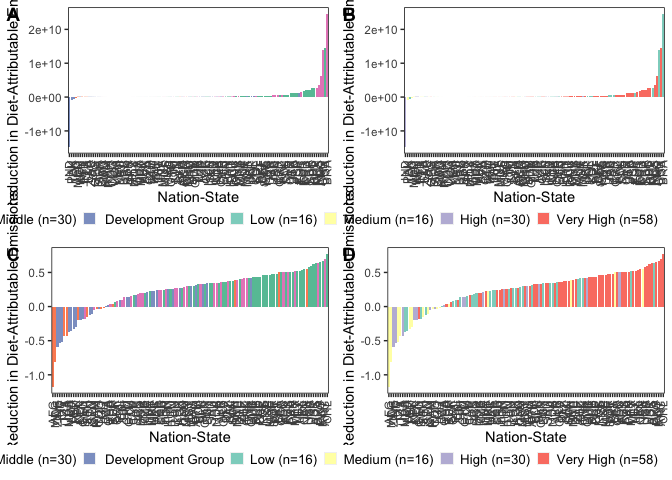<!-- -->

``` r
impact_data %>%
  ggplot(aes(factor(development_group),baseline_population_kg_co2e)) + 
  geom_violin(scale="width") + 
  stat_summary(fun.y=mean, geom="point", shape=21, size=2) +
  coord_flip()
```

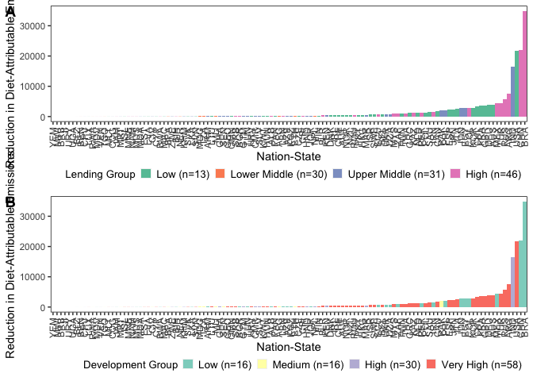<!-- -->

``` r
impact_data %>% 
ggplot(aes(x=baseline_population_kg_co2e,y=development_group,fill=stat(x))) +
  geom_density_ridges_gradient() +
  scale_fill_viridis_c(option="C")
```

    ## Warning: `stat(x)` was deprecated in ggplot2 3.4.0.
    ## ℹ Please use `after_stat(x)` instead.

    ## Picking joint bandwidth of 375

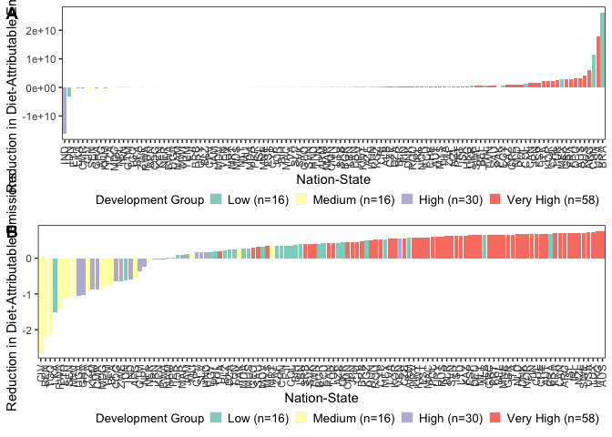<!-- -->

``` r
impact_data %>% 
ggplot(aes(x=baseline_population_kg_co2e,y=lending_group,fill=stat(x))) +
  geom_density_ridges_gradient(alpha=0.1) +
  scale_fill_viridis_c(option="C")
```

    ## Picking joint bandwidth of 394

<!-- -->

### Average Reduction

``` r
ggplot(spatial_impact_data,aes(x=long,y=lat,fill=proportion_school_aged_enrolled,group=group)) + 
  geom_polygon(color="black",size=0.125,alpha=0.66) + 
  scale_fill_continuous_sequential(labels=function(x)x/1000000,name="Millions Enrolled",palette="Purple-Blue",na.value="white",breaks=c(0,6000000,12000000,18000000,24000000,30000000),alpha=0.66) +
  guides(fill=guide_colorbar(title.position="top",title.hjust=0.5)) +
  xlab("") + 
  ylab("") +
  labs(caption="") +
  ggtitle("Enrollment Total") +
  theme(legend.position="bottom",panel.grid=element_blank(),panel.background=element_rect(fill="white"),panel.border=element_rect(fill=NA),axis.text=element_blank(),axis.ticks=element_blank(),legend.key.width=unit(3.5,"cm"))
```

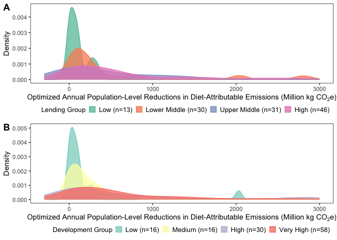<!-- -->

scale_fill_gradient(alpha=0.66,name=bquote(‘Kilograms
CO’\[2\]\*‘e’),colors=“z2”,trans=“reverse”,na.value=“white”,labels=scales::comma,breaks=c(750,1500,2250,3000,3750)) +
guides(fill=guide_colorbar(reverse=TRUE,title.position=“top”,title.hjust=0.5))
+

``` r
ggplot(spatial_impact_data,aes(x=long,y=lat,fill=eat_lancet_population_percent_reduction_kg_co2e
,group=group)) + 
  geom_polygon(color="black",size=0.125,alpha=0.66) + 
  scale_fill_gradient(low="palegreen",high="palegreen4",na.value="white") +
  guides(fill=guide_colorbar(reverse=TRUE,title.position="top",title.hjust=0.5)) +
  xlab("") + 
  ylab("") +
  labs(caption="") +
  ggtitle("Diet-Attributable Greenhouse Gas Footprint at Baseline") +
  theme(legend.position="bottom",panel.grid=element_blank(),panel.background=element_rect(fill="white"),panel.border=element_rect(fill=NA),axis.text=element_blank(),axis.ticks=element_blank(),legend.key.width=unit(3.5,"cm"))
```

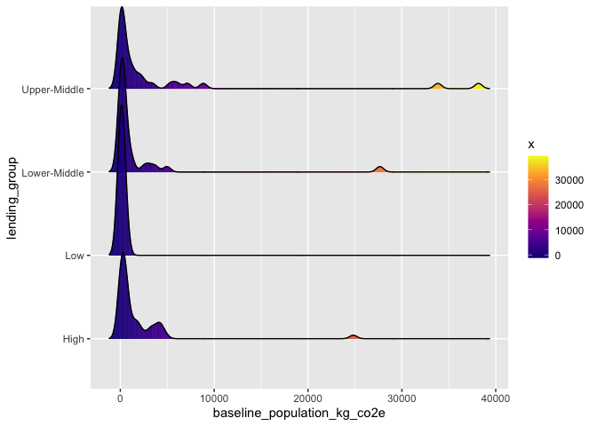<!-- -->

``` r
ggplot(spatial_impact_data,aes(x=long,y=lat,fill=eat_lancet_population_reduction_kg_co2e
,group=group)) + 
  geom_polygon(color="black",size=0.125,alpha=0.66) + 
  scale_fill_viridis_c(alpha=0.66,name=bquote('Kilograms CO'[2]*'e'),option="F",trans="reverse",na.value="white",labels=scales::comma,breaks=c(750,1500,2250,3000,3750)) +
  guides(fill=guide_colorbar(reverse=TRUE,title.position="top",title.hjust=0.5)) +
  xlab("") + 
  ylab("") +
  labs(caption="") +
  ggtitle("Diet-Attributable Greenhouse Gas Footprint at Baseline") +
  theme(legend.position="bottom",panel.grid=element_blank(),panel.background=element_rect(fill="white"),panel.border=element_rect(fill=NA),axis.text=element_blank(),axis.ticks=element_blank(),legend.key.width=unit(3.5,"cm"))
```

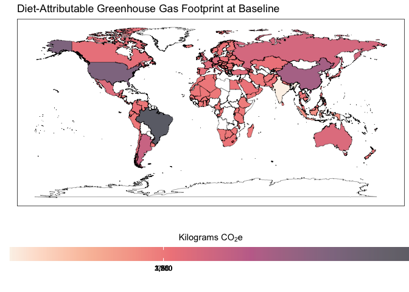<!-- -->
