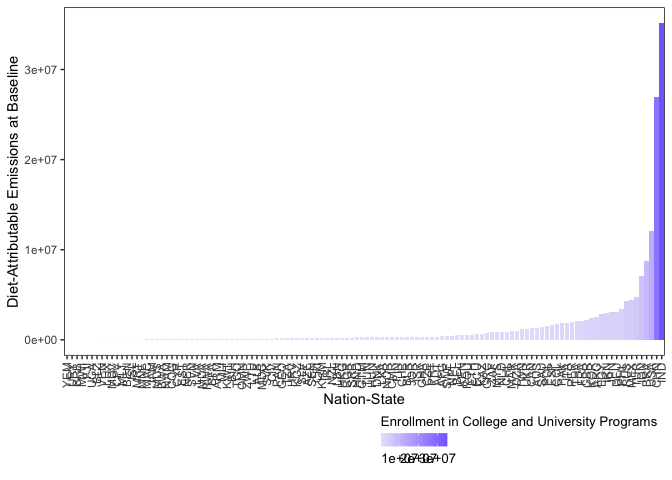
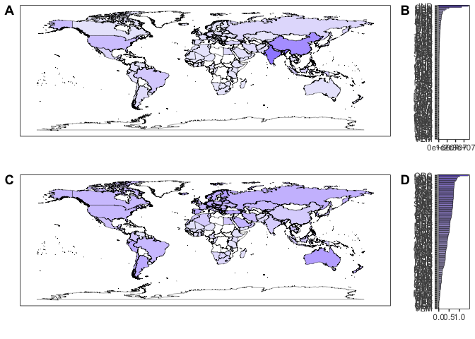
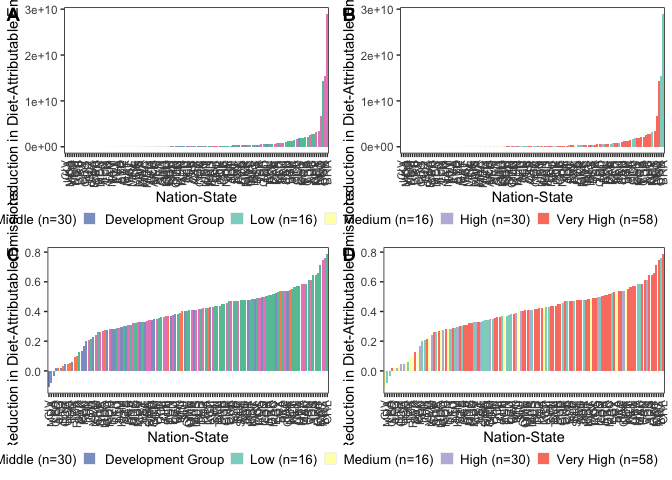

Data Analysis and Visualization
================
Last updated: July 9, 2024

## Package Loading

Here, we list the packages that will be required to support our
analytical and visualization procedures.

``` r
library(tidyverse)
```

    ## ── Attaching packages ─────────────────────────────────────── tidyverse 1.3.2 ──
    ## ✔ ggplot2 3.4.1      ✔ purrr   0.3.4 
    ## ✔ tibble  3.1.8      ✔ dplyr   1.0.10
    ## ✔ tidyr   1.2.1      ✔ stringr 1.4.1 
    ## ✔ readr   2.1.2      ✔ forcats 0.5.2 
    ## ── Conflicts ────────────────────────────────────────── tidyverse_conflicts() ──
    ## ✖ dplyr::filter() masks stats::filter()
    ## ✖ dplyr::lag()    masks stats::lag()

``` r
library(viridis)
```

    ## Loading required package: viridisLite

``` r
library(RColorBrewer)
library(colorspace)
library(ggpubr)
library(ggridges)
library(forcats)
library(lazyeval)
```

    ## 
    ## Attaching package: 'lazyeval'
    ## 
    ## The following objects are masked from 'package:purrr':
    ## 
    ##     is_atomic, is_formula

## Data Loading

The below code chunk loads in the data in the two formats we specified
at the end of our cleaning script: one suited for spatial visualization
and analysis and one not.

``` r
impact_data <- read.csv("/Users/kenjinchang/github/university-impact-model/data/model-output/university-impact-model.csv")
spatial_impact_data <- read.csv("/Users/kenjinchang/github/university-impact-model/data/model-output/university-impact-model-shapefile.csv")
```

## Methods-Section Figures

### Nation-State Inclusion

As specified in the manuscript, we will need to generate a figure
separating the nation-states included within our analysis from those
that were omitted for the various reasons cited in our cleaning script.

We will eventually also have to create a complementary flow diagram
documenting this exclusion process, whereby nation-states were excluded
either (1) because they did not have complete dietary-footprint data for
the nine dietary scenarios across the two identified sources (i.e.,
publication data for Kim et al. (2020) and publication data for Semba et
al. (2020)), (2) because they did not have the \_\_\_

For now, we focus on creating a choropleth map using
`spatial_impact_data` indicating which and how many nation-states are
being factored into our country-level and global results.

``` r
spatial_impact_data <- spatial_impact_data %>%
  mutate(inclusion=case_when(university_enrollment>0~"Included")) 
impact_data<- impact_data %>%
  mutate(inclusion=case_when(university_enrollment>0~"Included")) 
```

``` r
ggplot(spatial_impact_data,aes(x=long,y=lat,fill=inclusion,group=group)) + 
  geom_polygon(color="black",linewidth=0.125) +
  scale_fill_brewer(palette="Pastel2",na.value="white",name="Inclusion Outcomes",labels=c("Included (n=120)","NA")) +
  xlab("") + 
  ylab("") +
  labs(caption="") +
  theme(legend.position="bottom",legend.justification="right",legend.box.spacing=unit(-15,"pt"),legend.key.size=unit(10,"pt"),panel.grid=element_blank(),panel.background=element_rect(fill="white"),panel.border=element_rect(fill=NA),axis.text=element_blank(),axis.ticks=element_blank(),legend.title=element_text(size=10),legend.text=element_text(size=10),plot.title=element_text(size=10))
```

<!-- -->

## Descriptive Results

### Enrollment Indicators

To provide readers with a sense of scale and context, we perform a
series of calculations to derive a few relevant statistics. These
include:

- The mean proportion of the national population that is between the
  ages of 18 and 23 across the 120 included nation-states (i.e., 7.30%)

``` r
impact_data %>%
  select(country,proportion_school_aged) %>%
  summarise(mean(proportion_school_aged))
```

    ##   mean(proportion_school_aged)
    ## 1                   0.07302653

- The mean proportion of the school-aged population that is thought to
  be enrolled in college or university programs across the 120 included
  nation-states (i.e., 41.50%)

``` r
impact_data %>%
  select(country,proportion_school_aged_enrolled) %>%
  summarise(mean(proportion_school_aged_enrolled))
```

    ##   mean(proportion_school_aged_enrolled)
    ## 1                              0.414998

- The global sum of people enrolled in college and university programs
  across the 120 included nation-states (i.e., 168,167,205)

``` r
impact_data %>%
  summarize(sum(university_enrollment))
```

    ##   sum(university_enrollment)
    ## 1                  168167205

- The global sum of people of all ages residing in the 120 included
  nation-states (i.e., 6,592,823,027)

``` r
impact_data %>%
  summarise(sum(national_population))
```

    ##   sum(national_population)
    ## 1               6592823027

- The proportion of that sum enrollees account for (i.e., 2.55%)

``` r
168167205 / 6592823027
```

    ## [1] 0.02550762

This final statistic, in particular, will provide us with a more
complete understanding of the size and proportion of the population that
the expected reductions in carbon emissions are being modeled from.

``` r
impact_data %>% 
  ggplot(aes(university_enrollment,proportion_school_aged_enrolled,label=country_alpha_three,color=per_capita_gni)) + 
  geom_point() + 
  scale_color_gradient(low="mistyrose1",high="salmon4",na.value="white",name="Per Capita Gross National Income",guide=guide_colourbar(reverse=FALSE,title.position="top",title.hjust=0.5)) +
  geom_text(color="black",hjust=-0.15,nudge_x=0.05,alpha=0.6) +
  xlab("College and University Enrollment") + 
  ylab("Proportion School-Aged Enrolled") +
  theme(legend.key.width=unit(3,"lines"),legend.position="bottom",legend.justification="center",legend.box.spacing=unit(0,"pt"),legend.key.size=unit(10,"pt"),panel.grid=element_blank(),panel.background=element_rect(fill="white"),panel.border=element_rect(fill=NA),legend.title=element_text(size=10),legend.text=element_text(size=10),plot.title=element_text(size=10))
```

<!-- -->

``` r
university_enrollment_absolute <- spatial_impact_data %>%
  ggplot(aes(x=long,y=lat,fill=university_enrollment,group=group)) + 
  geom_polygon(color="black",linewidth=0.125,alpha=0.8) +
  scale_fill_gradient(low="lavender",high="darkslateblue",na.value="white",name="Enrollment in College and University Programs",guide=guide_colourbar(reverse=FALSE,title.position="top",title.hjust=0.5)) +
  xlab("") + 
  ylab("") +
  labs(caption="") +
  theme(legend.key.width=unit(3,"lines"),legend.position="bottom",legend.justification="center",legend.box.spacing=unit(-15,"pt"),legend.key.size=unit(10,"pt"),panel.grid=element_blank(),panel.background=element_rect(fill="white"),panel.border=element_rect(fill=NA),axis.text=element_blank(),axis.ticks=element_blank(),legend.title=element_text(size=10),legend.text=element_text(size=10),plot.title=element_text(size=10))
```

``` r
university_enrollment_relative <- spatial_impact_data %>%
  ggplot(aes(x=long,y=lat,fill=proportion_school_aged_enrolled,group=group)) + 
  geom_polygon(color="black",linewidth=0.125,alpha=0.8) +
  scale_fill_gradient(low="lavender",high="darkslateblue",na.value="white",name="Proportion of School-Aged Population Enrolled",guide=guide_colourbar(reverse=FALSE,title.position="top",title.hjust=0.5)) +
  xlab("") + 
  ylab("") +
  labs(caption="") +
  theme(legend.key.width=unit(3,"lines"),legend.position="bottom",legend.justification="center",legend.box.spacing=unit(-15,"pt"),legend.key.size=unit(10,"pt"),panel.grid=element_blank(),panel.background=element_rect(fill="white"),panel.border=element_rect(fill=NA),axis.text=element_blank(),axis.ticks=element_blank(),legend.title=element_text(size=10),legend.text=element_text(size=10),plot.title=element_text(size=10))
```

``` r
ggarrange(university_enrollment_absolute,university_enrollment_relative,
          nrow=2,
          labels=c("A","B"))
```

<!-- -->

### Lending- and Development-Group Membership

``` r
impact_data %>%
  count(lending_group)
```

    ##   lending_group  n
    ## 1          High 46
    ## 2           Low 13
    ## 3  Lower-Middle 30
    ## 4  Upper-Middle 31

``` r
impact_data %>%
  count(development_group)
```

    ##   development_group  n
    ## 1              High 30
    ## 2               Low 16
    ## 3            Medium 16
    ## 4         Very High 58

``` r
lending_group_membership <- spatial_impact_data %>%
  ggplot(aes(x=long,y=lat,group=group,fill=factor(lending_group,levels=c("Low","Lower-Middle","Upper-Middle","High","NA")))) + 
  geom_polygon(color="black",linewidth=0.125) +
  scale_fill_brewer(palette="Set2",na.value="white",name="Lending Group",labels=c("Low (n=13)","Lower Middle (n=30)","Upper Middle (n=31)","High (n=46)","NA")) +
  xlab("") + 
  ylab("") +
  labs(caption="") +
  theme(legend.position="bottom",legend.justification="right",legend.box.spacing=unit(-15,"pt"),legend.key.size=unit(10,"pt"),panel.grid=element_blank(),panel.background=element_rect(fill="white"),panel.border=element_rect(fill=NA),axis.text=element_blank(),axis.ticks=element_blank(),legend.title=element_text(size=10),legend.text=element_text(size=10),plot.title=element_text(size=10))
```

``` r
development_group_membership <- spatial_impact_data %>%
  ggplot(aes(x=long,y=lat,group=group,fill=factor(development_group,levels=c("Low","Medium","High","Very High","NA")))) + 
  geom_polygon(color="black",linewidth=0.125) +
  scale_fill_brewer(palette="Set3",na.value="white",name="Development Group",labels=c("Low (n=16)","Medium (n=16)","High (n=30)","Very High (n=58)","NA")) +
  xlab("") + 
  ylab("") +
  labs(caption="") +
  theme(legend.position="bottom",legend.justification="right",legend.box.spacing=unit(-15,"pt"),legend.key.size=unit(10,"pt"),panel.grid=element_blank(),panel.background=element_rect(fill="white"),panel.border=element_rect(fill=NA),axis.text=element_blank(),axis.ticks=element_blank(),legend.title=element_text(size=10),legend.text=element_text(size=10),plot.title=element_text(size=10))
```

``` r
ggarrange(lending_group_membership,development_group_membership,
          nrow=2,
          labels=c("A","B"))
```

<!-- -->

### Technical Potential

Because the mean reduction across the nine dietary change scenarios may
not be particularly meaningful, we may want to, instead, look at the
returns associated with the scenario yielding the greatest reductions,
instead.

For now, though, let us look at each scenario, individually.

- Meatless Day

- Low Red Meat

- No Red Meat

- No Dairy

- Lacto-Ovo Vegetarian

- EAT-Lancet

- Two-Thirds Vegan

- Vegan

As described previously, we will now run a similar set of analyses for
the 120 included nation-states - this time, for each of their optimal
change scenarios. - should spot check this

``` r
impact_data <- impact_data %>%
  mutate(greatest_population_reduction_kg_co2e=pmax(meatless_day_population_reduction_kg_co2e,low_red_meat_population_reduction_kg_co2e,no_red_meat_population_reduction_kg_co2e,no_dairy_population_reduction_kg_co2e,pescetarian_population_reduction_kg_co2e,lacto_ovo_vegetarian_population_reduction_kg_co2e,eat_lancet_population_reduction_kg_co2e,two_thirds_vegan_population_reduction_kg_co2e,vegan_population_reduction_kg_co2e))
```

``` r
impact_data <- impact_data %>%
  mutate(greatest_reduction_diet=case_when(greatest_population_reduction_kg_co2e==meatless_day_population_reduction_kg_co2e~"Meatless Day",
                                           greatest_population_reduction_kg_co2e==low_red_meat_population_reduction_kg_co2e~"Low Red Meat",
                                           greatest_population_reduction_kg_co2e==no_red_meat_population_reduction_kg_co2e~"No Red Meat",
                                           greatest_population_reduction_kg_co2e==no_dairy_population_reduction_kg_co2e~"No Dairy",
                                           greatest_population_reduction_kg_co2e==pescetarian_population_reduction_kg_co2e~"Pescetarian",
                                           greatest_population_reduction_kg_co2e==lacto_ovo_vegetarian_population_reduction_kg_co2e~"Lacto-Ovo Vegetarian",
                                           greatest_population_reduction_kg_co2e==eat_lancet_population_reduction_kg_co2e~"EAT Lancet",
                                           greatest_population_reduction_kg_co2e==two_thirds_vegan_population_reduction_kg_co2e~"Two-Thirds Vegan",
                                           greatest_population_reduction_kg_co2e==vegan_population_reduction_kg_co2e~"Vegan"))
```

``` r
impact_data
```

    ##       X                                                    country
    ## 1     1                                                Afghanistan
    ## 2     2                                                    Albania
    ## 3     3                                                    Algeria
    ## 4     4                                                  Argentina
    ## 5     5                                                    Armenia
    ## 6     6                                                  Australia
    ## 7     7                                                    Austria
    ## 8     8                                                 Azerbaijan
    ## 9     9                                                   Barbados
    ## 10   10                                                    Belarus
    ## 11   11                                                    Belgium
    ## 12   12                                                     Belize
    ## 13   13                                                      Benin
    ## 14   14                                     Bosnia and Herzegovina
    ## 15   15                                                   Botswana
    ## 16   16                                                     Brazil
    ## 17   17                                                   Bulgaria
    ## 18   18                                               Burkina Faso
    ## 19   19                                                 Cabo Verde
    ## 20   20                                                   Cambodia
    ## 21   21                                                   Cameroon
    ## 22   22                                                     Canada
    ## 23   23                                                      Chile
    ## 24   24                                                      China
    ## 25   25                                                   Colombia
    ## 26   26                                                Congo (the)
    ## 27   27                                                 Costa Rica
    ## 28   28                                              Côte d'Ivoire
    ## 29   29                                                    Croatia
    ## 30   30                                                     Cyprus
    ## 31   31                                                    Czechia
    ## 32   32                                                    Denmark
    ## 33   33                                                    Ecuador
    ## 34   34                                                      Egypt
    ## 35   35                                                El Salvador
    ## 36   36                                                    Estonia
    ## 37   37                                                   Ethiopia
    ## 38   38                                                       Fiji
    ## 39   39                                                    Finland
    ## 40   40                                                     France
    ## 41   41                                                    Georgia
    ## 42   42                                                    Germany
    ## 43   43                                                      Ghana
    ## 44   44                                                     Greece
    ## 45   45                                                  Guatemala
    ## 46   46                                                   Honduras
    ## 47   47                                                  Hong Kong
    ## 48   48                                                    Hungary
    ## 49   49                                                    Iceland
    ## 50   50                                                      India
    ## 51   51                                                  Indonesia
    ## 52   52                                 Iran (Islamic Republic of)
    ## 53   53                                                    Ireland
    ## 54   54                                                     Israel
    ## 55   55                                                      Italy
    ## 56   56                                                    Jamaica
    ## 57   57                                                      Japan
    ## 58   58                                                     Jordan
    ## 59   59                                                 Kazakhstan
    ## 60   60                                                      Kenya
    ## 61   61                                    Korea (the Republic of)
    ## 62   62                                                     Kuwait
    ## 63   63                                                 Kyrgyzstan
    ## 64   64                                                     Latvia
    ## 65   65                                                    Lebanon
    ## 66   66                                                  Lithuania
    ## 67   67                                                 Luxembourg
    ## 68   68                                                      Macao
    ## 69   69                                                 Madagascar
    ## 70   70                                                     Malawi
    ## 71   71                                                   Malaysia
    ## 72   72                                                   Maldives
    ## 73   73                                                       Mali
    ## 74   74                                                      Malta
    ## 75   75                                                 Mauritania
    ## 76   76                                                  Mauritius
    ## 77   77                                                     Mexico
    ## 78   78                                  Moldova (the Republic of)
    ## 79   79                                                 Montenegro
    ## 80   80                                                    Morocco
    ## 81   81                                                    Namibia
    ## 82   82                                                      Nepal
    ## 83   83                               Netherlands (Kingdom of the)
    ## 84   84                                                New Zealand
    ## 85   85                                                Niger (the)
    ## 86   86                                                     Norway
    ## 87   87                                                       Oman
    ## 88   88                                                   Pakistan
    ## 89   89                                                     Panama
    ## 90   90                                                       Peru
    ## 91   91                                          Philippines (the)
    ## 92   92                                                     Poland
    ## 93   93                                                   Portugal
    ## 94   94                                                    Romania
    ## 95   95                                  Russidan Federation (the)
    ## 96   96                                                     Rwanda
    ## 97   97                                               Saudi Arabia
    ## 98   98                                                    Senegal
    ## 99   99                                                     Serbia
    ## 100 100                                                   Slovakia
    ## 101 101                                                   Slovenia
    ## 102 102                                               South Africa
    ## 103 103                                                      Spain
    ## 104 104                                                  Sri Lanka
    ## 105 105                                                     Sweden
    ## 106 106                                                Switzerland
    ## 107 107                          Tanzania (the United Republic of)
    ## 108 108                                                   Thailand
    ## 109 109                                                       Togo
    ## 110 110                                                    Tunisia
    ## 111 111                                                    Türkiye
    ## 112 112                                                     Uganda
    ## 113 113                                                    Ukraine
    ## 114 114 United Kingdom of Great Britain and Northern Ireland (the)
    ## 115 115                             United States of America (the)
    ## 116 116                                                    Uruguay
    ## 117 117                         Venezuela (Bolivarian Republic of)
    ## 118 118                                                      Yemen
    ## 119 119                                                   Zimbabwe
    ## 120 120                                                     Taiwan
    ##     national_population national_population_ref_year school_aged_population
    ## 1              38042000                         2019                3826080
    ## 2               2867000                         2019                 232597
    ## 3              43053000                         2019                3116237
    ## 4              44901000                         2019                3491568
    ## 5               2958000                         2019                 178853
    ## 6              25303000                         2019                1555767
    ## 7               8865000                         2019                 496255
    ## 8              10032000                         2019                 692066
    ## 9                287000                         2019                  18979
    ## 10              9467000                         2019                 445306
    ## 11             11483000                         2019                 653387
    ## 12               390000                         2019                  39334
    ## 13             11801000                         2019                1057994
    ## 14              3301000                         2019                 221486
    ## 15              2304000                         2019                 202724
    ## 16            211050000                         2019               15944204
    ## 17              6970000                         2019                 330439
    ## 18             20321000                         2019                1868186
    ## 19               550000                         2019                  49368
    ## 20             16487000                         2019                1512176
    ## 21             25876000                         2019                2318544
    ## 22             37375000                         2019                2314396
    ## 23             18952000                         2019                1380517
    ## 24           1397295000                         2019               87405727
    ## 25             50339000                         2019                4352341
    ## 26              5381000                         2019                 432790
    ## 27              5048000                         2019                 384589
    ## 28             25717000                         2019                2332784
    ## 29              4071000                         2019                 243630
    ## 30              1199000                         2019                  57992
    ## 31             10629000                         2019                 515983
    ## 32              5818000                         2019                 382964
    ## 33             17374000                         2019                1516470
    ## 34            100388000                         2019                8288106
    ## 35              6454000                         2019                 648643
    ## 36              1317000                         2019                  65051
    ## 37            112079000                         2019                9341700
    ## 38               890000                         2019                  74034
    ## 39              5533000                         2019                 326291
    ## 40             67211000                         2019                3872447
    ## 41              3721000                         2019                 236603
    ## 42             82806000                         2019                4446701
    ## 43             30418000                         2019                2879063
    ## 44             10696000                         2019                 536831
    ## 45             17581000                         2019                1683281
    ## 46              9746000                         2019                1020126
    ## 47              7508000                         2019                 367892
    ## 48              9732000                         2019                 563247
    ## 49               356000                         2019                  24397
    ## 50           1366418000                         2019              123012080
    ## 51            270626000                         2019               22134366
    ## 52             82914000                         2019                5759512
    ## 53              4893000                         2019                 299162
    ## 54              9018000                         2019                 608855
    ## 55             60340000                         2019                2949047
    ## 56              2948000                         2019                 263211
    ## 57            126097000                         2019                7294341
    ## 58             10102000                         2019                 932422
    ## 59             18469000                         2019                1109389
    ## 60             52574000                         2019                5258141
    ## 61             51782000                         2019                3216844
    ## 62              4207000                         2019                 213253
    ## 63              6404000                         2019                 516666
    ## 64              1916000                         2019                  87721
    ## 65              6856000                         2019                 543444
    ## 66              2778000                         2019                 160432
    ## 67               615000                         2019                  37885
    ## 68               640000                         2019                  34250
    ## 69             26969000                         2019                2686838
    ## 70             18629000                         2019                1594473
    ## 71             31950000                         2019                2829077
    ## 72               531000                         2019                  46388
    ## 73             19658000                         2019                1607365
    ## 74               485000                         2019                  25687
    ## 75              4526000                         2019                 406316
    ## 76              1268000                         2019                  95699
    ## 77            127576000                         2019               10986234
    ## 78              3536000                         2019                 207665
    ## 79               622000                         2019                  41918
    ## 80             36472000                         2019                2906409
    ## 81              2495000                         2019                 244869
    ## 82             28609000                         2019                3287931
    ## 83             17280000                         2019                1021272
    ## 84              4929000                         2019                 322712
    ## 85             23311000                         2019                1901854
    ## 86              5369000                         2019                 347806
    ## 87              4975000                         2019                 294677
    ## 88            216565000                         2019               20964647
    ## 89              4246000                         2019                 337038
    ## 90             32510000                         2019                2557060
    ## 91            108117000                         2019               10118217
    ## 92             37895000                         2019                2175600
    ## 93             10237000                         2019                 542759
    ## 94             19358000                         2019                1056350
    ## 95            144369000                         2019                6827409
    ## 96             12627000                         2019                1156752
    ## 97             34269000                         2019                2331521
    ## 98             16296000                         2019                1486053
    ## 99              6955000                         2019                 368449
    ## 100             5448000                         2019                 318395
    ## 101             2067000                         2019                  99249
    ## 102            58558000                         2019                4947845
    ## 103            46719000                         2019                2251968
    ## 104            21757000                         2019                1542373
    ## 105            10251000                         2019                 594891
    ## 106             8580000                         2019                 499765
    ## 107            58005000                         2019                4980920
    ## 108            69626000                         2019                4887764
    ## 109             8082000                         2019                 723244
    ## 110            11695000                         2019                 838860
    ## 111            83430000                         2019                6677766
    ## 112            44270000                         2019                3419644
    ## 113            44391000                         2019                2595860
    ## 114            66856000                         2019                4019176
    ## 115           329534000                         2019               21452031
    ## 116             3462000                         2019                 257364
    ## 117            28516000                         2019                2660784
    ## 118            29162000                         2019                2877905
    ## 119            14645000                         2019                1354863
    ## 120            23596027                         2019                1753830
    ##     school_aged_population_ref_year per_capita_gni per_capita_gni_ref_year
    ## 1                              2018            550                    2018
    ## 2                              2019           4860                    2018
    ## 3                              2018           3920                    2017
    ## 4                              2017          12390                    2018
    ## 5                              2019           4230                    2018
    ## 6                              2018          53230                    2018
    ## 7                              2018          49310                    2018
    ## 8                              2019           4050                    2018
    ## 9                              2015          15410                    2018
    ## 10                             2018           5670                    2018
    ## 11                             2018          45910                    2018
    ## 12                             2019           4470                    2018
    ## 13                             2018            870                    2018
    ## 14                             2019           5740                    2018
    ## 15                             2019           7750                    2018
    ## 16                             2011           9140                    2018
    ## 17                             2018           8860                    2018
    ## 18                             2019            670                    2018
    ## 19                             2018           3420                    2018
    ## 20                             2019           1390                    2018
    ## 21                             2018           1440                    2018
    ## 22                             2018          44940                    2018
    ## 23                             2018          14670                    2018
    ## 24                             2019           9460                    2018
    ## 25                             2018           6180                    2018
    ## 26                             2017           1640                    2018
    ## 27                             2019          11520                    2018
    ## 28                             2017           1600                    2018
    ## 29                             2018          14000                    2018
    ## 30                             2018          28570                    2018
    ## 31                             2018          20240                    2018
    ## 32                             2018          60140                    2018
    ## 33                             2016           6110                    2018
    ## 34                             2017           2800                    2018
    ## 35                             2018           3820                    2018
    ## 36                             2018          21140                    2018
    ## 37                             2014            790                    2018
    ## 38                             2016           5860                    2018
    ## 39                             2018          48280                    2018
    ## 40                             2018          41080                    2018
    ## 41                             2019           4440                    2018
    ## 42                             2018          47090                    2018
    ## 43                             2019           2130                    2018
    ## 44                             2018          19770                    2018
    ## 45                             2015           4400                    2018
    ## 46                             2018           2350                    2018
    ## 47                             2019          50300                    2018
    ## 48                             2018          14780                    2018
    ## 49                             2018          67960                    2018
    ## 50                             2019           2020                    2018
    ## 51                             2018           3840                    2018
    ## 52                             2018           5470                    2017
    ## 53                             2018          61390                    2018
    ## 54                             2018          40920                    2018
    ## 55                             2018          33730                    2018
    ## 56                             2019           4970                    2018
    ## 57                             2019          41310                    2018
    ## 58                             2018           4200                    2018
    ## 59                             2019           8070                    2018
    ## 60                             2019           1620                    2018
    ## 61                             2018          30600                    2018
    ## 62                             2019          34290                    2018
    ## 63                             2019           1220                    2018
    ## 64                             2018          16510                    2018
    ## 65                             2019           7920                    2018
    ## 66                             2018          17430                    2018
    ## 67                             2018          70870                    2018
    ## 68                             2019          79110                    2018
    ## 69                             2018            510                    2018
    ## 70                             2014            360                    2018
    ## 71                             2019          10590                    2018
    ## 72                             2017           9280                    2018
    ## 73                             2017            840                    2018
    ## 74                             2018          26480                    2018
    ## 75                             2019           1160                    2018
    ## 76                             2017          12050                    2018
    ## 77                             2018           9180                    2018
    ## 78                             2019           2980                    2018
    ## 79                             2019           8430                    2018
    ## 80                             2019           3090                    2018
    ## 81                             2017           5220                    2018
    ## 82                             2019            970                    2018
    ## 83                             2018          51260                    2018
    ## 84                             2018          40640                    2018
    ## 85                             2019            390                    2018
    ## 86                             2018          80610                    2018
    ## 87                             2019          15140                    2018
    ## 88                             2018           1590                    2018
    ## 89                             2016          14370                    2018
    ## 90                             2019           6470                    2018
    ## 91                             2017           3830                    2018
    ## 92                             2018          14100                    2018
    ## 93                             2018          21990                    2018
    ## 94                             2018          11290                    2018
    ## 95                             2018          10230                    2018
    ## 96                             2019            780                    2018
    ## 97                             2019          21600                    2018
    ## 98                             2019           1410                    2018
    ## 99                             2019           6390                    2018
    ## 100                            2018          18260                    2018
    ## 101                            2018          24580                    2018
    ## 102                            2018           5750                    2018
    ## 103                            2018          29340                    2018
    ## 104                            2019           4060                    2018
    ## 105                            2018          55490                    2018
    ## 106                            2018          84410                    2018
    ## 107                            2019           1020                    2018
    ## 108                            2017           6610                    2018
    ## 109                            2019            660                    2018
    ## 110                            2019           3500                    2018
    ## 111                            2018          10420                    2018
    ## 112                            2014            620                    2018
    ## 113                            2014           2660                    2018
    ## 114                            2018          41770                    2018
    ## 115                            2018          63080                    2018
    ## 116                            2017          15650                    2018
    ## 117                            2015          13080                    2014
    ## 118                            2014           1460                    2014
    ## 119                            2015           1790                    2018
    ## 120                            2019          26561                    2019
    ##     isced_6_enrollment isced_6_ref_year isced_7_enrollment isced_7_ref_year
    ## 1            365982.00             2018            4600.00             2018
    ## 2             89231.00             2019           43749.00             2019
    ## 3            996087.00             2018               0.00                0
    ## 4           2210454.00             2017          276648.00             2017
    ## 5             69622.00             2019           10855.00             2019
    ## 6            999034.00             2018          304632.00             2018
    ## 7            199235.73             2018          135346.11             2018
    ## 8            160631.00             2019           20954.00             2019
    ## 9                 0.00                0               0.00                0
    ## 10           284348.00             2018           14947.00             2018
    ## 11           372686.00             2018          102785.00             2018
    ## 12             5383.00             2019               0.00                0
    ## 13                0.00                0           12657.00             2018
    ## 14            67031.00             2019           21004.00             2019
    ## 15            34515.00             2019            2266.00             2019
    ## 16          8450755.00             2018          175220.00             2018
    ## 17           155091.00             2018           74680.00             2018
    ## 18            43145.00             2014           33243.00             2014
    ## 19            10988.00             2018             370.00             2018
    ## 20           179258.00             2019           23256.00             2019
    ## 21           224903.00             2018           62008.00             2018
    ## 22          1005055.00             2018          202679.00             2018
    ## 23           805053.22             2018           96619.92             2018
    ## 24         24075437.00             2019         2409068.00             2019
    ## 25          1557594.00             2018          157581.00             2018
    ## 26            34176.00             2017            7032.00             2017
    ## 27           178008.00             2019           14180.00             2019
    ## 28           101758.00             2017           33982.00             2017
    ## 29            97605.00             2018           63586.00             2018
    ## 30            22615.00             2018           18434.00             2018
    ## 31           193614.00             2018          111986.00             2018
    ## 32           195846.00             2018           70048.00             2018
    ## 33           567854.00             2016           21911.00             2016
    ## 34          2646568.00             2017          222873.00             2017
    ## 35           155759.00             2018           16769.00             2018
    ## 36            28718.58             2018           14590.50             2018
    ## 37           555335.00             2014           29697.00             2014
    ## 38                0.00                0               0.00                0
    ## 39           207313.00             2018           68582.00             2018
    ## 40          1058491.00             2018          989085.00             2018
    ## 41           111058.00             2019           33940.00             2019
    ## 42          1872666.00             2018         1054512.00             2018
    ## 43           289575.00             2019           29110.00             2019
    ## 44           659535.00             2018           78118.00             2018
    ## 45           247096.00             2015           18537.00             2015
    ## 46           238509.00             2018           18076.00             2018
    ## 47           162103.00             2019           52640.01             2019
    ## 48           183509.00             2018           79929.00             2018
    ## 49            12189.00             2018            4421.00             2018
    ## 50         30550057.00             2019         4425011.00             2019
    ## 51          6659889.00             2018          355463.00             2018
    ## 52          2076361.00             2018          744234.00             2018
    ## 53           168877.00             2018           33935.00             2018
    ## 54           240653.00             2018           62996.00             2018
    ## 55          1140641.00             2018          713633.00             2018
    ## 56            31487.00             2019            2894.00             2018
    ## 57          2674263.00             2018          348038.00             2018
    ## 58           279811.00             2018           26227.00             2018
    ## 59           542458.00             2019           42971.00             2019
    ## 60           439768.00             2019           51079.00             2019
    ## 61          2089686.00             2018          242332.00             2018
    ## 62            81414.00             2019            3382.00             2019
    ## 63           123421.00             2019           41164.00             2019
    ## 64            46164.00             2018           18323.00             2018
    ## 65           191885.00             2019           25031.00             2019
    ## 66            88468.00             2018           27076.00             2018
    ## 67             3050.00             2018            2534.00             2018
    ## 68            25061.00             2019            6465.00             2019
    ## 69           123519.00             2018           17479.00             2018
    ## 70                0.00                0               0.00                0
    ## 71           680068.00             2019           95047.00             2019
    ## 72             8097.00             2017            1749.00             2017
    ## 73            63314.00             2015           18001.00             2015
    ## 74             8553.00             2018            4452.00             2018
    ## 75            15473.00             2017            3419.00             2017
    ## 76            30948.00             2017            4000.00             2017
    ## 77          4035251.00             2018          308188.00             2018
    ## 78            46779.00             2019           17895.00             2019
    ## 79            21308.00             2019            1318.00             2019
    ## 80           764154.00             2019          131464.00             2019
    ## 81            38576.00             2017            2292.00             2017
    ## 82           376016.00             2019           60270.00             2019
    ## 83           668811.00             2018          180016.00             2018
    ## 84           187577.99             2018           19221.03             2018
    ## 85            42937.00             2019           18912.00             2019
    ## 86           199223.00             2018           72404.00             2018
    ## 87            99740.00             2019            5222.00             2019
    ## 88          1679110.00             2018          176844.00             2018
    ## 89           129295.00             2015           17197.00             2015
    ## 90          1822684.00             2016           92793.00             2016
    ## 91          3155957.00             2017          236351.00             2017
    ## 92           986723.00             2018          464624.00             2018
    ## 93           205180.00             2018          118194.00             2018
    ## 94           350263.00             2018          168852.00             2018
    ## 95          3032738.00             2018         1213147.00             2018
    ## 96            63557.00             2019            4214.00             2019
    ## 97          1305312.00             2019           81212.00             2019
    ## 98           148277.00             2019           38136.00             2019
    ## 99           191014.00             2019           47350.00             2019
    ## 100           79000.00             2018           55816.00             2018
    ## 101           41840.00             2018           21517.00             2018
    ## 102          729513.00             2018           62930.00             2018
    ## 103         1212026.00             2018          339934.00             2018
    ## 104          229789.00             2019           44693.00             2019
    ## 105          241045.00             2018          144769.00             2018
    ## 106          207284.00             2018           70070.00             2018
    ## 107          142898.00             2019            9123.00             2019
    ## 108         1859422.00             2016          180683.00             2016
    ## 109           84431.00             2018            3975.00             2018
    ## 110          163719.00             2019           91806.00             2019
    ## 111         4112575.00             2018          583939.00             2018
    ## 112               0.00                0               0.00                0
    ## 113          800886.00             2019          392210.00             2019
    ## 114         1620993.00             2018          450591.00             2018
    ## 115         9057685.06             2018         2651278.84             2018
    ## 116               0.00                0               0.00                0
    ## 117               0.00                0               0.00                0
    ## 118               0.00                0               0.00                0
    ## 119           99433.00             2015           14899.00             2015
    ## 120         1016459.00             2019          168203.00             2019
    ##     isced_8_enrollment isced_8_ref_year university_enrollment
    ## 1             28.00000             2018          3.706100e+05
    ## 2           1865.00000             2019          1.348450e+05
    ## 3              0.00000                0          9.960870e+05
    ## 4          26098.00000             2017          2.513200e+06
    ## 5            985.00000             2019          8.146200e+04
    ## 6          56110.00000             2018          1.359776e+06
    ## 7          20396.37352             2018          3.549782e+05
    ## 8           2626.00000             2019          1.842110e+05
    ## 9            133.00000             2011          1.330000e+02
    ## 10          5652.00000             2018          3.049470e+05
    ## 11         17339.00000             2018          4.928100e+05
    ## 12             0.00000                0          5.383000e+03
    ## 13          2060.00000             2018          1.471700e+04
    ## 14           981.00000             2019          8.901600e+04
    ## 15           123.00000             2019          3.690400e+04
    ## 16        115028.00000             2018          8.741003e+06
    ## 17          6564.00000             2018          2.363350e+05
    ## 18          1382.00000             2019          7.777000e+04
    ## 19            62.00000             2018          1.142000e+04
    ## 20          1349.00000             2018          2.038630e+05
    ## 21          7258.00000             2018          2.941690e+05
    ## 22         53455.00000             2018          1.261189e+06
    ## 23          5789.00000             2018          9.074621e+05
    ## 24        410153.00000             2019          2.689466e+07
    ## 25          6225.00000             2018          1.721400e+06
    ## 26           821.00000             2017          4.202900e+04
    ## 27          2805.00000             2019          1.949930e+05
    ## 28          7190.00000             2017          1.429300e+05
    ## 29          3584.00000             2018          1.647750e+05
    ## 30          1472.00000             2018          4.252100e+04
    ## 31         22457.00000             2018          3.280570e+05
    ## 32          9437.00000             2018          2.753310e+05
    ## 33           315.00000             2016          5.900800e+05
    ## 34         45032.00000             2017          2.914473e+06
    ## 35            63.00000             2018          1.725910e+05
    ## 36          2464.33300             2018          4.577342e+04
    ## 37          1983.00000             2014          5.870150e+05
    ## 38           162.00000             2005          1.620000e+02
    ## 39         18621.00000             2018          2.945160e+05
    ## 40         66096.00000             2018          2.113672e+06
    ## 41          3512.00000             2019          1.485100e+05
    ## 42        200400.00000             2018          3.127578e+06
    ## 43          2373.00000             2019          3.210580e+05
    ## 44         29221.00000             2018          7.668740e+05
    ## 45           881.00000             2015          2.665140e+05
    ## 46           492.00000             2017          2.570770e+05
    ## 47         10697.00100             2019          2.254400e+05
    ## 48          7676.00000             2018          2.711140e+05
    ## 49           637.00000             2018          1.724700e+04
    ## 50        173050.00000             2019          3.514812e+07
    ## 51         43126.00000             2018          7.058478e+06
    ## 52        141078.00000             2018          2.961673e+06
    ## 53          8517.00000             2018          2.113290e+05
    ## 54         11571.00000             2018          3.152200e+05
    ## 55         28338.00000             2018          1.882612e+06
    ## 56             0.00000                0          3.438100e+04
    ## 57         80767.00000             2018          3.103068e+06
    ## 58          5048.00000             2018          3.110860e+05
    ## 59          5609.00000             2019          5.910380e+05
    ## 60         10215.00000             2019          5.010620e+05
    ## 61         74750.00000             2018          2.406768e+06
    ## 62            77.00000             2019          8.487300e+04
    ## 63          2636.00000             2019          1.672210e+05
    ## 64          2196.00000             2018          6.668300e+04
    ## 65          4230.00000             2019          2.211460e+05
    ## 66          2743.00000             2018          1.182870e+05
    ## 67           693.00000             2018          6.277000e+03
    ## 68          2562.00000             2019          3.408800e+04
    ## 69           756.00000             2018          1.417540e+05
    ## 70           154.00000             2010          1.540000e+02
    ## 71         44516.00000             2019          8.196310e+05
    ## 72            12.00000             2017          9.858000e+03
    ## 73           338.00000             2015          8.165300e+04
    ## 74           147.00000             2018          1.315200e+04
    ## 75           111.00000             2017          1.900300e+04
    ## 76           351.00000             2017          3.529900e+04
    ## 77         43744.00000             2018          4.387183e+06
    ## 78          2073.00000             2019          6.674700e+04
    ## 79            83.00000             2019          2.270900e+04
    ## 80         36653.00000             2019          9.322710e+05
    ## 81           187.00000             2017          4.105500e+04
    ## 82          1891.00000             2019          4.381770e+05
    ## 83         15650.00000             2018          8.644770e+05
    ## 84          9853.82655             2018          2.166528e+05
    ## 85          1713.00000             2019          6.356200e+04
    ## 86          8497.00000             2018          2.801240e+05
    ## 87           177.00000             2019          1.051390e+05
    ## 88         22147.00000             2018          1.878101e+06
    ## 89           107.00000             2016          1.465990e+05
    ## 90          8896.00000             2017          1.924373e+06
    ## 91         23827.00000             2017          3.416135e+06
    ## 92         41318.00000             2018          1.492665e+06
    ## 93         20239.00000             2018          3.436130e+05
    ## 94         19756.00000             2018          5.388710e+05
    ## 95         94582.00000             2018          4.340467e+06
    ## 96            51.00000             2019          6.782200e+04
    ## 97         10541.00000             2019          1.397065e+06
    ## 98          8296.00000             2019          1.947090e+05
    ## 99         11407.00000             2019          2.497710e+05
    ## 100         6991.00000             2018          1.418070e+05
    ## 101         2824.00000             2018          6.618100e+04
    ## 102        23730.00000             2018          8.161730e+05
    ## 103        85480.00000             2018          1.637440e+06
    ## 104         4684.00000             2019          2.791660e+05
    ## 105        19682.00000             2018          4.054960e+05
    ## 106        25209.00000             2018          3.025630e+05
    ## 107         2014.00000             2019          1.540350e+05
    ## 108        24742.00000             2016          2.064847e+06
    ## 109         1652.00000             2018          9.005800e+04
    ## 110        11629.00000             2019          2.671540e+05
    ## 111        95100.00000             2018          4.791614e+06
    ## 112         2194.00000             2004          2.194000e+03
    ## 113        24751.00000             2019          1.217847e+06
    ## 114       111257.00000             2018          2.182841e+06
    ## 115       354198.15772             2018          1.206316e+07
    ## 116           91.02809             2006          9.102809e+01
    ## 117         5718.00000             2008          5.718000e+03
    ## 118           64.00000             2007          6.400000e+01
    ## 119          371.00000             2015          1.147030e+05
    ## 120        28510.00000             2019          1.213172e+06
    ##     proportion_school_aged proportion_school_aged_enrolled
    ## 1               0.10057515                    9.686415e-02
    ## 2               0.08112905                    5.797366e-01
    ## 3               0.07238141                    3.196442e-01
    ## 4               0.07776148                    7.197912e-01
    ## 5               0.06046416                    4.554690e-01
    ## 6               0.06148548                    8.740229e-01
    ## 7               0.05597913                    7.153141e-01
    ## 8               0.06898585                    2.661755e-01
    ## 9               0.06612892                    7.007745e-03
    ## 10              0.04703771                    6.848033e-01
    ## 11              0.05690037                    7.542391e-01
    ## 12              0.10085641                    1.368536e-01
    ## 13              0.08965291                    1.391029e-02
    ## 14              0.06709664                    4.019035e-01
    ## 15              0.08798785                    1.820406e-01
    ## 16              0.07554705                    5.482245e-01
    ## 17              0.04740875                    7.152152e-01
    ## 18              0.09193376                    4.162862e-02
    ## 19              0.08976000                    2.313239e-01
    ## 20              0.09171929                    1.348143e-01
    ## 21              0.08960210                    1.268766e-01
    ## 22              0.06192364                    5.449322e-01
    ## 23              0.07284281                    6.573350e-01
    ## 24              0.06255352                    3.076990e-01
    ## 25              0.08646062                    3.955113e-01
    ## 26              0.08042929                    9.711176e-02
    ## 27              0.07618641                    5.070166e-01
    ## 28              0.09070980                    6.127014e-02
    ## 29              0.05984525                    6.763330e-01
    ## 30              0.04836697                    7.332218e-01
    ## 31              0.04854483                    6.357903e-01
    ## 32              0.06582399                    7.189475e-01
    ## 33              0.08728387                    3.891142e-01
    ## 34              0.08256072                    3.516452e-01
    ## 35              0.10050248                    2.660801e-01
    ## 36              0.04939332                    7.036543e-01
    ## 37              0.08334924                    6.283813e-02
    ## 38              0.08318427                    2.188184e-03
    ## 39              0.05897181                    9.026176e-01
    ## 40              0.05761627                    5.458234e-01
    ## 41              0.06358586                    6.276759e-01
    ## 42              0.05370023                    7.033479e-01
    ## 43              0.09464998                    1.115148e-01
    ## 44              0.05018988                    1.428520e+00
    ## 45              0.09574433                    1.583301e-01
    ## 46              0.10467125                    2.520051e-01
    ## 47              0.04900000                    6.127886e-01
    ## 48              0.05787577                    4.813412e-01
    ## 49              0.06853090                    7.069312e-01
    ## 50              0.09002522                    2.857290e-01
    ## 51              0.08178950                    3.188923e-01
    ## 52              0.06946369                    5.142229e-01
    ## 53              0.06114081                    7.064032e-01
    ## 54              0.06751552                    5.177259e-01
    ## 55              0.04887383                    6.383798e-01
    ## 56              0.08928460                    1.306214e-01
    ## 57              0.05784706                    4.254076e-01
    ## 58              0.09230073                    3.336322e-01
    ## 59              0.06006763                    5.327599e-01
    ## 60              0.10001409                    9.529261e-02
    ## 61              0.06212282                    7.481768e-01
    ## 62              0.05069004                    3.979921e-01
    ## 63              0.08067864                    3.236540e-01
    ## 64              0.04578340                    7.601715e-01
    ## 65              0.07926546                    4.069343e-01
    ## 66              0.05775090                    7.373030e-01
    ## 67              0.06160163                    1.656856e-01
    ## 68              0.05351562                    9.952701e-01
    ## 69              0.09962690                    5.275867e-02
    ## 70              0.08559091                    9.658364e-05
    ## 71              0.08854701                    2.897168e-01
    ## 72              0.08735970                    2.125119e-01
    ## 73              0.08176646                    5.079929e-02
    ## 74              0.05296289                    5.120100e-01
    ## 75              0.08977375                    4.676902e-02
    ## 76              0.07547240                    3.688544e-01
    ## 77              0.08611521                    3.993346e-01
    ## 78              0.05872879                    3.214167e-01
    ## 79              0.06739228                    5.417482e-01
    ## 80              0.07968877                    3.207639e-01
    ## 81              0.09814389                    1.676611e-01
    ## 82              0.11492646                    1.332683e-01
    ## 83              0.05910139                    8.464709e-01
    ## 84              0.06547210                    6.713504e-01
    ## 85              0.08158612                    3.342107e-02
    ## 86              0.06478041                    8.054030e-01
    ## 87              0.05923156                    3.567940e-01
    ## 88              0.09680533                    8.958419e-02
    ## 89              0.07937777                    4.349628e-01
    ## 90              0.07865457                    7.525725e-01
    ## 91              0.09358581                    3.376222e-01
    ## 92              0.05741127                    6.860935e-01
    ## 93              0.05301934                    6.330858e-01
    ## 94              0.05456917                    5.101254e-01
    ## 95              0.04729138                    6.357415e-01
    ## 96              0.09160941                    5.863141e-02
    ## 97              0.06803586                    5.992076e-01
    ## 98              0.09119127                    1.310243e-01
    ## 99              0.05297613                    6.778984e-01
    ## 100             0.05844255                    4.453807e-01
    ## 101             0.04801597                    6.668178e-01
    ## 102             0.08449477                    1.649552e-01
    ## 103             0.04820240                    7.271151e-01
    ## 104             0.07089089                    1.809977e-01
    ## 105             0.05803248                    6.816308e-01
    ## 106             0.05824767                    6.054105e-01
    ## 107             0.08587053                    3.092501e-02
    ## 108             0.07020027                    4.224523e-01
    ## 109             0.08948825                    1.245195e-01
    ## 110             0.07172809                    3.184727e-01
    ## 111             0.08004035                    7.175475e-01
    ## 112             0.07724518                    6.415873e-04
    ## 113             0.05847717                    4.691497e-01
    ## 114             0.06011691                    5.431066e-01
    ## 115             0.06509808                    5.623319e-01
    ## 116             0.07433969                    3.536940e-04
    ## 117             0.09330846                    2.148991e-03
    ## 118             0.09868682                    2.223840e-05
    ## 119             0.09251369                    8.466022e-02
    ## 120             0.07432734                    6.917272e-01
    ##     baseline_per_capita_kg_co2e baseline_adjusted_per_capita_kg_co2e
    ## 1                      898.4078                            1757.3491
    ## 2                     2012.7098                            1772.5333
    ## 3                     1107.7870                            1216.5834
    ## 4                     3516.5223                            2783.6109
    ## 5                     1645.6205                            1644.5922
    ## 6                     3142.1003                            2799.1401
    ## 7                     1583.3920                            1311.3182
    ## 8                     1653.5135                            1767.8208
    ## 9                     1581.5435                            1556.5813
    ## 10                    1467.6827                            1301.2610
    ## 11                    1766.9017                            1596.7928
    ## 12                    1085.4359                            1220.1904
    ## 13                     821.8233                            1009.0690
    ## 14                    1036.1921                            1059.9678
    ## 15                    1585.2711                            2473.7463
    ## 16                    4366.1015                            3420.6406
    ## 17                     989.1980                             926.8907
    ## 18                    1104.5643                            1076.5073
    ## 19                    1095.9136                            1255.9315
    ## 20                     930.9660                             930.2655
    ## 21                     921.0749                             949.0916
    ## 22                    1658.6914                            1385.4314
    ## 23                    3895.4905                            3746.9333
    ## 24                    1258.2617                            1222.1413
    ## 25                    1972.8242                            2678.7018
    ## 26                     677.7450                            1086.3613
    ## 27                    1860.1294                            2146.6417
    ## 28                     555.2293                             956.6188
    ## 29                    1338.5973                            1436.5461
    ## 30                    1411.5938                            1541.4825
    ## 31                    1146.2329                            1191.8305
    ## 32                    1770.7317                            1637.1855
    ## 33                    1506.3045                            1989.3028
    ## 34                    1283.0885                            1082.4833
    ## 35                    1367.8541                            1599.5367
    ## 36                    1124.3830                            1148.9627
    ## 37                     717.8578                            1012.7201
    ## 38                    1403.4943                            1591.1454
    ## 39                    1450.8010                            1349.8425
    ## 40                    1958.1279                            1638.6526
    ## 41                    1205.7576                            1664.7535
    ## 42                    1532.2176                            1328.7645
    ## 43                     578.9954                             653.3460
    ## 44                    1802.0541                            1473.2174
    ## 45                     892.7137                            1225.7026
    ## 46                    1459.1996                            1978.6573
    ## 47                    2759.3689                            2426.2703
    ## 48                    1047.8904                            1124.2097
    ## 49                    2224.0045                            1999.3356
    ## 50                     786.9643                            1287.4288
    ## 51                     703.6596                             898.5057
    ## 52                     852.6197                             814.6475
    ## 53                    2347.5277                            2014.5439
    ## 54                    2344.1241                            1764.6501
    ## 55                    1711.8489                            1443.6557
    ## 56                    1029.9690                            1173.9495
    ## 57                    1094.1137                            1174.6905
    ## 58                    1320.4589                            1530.1844
    ## 59                    2364.7877                            1957.3910
    ## 60                    1035.4576                            1450.8261
    ## 61                    1676.9165                            1516.5041
    ## 62                    2620.3307                            2046.2553
    ## 63                    1868.8452                            1950.0221
    ## 64                    1016.2363                            1012.7906
    ## 65                    1402.3321                            1567.9274
    ## 66                    1213.3716                            1100.9912
    ## 67                    2143.2976                            1998.2210
    ## 68                    1771.9985                            1832.3678
    ## 69                     959.3850                            2032.7819
    ## 70                     525.3949                             526.5944
    ## 71                    1402.1087                            1441.4502
    ## 72                    1559.5775                            1543.7388
    ## 73                    1730.9488                            1895.1341
    ## 74                    1629.6737                            1491.4920
    ## 75                    1746.9056                            1835.6057
    ## 76                    1380.1854                            1254.1507
    ## 77                    1218.8209                            1106.3427
    ## 78                     885.1354                            1174.6396
    ## 79                    1834.5351                            1581.8208
    ## 80                     925.6469                             865.3921
    ## 81                    1164.1749                            1738.0811
    ## 82                    1142.1832                            1622.6222
    ## 83                    1820.7610                            1658.4843
    ## 84                    2634.2060                            2476.2338
    ## 85                    1335.2770                            1214.6256
    ## 86                    1934.9829                            1719.8260
    ## 87                    1836.6585                            1800.9364
    ## 88                    1337.3391                            1933.9168
    ## 89                    1977.4806                            2153.1881
    ## 90                    1071.3782                            1099.7275
    ## 91                     900.4480                            1157.6246
    ## 92                    1207.7833                            1040.0344
    ## 93                    1923.3867                            1785.7165
    ## 94                    1261.1237                            1177.4919
    ## 95                    1647.2385                            1495.0925
    ## 96                     471.4065                             641.2035
    ## 97                    1424.2394                            1383.5644
    ## 98                     919.5938                            1360.7980
    ## 99                     927.1896                             976.6762
    ## 100                    852.1398                            1133.5238
    ## 101                   1618.2819                            1433.0189
    ## 102                   1421.9375                            1373.4400
    ## 103                   1669.8609                            1516.2394
    ## 104                    584.0184                             857.0515
    ## 105                   1905.6643                            1736.4459
    ## 106                   1814.5086                            1741.4415
    ## 107                    930.4418                            1461.4485
    ## 108                    942.3208                            1150.9272
    ## 109                    450.5350                             565.8064
    ## 110                    982.7868                             895.4004
    ## 111                   1262.7231                            1046.9608
    ## 112                    767.7384                            1279.1868
    ## 113                    996.5576                             970.8946
    ## 114                   1968.0993                            1753.1528
    ## 115                   2058.1945                            1690.7668
    ## 116                   2666.5831                            2206.8964
    ## 117                   2762.0133                            3003.9277
    ## 118                    688.2674                            1209.8080
    ## 119                    816.8037                            1720.9587
    ## 120                   1221.3552                            1176.8670
    ##     baseline_oecd_per_capita_kg_co2e meatless_day_per_capita_kg_co2e
    ## 1                           3208.271                       1817.4949
    ## 2                           1744.277                       1699.0555
    ## 3                           2233.246                       1212.7564
    ## 4                           2279.408                       2556.9938
    ## 5                           1952.962                       1594.5413
    ## 6                           2298.023                       2635.1555
    ## 7                           1504.001                       1269.7309
    ## 8                           2409.496                       1723.6840
    ## 9                           2330.255                       1543.4558
    ## 10                          1643.023                       1289.4822
    ## 11                          1807.447                       1543.6344
    ## 12                          2956.035                       1155.6168
    ## 13                          5296.665                        990.0407
    ## 14                          1680.315                       1052.4054
    ## 15                          3535.021                       2432.0601
    ## 16                          3454.117                       3219.1744
    ## 17                          1609.274                        941.3749
    ## 18                          4655.496                       1003.7817
    ## 19                          2830.236                       1240.3191
    ## 20                          3842.742                        897.1488
    ## 21                          4195.384                        885.9991
    ## 22                          1475.992                       1312.3720
    ## 23                          4043.719                       3386.8340
    ## 24                          2502.106                       1151.3441
    ## 25                          3089.352                       2631.9214
    ## 26                          3376.402                       1060.7640
    ## 27                          2513.078                       2138.9448
    ## 28                          3632.726                        992.7831
    ## 29                          1601.091                       1406.2327
    ## 30                          1976.104                       1546.1731
    ## 31                          1479.932                       1167.0000
    ## 32                          1610.761                       1530.4715
    ## 33                          2123.847                       1930.2690
    ## 34                          2398.447                       1061.2308
    ## 35                          3233.217                       1528.7944
    ## 36                          1321.567                       1088.5392
    ## 37                          3559.220                        987.8282
    ## 38                          2862.436                       1543.6936
    ## 39                          1295.447                       1278.9050
    ## 40                          1728.492                       1566.0639
    ## 41                          2333.562                       1724.6002
    ## 42                          1582.986                       1286.3318
    ## 43                          3147.461                        640.4659
    ## 44                          1686.531                       1454.4083
    ## 45                          3049.164                       1176.1251
    ## 46                          3627.035                       1912.0559
    ## 47                          2347.465                       2243.8914
    ## 48                          1560.305                       1095.4578
    ## 49                          1819.892                       1838.8993
    ## 50                          2899.568                       1286.1557
    ## 51                          2636.544                        903.6356
    ## 52                          1893.333                        821.3549
    ## 53                          2112.166                       1908.7369
    ## 54                          2200.556                       1674.3841
    ## 55                          1617.317                       1434.8575
    ## 56                          2693.088                       1191.6133
    ## 57                          1836.385                       1098.5266
    ## 58                          2916.020                       1533.6254
    ## 59                          1884.163                       1940.5645
    ## 60                          2497.761                       1432.3911
    ## 61                          2134.844                       1417.7193
    ## 62                          2677.969                       1914.0162
    ## 63                          2078.077                       1885.4118
    ## 64                          1308.912                       1001.4693
    ## 65                          2170.516                       1509.4942
    ## 66                          1321.986                       1057.6890
    ## 67                          1750.077                       1872.0893
    ## 68                          2247.932                       1722.2491
    ## 69                          3802.641                       2080.5181
    ## 70                          3166.759                        495.2496
    ## 71                          2561.169                       1495.6694
    ## 72                          2795.545                       1570.2939
    ## 73                          3893.778                       1916.3808
    ## 74                          1732.643                       1385.6836
    ## 75                          3172.938                       1795.1131
    ## 76                          2769.712                       1240.2226
    ## 77                          1791.692                       1041.9094
    ## 78                          1657.181                       1255.4689
    ## 79                          1647.487                       1523.7773
    ## 80                          1892.152                        873.8560
    ## 81                          3326.451                       1737.2167
    ## 82                          3085.366                       1597.9533
    ## 83                          1813.982                       1573.3899
    ## 84                          2105.546                       2385.2048
    ## 85                          3632.543                       1126.9240
    ## 86                          1805.383                       1632.2020
    ## 87                          2410.324                       1780.2200
    ## 88                          2228.987                       1924.3943
    ## 89                          2859.593                       2032.5959
    ## 90                          2613.247                       1112.0772
    ## 91                          2724.559                       1148.7668
    ## 92                          1596.641                       1052.3534
    ## 93                          1836.872                       1686.6353
    ## 94                          1629.468                       1167.0383
    ## 95                          1949.408                       1428.5313
    ## 96                          2695.123                        617.6003
    ## 97                          2647.015                       1371.6429
    ## 98                          3628.942                       1432.6754
    ## 99                          1529.254                        944.9509
    ## 100                         1464.851                       1107.0114
    ## 101                         1739.152                       1390.4679
    ## 102                         2239.090                       1353.6084
    ## 103                         1760.481                       1460.8426
    ## 104                         2567.993                        891.3321
    ## 105                         1603.583                       1643.2798
    ## 106                         1677.098                       1667.0841
    ## 107                         3964.186                       1466.3091
    ## 108                         2673.841                       1141.2863
    ## 109                         2643.367                        537.1583
    ## 110                         1666.672                        889.2031
    ## 111                         1683.835                       1054.3904
    ## 112                         3557.510                       1273.2378
    ## 113                         1435.537                        963.9079
    ## 114                         2016.863                       1683.4490
    ## 115                         1659.567                       1619.7904
    ## 116                         2221.506                       2059.4024
    ## 117                         3182.734                       2926.1690
    ## 118                         2521.817                       1185.2100
    ## 119                         3150.463                       1719.5461
    ## 120                         2175.756                       1107.7260
    ##     low_red_meat_per_capita_kg_co2e no_red_meat_per_capita_kg_co2e
    ## 1                         1835.4105                      1954.9493
    ## 2                         1737.5688                      1289.9829
    ## 3                         1216.5834                      1099.5725
    ## 4                         2180.0622                      1061.9136
    ## 5                         1635.4988                      1116.2393
    ## 6                         2078.5067                      1156.3334
    ## 7                         1140.0235                       899.3781
    ## 8                         1767.8208                      1263.4540
    ## 9                         1489.3929                       890.9179
    ## 10                        1160.9924                       977.3970
    ## 11                        1420.4598                      1099.7574
    ## 12                        1124.7821                       638.9745
    ## 13                        1019.2413                       789.8658
    ## 14                        1059.9678                       891.5858
    ## 15                        2318.2121                      1862.8102
    ## 16                        3170.0221                      1556.5373
    ## 17                         942.7441                       797.4342
    ## 18                        1125.0357                       550.9164
    ## 19                        1255.9315                       938.4450
    ## 20                         941.6037                       692.6366
    ## 21                         949.0916                       529.1519
    ## 22                        1259.1386                       754.5985
    ## 23                        3416.4486                       892.1042
    ## 24                        1162.4409                       736.6589
    ## 25                        2384.8224                      1807.9018
    ## 26                        1081.4225                       704.8084
    ## 27                        1855.0838                      1674.1850
    ## 28                         970.5744                       846.4707
    ## 29                        1198.1833                      1011.5102
    ## 30                        1369.3856                      1178.7047
    ## 31                        1080.2416                       913.0071
    ## 32                        1487.7684                      1018.3861
    ## 33                        1960.4008                      1275.0356
    ## 34                        1078.1413                       847.8518
    ## 35                        1448.0060                       910.7661
    ## 36                        1058.4752                       790.6945
    ## 37                        1002.5587                       831.9701
    ## 38                        1562.8459                       922.6396
    ## 39                        1265.1874                       955.4069
    ## 40                        1444.9273                       968.1412
    ## 41                        1427.5549                      1423.3426
    ## 42                        1185.6212                       909.1975
    ## 43                         653.9468                       564.2180
    ## 44                        1383.0184                      1153.9301
    ## 45                        1003.5064                       763.1098
    ## 46                        1774.7760                      1149.9598
    ## 47                        1547.6497                       960.1876
    ## 48                        1032.8396                       760.9341
    ## 49                        1820.2947                      1201.0940
    ## 50                        1277.9950                      1205.2635
    ## 51                         908.7215                       787.7751
    ## 52                         814.6475                       691.2420
    ## 53                        1805.0868                      1090.4755
    ## 54                        1764.6501                       894.6779
    ## 55                        1353.1069                      1088.8085
    ## 56                        1025.9742                       737.3271
    ## 57                        1174.9644                       710.9304
    ## 58                        1391.5532                      1089.4234
    ## 59                        1957.3910                      1478.2473
    ## 60                        1473.3784                      1239.4105
    ## 61                        1458.6613                       911.3001
    ## 62                        2018.1685                       871.6330
    ## 63                        1952.1283                      1359.2025
    ## 64                         966.4401                       786.3417
    ## 65                        1465.0746                      1024.7672
    ## 66                        1068.7016                       901.6568
    ## 67                        1567.1272                      1014.1877
    ## 68                        1324.7308                       948.7706
    ## 69                        2046.9412                      1732.9488
    ## 70                         550.3947                       322.5008
    ## 71                        1386.7140                      1125.3685
    ## 72                        1538.5118                      1100.1381
    ## 73                        1916.6521                      1777.9124
    ## 74                        1346.0950                       776.0609
    ## 75                        1786.0073                      1344.1145
    ## 76                        1251.4445                       899.9052
    ## 77                        1035.8126                       584.0717
    ## 78                        1180.3192                      1212.1286
    ## 79                        1432.1316                      1110.8062
    ## 80                         821.8945                       642.8373
    ## 81                        1747.9575                      1227.3789
    ## 82                        1619.6865                      1367.5715
    ## 83                        1552.2348                      1024.2114
    ## 84                        1944.3040                      1306.3843
    ## 85                        1241.3926                       604.3225
    ## 86                        1671.3912                      1014.7599
    ## 87                        1757.7756                      1221.8534
    ## 88                        1874.4791                      1735.3883
    ## 89                        2046.5765                       972.5165
    ## 90                        1095.6720                       814.1551
    ## 91                        1152.1199                       817.9884
    ## 92                        1010.4091                       813.6762
    ## 93                        1561.9667                       999.8317
    ## 94                        1177.4919                       925.2268
    ## 95                        1463.2441                       816.5735
    ## 96                         641.2035                       491.5702
    ## 97                        1367.4576                       937.4798
    ## 98                        1377.1689                      1025.2486
    ## 99                         912.9014                       702.4745
    ## 100                        942.1378                       794.7647
    ## 101                       1343.1595                      1001.4511
    ## 102                       1351.9241                       838.8549
    ## 103                       1298.6188                       898.6263
    ## 104                        846.7332                       789.4181
    ## 105                       1524.7633                       991.5112
    ## 106                       1426.6808                      1018.5976
    ## 107                       1468.5127                      1327.7499
    ## 108                       1108.0382                       910.2033
    ## 109                        603.5677                       464.2639
    ## 110                        862.6199                       729.4833
    ## 111                       1046.9608                       944.8707
    ## 112                       1279.1868                      1094.2559
    ## 113                        879.4654                       765.7683
    ## 114                       1671.9637                       980.6153
    ## 115                       1457.3872                       857.9898
    ## 116                       2033.8914                      1081.3377
    ## 117                       2856.9997                      1370.8606
    ## 118                       1139.3542                       917.7527
    ## 119                       1641.9020                      1302.9337
    ## 120                       1128.2311                       847.0067
    ##     no_dairy_per_capita_kg_co2e pescetarian_per_capita_kg_co2e
    ## 1                      508.6838                       881.5167
    ## 2                      901.7251                      1271.3019
    ## 3                      829.6017                       681.1100
    ## 4                     2505.3500                       887.1841
    ## 5                      999.9185                      1077.4663
    ## 6                     2389.0576                      1120.8631
    ## 7                      920.5979                       830.9263
    ## 8                      999.3511                      1151.9549
    ## 9                     1180.8994                       873.4248
    ## 10                    1004.7585                       859.2536
    ## 11                    1201.5717                       996.5277
    ## 12                     956.9131                       571.9262
    ## 13                     852.8737                       517.7540
    ## 14                     630.4358                       822.2034
    ## 15                    1141.6116                      1041.2965
    ## 16                    2689.8638                      1053.4013
    ## 17                     639.2602                       727.0294
    ## 18                     911.9002                       511.9318
    ## 19                     871.2087                       738.1462
    ## 20                     907.2887                       653.2140
    ## 21                     801.0268                       423.2711
    ## 22                    1119.2036                       712.2968
    ## 23                    3418.7635                       827.4585
    ## 24                    1126.2406                       683.8947
    ## 25                    1567.7272                      1049.1267
    ## 26                     992.6792                       646.4838
    ## 27                     970.0858                      1184.9666
    ## 28                     781.3607                       614.8966
    ## 29                     915.3151                       922.0514
    ## 30                    1313.7459                      1045.5628
    ## 31                     860.4668                       801.7087
    ## 32                    1196.1154                       942.9841
    ## 33                    1665.8717                       938.3366
    ## 34                     856.9777                       613.7625
    ## 35                     961.2638                       816.6904
    ## 36                     765.2143                       753.5322
    ## 37                     477.1807                       692.0379
    ## 38                    1240.9326                       799.7065
    ## 39                     797.3938                       932.7027
    ## 40                    1223.9380                       960.4986
    ## 41                     608.5858                      1184.7977
    ## 42                     918.7020                       893.3720
    ## 43                     562.4014                       417.9726
    ## 44                    1059.5449                      1071.6840
    ## 45                     643.8806                       581.6096
    ## 46                    1143.3380                       737.7532
    ## 47                    2217.8635                       938.2352
    ## 48                     821.1552                       709.5625
    ## 49                    1439.8176                      1132.4417
    ## 50                     497.3826                       769.5537
    ## 51                     825.3666                       660.1071
    ## 52                     614.5103                       565.3576
    ## 53                    1508.9895                      1086.9216
    ## 54                    1493.3744                       824.5953
    ## 55                    1063.9225                       981.5409
    ## 56                     893.8391                       733.4432
    ## 57                    1055.7402                       671.5994
    ## 58                    1045.7055                       689.2373
    ## 59                    1293.9759                      1086.8388
    ## 60                     699.2934                       861.4014
    ## 61                    1463.0336                       836.7185
    ## 62                    1817.9498                       749.0495
    ## 63                    1235.4767                      1069.0389
    ## 64                     653.6861                       799.5900
    ## 65                    1252.5428                       707.0768
    ## 66                     636.4344                       865.8009
    ## 67                    1523.1313                      1004.5501
    ## 68                    1676.7278                       851.5971
    ## 69                    1007.7329                       696.2646
    ## 70                     506.7035                       301.2500
    ## 71                    1332.4287                       950.3356
    ## 72                    1147.1310                      1050.5606
    ## 73                     885.2508                      1038.5429
    ## 74                    1153.3466                       713.2375
    ## 75                    1007.2548                       895.8151
    ## 76                    1007.9501                       814.0771
    ## 77                     905.8177                       505.5939
    ## 78                     637.4780                       956.6659
    ## 79                     941.4699                      1085.0861
    ## 80                     632.7303                       545.9938
    ## 81                    1159.6428                       886.3528
    ## 82                     767.1108                       696.3222
    ## 83                    1117.1417                       962.9064
    ## 84                    1932.5786                      1173.2342
    ## 85                     890.6459                       606.4808
    ## 86                    1293.8575                       998.1504
    ## 87                    1409.1784                      1088.5872
    ## 88                     733.0128                      1159.3254
    ## 89                    1896.4591                       816.4731
    ## 90                     901.8800                       695.3128
    ## 91                    1100.9752                       717.2980
    ## 92                     665.8085                       771.4419
    ## 93                    1465.8433                      1003.0260
    ## 94                     688.6727                       909.5734
    ## 95                    1126.7704                       836.3966
    ## 96                     484.1853                       425.2634
    ## 97                    1131.8695                       746.8807
    ## 98                     954.8659                       660.9800
    ## 99                     647.5352                       643.3822
    ## 100                    713.3683                       741.9206
    ## 101                   1103.5011                       912.9293
    ## 102                   1255.0006                       589.6344
    ## 103                   1260.6223                       883.4259
    ## 104                    555.9676                       604.0418
    ## 105                   1198.8159                      1001.4356
    ## 106                   1087.2110                       998.7527
    ## 107                    546.7537                       840.4639
    ## 108                   1048.9955                       687.9953
    ## 109                    564.2744                       426.8414
    ## 110                    645.6817                       616.3483
    ## 111                    684.8178                       725.2745
    ## 112                    599.5304                       729.7318
    ## 113                    636.4313                       715.2191
    ## 114                   1424.5222                       959.8366
    ## 115                   1300.5424                       876.6985
    ## 116                   1727.5437                      1038.0033
    ## 117                   2344.2900                      1066.6240
    ## 118                    817.0343                       532.0839
    ## 119                    891.1898                       547.1161
    ## 120                   1082.9674                       686.5346
    ##     lacto_ovo_vegetarian_per_capita_kg_co2e eat_lancet_per_capita_kg_co2e
    ## 1                                 2178.3697                       1379.19
    ## 2                                 1258.1884                        689.52
    ## 3                                 1189.7864                        852.12
    ## 4                                 1197.2915                       1060.44
    ## 5                                 1294.2358                        720.45
    ## 6                                 1651.2620                        775.22
    ## 7                                 1020.2073                        499.68
    ## 8                                 1458.8634                        945.82
    ## 9                                 1464.7026                        854.70
    ## 10                                1218.8092                        565.66
    ## 11                                1224.7011                        601.44
    ## 12                                 768.1750                        849.91
    ## 13                                 875.8706                       2628.28
    ## 14                                1007.0310                        644.58
    ## 15                                2181.9421                       1633.00
    ## 16                                2010.3756                       1375.73
    ## 17                                1028.4250                        585.97
    ## 18                                 567.4284                       1910.79
    ## 19                                1146.6446                        922.45
    ## 20                                 698.4486                       1749.41
    ## 21                                 507.4440                       1719.26
    ## 22                                 874.0152                        508.63
    ## 23                                1226.2538                       1265.21
    ## 24                                 726.5607                        826.16
    ## 25                                2351.2385                       1269.87
    ## 26                                 907.1805                       1113.75
    ## 27                                2092.7630                       1007.97
    ## 28                                1209.7687                       2013.37
    ## 29                                1224.3633                        574.63
    ## 30                                1574.2915                        674.80
    ## 31                                1018.0807                        509.27
    ## 32                                 890.1874                        583.68
    ## 33                                1576.0662                        876.46
    ## 34                                 933.7156                       1052.79
    ## 35                                1104.3405                       1148.12
    ## 36                                 725.9986                        472.82
    ## 37                                 838.4768                       1525.12
    ## 38                                1258.9829                        908.14
    ## 39                                 853.2799                        475.95
    ## 40                                1130.5362                        605.57
    ## 41                                2083.6910                        852.68
    ## 42                                1031.7351                        543.41
    ## 43                                 563.1849                       1178.86
    ## 44                                1341.5537                        614.54
    ## 45                                 878.6603                       1217.54
    ## 46                                1512.4473                       1200.94
    ## 47                                1149.6183                        700.33
    ## 48                                 922.9460                        528.59
    ## 49                                 876.2817                        653.84
    ## 50                                1278.5172                       1246.99
    ## 51                                 934.4150                       1139.07
    ## 52                                 861.5991                        885.97
    ## 53                                1273.8946                        679.30
    ## 54                                1132.7940                        890.44
    ## 55                                1382.0682                        576.99
    ## 56                                1297.5964                        920.69
    ## 57                                 641.5429                        594.41
    ## 58                                1554.3199                       1209.74
    ## 59                                1839.6060                        859.70
    ## 60                                1321.7810                       1071.01
    ## 61                                 825.0102                        753.78
    ## 62                                1120.5815                       1110.47
    ## 63                                1497.7502                        943.15
    ## 64                                 933.4859                        457.07
    ## 65                                1158.8953                        857.73
    ## 66                                 797.8692                        458.75
    ## 67                                1115.2995                        604.81
    ## 68                                1061.5373                        737.56
    ## 69                                2366.9356                       1764.24
    ## 70                                 307.1806                       1078.01
    ## 71                                1820.9847                        930.00
    ## 72                                1729.6242                       1052.41
    ## 73                                2043.8611                       1542.21
    ## 74                                 750.8331                        566.13
    ## 75                                1552.1581                       1152.53
    ## 76                                1156.6538                        996.34
    ## 77                                 655.3180                        577.57
    ## 78                                1740.4444                        639.85
    ## 79                                1175.5164                        623.10
    ## 80                                 924.5743                        835.89
    ## 81                                1732.0301                       1189.75
    ## 82                                1449.9404                       1401.69
    ## 83                                1062.8235                        601.27
    ## 84                                1839.0308                        761.49
    ## 85                                 600.7142                       1496.79
    ## 86                                1106.4573                        635.99
    ## 87                                1655.9214                       1000.43
    ## 88                                1867.2598                        990.03
    ## 89                                1309.0467                       1147.97
    ## 90                                1186.1517                       1057.70
    ## 91                                1095.6195                        731.12
    ## 92                                1126.2676                        496.20
    ## 93                                1092.1483                        654.71
    ## 94                                1104.3170                        615.06
    ## 95                                1029.1380                        656.23
    ## 96                                 475.9814                       1130.97
    ## 97                                1300.1048                        982.49
    ## 98                                1863.9419                       1916.80
    ## 99                                 754.5994                        565.57
    ## 100                                947.9370                        506.97
    ## 101                               1135.1620                        620.56
    ## 102                               1234.6190                        935.43
    ## 103                               1128.4207                        596.29
    ## 104                               1097.0157                       1462.98
    ## 105                               1084.2818                        548.89
    ## 106                               1220.9399                        582.76
    ## 107                               1495.4728                       1799.06
    ## 108                               1083.4408                        754.74
    ## 109                                365.2699                       1404.80
    ## 110                                852.0187                        733.27
    ## 111                               1098.9682                        732.76
    ## 112                               1237.5435                       1567.16
    ## 113                                921.9877                        557.65
    ## 114                               1265.2261                        665.44
    ## 115                               1193.9316                        586.17
    ## 116                               1174.5690                       1088.55
    ## 117                               2459.6168                       1229.74
    ## 118                               1037.6227                       1218.94
    ## 119                               1711.0703                       1336.00
    ## 120                                692.8795                        724.84
    ##     two_thirds_vegan_per_capita_kg_co2e vegan_per_capita_kg_co2e
    ## 1                              756.1502                 255.5508
    ## 2                              833.0340                 363.2844
    ## 3                              597.2911                 287.6409
    ## 4                             1269.1834                 511.9696
    ## 5                              798.7925                 375.8927
    ## 6                             1130.5242                 296.2025
    ## 7                              618.7759                 272.5019
    ## 8                              778.4354                 283.7427
    ## 9                              718.6603                 299.6997
    ## 10                             642.6805                 313.3902
    ## 11                             735.7358                 305.2095
    ## 12                             615.2437                 312.7704
    ## 13                             503.3199                 250.4453
    ## 14                             545.7872                 288.6970
    ## 15                            1004.8302                 270.3717
    ## 16                            1393.1516                 379.3978
    ## 17                             509.5149                 300.8417
    ## 18                             548.7761                 284.9105
    ## 19                             603.1676                 276.7857
    ## 20                             675.5729                 548.2266
    ## 21                             497.0014                 270.9563
    ## 22                             648.4227                 279.9279
    ## 23                            1457.6168                 312.9341
    ## 24                             704.0758                 445.0430
    ## 25                            1097.8111                 307.3657
    ## 26                             515.5779                 230.1863
    ## 27                             881.9171                 249.5548
    ## 28                             471.5969                 229.0860
    ## 29                             670.3618                 287.2189
    ## 30                             699.6703                 278.7483
    ## 31                             576.8764                 269.4165
    ## 32                             774.2417                 342.7674
    ## 33                             894.7563                 347.4823
    ## 34                             565.3126                 306.7275
    ## 35                             695.8901                 244.0668
    ## 36                             567.3387                 276.5332
    ## 37                             494.9145                 236.0118
    ## 38                             725.5568                 292.7625
    ## 39                             638.4484                 282.7513
    ## 40                             746.6632                 300.6698
    ## 41                             737.7026                 274.1780
    ## 42                             650.9758                 312.0783
    ## 43                             359.0290                 211.8705
    ## 44                             691.6308                 300.8375
    ## 45                             576.7485                 252.2714
    ## 46                             815.8686                 234.4742
    ## 47                            1021.9823                 319.8383
    ## 48                             563.1718                 282.6528
    ## 49                             842.8120                 264.5502
    ## 50                             642.6923                 320.3240
    ## 51                             507.7390                 312.3556
    ## 52                             474.2390                 304.0347
    ## 53                             836.9692                 248.1785
    ## 54                             780.8181                 288.9007
    ## 55                             676.4417                 292.8264
    ## 56                             555.5646                 246.3722
    ## 57                             612.5952                 331.5475
    ## 58                             705.4689                 293.1184
    ## 59                             876.7269                 336.3949
    ## 60                             659.2307                 263.4330
    ## 61                             811.4595                 458.9372
    ## 62                             882.7378                 300.9962
    ## 63                             846.2827                 294.4129
    ## 64                             550.9102                 319.9699
    ## 65                             719.3915                 295.1236
    ## 66                             561.1196                 291.1999
    ## 67                             867.9251                 302.7772
    ## 68                             822.3302                 317.3113
    ## 69                             878.1091                 300.7727
    ## 70                             342.2350                 250.0553
    ## 71                             684.0139                 305.2957
    ## 72                             711.1173                 294.8065
    ## 73                             829.1997                 296.2325
    ## 74                             696.9094                 299.6181
    ## 75                             777.6478                 248.6689
    ## 76                             648.3799                 345.4944
    ## 77                             524.6570                 233.8190
    ## 78                             594.4820                 304.4032
    ## 79                             748.2220                 331.4226
    ## 80                             480.7889                 288.5389
    ## 81                             764.6250                 277.8970
    ## 82                             779.3724                 357.7475
    ## 83                             732.2887                 269.1909
    ## 84                            1021.7971                 294.5788
    ## 85                             576.9544                 258.1188
    ## 86                             746.4944                 259.8293
    ## 87                             803.2492                 304.4056
    ## 88                             815.2287                 255.8846
    ## 89                             986.7691                 403.5605
    ## 90                             612.0954                 368.2662
    ## 91                             587.1087                 301.8507
    ## 92                             533.6344                 280.4344
    ## 93                             862.0371                 400.1975
    ## 94                             593.7237                 301.8396
    ## 95                             714.2188                 323.7838
    ## 96                             408.6190                 292.3267
    ## 97                             649.6323                 282.6587
    ## 98                             644.0983                 285.7491
    ## 99                             512.3443                 280.1783
    ## 100                            571.0936                 289.8749
    ## 101                            721.0844                 365.1182
    ## 102                            633.7221                 263.8632
    ## 103                            722.1774                 325.1315
    ## 104                            481.8735                 294.2846
    ## 105                            757.8591                 268.5656
    ## 106                            772.5225                 288.0630
    ## 107                            660.5536                 260.1061
    ## 108                            647.2217                 395.3690
    ## 109                            372.1746                 275.3588
    ## 110                            522.2515                 335.6761
    ## 111                            587.0451                 357.0872
    ## 112                            573.9156                 221.2799
    ## 113                            549.9909                 339.5390
    ## 114                            762.7344                 267.5252
    ## 115                            740.5162                 265.3908
    ## 116                           1116.5928                 571.4226
    ## 117                           1218.0226                 325.0700
    ## 118                            584.2962                 271.5407
    ## 119                            733.6031                 239.9253
    ## 120                            650.4934                 387.3066
    ##     baseline_population_kg_co2e baseline_adjusted_population_kg_co2e
    ## 1                  3.329589e+08                         6.512912e+08
    ## 2                  2.714039e+08                         2.390173e+08
    ## 3                  1.103452e+09                         1.211823e+09
    ## 4                  8.837724e+09                         6.995771e+09
    ## 5                  1.340555e+08                         1.339718e+08
    ## 6                  4.272553e+09                         3.806203e+09
    ## 7                  5.620697e+08                         4.654894e+08
    ## 8                  3.045954e+08                         3.256520e+08
    ## 9                  2.103453e+05                         2.070253e+05
    ## 10                 4.475654e+08                         3.968156e+08
    ## 11                 8.707468e+08                         7.869155e+08
    ## 12                 5.842901e+06                         6.568285e+06
    ## 13                 1.209477e+07                         1.485047e+07
    ## 14                 9.223768e+07                         9.435409e+07
    ## 15                 5.850284e+07                         9.129113e+07
    ## 16                 3.816411e+10                         2.989983e+10
    ## 17                 2.337821e+08                         2.190567e+08
    ## 18                 8.590197e+07                         8.371997e+07
    ## 19                 1.251533e+07                         1.434274e+07
    ## 20                 1.897895e+08                         1.896467e+08
    ## 21                 2.709517e+08                         2.791933e+08
    ## 22                 2.091923e+09                         1.747291e+09
    ## 23                 3.535010e+09                         3.400200e+09
    ## 24                 3.384052e+10                         3.286907e+10
    ## 25                 3.396020e+09                         4.611117e+09
    ## 26                 2.848494e+07                         4.565868e+07
    ## 27                 3.627122e+08                         4.185801e+08
    ## 28                 7.935892e+07                         1.367295e+08
    ## 29                 2.205674e+08                         2.367069e+08
    ## 30                 6.002238e+07                         6.554538e+07
    ## 31                 3.760297e+08                         3.909883e+08
    ## 32                 4.875373e+08                         4.507679e+08
    ## 33                 8.888402e+08                         1.173848e+09
    ## 34                 3.739527e+09                         3.154868e+09
    ## 35                 2.360793e+08                         2.760656e+08
    ## 36                 5.146685e+07                         5.259195e+07
    ## 37                 4.213933e+08                         5.944819e+08
    ## 38                 2.273661e+05                         2.577656e+05
    ## 39                 4.272841e+08                         3.975502e+08
    ## 40                 4.138840e+09                         3.463574e+09
    ## 41                 1.790671e+08                         2.472325e+08
    ## 42                 4.792130e+09                         4.155815e+09
    ## 43                 1.858911e+08                         2.097620e+08
    ## 44                 1.381948e+09                         1.129772e+09
    ## 45                 2.379207e+08                         3.266669e+08
    ## 46                 3.751267e+08                         5.086673e+08
    ## 47                 6.220722e+08                         5.469784e+08
    ## 48                 2.840978e+08                         3.047890e+08
    ## 49                 3.835741e+07                         3.448254e+07
    ## 50                 2.766031e+10                         4.525070e+10
    ## 51                 4.966766e+09                         6.342083e+09
    ## 52                 2.525181e+09                         2.412720e+09
    ## 53                 4.961007e+08                         4.257316e+08
    ## 54                 7.389148e+08                         5.562530e+08
    ## 55                 3.222747e+09                         2.717844e+09
    ## 56                 3.541136e+07                         4.036156e+07
    ## 57                 3.395109e+09                         3.645145e+09
    ## 58                 4.107763e+08                         4.760190e+08
    ## 59                 1.397679e+09                         1.156892e+09
    ## 60                 5.188284e+08                         7.269538e+08
    ## 61                 4.035949e+09                         3.649874e+09
    ## 62                 2.223953e+08                         1.736718e+08
    ## 63                 3.125102e+08                         3.260846e+08
    ## 64                 6.776568e+07                         6.753592e+07
    ## 65                 3.101201e+08                         3.467409e+08
    ## 66                 1.435261e+08                         1.302330e+08
    ## 67                 1.345348e+07                         1.254283e+07
    ## 68                 6.040389e+07                         6.246175e+07
    ## 69                 1.359967e+08                         2.881550e+08
    ## 70                 8.091082e+04                         8.109554e+04
    ## 71                 1.149212e+09                         1.181457e+09
    ## 72                 1.537432e+07                         1.521818e+07
    ## 73                 1.413372e+08                         1.547434e+08
    ## 74                 2.143347e+07                         1.961610e+07
    ## 75                 3.319645e+07                         3.488201e+07
    ## 76                 4.871917e+07                         4.427027e+07
    ## 77                 5.347190e+09                         4.853728e+09
    ## 78                 5.908013e+07                         7.840367e+07
    ## 79                 4.166046e+07                         3.592157e+07
    ## 80                 8.629538e+08                         8.067800e+08
    ## 81                 4.779520e+07                         7.135692e+07
    ## 82                 5.004784e+08                         7.109957e+08
    ## 83                 1.574006e+09                         1.433722e+09
    ## 84                 5.707082e+08                         5.364831e+08
    ## 85                 8.487288e+07                         7.720403e+07
    ## 86                 5.420352e+08                         4.817645e+08
    ## 87                 1.931044e+08                         1.893487e+08
    ## 88                 2.511658e+09                         3.632091e+09
    ## 89                 2.898967e+08                         3.156552e+08
    ## 90                 2.061731e+09                         2.116286e+09
    ## 91                 3.076052e+09                         3.954602e+09
    ## 92                 1.802816e+09                         1.552423e+09
    ## 93                 6.609007e+08                         6.135954e+08
    ## 94                 6.795830e+08                         6.345162e+08
    ## 95                 7.149785e+09                         6.489400e+09
    ## 96                 3.197173e+07                         4.348770e+07
    ## 97                 1.989755e+09                         1.932929e+09
    ## 98                 1.790532e+08                         2.649596e+08
    ## 99                 2.315851e+08                         2.439454e+08
    ## 100                1.208394e+08                         1.607416e+08
    ## 101                1.070995e+08                         9.483862e+07
    ## 102                1.160547e+09                         1.120965e+09
    ## 103                2.734297e+09                         2.482751e+09
    ## 104                1.630381e+08                         2.392596e+08
    ## 105                7.727392e+08                         7.041218e+08
    ## 106                5.490032e+08                         5.268958e+08
    ## 107                1.433206e+08                         2.251142e+08
    ## 108                1.945748e+09                         2.376489e+09
    ## 109                4.057428e+07                         5.095539e+07
    ## 110                2.625554e+08                         2.392098e+08
    ## 111                6.050481e+09                         5.016632e+09
    ## 112                1.684418e+06                         2.806536e+06
    ## 113                1.213655e+09                         1.182401e+09
    ## 114                4.296048e+09                         3.826854e+09
    ## 115                2.482833e+10                         2.039599e+10
    ## 116                2.427340e+05                         2.008896e+05
    ## 117                1.579319e+07                         1.717646e+07
    ## 118                4.404911e+04                         7.742771e+04
    ## 119                9.368984e+07                         1.973991e+08
    ## 120                1.481714e+09                         1.427742e+09
    ##     baseline_oecd_population_kg_co2e meatless_day_population_kg_co2e
    ## 1                       1.189017e+09                    6.735818e+08
    ## 2                       2.352070e+08                    2.291091e+08
    ## 3                       2.224508e+09                    1.208011e+09
    ## 4                       5.728608e+09                    6.426237e+09
    ## 5                       1.590922e+08                    1.298945e+08
    ## 6                       3.124797e+09                    3.583221e+09
    ## 7                       5.338877e+08                    4.507268e+08
    ## 8                       4.438556e+08                    3.175216e+08
    ## 9                       3.099239e+05                    2.052796e+05
    ## 10                      5.010349e+08                    3.932237e+08
    ## 11                      8.907279e+08                    7.607185e+08
    ## 12                      1.591234e+07                    6.220685e+06
    ## 13                      7.795102e+07                    1.457043e+07
    ## 14                      1.495750e+08                    9.368092e+07
    ## 15                      1.304564e+08                    8.975275e+07
    ## 16                      3.019245e+10                    2.813881e+10
    ## 17                      3.803277e+08                    2.224798e+08
    ## 18                      3.620579e+08                    7.806411e+07
    ## 19                      3.232129e+07                    1.416444e+07
    ## 20                      7.833929e+08                    1.828954e+08
    ## 21                      1.234152e+09                    2.606335e+08
    ## 22                      1.861504e+09                    1.655149e+09
    ## 23                      3.669522e+09                    3.073424e+09
    ## 24                      6.729328e+10                    3.096501e+10
    ## 25                      5.318011e+09                    4.530589e+09
    ## 26                      1.419068e+08                    4.458285e+07
    ## 27                      4.900326e+08                    4.170793e+08
    ## 28                      5.192256e+08                    1.418985e+08
    ## 29                      2.638197e+08                    2.317120e+08
    ## 30                      8.402592e+07                    6.574483e+07
    ## 31                      4.855021e+08                    3.828425e+08
    ## 32                      4.434926e+08                    4.213862e+08
    ## 33                      1.253240e+09                    1.139013e+09
    ## 34                      6.990209e+09                    3.092928e+09
    ## 35                      5.580241e+08                    2.638562e+08
    ## 36                      6.049262e+07                    4.982616e+07
    ## 37                      2.089315e+09                    5.798700e+08
    ## 38                      4.637146e+05                    2.500784e+05
    ## 39                      3.815299e+08                    3.766580e+08
    ## 40                      3.653464e+09                    3.310145e+09
    ## 41                      3.465573e+08                    2.561204e+08
    ## 42                      4.950912e+09                    4.023103e+09
    ## 43                      1.010518e+09                    2.056267e+08
    ## 44                      1.293357e+09                    1.115348e+09
    ## 45                      8.126448e+08                    3.134538e+08
    ## 46                      9.324272e+08                    4.915456e+08
    ## 47                      5.292126e+08                    5.058629e+08
    ## 48                      4.230206e+08                    2.969939e+08
    ## 49                      3.138768e+07                    3.171550e+07
    ## 50                      1.019143e+11                    4.520595e+10
    ## 51                      1.860999e+10                    6.378292e+09
    ## 52                      5.607435e+09                    2.432585e+09
    ## 53                      4.463620e+08                    4.033715e+08
    ## 54                      6.936593e+08                    5.277994e+08
    ## 55                      3.044781e+09                    2.701280e+09
    ## 56                      9.259106e+07                    4.096886e+07
    ## 57                      5.698426e+09                    3.408803e+09
    ## 58                      9.071330e+08                    4.770894e+08
    ## 59                      1.113612e+09                    1.146947e+09
    ## 60                      1.251533e+09                    7.177167e+08
    ## 61                      5.138074e+09                    3.412121e+09
    ## 62                      2.272872e+08                    1.624483e+08
    ## 63                      3.474982e+08                    3.152805e+08
    ## 64                      8.728215e+07                    6.678098e+07
    ## 65                      4.800008e+08                    3.338186e+08
    ## 66                      1.563737e+08                    1.251109e+08
    ## 67                      1.098523e+07                    1.175110e+07
    ## 68                      7.662752e+07                    5.870803e+07
    ## 69                      5.390396e+08                    2.949218e+08
    ## 70                      4.876809e+05                    7.626844e+04
    ## 71                      2.099213e+09                    1.225897e+09
    ## 72                      2.755848e+07                    1.547996e+07
    ## 73                      3.179387e+08                    1.564782e+08
    ## 74                      2.278772e+07                    1.822451e+07
    ## 75                      6.029535e+07                    3.411254e+07
    ## 76                      9.776808e+07                    4.377862e+07
    ## 77                      7.860480e+09                    4.571047e+09
    ## 78                      1.106119e+08                    8.379878e+07
    ## 79                      3.741279e+07                    3.460346e+07
    ## 80                      1.763998e+09                    8.146707e+08
    ## 81                      1.365675e+08                    7.132143e+07
    ## 82                      1.351936e+09                    7.001864e+08
    ## 83                      1.568146e+09                    1.360159e+09
    ## 84                      4.561726e+08                    5.167614e+08
    ## 85                      2.308917e+08                    7.162954e+07
    ## 86                      5.057312e+08                    4.572189e+08
    ## 87                      2.534191e+08                    1.871705e+08
    ## 88                      4.186264e+09                    3.614207e+09
    ## 89                      4.192135e+08                    2.979765e+08
    ## 90                      5.028862e+09                    2.140051e+09
    ## 91                      9.307463e+09                    3.924342e+09
    ## 92                      2.383250e+09                    1.570811e+09
    ## 93                      6.311733e+08                    5.795498e+08
    ## 94                      8.780730e+08                    6.288831e+08
    ## 95                      8.461340e+09                    6.200493e+09
    ## 96                      1.827886e+08                    4.188689e+07
    ## 97                      3.698052e+09                    1.916274e+09
    ## 98                      7.065877e+08                    2.789548e+08
    ## 99                      3.819632e+08                    2.360213e+08
    ## 100                     2.077261e+08                    1.569820e+08
    ## 101                     1.150988e+08                    9.202256e+07
    ## 102                     1.827485e+09                    1.104779e+09
    ## 103                     2.882682e+09                    2.392042e+09
    ## 104                     7.168964e+08                    2.488296e+08
    ## 105                     6.502466e+08                    6.663434e+08
    ## 106                     5.074279e+08                    5.043980e+08
    ## 107                     6.106234e+08                    2.258629e+08
    ## 108                     5.521072e+09                    2.356582e+09
    ## 109                     2.380564e+08                    4.837540e+07
    ## 110                     4.452582e+08                    2.375542e+08
    ## 111                     8.068288e+09                    5.052232e+09
    ## 112                     7.805177e+06                    2.793484e+06
    ## 113                     1.748264e+09                    1.173892e+09
    ## 114                     4.402492e+09                    3.674702e+09
    ## 115                     2.001963e+10                    1.953979e+10
    ## 116                     2.022195e+05                    1.874635e+05
    ## 117                     1.819887e+07                    1.673183e+07
    ## 118                     1.613963e+05                    7.585344e+04
    ## 119                     3.613675e+08                    1.972371e+08
    ## 120                     2.639567e+09                    1.343862e+09
    ##     low_red_meat_population_kg_co2e no_red_meat_population_kg_co2e
    ## 1                      6.802215e+08                   7.245238e+08
    ## 2                      2.343025e+08                   1.739477e+08
    ## 3                      1.211823e+09                   1.095270e+09
    ## 4                      5.478932e+09                   2.668801e+09
    ## 5                      1.332310e+08                   9.093109e+07
    ## 6                      2.826303e+09                   1.572354e+09
    ## 7                      4.046835e+08                   3.192596e+08
    ## 8                      3.256520e+08                   2.327421e+08
    ## 9                      1.980893e+05                   1.184921e+05
    ## 10                     3.540412e+08                   2.980543e+08
    ## 11                     7.000168e+08                   5.419714e+08
    ## 12                     6.054702e+06                   3.439600e+06
    ## 13                     1.500017e+07                   1.162446e+07
    ## 14                     9.435409e+07                   7.936541e+07
    ## 15                     8.555130e+07                   6.874515e+07
    ## 16                     2.770917e+10                   1.360570e+10
    ## 17                     2.228034e+08                   1.884616e+08
    ## 18                     8.749403e+07                   4.284477e+07
    ## 19                     1.434274e+07                   1.071704e+07
    ## 20                     1.919582e+08                   1.412030e+08
    ## 21                     2.791933e+08                   1.556601e+08
    ## 22                     1.588012e+09                   9.516913e+08
    ## 23                     3.100298e+09                   8.095508e+08
    ## 24                     3.126345e+10                   1.981219e+10
    ## 25                     4.105233e+09                   3.112122e+09
    ## 26                     4.545111e+07                   2.962239e+07
    ## 27                     3.617284e+08                   3.264543e+08
    ## 28                     1.387242e+08                   1.209861e+08
    ## 29                     1.974307e+08                   1.666716e+08
    ## 30                     5.822765e+07                   5.011970e+07
    ## 31                     3.543808e+08                   2.995184e+08
    ## 32                     4.096288e+08                   2.803933e+08
    ## 33                     1.156793e+09                   7.523730e+08
    ## 34                     3.142214e+09                   2.471041e+09
    ## 35                     2.499128e+08                   1.571900e+08
    ## 36                     4.845003e+07                   3.619279e+07
    ## 37                     5.885170e+08                   4.883789e+08
    ## 38                     2.531810e+05                   1.494676e+05
    ## 39                     3.726179e+08                   2.813826e+08
    ## 40                     3.054102e+09                   2.046333e+09
    ## 41                     2.120062e+08                   2.113806e+08
    ## 42                     3.708123e+09                   2.843586e+09
    ## 43                     2.099549e+08                   1.811467e+08
    ## 44                     1.060601e+09                   8.849190e+08
    ## 45                     2.674485e+08                   2.033794e+08
    ## 46                     4.562541e+08                   2.956282e+08
    ## 47                     3.489022e+08                   2.164647e+08
    ## 48                     2.800173e+08                   2.062999e+08
    ## 49                     3.139462e+07                   2.071527e+07
    ## 50                     4.491912e+10                   4.236274e+10
    ## 51                     6.414191e+09                   5.560493e+09
    ## 52                     2.412720e+09                   2.047233e+09
    ## 53                     3.814672e+08                   2.304491e+08
    ## 54                     5.562530e+08                   2.820204e+08
    ## 55                     2.547375e+09                   2.049804e+09
    ## 56                     3.527402e+07                   2.535004e+07
    ## 57                     3.645995e+09                   2.206066e+09
    ## 58                     4.328927e+08                   3.389044e+08
    ## 59                     1.156892e+09                   8.737003e+08
    ## 60                     7.382539e+08                   6.210215e+08
    ## 61                     3.510659e+09                   2.193288e+09
    ## 62                     1.712880e+08                   7.397811e+07
    ## 63                     3.264368e+08                   2.272872e+08
    ## 64                     6.444513e+07                   5.243562e+07
    ## 65                     3.239954e+08                   2.266232e+08
    ## 66                     1.264135e+08                   1.066543e+08
    ## 67                     9.836857e+06                   6.366056e+06
    ## 68                     4.515742e+07                   3.234169e+07
    ## 69                     2.901621e+08                   2.456524e+08
    ## 70                     8.476079e+04                   4.966513e+04
    ## 71                     1.136594e+09                   9.223869e+08
    ## 72                     1.516665e+07                   1.084516e+07
    ## 73                     1.565004e+08                   1.451719e+08
    ## 74                     1.770384e+07                   1.020675e+07
    ## 75                     3.393950e+07                   2.554221e+07
    ## 76                     4.417474e+07                   3.176575e+07
    ## 77                     4.544299e+09                   2.562429e+09
    ## 78                     7.878277e+07                   8.090595e+07
    ## 79                     3.252228e+07                   2.522530e+07
    ## 80                     7.662284e+08                   5.992986e+08
    ## 81                     7.176239e+07                   5.039004e+07
    ## 82                     7.097094e+08                   5.992384e+08
    ## 83                     1.341871e+09                   8.854072e+08
    ## 84                     4.212390e+08                   2.830319e+08
    ## 85                     7.890540e+07                   3.841194e+07
    ## 86                     4.681968e+08                   2.842586e+08
    ## 87                     1.848108e+08                   1.284644e+08
    ## 88                     3.520461e+09                   3.259235e+09
    ## 89                     3.000261e+08                   1.425699e+08
    ## 90                     2.108482e+09                   1.566738e+09
    ## 91                     3.935797e+09                   2.794359e+09
    ## 92                     1.508202e+09                   1.214546e+09
    ## 93                     5.367121e+08                   3.435552e+08
    ## 94                     6.345162e+08                   4.985779e+08
    ## 95                     6.351163e+09                   3.544310e+09
    ## 96                     4.348770e+07                   3.333928e+07
    ## 97                     1.910427e+09                   1.309720e+09
    ## 98                     2.681472e+08                   1.996251e+08
    ## 99                     2.280163e+08                   1.754578e+08
    ## 100                    1.336017e+08                   1.127032e+08
    ## 101                    8.889164e+07                   6.627704e+07
    ## 102                    1.103404e+09                   6.846507e+08
    ## 103                    2.126410e+09                   1.471447e+09
    ## 104                    2.363791e+08                   2.203787e+08
    ## 105                    6.182854e+08                   4.020538e+08
    ## 106                    4.316608e+08                   3.081900e+08
    ## 107                    2.262024e+08                   2.045199e+08
    ## 108                    2.287929e+09                   1.879430e+09
    ## 109                    5.435610e+07                   4.181068e+07
    ## 110                    2.304524e+08                   1.948844e+08
    ## 111                    5.016632e+09                   4.527456e+09
    ## 112                    2.806536e+06                   2.400797e+06
    ## 113                    1.071054e+09                   9.325886e+08
    ## 114                    3.649631e+09                   2.140527e+09
    ## 115                    1.758070e+10                   1.035007e+10
    ## 116                    1.851412e+05                   9.843211e+04
    ## 117                    1.633632e+07                   7.838581e+06
    ## 118                    7.291867e+04                   5.873617e+04
    ## 119                    1.883311e+08                   1.494504e+08
    ## 120                    1.368738e+09                   1.027565e+09
    ##     no_dairy_population_kg_co2e pescetarian_population_kg_co2e
    ## 1                  1.885233e+08                   3.266989e+08
    ## 2                  1.215931e+08                   1.714287e+08
    ## 3                  8.263554e+08                   6.784448e+08
    ## 4                  6.296446e+09                   2.229671e+09
    ## 5                  8.145536e+07                   8.777256e+07
    ## 6                  3.248583e+09                   1.524123e+09
    ## 7                  3.267922e+08                   2.949607e+08
    ## 8                  1.840915e+08                   2.122028e+08
    ## 9                  1.570596e+05                   1.161655e+05
    ## 10                 3.063981e+08                   2.620268e+08
    ## 11                 5.921465e+08                   4.910988e+08
    ## 12                 5.151063e+06                   3.078679e+06
    ## 13                 1.255174e+07                   7.619785e+06
    ## 14                 5.611887e+07                   7.318925e+07
    ## 15                 4.213003e+07                   3.842801e+07
    ## 16                 2.351211e+10                   9.207784e+09
    ## 17                 1.510796e+08                   1.718225e+08
    ## 18                 7.091848e+07                   3.981293e+07
    ## 19                 9.949203e+06                   8.429630e+06
    ## 20                 1.849626e+08                   1.331662e+08
    ## 21                 2.356373e+08                   1.245132e+08
    ## 22                 1.411527e+09                   8.983408e+08
    ## 23                 3.102398e+09                   7.508873e+08
    ## 24                 3.028985e+10                   1.839311e+10
    ## 25                 2.698686e+09                   1.805967e+09
    ## 26                 4.172131e+07                   2.717107e+07
    ## 27                 1.891599e+08                   2.310602e+08
    ## 28                 1.116799e+08                   8.788717e+07
    ## 29                 1.508210e+08                   1.519310e+08
    ## 30                 5.586179e+07                   4.445838e+07
    ## 31                 2.822822e+08                   2.630062e+08
    ## 32                 3.293276e+08                   2.596328e+08
    ## 33                 9.829976e+08                   5.536937e+08
    ## 34                 2.497638e+09                   1.788794e+09
    ## 35                 1.659055e+08                   1.409534e+08
    ## 36                 3.502647e+07                   3.449174e+07
    ## 37                 2.801122e+08                   4.062366e+08
    ## 38                 2.010311e+05                   1.295524e+05
    ## 39                 2.348452e+08                   2.746959e+08
    ## 40                 2.587004e+09                   2.030179e+09
    ## 41                 9.038107e+07                   1.759543e+08
    ## 42                 2.873312e+09                   2.794091e+09
    ## 43                 1.805635e+08                   1.341934e+08
    ## 44                 8.125374e+08                   8.218466e+08
    ## 45                 1.716032e+08                   1.550071e+08
    ## 46                 2.939259e+08                   1.896594e+08
    ## 47                 4.999952e+08                   2.115158e+08
    ## 48                 2.226267e+08                   1.923723e+08
    ## 49                 2.483253e+07                   1.953122e+07
    ## 50                 1.748206e+10                   2.704837e+10
    ## 51                 5.825832e+09                   4.659351e+09
    ## 52                 1.819978e+09                   1.674404e+09
    ## 53                 3.188932e+08                   2.296981e+08
    ## 54                 4.707415e+08                   2.599289e+08
    ## 55                 2.002953e+09                   1.847861e+09
    ## 56                 3.073108e+07                   2.521651e+07
    ## 57                 3.276034e+09                   2.084019e+09
    ## 58                 3.253043e+08                   2.144121e+08
    ## 59                 7.647889e+08                   6.423630e+08
    ## 60                 3.503893e+08                   4.316155e+08
    ## 61                 3.521183e+09                   2.013787e+09
    ## 62                 1.542949e+08                   6.357408e+07
    ## 63                 2.065977e+08                   1.787658e+08
    ## 64                 4.358975e+07                   5.331906e+07
    ## 65                 2.769948e+08                   1.563672e+08
    ## 66                 7.528192e+07                   1.024130e+08
    ## 67                 9.560695e+06                   6.305561e+06
    ## 68                 5.715630e+07                   2.902924e+07
    ## 69                 1.428502e+08                   9.869829e+07
    ## 70                 7.803234e+04                   4.639250e+04
    ## 71                 1.092100e+09                   7.789245e+08
    ## 72                 1.130842e+07                   1.035643e+07
    ## 73                 7.228339e+07                   8.480014e+07
    ## 74                 1.516881e+07                   9.380500e+06
    ## 75                 1.914086e+07                   1.702317e+07
    ## 76                 3.557963e+07                   2.873611e+07
    ## 77                 3.973988e+09                   2.218133e+09
    ## 78                 4.254974e+07                   6.385458e+07
    ## 79                 2.137984e+07                   2.464122e+07
    ## 80                 5.898761e+08                   5.090142e+08
    ## 81                 4.760913e+07                   3.638922e+07
    ## 82                 3.361303e+08                   3.051124e+08
    ## 83                 9.657433e+08                   8.324104e+08
    ## 84                 4.186987e+08                   2.541845e+08
    ## 85                 5.661123e+07                   3.854913e+07
    ## 86                 3.624405e+08                   2.796059e+08
    ## 87                 1.481596e+08                   1.144530e+08
    ## 88                 1.376672e+09                   2.177330e+09
    ## 89                 2.780190e+08                   1.196941e+08
    ## 90                 1.735554e+09                   1.338041e+09
    ## 91                 3.761080e+09                   2.450387e+09
    ## 92                 9.938290e+08                   1.151504e+09
    ## 93                 5.036828e+08                   3.446528e+08
    ## 94                 3.711057e+08                   4.901427e+08
    ## 95                 4.890710e+09                   3.630352e+09
    ## 96                 3.283842e+07                   2.884222e+07
    ## 97                 1.581295e+09                   1.043441e+09
    ## 98                 1.859210e+08                   1.286988e+08
    ## 99                 1.617355e+08                   1.606982e+08
    ## 100                1.011606e+08                   1.052095e+08
    ## 101                7.303080e+07                   6.041857e+07
    ## 102                1.024298e+09                   4.812437e+08
    ## 103                2.064193e+09                   1.446557e+09
    ## 104                1.552073e+08                   1.686279e+08
    ## 105                4.861151e+08                   4.060781e+08
    ## 106                3.289498e+08                   3.021856e+08
    ## 107                8.421920e+07                   1.294609e+08
    ## 108                2.166015e+09                   1.420605e+09
    ## 109                5.081742e+07                   3.844048e+07
    ## 110                1.724965e+08                   1.646599e+08
    ## 111                3.281383e+09                   3.475236e+09
    ## 112                1.315370e+06                   1.601032e+06
    ## 113                7.750759e+08                   8.710274e+08
    ## 114                3.109505e+09                   2.095171e+09
    ## 115                1.568865e+10                   1.057576e+10
    ## 116                1.572550e+05                   9.448746e+04
    ## 117                1.340465e+07                   6.098956e+06
    ## 118                5.229019e+04                   3.405337e+04
    ## 119                1.022221e+08                   6.275586e+07
    ## 120                1.313826e+09                   8.328845e+08
    ##     lacto_ovo_vegetarian_population_kg_co2e eat_lancet_population_kg_co2e
    ## 1                              8.073256e+08                  5.111416e+08
    ## 2                              1.696604e+08                  9.297832e+07
    ## 3                              1.185131e+09                  8.487857e+08
    ## 4                              3.009033e+09                  2.665098e+09
    ## 5                              1.054310e+08                  5.868930e+07
    ## 6                              2.245346e+09                  1.054126e+09
    ## 7                              3.621514e+08                  1.773755e+08
    ## 8                              2.687387e+08                  1.742304e+08
    ## 9                              1.948054e+05                  1.136751e+05
    ## 10                             3.716722e+08                  1.724963e+08
    ## 11                             6.035450e+08                  2.963956e+08
    ## 12                             4.135086e+06                  4.575066e+06
    ## 13                             1.289019e+07                  3.868040e+07
    ## 14                             8.964187e+07                  5.737793e+07
    ## 15                             8.052239e+07                  6.026423e+07
    ## 16                             1.757270e+10                  1.202526e+10
    ## 17                             2.430528e+08                  1.384852e+08
    ## 18                             4.412891e+07                  1.486021e+08
    ## 19                             1.309468e+07                  1.053438e+07
    ## 20                             1.423878e+08                  3.566400e+08
    ## 21                             1.492743e+08                  5.057530e+08
    ## 22                             1.102298e+09                  6.414786e+08
    ## 23                             1.112779e+09                  1.148130e+09
    ## 24                             1.954060e+10                  2.221929e+10
    ## 25                             4.047422e+09                  2.185954e+09
    ## 26                             3.812789e+07                  4.680980e+07
    ## 27                             4.080741e+08                  1.965471e+08
    ## 28                             1.729122e+08                  2.877710e+08
    ## 29                             2.017445e+08                  9.468466e+07
    ## 30                             6.694045e+07                  2.869317e+07
    ## 31                             3.339885e+08                  1.670696e+08
    ## 32                             2.450962e+08                  1.607052e+08
    ## 33                             9.300051e+08                  5.171815e+08
    ## 34                             2.721289e+09                  3.068328e+09
    ## 35                             1.905992e+08                  1.981552e+08
    ## 36                             3.323144e+07                  2.164259e+07
    ## 37                             4.921985e+08                  8.952683e+08
    ## 38                             2.039552e+05                  1.471187e+05
    ## 39                             2.513046e+08                  1.401749e+08
    ## 40                             2.389583e+09                  1.279976e+09
    ## 41                             3.094490e+08                  1.266315e+08
    ## 42                             3.226832e+09                  1.699557e+09
    ## 43                             1.808150e+08                  3.784824e+08
    ## 44                             1.028803e+09                  4.712747e+08
    ## 45                             2.341753e+08                  3.244915e+08
    ## 46                             3.888154e+08                  3.087341e+08
    ## 47                             2.591700e+08                  1.578824e+08
    ## 48                             2.502236e+08                  1.433081e+08
    ## 49                             1.511323e+07                  1.127678e+07
    ## 50                             4.493747e+10                  4.382935e+10
    ## 51                             6.595548e+09                  8.040101e+09
    ## 52                             2.551775e+09                  2.623953e+09
    ## 53                             2.692109e+08                  1.435558e+08
    ## 54                             3.570793e+08                  2.806845e+08
    ## 55                             2.601898e+09                  1.086248e+09
    ## 56                             4.461266e+07                  3.165424e+07
    ## 57                             1.990751e+09                  1.844495e+09
    ## 58                             4.835272e+08                  3.763332e+08
    ## 59                             1.087277e+09                  5.081154e+08
    ## 60                             6.622942e+08                  5.366424e+08
    ## 61                             1.985608e+09                  1.814174e+09
    ## 62                             9.510712e+07                  9.424892e+07
    ## 63                             2.504553e+08                  1.577145e+08
    ## 64                             6.224764e+07                  3.047880e+07
    ## 65                             2.562851e+08                  1.896836e+08
    ## 66                             9.437756e+07                  5.426416e+07
    ## 67                             7.000735e+06                  3.796392e+06
    ## 68                             3.618568e+07                  2.514195e+07
    ## 69                             3.355226e+08                  2.500881e+08
    ## 70                             4.730581e+04                  1.660135e+05
    ## 71                             1.492535e+09                  7.622568e+08
    ## 72                             1.705064e+07                  1.037466e+07
    ## 73                             1.668874e+08                  1.259261e+08
    ## 74                             9.874957e+06                  7.445742e+06
    ## 75                             2.949566e+07                  2.190153e+07
    ## 76                             4.082872e+07                  3.516981e+07
    ## 77                             2.875000e+09                  2.533905e+09
    ## 78                             1.161694e+08                  4.270807e+07
    ## 79                             2.669480e+07                  1.414998e+07
    ## 80                             8.619538e+08                  7.792760e+08
    ## 81                             7.110849e+07                  4.884519e+07
    ## 82                             6.353305e+08                  6.141883e+08
    ## 83                             9.187865e+08                  5.197841e+08
    ## 84                             3.984313e+08                  1.649790e+08
    ## 85                             3.818260e+07                  9.513897e+07
    ## 86                             3.099452e+08                  1.781561e+08
    ## 87                             1.741019e+08                  1.051842e+08
    ## 88                             3.506903e+09                  1.859376e+09
    ## 89                             1.919049e+08                  1.682913e+08
    ## 90                             2.282598e+09                  2.035409e+09
    ## 91                             3.742784e+09                  2.497605e+09
    ## 92                             1.681140e+09                  7.406604e+08
    ## 93                             3.752763e+08                  2.249669e+08
    ## 94                             5.950844e+08                  3.314380e+08
    ## 95                             4.466939e+09                  2.848345e+09
    ## 96                             3.228201e+07                  7.670465e+07
    ## 97                             1.816331e+09                  1.372602e+09
    ## 98                             3.629263e+08                  3.732182e+08
    ## 99                             1.884770e+08                  1.412630e+08
    ## 100                            1.344241e+08                  7.189189e+07
    ## 101                            7.512616e+07                  4.106928e+07
    ## 102                            1.007663e+09                  7.634727e+08
    ## 103                            1.847721e+09                  9.763891e+08
    ## 104                            3.062495e+08                  4.084143e+08
    ## 105                            4.396719e+08                  2.225727e+08
    ## 106                            3.694112e+08                  1.763216e+08
    ## 107                            2.303551e+08                  2.771182e+08
    ## 108                            2.237139e+09                  1.558423e+09
    ## 109                            3.289548e+07                  1.265135e+08
    ## 110                            2.276202e+08                  1.958960e+08
    ## 111                            5.265831e+09                  3.511103e+09
    ## 112                            2.715170e+06                  3.438349e+06
    ## 113                            1.122840e+09                  6.791324e+08
    ## 114                            2.761787e+09                  1.452550e+09
    ## 115                            1.440259e+10                  7.071064e+09
    ## 116                            1.069188e+05                  9.908863e+04
    ## 117                            1.406409e+07                  7.031653e+06
    ## 118                            6.640786e+04                  7.801216e+04
    ## 119                            1.962649e+08                  1.532432e+08
    ## 120                            8.405820e+08                  8.793556e+08
    ##     two_thirds_vegan_population_kg_co2e vegan_population_kg_co2e
    ## 1                          2.802368e+08             9.470968e+07
    ## 2                          1.123305e+08             4.898709e+07
    ## 3                          5.949539e+08             2.865154e+08
    ## 4                          3.189712e+09             1.286682e+09
    ## 5                          6.507124e+07             3.062097e+07
    ## 6                          1.537260e+09             4.027691e+08
    ## 7                          2.196520e+08             9.673225e+07
    ## 8                          1.433964e+08             5.226852e+07
    ## 9                          9.558181e+04             3.986006e+04
    ## 10                         1.959835e+08             9.556741e+07
    ## 11                         3.625780e+08             1.504103e+08
    ## 12                         3.311857e+06             1.683643e+06
    ## 13                         7.407359e+06             3.685804e+06
    ## 14                         4.858380e+07             2.569865e+07
    ## 15                         3.708225e+07             9.977798e+06
    ## 16                         1.217754e+10             3.316318e+09
    ## 17                         1.204162e+08             7.109942e+07
    ## 18                         4.267832e+07             2.215749e+07
    ## 19                         6.888174e+06             3.160892e+06
    ## 20                         1.377243e+08             1.117631e+08
    ## 21                         1.462024e+08             7.970694e+07
    ## 22                         8.177836e+08             3.530420e+08
    ## 23                         1.322732e+09             2.839758e+08
    ## 24                         1.893588e+10             1.196928e+10
    ## 25                         1.889772e+09             5.290993e+08
    ## 26                         2.166923e+07             9.674499e+06
    ## 27                         1.719677e+08             4.866144e+07
    ## 28                         6.740535e+07             3.274326e+07
    ## 29                         1.104589e+08             4.732650e+07
    ## 30                         2.975068e+07             1.185266e+07
    ## 31                         1.892483e+08             8.838398e+07
    ## 32                         2.131727e+08             9.437448e+07
    ## 33                         5.279778e+08             2.050424e+08
    ## 34                         1.647588e+09             8.939490e+08
    ## 35                         1.201044e+08             4.212374e+07
    ## 36                         2.596903e+07             1.265787e+07
    ## 37                         2.905223e+08             1.385425e+08
    ## 38                         1.175402e+05             4.742752e+04
    ## 39                         1.880333e+08             8.327478e+07
    ## 40                         1.578201e+09             6.355173e+08
    ## 41                         1.095562e+08             4.071817e+07
    ## 42                         2.035978e+09             9.760491e+08
    ## 43                         1.152691e+08             6.802271e+07
    ## 44                         5.303937e+08             2.307045e+08
    ## 45                         1.537115e+08             6.723386e+07
    ## 46                         2.097410e+08             6.027792e+07
    ## 47                         2.303957e+08             7.210436e+07
    ## 48                         1.526837e+08             7.663113e+07
    ## 49                         1.453598e+07             4.562698e+06
    ## 50                         2.258942e+10             1.125879e+10
    ## 51                         3.583865e+09             2.204755e+09
    ## 52                         1.404541e+09             9.004515e+08
    ## 53                         1.768759e+08             5.244732e+07
    ## 54                         2.461295e+08             9.106728e+07
    ## 55                         1.273477e+09             5.512784e+08
    ## 56                         1.910087e+07             8.470521e+06
    ## 57                         1.900924e+09             1.028814e+09
    ## 58                         2.194615e+08             9.118503e+07
    ## 59                         5.181789e+08             1.988222e+08
    ## 60                         3.303154e+08             1.319963e+08
    ## 61                         1.952995e+09             1.104555e+09
    ## 62                         7.492061e+07             2.554645e+07
    ## 63                         1.415162e+08             4.923203e+07
    ## 64                         3.673634e+07             2.133655e+07
    ## 65                         1.590906e+08             6.526541e+07
    ## 66                         6.637316e+07             3.444516e+07
    ## 67                         5.447966e+06             1.900533e+06
    ## 68                         2.803159e+07             1.081651e+07
    ## 69                         1.244755e+08             4.263574e+07
    ## 70                         5.270419e+04             3.850852e+04
    ## 71                         5.606390e+08             2.502298e+08
    ## 72                         7.010194e+06             2.906202e+06
    ## 73                         6.770664e+07             2.418827e+07
    ## 74                         9.165752e+06             3.940577e+06
    ## 75                         1.477764e+07             4.725455e+06
    ## 76                         2.288716e+07             1.219561e+07
    ## 77                         2.301766e+09             1.025807e+09
    ## 78                         3.967989e+07             2.031800e+07
    ## 79                         1.699137e+07             7.526277e+06
    ## 80                         4.482256e+08             2.689964e+08
    ## 81                         3.139168e+07             1.140906e+07
    ## 82                         3.415031e+08             1.567567e+08
    ## 83                         6.330467e+08             2.327094e+08
    ## 84                         2.213753e+08             6.382133e+07
    ## 85                         3.667237e+07             1.640655e+07
    ## 86                         2.091110e+08             7.278442e+07
    ## 87                         8.445282e+07             3.200490e+07
    ## 88                         1.531082e+09             4.805772e+08
    ## 89                         1.446594e+08             5.916156e+07
    ## 90                         1.177900e+09             7.086815e+08
    ## 91                         2.005642e+09             1.031163e+09
    ## 92                         7.965374e+08             4.185946e+08
    ## 93                         2.962072e+08             1.375130e+08
    ## 94                         3.199405e+08             1.626526e+08
    ## 95                         3.100043e+09             1.405373e+09
    ## 96                         2.771336e+07             1.982618e+07
    ## 97                         9.075785e+08             3.948926e+08
    ## 98                         1.254117e+08             5.563791e+07
    ## 99                         1.279687e+08             6.998042e+07
    ## 100                        8.098507e+07             4.110629e+07
    ## 101                        4.772209e+07             2.416389e+07
    ## 102                        5.172269e+08             2.153580e+08
    ## 103                        1.182522e+09             5.323834e+08
    ## 104                        1.345227e+08             8.215425e+07
    ## 105                        3.073089e+08             1.089023e+08
    ## 106                        2.337367e+08             8.715720e+07
    ## 107                        1.017484e+08             4.006545e+07
    ## 108                        1.336414e+09             8.163765e+08
    ## 109                        3.351730e+07             2.479826e+07
    ## 110                        1.395216e+08             8.967722e+07
    ## 111                        2.812893e+09             1.711024e+09
    ## 112                        1.259171e+06             4.854881e+05
    ## 113                        6.698047e+08             4.135066e+08
    ## 114                        1.664928e+09             5.839650e+08
    ## 115                        8.932967e+09             3.201453e+09
    ## 116                        1.016413e+05             5.201551e+04
    ## 117                        6.964653e+06             1.858751e+06
    ## 118                        3.739496e+04             1.737860e+04
    ## 119                        8.414648e+07             2.752015e+07
    ## 120                        7.891604e+08             4.698695e+08
    ##     baseline_adjusted_population_reduction_kg_co2e
    ## 1                                     3.183322e+08
    ## 2                                    -3.238660e+07
    ## 3                                     1.083706e+08
    ## 4                                    -1.841953e+09
    ## 5                                    -8.376777e+04
    ## 6                                    -4.663491e+08
    ## 7                                    -9.658028e+07
    ## 8                                     2.105665e+07
    ## 9                                    -3.319959e+03
    ## 10                                   -5.074979e+07
    ## 11                                   -8.383135e+07
    ## 12                                    7.253835e+05
    ## 13                                    2.755696e+06
    ## 14                                    2.116411e+06
    ## 15                                    3.278829e+07
    ## 16                                   -8.264276e+09
    ## 17                                   -1.472540e+07
    ## 18                                   -2.181997e+06
    ## 19                                    1.827405e+06
    ## 20                                   -1.428187e+05
    ## 21                                    8.241651e+06
    ## 22                                   -3.446324e+08
    ## 23                                   -1.348101e+08
    ## 24                                   -9.714454e+08
    ## 25                                    1.215098e+09
    ## 26                                    1.717373e+07
    ## 27                                    5.586790e+07
    ## 28                                    5.737061e+07
    ## 29                                    1.613951e+07
    ## 30                                    5.523000e+06
    ## 31                                    1.495861e+07
    ## 32                                   -3.676940e+07
    ## 33                                    2.850076e+08
    ## 34                                   -5.846583e+08
    ## 35                                    3.998633e+07
    ## 36                                    1.125093e+06
    ## 37                                    1.730886e+08
    ## 38                                    3.039949e+04
    ## 39                                   -2.973388e+07
    ## 40                                   -6.752661e+08
    ## 41                                    6.816548e+07
    ## 42                                   -6.363153e+08
    ## 43                                    2.387087e+07
    ## 44                                   -2.521763e+08
    ## 45                                    8.874620e+07
    ## 46                                    1.335406e+08
    ## 47                                   -7.509375e+07
    ## 48                                    2.069123e+07
    ## 49                                   -3.874864e+06
    ## 50                                    1.759038e+10
    ## 51                                    1.375317e+09
    ## 52                                   -1.124610e+08
    ## 53                                   -7.036912e+07
    ## 54                                   -1.826618e+08
    ## 55                                   -5.049039e+08
    ## 56                                    4.950193e+06
    ## 57                                    2.500353e+08
    ## 58                                    6.524269e+07
    ## 59                                   -2.407870e+08
    ## 60                                    2.081254e+08
    ## 61                                   -3.860753e+08
    ## 62                                   -4.872350e+07
    ## 63                                    1.357448e+07
    ## 64                                   -2.297670e+05
    ## 65                                    3.662072e+07
    ## 66                                   -1.329314e+07
    ## 67                                   -9.106461e+05
    ## 68                                    2.057868e+06
    ## 69                                    1.521583e+08
    ## 70                                    1.847213e+02
    ## 71                                    3.224557e+07
    ## 72                                   -1.561382e+05
    ## 73                                    1.340623e+07
    ## 74                                   -1.817366e+06
    ## 75                                    1.685566e+06
    ## 76                                   -4.448900e+06
    ## 77                                   -4.934621e+08
    ## 78                                    1.932354e+07
    ## 79                                   -5.738889e+06
    ## 80                                   -5.617377e+07
    ## 81                                    2.356172e+07
    ## 82                                    2.105173e+08
    ## 83                                   -1.402845e+08
    ## 84                                   -3.422514e+07
    ## 85                                   -7.668846e+06
    ## 86                                   -6.027062e+07
    ## 87                                   -3.755781e+06
    ## 88                                    1.120433e+09
    ## 89                                    2.575853e+07
    ## 90                                    5.455468e+07
    ## 91                                    8.785500e+08
    ## 92                                   -2.503930e+08
    ## 93                                   -4.730527e+07
    ## 94                                   -4.506679e+07
    ## 95                                   -6.603848e+08
    ## 96                                    1.151597e+07
    ## 97                                   -5.682560e+07
    ## 98                                    8.590642e+07
    ## 99                                    1.236031e+07
    ## 100                                   3.990222e+07
    ## 101                                  -1.226089e+07
    ## 102                                  -3.958234e+07
    ## 103                                  -2.515460e+08
    ## 104                                   7.622155e+07
    ## 105                                  -6.861739e+07
    ## 106                                  -2.210742e+07
    ## 107                                   8.179363e+07
    ## 108                                   4.307402e+08
    ## 109                                   1.038111e+07
    ## 110                                  -2.334560e+07
    ## 111                                  -1.033850e+09
    ## 112                                   1.122118e+06
    ## 113                                  -3.125363e+07
    ## 114                                  -4.691940e+08
    ## 115                                  -4.432340e+09
    ## 116                                  -4.184441e+04
    ## 117                                   1.383266e+06
    ## 118                                   3.337860e+04
    ## 119                                   1.037093e+08
    ## 120                                  -5.397185e+07
    ##     baseline_oecd_population_reduction_kg_co2e
    ## 1                                 8.560584e+08
    ## 2                                -3.619689e+07
    ## 3                                 1.121055e+09
    ## 4                                -3.109116e+09
    ## 5                                 2.503669e+07
    ## 6                                -1.147756e+09
    ## 7                                -2.818199e+07
    ## 8                                 1.392602e+08
    ## 9                                 9.957858e+04
    ## 10                                5.346946e+07
    ## 11                                1.998110e+07
    ## 12                                1.006944e+07
    ## 13                                6.585625e+07
    ## 14                                5.733727e+07
    ## 15                                7.195357e+07
    ## 16                               -7.971658e+09
    ## 17                                1.465456e+08
    ## 18                                2.761559e+08
    ## 19                                1.980596e+07
    ## 20                                5.936034e+08
    ## 21                                9.632003e+08
    ## 22                               -2.304190e+08
    ## 23                                1.345119e+08
    ## 24                                3.345276e+10
    ## 25                                1.921992e+09
    ## 26                                1.134219e+08
    ## 27                                1.273204e+08
    ## 28                                4.398666e+08
    ## 29                                4.325236e+07
    ## 30                                2.400354e+07
    ## 31                                1.094723e+08
    ## 32                               -4.404476e+07
    ## 33                                3.643997e+08
    ## 34                                3.250683e+09
    ## 35                                3.219448e+08
    ## 36                                9.025769e+06
    ## 37                                1.667922e+09
    ## 38                                2.363485e+05
    ## 39                               -4.575424e+07
    ## 40                               -4.853760e+08
    ## 41                                1.674903e+08
    ## 42                                1.587816e+08
    ## 43                                8.246264e+08
    ## 44                               -8.859159e+07
    ## 45                                5.747241e+08
    ## 46                                5.573006e+08
    ## 47                               -9.285951e+07
    ## 48                                1.389228e+08
    ## 49                               -6.969728e+06
    ## 50                                7.425403e+10
    ## 51                                1.364322e+10
    ## 52                                3.082254e+09
    ## 53                               -4.973871e+07
    ## 54                               -4.525555e+07
    ## 55                               -1.779662e+08
    ## 56                                5.717970e+07
    ## 57                                2.303317e+09
    ## 58                                4.963567e+08
    ## 59                               -2.840677e+08
    ## 60                                7.327048e+08
    ## 61                                1.102126e+09
    ## 62                                4.891918e+06
    ## 63                                3.498800e+07
    ## 64                                1.951647e+07
    ## 65                                1.698807e+08
    ## 66                                1.284762e+07
    ## 67                               -2.468244e+06
    ## 68                                1.622364e+07
    ## 69                                4.030429e+08
    ## 70                                4.067701e+05
    ## 71                                9.500016e+08
    ## 72                                1.218417e+07
    ## 73                                1.766015e+08
    ## 74                                1.354252e+06
    ## 75                                2.709890e+07
    ## 76                                4.904891e+07
    ## 77                                2.513290e+09
    ## 78                                5.153175e+07
    ## 79                               -4.247672e+06
    ## 80                                9.010445e+08
    ## 81                                8.877225e+07
    ## 82                                8.514580e+08
    ## 83                               -5.860161e+06
    ## 84                               -1.145356e+08
    ## 85                                1.460188e+08
    ## 86                               -3.630394e+07
    ## 87                                6.031462e+07
    ## 88                                1.674606e+09
    ## 89                                1.293168e+08
    ## 90                                2.967131e+09
    ## 91                                6.231411e+09
    ## 92                                5.804344e+08
    ## 93                               -2.972741e+07
    ## 94                                1.984900e+08
    ## 95                                1.311555e+09
    ## 96                                1.508169e+08
    ## 97                                1.708297e+09
    ## 98                                5.275345e+08
    ## 99                                1.503781e+08
    ## 100                               8.688667e+07
    ## 101                               7.999278e+06
    ## 102                               6.669378e+08
    ## 103                               1.483850e+08
    ## 104                               5.538583e+08
    ## 105                              -1.224927e+08
    ## 106                              -4.157532e+07
    ## 107                               4.673028e+08
    ## 108                               3.575324e+09
    ## 109                               1.974821e+08
    ## 110                               1.827028e+08
    ## 111                               2.017807e+09
    ## 112                               6.120759e+06
    ## 113                               5.346091e+08
    ## 114                               1.064439e+08
    ## 115                              -4.808703e+09
    ## 116                              -4.051451e+04
    ## 117                               2.405679e+06
    ## 118                               1.173472e+05
    ## 119                               2.676777e+08
    ## 120                               1.157853e+09
    ##     meatless_day_population_reduction_kg_co2e
    ## 1                                3.406229e+08
    ## 2                               -4.229472e+07
    ## 3                                1.045586e+08
    ## 4                               -2.411487e+09
    ## 5                               -4.161015e+06
    ## 6                               -6.893313e+08
    ## 7                               -1.113429e+08
    ## 8                                1.292617e+07
    ## 9                               -5.065656e+03
    ## 10                              -5.434171e+07
    ## 11                              -1.100283e+08
    ## 12                               3.777836e+05
    ## 13                               2.475656e+06
    ## 14                               1.443237e+06
    ## 15                               3.124990e+07
    ## 16                              -1.002529e+10
    ## 17                              -1.130226e+07
    ## 18                              -7.837863e+06
    ## 19                               1.649111e+06
    ## 20                              -6.894087e+06
    ## 21                              -1.031821e+07
    ## 22                              -4.367742e+08
    ## 23                              -4.615865e+08
    ## 24                              -2.875513e+09
    ## 25                               1.134570e+09
    ## 26                               1.609791e+07
    ## 27                               5.436705e+07
    ## 28                               6.253957e+07
    ## 29                               1.114462e+07
    ## 30                               5.722450e+06
    ## 31                               6.812779e+06
    ## 32                              -6.615107e+07
    ## 33                               2.501730e+08
    ## 34                              -6.465982e+08
    ## 35                               2.777685e+07
    ## 36                              -1.640694e+06
    ## 37                               1.584766e+08
    ## 38                               2.271230e+04
    ## 39                              -5.062611e+07
    ## 40                              -8.286948e+08
    ## 41                               7.705331e+07
    ## 42                              -7.690267e+08
    ## 43                               1.973559e+07
    ## 44                              -2.666005e+08
    ## 45                               7.553311e+07
    ## 46                               1.164189e+08
    ## 47                              -1.162092e+08
    ## 48                               1.289617e+07
    ## 49                              -6.641909e+06
    ## 50                               1.754564e+10
    ## 51                               1.411526e+09
    ## 52                              -9.259596e+07
    ## 53                              -9.272922e+07
    ## 54                              -2.111155e+08
    ## 55                              -5.214675e+08
    ## 56                               5.557493e+06
    ## 57                               1.369338e+07
    ## 58                               6.631311e+07
    ## 59                              -2.507320e+08
    ## 60                               1.988883e+08
    ## 61                              -6.238275e+08
    ## 62                              -5.994703e+07
    ## 63                               2.770289e+06
    ## 64                              -9.847042e+05
    ## 65                               2.369846e+07
    ## 66                              -1.841523e+07
    ## 67                              -1.702374e+06
    ## 68                              -1.695856e+06
    ## 69                               1.589251e+08
    ## 70                              -4.642383e+03
    ## 71                               7.668531e+07
    ## 72                               1.056415e+05
    ## 73                               1.514109e+07
    ## 74                              -3.208958e+06
    ## 75                               9.160874e+05
    ## 76                              -4.940549e+06
    ## 77                              -7.761431e+08
    ## 78                               2.471865e+07
    ## 79                              -7.056998e+06
    ## 80                              -4.828312e+07
    ## 81                               2.352623e+07
    ## 82                               1.997080e+08
    ## 83                              -2.138467e+08
    ## 84                              -5.394683e+07
    ## 85                              -1.324334e+07
    ## 86                              -8.481622e+07
    ## 87                              -5.933886e+06
    ## 88                               1.102549e+09
    ## 89                               8.079842e+06
    ## 90                               7.832001e+07
    ## 91                               8.482903e+08
    ## 92                              -2.320048e+08
    ## 93                              -8.135085e+07
    ## 94                              -5.069991e+07
    ## 95                              -9.492916e+08
    ## 96                               9.915159e+06
    ## 97                              -7.348078e+07
    ## 98                               9.990159e+07
    ## 99                               4.436258e+06
    ## 100                              3.614257e+07
    ## 101                             -1.507695e+07
    ## 102                             -5.576833e+07
    ## 103                             -3.422550e+08
    ## 104                              8.579152e+07
    ## 105                             -1.063958e+08
    ## 106                             -4.460520e+07
    ## 107                              8.254233e+07
    ## 108                              4.108332e+08
    ## 109                              7.801122e+06
    ## 110                             -2.500126e+07
    ## 111                             -9.982497e+08
    ## 112                              1.109066e+06
    ## 113                             -3.976235e+07
    ## 114                             -6.213464e+08
    ## 115                             -5.288541e+09
    ## 116                             -5.527050e+04
    ## 117                              9.386420e+05
    ## 118                              3.180433e+04
    ## 119                              1.035473e+08
    ## 120                             -1.378519e+08
    ##     low_red_meat_population_reduction_kg_co2e
    ## 1                                3.472626e+08
    ## 2                               -3.710140e+07
    ## 3                                1.083706e+08
    ## 4                               -3.358791e+09
    ## 5                               -8.245313e+05
    ## 6                               -1.446249e+09
    ## 7                               -1.573862e+08
    ## 8                                2.105665e+07
    ## 9                               -1.225602e+04
    ## 10                              -9.352427e+07
    ## 11                              -1.707300e+08
    ## 12                               2.118008e+05
    ## 13                               2.905402e+06
    ## 14                               2.116411e+06
    ## 15                               2.704846e+07
    ## 16                              -1.045493e+10
    ## 17                              -1.097869e+07
    ## 18                               1.592058e+06
    ## 19                               1.827405e+06
    ## 20                               2.168625e+06
    ## 21                               8.241651e+06
    ## 22                              -5.039116e+08
    ## 23                              -4.347124e+08
    ## 24                              -2.577067e+09
    ## 25                               7.092136e+08
    ## 26                               1.696616e+07
    ## 27                              -9.838503e+05
    ## 28                               5.936528e+07
    ## 29                              -2.313671e+07
    ## 30                              -1.794732e+06
    ## 31                              -2.164891e+07
    ## 32                              -7.790857e+07
    ## 33                               2.679532e+08
    ## 34                              -5.973130e+08
    ## 35                               1.383349e+07
    ## 36                              -3.016827e+06
    ## 37                               1.671237e+08
    ## 38                               2.581496e+04
    ## 39                              -5.466618e+07
    ## 40                              -1.084738e+09
    ## 41                               3.293911e+07
    ## 42                              -1.084007e+09
    ## 43                               2.406376e+07
    ## 44                              -3.213476e+08
    ## 45                               2.952781e+07
    ## 46                               8.112741e+07
    ## 47                              -2.731700e+08
    ## 48                              -4.080478e+06
    ## 49                              -6.962782e+06
    ## 50                               1.725880e+10
    ## 51                               1.447425e+09
    ## 52                              -1.124610e+08
    ## 53                              -1.146335e+08
    ## 54                              -1.826618e+08
    ## 55                              -6.753721e+08
    ## 56                              -1.373438e+05
    ## 57                               2.508852e+08
    ## 58                               2.211643e+07
    ## 59                              -2.407870e+08
    ## 60                               2.194255e+08
    ## 61                              -5.252897e+08
    ## 62                              -5.110731e+07
    ## 63                               1.392668e+07
    ## 64                              -3.320555e+06
    ## 65                               1.387525e+07
    ## 66                              -1.711258e+07
    ## 67                              -3.616622e+06
    ## 68                              -1.524646e+07
    ## 69                               1.541654e+08
    ## 70                               3.849967e+03
    ## 71                              -1.261795e+07
    ## 72                              -2.076658e+05
    ## 73                               1.516324e+07
    ## 74                              -3.729628e+06
    ## 75                               7.430499e+05
    ## 76                              -4.544427e+06
    ## 77                              -8.028909e+08
    ## 78                               1.970263e+07
    ## 79                              -9.138181e+06
    ## 80                              -9.672535e+07
    ## 81                               2.396720e+07
    ## 82                               2.092310e+08
    ## 83                              -2.321348e+08
    ## 84                              -1.494692e+08
    ## 85                              -5.967482e+06
    ## 86                              -7.383838e+07
    ## 87                              -8.293670e+06
    ## 88                               1.008803e+09
    ## 89                               1.012939e+07
    ## 90                               4.675037e+07
    ## 91                               8.597452e+08
    ## 92                              -2.946136e+08
    ## 93                              -1.241886e+08
    ## 94                              -4.506679e+07
    ## 95                              -7.986217e+08
    ## 96                               1.151597e+07
    ## 97                              -7.932792e+07
    ## 98                               8.909398e+07
    ## 99                              -3.568785e+06
    ## 100                              1.276235e+07
    ## 101                             -1.820788e+07
    ## 102                             -5.714297e+07
    ## 103                             -6.078867e+08
    ## 104                              7.334103e+07
    ## 105                             -1.544538e+08
    ## 106                             -1.173423e+08
    ## 107                              8.288176e+07
    ## 108                              3.421810e+08
    ## 109                              1.378182e+07
    ## 110                             -3.210304e+07
    ## 111                             -1.033850e+09
    ## 112                              1.122118e+06
    ## 113                             -1.426004e+08
    ## 114                             -6.464170e+08
    ## 115                             -7.247636e+09
    ## 116                             -5.759272e+04
    ## 117                              5.431323e+05
    ## 118                              2.886956e+04
    ## 119                              9.464125e+07
    ## 120                             -1.129757e+08
    ##     no_red_meat_population_reduction_kg_co2e
    ## 1                               3.915649e+08
    ## 2                              -9.745611e+07
    ## 3                              -8.182339e+06
    ## 4                              -6.168923e+09
    ## 5                              -4.312445e+07
    ## 6                              -2.700198e+09
    ## 7                              -2.428101e+08
    ## 8                              -7.185326e+07
    ## 9                              -9.185320e+04
    ## 10                             -1.495111e+08
    ## 11                             -3.287754e+08
    ## 12                             -2.403302e+06
    ## 13                             -4.703175e+05
    ## 14                             -1.287227e+07
    ## 15                              1.024231e+07
    ## 16                             -2.455841e+10
    ## 17                             -4.532049e+07
    ## 18                             -4.305720e+07
    ## 19                             -1.798291e+06
    ## 20                             -4.858655e+07
    ## 21                             -1.152916e+08
    ## 22                             -1.140232e+09
    ## 23                             -2.725459e+09
    ## 24                             -1.402833e+10
    ## 25                             -2.838975e+08
    ## 26                              1.137447e+06
    ## 27                             -3.625786e+07
    ## 28                              4.162713e+07
    ## 29                             -5.389578e+07
    ## 30                             -9.902677e+06
    ## 31                             -7.651137e+07
    ## 32                             -2.071440e+08
    ## 33                             -1.364672e+08
    ## 34                             -1.268486e+09
    ## 35                             -7.888927e+07
    ## 36                             -1.527407e+07
    ## 37                              6.698562e+07
    ## 38                             -7.789845e+04
    ## 39                             -1.459015e+08
    ## 40                             -2.092507e+09
    ## 41                              3.231354e+07
    ## 42                             -1.948544e+09
    ## 43                             -4.744398e+06
    ## 44                             -4.970294e+08
    ## 45                             -3.454127e+07
    ## 46                             -7.949845e+07
    ## 47                             -4.056075e+08
    ## 48                             -7.779787e+07
    ## 49                             -1.764214e+07
    ## 50                              1.470243e+10
    ## 51                              5.937274e+08
    ## 52                             -4.779478e+08
    ## 53                             -2.656516e+08
    ## 54                             -4.568945e+08
    ## 55                             -1.172943e+09
    ## 56                             -1.006132e+07
    ## 57                             -1.189044e+09
    ## 58                             -7.187191e+07
    ## 59                             -5.239791e+08
    ## 60                              1.021931e+08
    ## 61                             -1.842661e+09
    ## 62                             -1.484172e+08
    ## 63                             -8.522296e+07
    ## 64                             -1.533006e+07
    ## 65                             -8.349698e+07
    ## 66                             -3.687181e+07
    ## 67                             -7.087423e+06
    ## 68                             -2.806219e+07
    ## 69                              1.096558e+08
    ## 70                             -3.124569e+04
    ## 71                             -2.268248e+08
    ## 72                             -4.529154e+06
    ## 73                              3.834719e+06
    ## 74                             -1.122672e+07
    ## 75                             -7.654241e+06
    ## 76                             -1.695341e+07
    ## 77                             -2.784761e+09
    ## 78                              2.182581e+07
    ## 79                             -1.643516e+07
    ## 80                             -2.636552e+08
    ## 81                              2.594841e+06
    ## 82                              9.875997e+07
    ## 83                             -6.885989e+08
    ## 84                             -2.876764e+08
    ## 85                             -4.646093e+07
    ## 86                             -2.577766e+08
    ## 87                             -6.463999e+07
    ## 88                              7.475766e+08
    ## 89                             -1.473267e+08
    ## 90                             -4.949933e+08
    ## 91                             -2.816933e+08
    ## 92                             -5.882699e+08
    ## 93                             -3.173455e+08
    ## 94                             -1.810051e+08
    ## 95                             -3.605474e+09
    ## 96                              1.367547e+06
    ## 97                             -6.800349e+08
    ## 98                              2.057194e+07
    ## 99                             -5.612731e+07
    ## 100                            -8.136198e+06
    ## 101                            -4.082247e+07
    ## 102                            -4.758962e+08
    ## 103                            -1.262850e+09
    ## 104                             5.734063e+07
    ## 105                            -3.706854e+08
    ## 106                            -2.408132e+08
    ## 107                             6.119935e+07
    ## 108                            -6.631785e+07
    ## 109                             1.236396e+06
    ## 110                            -6.767103e+07
    ## 111                            -1.523026e+09
    ## 112                             7.163795e+05
    ## 113                            -2.810661e+08
    ## 114                            -2.155521e+09
    ## 115                            -1.447826e+10
    ## 116                            -1.443019e+05
    ## 117                            -7.954612e+06
    ## 118                             1.468706e+04
    ## 119                             5.576057e+07
    ## 120                            -4.541492e+08
    ##     no_dairy_population_reduction_kg_co2e
    ## 1                           -1.444356e+08
    ## 2                           -1.498107e+08
    ## 3                           -2.770968e+08
    ## 4                           -2.541278e+09
    ## 5                           -5.260017e+07
    ## 6                           -1.023969e+09
    ## 7                           -2.352775e+08
    ## 8                           -1.205039e+08
    ## 9                           -5.328566e+04
    ## 10                          -1.411673e+08
    ## 11                          -2.786003e+08
    ## 12                          -6.918379e+05
    ## 13                           4.569688e+05
    ## 14                          -3.611881e+07
    ## 15                          -1.637281e+07
    ## 16                          -1.465200e+10
    ## 17                          -8.270256e+07
    ## 18                          -1.498349e+07
    ## 19                          -2.566130e+06
    ## 20                          -4.826931e+06
    ## 21                          -3.531443e+07
    ## 22                          -6.803960e+08
    ## 23                          -4.326118e+08
    ## 24                          -3.550663e+09
    ## 25                          -6.973340e+08
    ## 26                           1.323637e+07
    ## 27                          -1.735523e+08
    ## 28                           3.232097e+07
    ## 29                          -6.974633e+07
    ## 30                          -4.160589e+06
    ## 31                          -9.374756e+07
    ## 32                          -1.582097e+08
    ## 33                           9.415740e+07
    ## 34                          -1.241888e+09
    ## 35                          -7.017382e+07
    ## 36                          -1.644038e+07
    ## 37                          -1.412811e+08
    ## 38                          -2.633500e+04
    ## 39                          -1.924389e+08
    ## 40                          -1.551837e+09
    ## 41                          -8.868599e+07
    ## 42                          -1.918818e+09
    ## 43                          -5.327640e+06
    ## 44                          -5.694110e+08
    ## 45                          -6.631751e+07
    ## 46                          -8.120076e+07
    ## 47                          -1.220770e+08
    ## 48                          -6.147110e+07
    ## 49                          -1.352487e+07
    ## 50                          -1.017825e+10
    ## 51                           8.590662e+08
    ## 52                          -7.052022e+08
    ## 53                          -1.772074e+08
    ## 54                          -2.681733e+08
    ## 55                          -1.219794e+09
    ## 56                          -4.680282e+06
    ## 57                          -1.190755e+08
    ## 58                          -8.547195e+07
    ## 59                          -6.328905e+08
    ## 60                          -1.684391e+08
    ## 61                          -5.147664e+08
    ## 62                          -6.810047e+07
    ## 63                          -1.059125e+08
    ## 64                          -2.417593e+07
    ## 65                          -3.312532e+07
    ## 66                          -6.824417e+07
    ## 67                          -3.892784e+06
    ## 68                          -3.247589e+06
    ## 69                           6.853509e+06
    ## 70                          -2.878483e+03
    ## 71                          -5.711184e+07
    ## 72                          -4.065897e+06
    ## 73                          -6.905377e+07
    ## 74                          -6.264655e+06
    ## 75                          -1.405558e+07
    ## 76                          -1.313953e+07
    ## 77                          -1.373202e+09
    ## 78                          -1.653039e+07
    ## 79                          -2.028062e+07
    ## 80                          -2.730777e+08
    ## 81                          -1.860646e+05
    ## 82                          -1.643481e+08
    ## 83                          -6.082627e+08
    ## 84                          -1.520096e+08
    ## 85                          -2.826164e+07
    ## 86                          -1.795946e+08
    ## 87                          -4.494483e+07
    ## 88                          -1.134986e+09
    ## 89                          -1.187768e+07
    ## 90                          -3.261777e+08
    ## 91                           6.850280e+08
    ## 92                          -8.089868e+08
    ## 93                          -1.572178e+08
    ## 94                          -3.084773e+08
    ## 95                          -2.259075e+09
    ## 96                           8.666869e+05
    ## 97                          -4.084597e+08
    ## 98                           6.867794e+06
    ## 99                          -6.984956e+07
    ## 100                         -1.967878e+07
    ## 101                         -3.406871e+07
    ## 102                         -1.362493e+08
    ## 103                         -6.701037e+08
    ## 104                         -7.830819e+06
    ## 105                         -2.866242e+08
    ## 106                         -2.200534e+08
    ## 107                         -5.910139e+07
    ## 108                          2.202669e+08
    ## 109                          1.024314e+07
    ## 110                         -9.005896e+07
    ## 111                         -2.769099e+09
    ## 112                         -3.690483e+05
    ## 113                         -4.385788e+08
    ## 114                         -1.186542e+09
    ## 115                         -9.139681e+09
    ## 116                         -8.547896e+04
    ## 117                         -2.388542e+06
    ## 118                          8.241080e+03
    ## 119                          8.532300e+06
    ## 120                         -1.678882e+08
    ##     pescetarian_population_reduction_kg_co2e
    ## 1                              -6.260011e+06
    ## 2                              -9.997515e+07
    ## 3                              -4.250074e+08
    ## 4                              -6.608053e+09
    ## 5                              -4.628298e+07
    ## 6                              -2.748430e+09
    ## 7                              -2.671090e+08
    ## 8                              -9.239263e+07
    ## 9                              -9.417978e+04
    ## 10                             -1.855386e+08
    ## 11                             -3.796480e+08
    ## 12                             -2.764222e+06
    ## 13                             -4.474988e+06
    ## 14                             -1.904842e+07
    ## 15                             -2.007484e+07
    ## 16                             -2.895632e+10
    ## 17                             -6.195963e+07
    ## 18                             -4.608903e+07
    ## 19                             -4.085703e+06
    ## 20                             -5.662337e+07
    ## 21                             -1.464384e+08
    ## 22                             -1.193582e+09
    ## 23                             -2.784123e+09
    ## 24                             -1.544740e+10
    ## 25                             -1.590053e+09
    ## 26                             -1.313878e+06
    ## 27                             -1.316520e+08
    ## 28                              8.528245e+06
    ## 29                             -6.863634e+07
    ## 30                             -1.556400e+07
    ## 31                             -1.130236e+08
    ## 32                             -2.279046e+08
    ## 33                             -3.351465e+08
    ## 34                             -1.950733e+09
    ## 35                             -9.512590e+07
    ## 36                             -1.697511e+07
    ## 37                             -1.515668e+07
    ## 38                             -9.781363e+04
    ## 39                             -1.525882e+08
    ## 40                             -2.108661e+09
    ## 41                             -3.112757e+06
    ## 42                             -1.998039e+09
    ## 43                             -5.169767e+07
    ## 44                             -5.601018e+08
    ## 45                             -8.291361e+07
    ## 46                             -1.854673e+08
    ## 47                             -4.105564e+08
    ## 48                             -9.172544e+07
    ## 49                             -1.882618e+07
    ## 50                             -6.119478e+08
    ## 51                             -3.074144e+08
    ## 52                             -8.507764e+08
    ## 53                             -2.664026e+08
    ## 54                             -4.789859e+08
    ## 55                             -1.374887e+09
    ## 56                             -1.019485e+07
    ## 57                             -1.311091e+09
    ## 58                             -1.963642e+08
    ## 59                             -7.553164e+08
    ## 60                             -8.721294e+07
    ## 61                             -2.022161e+09
    ## 62                             -1.588212e+08
    ## 63                             -1.337444e+08
    ## 64                             -1.444662e+07
    ## 65                             -1.537529e+08
    ## 66                             -4.111309e+07
    ## 67                             -7.147918e+06
    ## 68                             -3.137464e+07
    ## 69                             -3.729838e+07
    ## 70                             -3.451832e+04
    ## 71                             -3.702872e+08
    ## 72                             -5.017889e+06
    ## 73                             -5.653702e+07
    ## 74                             -1.205297e+07
    ## 75                             -1.617327e+07
    ## 76                             -1.998306e+07
    ## 77                             -3.129057e+09
    ## 78                              4.774444e+06
    ## 79                             -1.701924e+07
    ## 80                             -3.539396e+08
    ## 81                             -1.140598e+07
    ## 82                             -1.953660e+08
    ## 83                             -7.415956e+08
    ## 84                             -3.165237e+08
    ## 85                             -4.632375e+07
    ## 86                             -2.624293e+08
    ## 87                             -7.865147e+07
    ## 88                             -3.343278e+08
    ## 89                             -1.702025e+08
    ## 90                             -7.236900e+08
    ## 91                             -6.256651e+08
    ## 92                             -6.513115e+08
    ## 93                             -3.162479e+08
    ## 94                             -1.894403e+08
    ## 95                             -3.519433e+09
    ## 96                             -3.129514e+06
    ## 97                             -9.463141e+08
    ## 98                             -5.035444e+07
    ## 99                             -7.088687e+07
    ## 100                            -1.562985e+07
    ## 101                            -4.668094e+07
    ## 102                            -6.793033e+08
    ## 103                            -1.287740e+09
    ## 104                             5.589861e+06
    ## 105                            -3.666611e+08
    ## 106                            -2.468176e+08
    ## 107                            -1.385973e+07
    ## 108                            -5.251432e+08
    ## 109                            -2.133799e+06
    ## 110                            -9.789549e+07
    ## 111                            -2.575246e+09
    ## 112                            -8.338636e+04
    ## 113                            -3.426273e+08
    ## 114                            -2.200877e+09
    ## 115                            -1.425258e+10
    ## 116                            -1.482465e+05
    ## 117                            -9.694236e+06
    ## 118                            -9.995742e+03
    ## 119                            -3.093398e+07
    ## 120                            -6.488294e+08
    ##     lacto_ovo_vegetarian_population_reduction_kg_co2e
    ## 1                                        4.743667e+08
    ## 2                                       -1.017434e+08
    ## 3                                        8.167847e+07
    ## 4                                       -5.828691e+09
    ## 5                                       -2.862450e+07
    ## 6                                       -2.027206e+09
    ## 7                                       -1.999183e+08
    ## 8                                       -3.585669e+07
    ## 9                                       -1.553983e+04
    ## 10                                      -7.589322e+07
    ## 11                                      -2.672018e+08
    ## 12                                      -1.707815e+06
    ## 13                                       7.954145e+05
    ## 14                                      -2.595810e+06
    ## 15                                       2.201955e+07
    ## 16                                      -2.059141e+10
    ## 17                                       9.270708e+06
    ## 18                                      -4.177306e+07
    ## 19                                       5.793488e+05
    ## 20                                      -4.740169e+07
    ## 21                                      -1.216774e+08
    ## 22                                      -9.896250e+08
    ## 23                                      -2.422231e+09
    ## 24                                      -1.429992e+10
    ## 25                                       6.514023e+08
    ## 26                                       9.642945e+06
    ## 27                                       4.536193e+07
    ## 28                                       9.355333e+07
    ## 29                                      -1.882291e+07
    ## 30                                       6.918070e+06
    ## 31                                      -4.204122e+07
    ## 32                                      -2.424411e+08
    ## 33                                       4.116498e+07
    ## 34                                      -1.018238e+09
    ## 35                                      -4.548007e+07
    ## 36                                      -1.823541e+07
    ## 37                                       7.080516e+07
    ## 38                                      -2.341084e+04
    ## 39                                      -1.759795e+08
    ## 40                                      -1.749257e+09
    ## 41                                       1.303819e+08
    ## 42                                      -1.565298e+09
    ## 43                                      -5.076085e+06
    ## 44                                      -3.531458e+08
    ## 45                                      -3.745435e+06
    ## 46                                       1.368874e+07
    ## 47                                      -3.629022e+08
    ## 48                                      -3.387418e+07
    ## 49                                      -2.324418e+07
    ## 50                                       1.727716e+10
    ## 51                                       1.628782e+09
    ## 52                                       2.659418e+07
    ## 53                                      -2.268898e+08
    ## 54                                      -3.818355e+08
    ## 55                                      -6.208492e+08
    ## 56                                       9.201297e+06
    ## 57                                      -1.404358e+09
    ## 58                                       7.275089e+07
    ## 59                                      -3.104023e+08
    ## 60                                       1.434658e+08
    ## 61                                      -2.050341e+09
    ## 62                                      -1.272882e+08
    ## 63                                      -6.205488e+07
    ## 64                                      -5.518044e+06
    ## 65                                      -5.383508e+07
    ## 66                                      -4.914853e+07
    ## 67                                      -6.452744e+06
    ## 68                                      -2.421820e+07
    ## 69                                       1.995259e+08
    ## 70                                      -3.360501e+04
    ## 71                                       3.433238e+08
    ## 72                                       1.676320e+06
    ## 73                                       2.555023e+07
    ## 74                                      -1.155851e+07
    ## 75                                      -3.700788e+06
    ## 76                                      -7.890441e+06
    ## 77                                      -2.472190e+09
    ## 78                                       5.708931e+07
    ## 79                                      -1.496565e+07
    ## 80                                      -9.999915e+05
    ## 81                                       2.331330e+07
    ## 82                                       1.348522e+08
    ## 83                                      -6.552195e+08
    ## 84                                      -1.722770e+08
    ## 85                                      -4.669028e+07
    ## 86                                      -2.320899e+08
    ## 87                                      -1.900252e+07
    ## 88                                       9.952446e+08
    ## 89                                      -9.799175e+07
    ## 90                                       2.208670e+08
    ## 91                                       6.667322e+08
    ## 92                                      -1.216757e+08
    ## 93                                      -2.856243e+08
    ## 94                                      -8.449859e+07
    ## 95                                      -2.682845e+09
    ## 96                                       3.102782e+05
    ## 97                                      -1.734241e+08
    ## 98                                       1.838731e+08
    ## 99                                      -4.310803e+07
    ## 100                                      1.358471e+07
    ## 101                                     -3.197336e+07
    ## 102                                     -1.528843e+08
    ## 103                                     -8.865758e+08
    ## 104                                      1.432114e+08
    ## 105                                     -3.330673e+08
    ## 106                                     -1.795919e+08
    ## 107                                      8.703455e+07
    ## 108                                      2.913911e+08
    ## 109                                     -7.678805e+06
    ## 110                                     -3.493521e+07
    ## 111                                     -7.846502e+08
    ## 112                                      1.030752e+06
    ## 113                                     -9.081470e+07
    ## 114                                     -1.534260e+09
    ## 115                                     -1.042574e+10
    ## 116                                     -1.358152e+05
    ## 117                                     -1.729104e+06
    ## 118                                      2.235874e+04
    ## 119                                      1.025751e+08
    ## 120                                     -6.411320e+08
    ##     eat_lancet_population_reduction_kg_co2e
    ## 1                              1.781827e+08
    ## 2                             -1.784255e+08
    ## 3                             -2.546666e+08
    ## 4                             -6.172626e+09
    ## 5                             -7.536624e+07
    ## 6                             -3.218427e+09
    ## 7                             -3.846942e+08
    ## 8                             -1.303649e+08
    ## 9                             -9.667018e+04
    ## 10                            -2.750691e+08
    ## 11                            -5.743512e+08
    ## 12                            -1.267836e+06
    ## 13                             2.658562e+07
    ## 14                            -3.485975e+07
    ## 15                             1.761389e+06
    ## 16                            -2.613885e+10
    ## 17                            -9.529689e+07
    ## 18                             6.270017e+07
    ## 19                            -1.980954e+06
    ## 20                             1.668504e+08
    ## 21                             2.348013e+08
    ## 22                            -1.450445e+09
    ## 23                            -2.386880e+09
    ## 24                            -1.162123e+10
    ## 25                            -1.210065e+09
    ## 26                             1.832485e+07
    ## 27                            -1.661651e+08
    ## 28                             2.084121e+08
    ## 29                            -1.258827e+08
    ## 30                            -3.132921e+07
    ## 31                            -2.089601e+08
    ## 32                            -3.268321e+08
    ## 33                            -3.716586e+08
    ## 34                            -6.711987e+08
    ## 35                            -3.792413e+07
    ## 36                            -2.982427e+07
    ## 37                             4.738750e+08
    ## 38                            -8.024739e+04
    ## 39                            -2.871092e+08
    ## 40                            -2.858864e+09
    ## 41                            -5.243556e+07
    ## 42                            -3.092573e+09
    ## 43                             1.925913e+08
    ## 44                            -9.106737e+08
    ## 45                             8.657075e+07
    ## 46                            -6.639261e+07
    ## 47                            -4.641898e+08
    ## 48                            -1.407896e+08
    ## 49                            -2.708063e+07
    ## 50                             1.616904e+10
    ## 51                             3.073335e+09
    ## 52                             9.877280e+07
    ## 53                            -3.525449e+08
    ## 54                            -4.582303e+08
    ## 55                            -2.136499e+09
    ## 56                            -3.757120e+06
    ## 57                            -1.550615e+09
    ## 58                            -3.444310e+07
    ## 59                            -8.895640e+08
    ## 60                             1.781397e+07
    ## 61                            -2.221775e+09
    ## 62                            -1.281464e+08
    ## 63                            -1.547957e+08
    ## 64                            -3.728688e+07
    ## 65                            -1.204366e+08
    ## 66                            -8.926193e+07
    ## 67                            -9.657087e+06
    ## 68                            -3.526194e+07
    ## 69                             1.140914e+08
    ## 70                             8.510272e+04
    ## 71                            -3.869549e+08
    ## 72                            -4.999658e+06
    ## 73                            -1.541109e+07
    ## 74                            -1.398773e+07
    ## 75                            -1.129492e+07
    ## 76                            -1.354936e+07
    ## 77                            -2.813285e+09
    ## 78                            -1.637206e+07
    ## 79                            -2.751048e+07
    ## 80                            -8.367777e+07
    ## 81                             1.049987e+06
    ## 82                             1.137099e+08
    ## 83                            -1.054222e+09
    ## 84                            -4.057293e+08
    ## 85                             1.026609e+07
    ## 86                            -3.638791e+08
    ## 87                            -8.792022e+07
    ## 88                            -6.522816e+08
    ## 89                            -1.216054e+08
    ## 90                            -2.632198e+07
    ## 91                            -5.784474e+08
    ## 92                            -1.062156e+09
    ## 93                            -4.359338e+08
    ## 94                            -3.481450e+08
    ## 95                            -4.301440e+09
    ## 96                             4.473292e+07
    ## 97                            -6.171526e+08
    ## 98                             1.941650e+08
    ## 99                            -9.032209e+07
    ## 100                           -4.894750e+07
    ## 101                           -6.603023e+07
    ## 102                           -3.970742e+08
    ## 103                           -1.757908e+09
    ## 104                            2.453762e+08
    ## 105                           -5.501665e+08
    ## 106                           -3.726816e+08
    ## 107                            1.337976e+08
    ## 108                           -3.873257e+08
    ## 109                            8.593920e+07
    ## 110                           -6.665940e+07
    ## 111                           -2.539378e+09
    ## 112                            1.753931e+06
    ## 113                           -5.345223e+08
    ## 114                           -2.843498e+09
    ## 115                           -1.775727e+10
    ## 116                           -1.436453e+05
    ## 117                           -8.761539e+06
    ## 118                            3.396305e+04
    ## 119                            5.955337e+07
    ## 120                           -6.023584e+08
    ##     two_thirds_vegan_population_reduction_kg_co2e
    ## 1                                   -5.272208e+07
    ## 2                                   -1.590734e+08
    ## 3                                   -5.084984e+08
    ## 4                                   -5.648012e+09
    ## 5                                   -6.898430e+07
    ## 6                                   -2.735293e+09
    ## 7                                   -3.424177e+08
    ## 8                                   -1.611990e+08
    ## 9                                   -1.147635e+05
    ## 10                                  -2.515819e+08
    ## 11                                  -5.081688e+08
    ## 12                                  -2.531044e+06
    ## 13                                  -4.687414e+06
    ## 14                                  -4.365388e+07
    ## 15                                  -2.142059e+07
    ## 16                                  -2.598656e+10
    ## 17                                  -1.133659e+08
    ## 18                                  -4.322365e+07
    ## 19                                  -5.627159e+06
    ## 20                                  -5.206522e+07
    ## 21                                  -1.247493e+08
    ## 22                                  -1.274140e+09
    ## 23                                  -2.212278e+09
    ## 24                                  -1.490464e+10
    ## 25                                  -1.506248e+09
    ## 26                                  -6.815719e+06
    ## 27                                  -1.907445e+08
    ## 28                                  -1.195357e+07
    ## 29                                  -1.101085e+08
    ## 30                                  -3.027170e+07
    ## 31                                  -1.867814e+08
    ## 32                                  -2.743646e+08
    ## 33                                  -3.608624e+08
    ## 34                                  -2.091939e+09
    ## 35                                  -1.159749e+08
    ## 36                                  -2.549782e+07
    ## 37                                  -1.308710e+08
    ## 38                                  -1.098259e+05
    ## 39                                  -2.392508e+08
    ## 40                                  -2.560639e+09
    ## 41                                  -6.951086e+07
    ## 42                                  -2.756152e+09
    ## 43                                  -7.062197e+07
    ## 44                                  -8.515547e+08
    ## 45                                  -8.420916e+07
    ## 46                                  -1.653856e+08
    ## 47                                  -3.916765e+08
    ## 48                                  -1.314140e+08
    ## 49                                  -2.382143e+07
    ## 50                                  -5.070890e+09
    ## 51                                  -1.382901e+09
    ## 52                                  -1.120640e+09
    ## 53                                  -3.192248e+08
    ## 54                                  -4.927853e+08
    ## 55                                  -1.949270e+09
    ## 56                                  -1.631050e+07
    ## 57                                  -1.494185e+09
    ## 58                                  -1.913148e+08
    ## 59                                  -8.795005e+08
    ## 60                                  -1.885130e+08
    ## 61                                  -2.082954e+09
    ## 62                                  -1.474747e+08
    ## 63                                  -1.709939e+08
    ## 64                                  -3.102934e+07
    ## 65                                  -1.510296e+08
    ## 66                                  -7.715293e+07
    ## 67                                  -8.005513e+06
    ## 68                                  -3.237229e+07
    ## 69                                  -1.152119e+07
    ## 70                                  -2.820663e+04
    ## 71                                  -5.885728e+08
    ## 72                                  -8.364121e+06
    ## 73                                  -7.363052e+07
    ## 74                                  -1.226772e+07
    ## 75                                  -1.841881e+07
    ## 76                                  -2.583200e+07
    ## 77                                  -3.045424e+09
    ## 78                                  -1.940024e+07
    ## 79                                  -2.466908e+07
    ## 80                                  -4.147282e+08
    ## 81                                  -1.640352e+07
    ## 82                                  -1.589753e+08
    ## 83                                  -9.409593e+08
    ## 84                                  -3.493330e+08
    ## 85                                  -4.820050e+07
    ## 86                                  -3.329242e+08
    ## 87                                  -1.086516e+08
    ## 88                                  -9.805762e+08
    ## 89                                  -1.452373e+08
    ## 90                                  -8.838315e+08
    ## 91                                  -1.070410e+09
    ## 92                                  -1.006278e+09
    ## 93                                  -3.646935e+08
    ## 94                                  -3.596425e+08
    ## 95                                  -4.049741e+09
    ## 96                                  -4.258375e+06
    ## 97                                  -1.082176e+09
    ## 98                                  -5.364146e+07
    ## 99                                  -1.036163e+08
    ## 100                                 -3.985433e+07
    ## 101                                 -5.937742e+07
    ## 102                                 -6.433201e+08
    ## 103                                 -1.551775e+09
    ## 104                                 -2.851537e+07
    ## 105                                 -4.654304e+08
    ## 106                                 -3.152665e+08
    ## 107                                 -4.157222e+07
    ## 108                                 -6.093345e+08
    ## 109                                 -7.056978e+06
    ## 110                                 -1.230338e+08
    ## 111                                 -3.237588e+09
    ## 112                                 -4.252472e+05
    ## 113                                 -5.438500e+08
    ## 114                                 -2.631120e+09
    ## 115                                 -1.589537e+10
    ## 116                                 -1.410927e+05
    ## 117                                 -8.828539e+06
    ## 118                                 -6.654154e+03
    ## 119                                 -9.543365e+06
    ## 120                                 -6.925536e+08
    ##     vegan_population_reduction_kg_co2e
    ## 1                        -2.382492e+08
    ## 2                        -2.224168e+08
    ## 3                        -8.169369e+08
    ## 4                        -7.551042e+09
    ## 5                        -1.034346e+08
    ## 6                        -3.869783e+09
    ## 7                        -4.653374e+08
    ## 8                        -2.523269e+08
    ## 9                        -1.704852e+05
    ## 10                       -3.519980e+08
    ## 11                       -7.203365e+08
    ## 12                       -4.159258e+06
    ## 13                       -8.408969e+06
    ## 14                       -6.653903e+07
    ## 15                       -4.852504e+07
    ## 16                       -3.484779e+10
    ## 17                       -1.626827e+08
    ## 18                       -6.374448e+07
    ## 19                       -9.354440e+06
    ## 20                       -7.802642e+07
    ## 21                       -1.912447e+08
    ## 22                       -1.738881e+09
    ## 23                       -3.251034e+09
    ## 24                       -2.187124e+10
    ## 25                       -2.866920e+09
    ## 26                       -1.881045e+07
    ## 27                       -3.140508e+08
    ## 28                       -4.661566e+07
    ## 29                       -1.732409e+08
    ## 30                       -4.816972e+07
    ## 31                       -2.876457e+08
    ## 32                       -3.931628e+08
    ## 33                       -6.837978e+08
    ## 34                       -2.845578e+09
    ## 35                       -1.939556e+08
    ## 36                       -3.880898e+07
    ## 37                       -2.828509e+08
    ## 38                       -1.799386e+05
    ## 39                       -3.440093e+08
    ## 40                       -3.503323e+09
    ## 41                       -1.383489e+08
    ## 42                       -3.816081e+09
    ## 43                       -1.178684e+08
    ## 44                       -1.151244e+09
    ## 45                       -1.706868e+08
    ## 46                       -3.148487e+08
    ## 47                       -5.499678e+08
    ## 48                       -2.074666e+08
    ## 49                       -3.379471e+07
    ## 50                       -1.640153e+10
    ## 51                       -2.762010e+09
    ## 52                       -1.624729e+09
    ## 53                       -4.436534e+08
    ## 54                       -6.478475e+08
    ## 55                       -2.671469e+09
    ## 56                       -2.694084e+07
    ## 57                       -2.366295e+09
    ## 58                       -3.195912e+08
    ## 59                       -1.198857e+09
    ## 60                       -3.868322e+08
    ## 61                       -2.931393e+09
    ## 62                       -1.968489e+08
    ## 63                       -2.632781e+08
    ## 64                       -4.642913e+07
    ## 65                       -2.448547e+08
    ## 66                       -1.090809e+08
    ## 67                       -1.155295e+07
    ## 68                       -4.958738e+07
    ## 69                       -9.336093e+07
    ## 70                       -4.240230e+04
    ## 71                       -8.989819e+08
    ## 72                       -1.246811e+07
    ## 73                       -1.171489e+08
    ## 74                       -1.749289e+07
    ## 75                       -2.847099e+07
    ## 76                       -3.652356e+07
    ## 77                       -4.321383e+09
    ## 78                       -3.876213e+07
    ## 79                       -3.413418e+07
    ## 80                       -5.939574e+08
    ## 81                       -3.638614e+07
    ## 82                       -3.437216e+08
    ## 83                       -1.341297e+09
    ## 84                       -5.068869e+08
    ## 85                       -6.846633e+07
    ## 86                       -4.692507e+08
    ## 87                       -1.610995e+08
    ## 88                       -2.031081e+09
    ## 89                       -2.307351e+08
    ## 90                       -1.353050e+09
    ## 91                       -2.044889e+09
    ## 92                       -1.384221e+09
    ## 93                       -5.233876e+08
    ## 94                       -5.169304e+08
    ## 95                       -5.744411e+09
    ## 96                       -1.214555e+07
    ## 97                       -1.594862e+09
    ## 98                       -1.234153e+08
    ## 99                       -1.616047e+08
    ## 100                      -7.973310e+07
    ## 101                      -8.293563e+07
    ## 102                      -9.451890e+08
    ## 103                      -2.201914e+09
    ## 104                      -8.088383e+07
    ## 105                      -6.638370e+08
    ## 106                      -4.618460e+08
    ## 107                      -1.032551e+08
    ## 108                      -1.129372e+09
    ## 109                      -1.577602e+07
    ## 110                      -1.728782e+08
    ## 111                      -4.339457e+09
    ## 112                      -1.198930e+06
    ## 113                      -8.001481e+08
    ## 114                      -3.712083e+09
    ## 115                      -2.162688e+10
    ## 116                      -1.907185e+05
    ## 117                      -1.393444e+07
    ## 118                      -2.667051e+04
    ## 119                      -6.616969e+07
    ## 120                      -1.011844e+09
    ##     baseline_adjusted_population_percent_reduction_kg_co2e
    ## 1                                             0.9560706239
    ## 2                                            -0.1193299247
    ## 3                                             0.0982105027
    ## 4                                            -0.2084193714
    ## 5                                            -0.0006248737
    ## 6                                            -0.1091499957
    ## 7                                            -0.1718297339
    ## 8                                             0.0691299083
    ## 9                                            -0.0157833800
    ## 10                                           -0.1133907808
    ## 11                                           -0.0962752332
    ## 12                                            0.1241478207
    ## 13                                            0.2278419029
    ## 14                                            0.0229451935
    ## 15                                            0.5604563875
    ## 16                                           -0.2165457819
    ## 17                                           -0.0629877321
    ## 18                                           -0.0254010090
    ## 19                                            0.1460132600
    ## 20                                           -0.0007525111
    ## 21                                            0.0304174202
    ## 22                                           -0.1647442942
    ## 23                                           -0.0381356926
    ## 24                                           -0.0287065756
    ## 25                                            0.3578005650
    ## 26                                            0.6029056649
    ## 27                                            0.1540281804
    ## 28                                            0.7229257228
    ## 29                                            0.0731727033
    ## 30                                            0.0920156798
    ## 31                                            0.0397803900
    ## 32                                           -0.0754186320
    ## 33                                            0.3206511850
    ## 34                                           -0.1563455288
    ## 35                                            0.1693766969
    ## 36                                            0.0218605365
    ## 37                                            0.4107529944
    ## 38                                            0.1337028250
    ## 39                                           -0.0695880796
    ## 40                                           -0.1631534655
    ## 41                                            0.3806701444
    ## 42                                           -0.1327833975
    ## 43                                            0.1284131681
    ## 44                                           -0.1824788050
    ## 45                                            0.3730074689
    ## 46                                            0.3559880706
    ## 47                                           -0.1207155007
    ## 48                                            0.0728313658
    ## 49                                           -0.1010199776
    ## 50                                            0.6359430568
    ## 51                                            0.2769039741
    ## 52                                           -0.0445358177
    ## 53                                           -0.1418444367
    ## 54                                           -0.2472027849
    ## 55                                           -0.1566687686
    ## 56                                            0.1397910824
    ## 57                                            0.0736457201
    ## 58                                            0.1588277833
    ## 59                                           -0.1722762426
    ## 60                                            0.4011449002
    ## 61                                           -0.0956591072
    ## 62                                           -0.2190850869
    ## 63                                            0.0434369319
    ## 64                                           -0.0033906097
    ## 65                                            0.1180855869
    ## 66                                           -0.0926182729
    ## 67                                           -0.0676885211
    ## 68                                            0.0340684731
    ## 69                                            1.1188383875
    ## 70                                            0.0022830232
    ## 71                                            0.0280588625
    ## 72                                           -0.0101557843
    ## 73                                            0.0948528188
    ## 74                                           -0.0847910212
    ## 75                                            0.0507755080
    ## 76                                           -0.0913172452
    ## 77                                           -0.0922843726
    ## 78                                            0.3270733844
    ## 79                                           -0.1377538608
    ## 80                                           -0.0650947660
    ## 81                                            0.4929725534
    ## 82                                            0.4206321810
    ## 83                                           -0.0891257787
    ## 84                                           -0.0599695998
    ## 85                                           -0.0903568510
    ## 86                                           -0.1111931877
    ## 87                                           -0.0194494798
    ## 88                                            0.4460930117
    ## 89                                            0.0888541867
    ## 90                                            0.0264606171
    ## 91                                            0.2856095921
    ## 92                                           -0.1388899190
    ## 93                                           -0.0715769811
    ## 94                                           -0.0663153591
    ## 95                                           -0.0923643011
    ## 96                                            0.3601923350
    ## 97                                           -0.0285590927
    ## 98                                            0.4797815708
    ## 99                                            0.0533726406
    ## 100                                           0.3302086975
    ## 101                                          -0.1144812933
    ## 102                                          -0.0341066228
    ## 103                                          -0.0919965986
    ## 104                                           0.4675076257
    ## 105                                          -0.0887975951
    ## 106                                          -0.0402682847
    ## 107                                           0.5707039184
    ## 108                                           0.2213750809
    ## 109                                           0.2558544268
    ## 110                                          -0.0889168611
    ## 111                                          -0.1708706357
    ## 112                                           0.6661754797
    ## 113                                          -0.0257516645
    ## 114                                          -0.1092152737
    ## 115                                          -0.1785194274
    ## 116                                          -0.1723879299
    ## 117                                           0.0875862398
    ## 118                                           0.7577586811
    ## 119                                           1.1069427268
    ## 120                                          -0.0364252798
    ##     baseline_oecd_population_percent_reduction_kg_co2e
    ## 1                                          2.571063277
    ## 2                                         -0.133369114
    ## 3                                          1.015952866
    ## 4                                         -0.351800533
    ## 5                                          0.186763567
    ## 6                                         -0.268634735
    ## 7                                         -0.050139670
    ## 8                                          0.457197452
    ## 9                                          0.473405328
    ## 10                                         0.119467368
    ## 11                                         0.022947080
    ## 12                                         1.723362608
    ## 13                                         5.445017504
    ## 14                                         0.621625279
    ## 15                                         1.229915704
    ## 16                                        -0.208878408
    ## 17                                         0.626846866
    ## 18                                         3.214780067
    ## 19                                         1.582535523
    ## 20                                         3.127693078
    ## 21                                         3.554878574
    ## 22                                        -0.110146983
    ## 23                                         0.038051349
    ## 24                                         0.988541557
    ## 25                                         0.565954247
    ## 26                                         3.981817871
    ## 27                                         0.351023205
    ## 28                                         5.542749765
    ## 29                                         0.196095918
    ## 30                                         0.399909869
    ## 31                                         0.291126823
    ## 32                                        -0.090341308
    ## 33                                         0.409972159
    ## 34                                         0.869276476
    ## 35                                         1.363714758
    ## 36                                         0.175370523
    ## 37                                         3.958112448
    ## 38                                         1.039506653
    ## 39                                        -0.107081545
    ## 40                                        -0.117273443
    ## 41                                         0.935349359
    ## 42                                         0.033133832
    ## 43                                         4.436072519
    ## 44                                        -0.064106290
    ## 45                                         2.415611803
    ## 46                                         1.485633052
    ## 47                                        -0.149274507
    ## 48                                         0.488996553
    ## 49                                        -0.181704893
    ## 50                                         2.684497161
    ## 51                                         2.746902834
    ## 52                                         1.220607328
    ## 53                                        -0.100259301
    ## 54                                        -0.061245959
    ## 55                                        -0.055221886
    ## 56                                         1.614727467
    ## 57                                         0.678422070
    ## 58                                         1.208338391
    ## 59                                        -0.203242368
    ## 60                                         1.412229479
    ## 61                                         0.273077185
    ## 62                                         0.021996495
    ## 63                                         0.111957964
    ## 64                                         0.287999261
    ## 65                                         0.547789944
    ## 66                                         0.089514185
    ## 67                                        -0.183465122
    ## 68                                         0.268586002
    ## 69                                         2.963623564
    ## 70                                         5.027388568
    ## 71                                         0.826655022
    ## 72                                         0.792501559
    ## 73                                         1.249505029
    ## 74                                         0.063184006
    ## 75                                         0.816319226
    ## 76                                         1.006768307
    ## 77                                         0.470020691
    ## 78                                         0.872234757
    ## 79                                        -0.101959321
    ## 80                                         1.044139975
    ## 81                                         1.857346662
    ## 82                                         1.701288179
    ## 83                                        -0.003723086
    ## 84                                        -0.200690307
    ## 85                                         1.720441214
    ## 86                                        -0.066977096
    ## 87                                         0.312341992
    ## 88                                         0.666733171
    ## 89                                         0.446078956
    ## 90                                         1.439145105
    ## 91                                         2.025782043
    ## 92                                         0.321959914
    ## 93                                        -0.044980147
    ## 94                                         0.292076106
    ## 95                                         0.183439850
    ## 96                                         4.717195570
    ## 97                                         0.858546601
    ## 98                                         2.946244389
    ## 99                                         0.649343003
    ## 100                                        0.719026065
    ## 101                                        0.074690146
    ## 102                                        0.574675450
    ## 103                                        0.054268049
    ## 104                                        3.397110207
    ## 105                                       -0.158517474
    ## 106                                       -0.075728751
    ## 107                                        3.260541879
    ## 108                                        1.837505803
    ## 109                                        4.867173661
    ## 110                                        0.695863691
    ## 111                                        0.333495254
    ## 112                                        3.633752971
    ## 113                                        0.440495264
    ## 114                                        0.024777174
    ## 115                                       -0.193678023
    ## 116                                       -0.166909114
    ## 117                                        0.152323798
    ## 118                                        2.664008040
    ## 119                                        2.857062194
    ## 120                                        0.781427895
    ##     meatless_day_population_percent_reduction_kg_co2e
    ## 1                                         1.023017727
    ## 2                                        -0.155836851
    ## 3                                         0.094755897
    ## 4                                        -0.272862889
    ## 5                                        -0.031039484
    ## 6                                        -0.161339464
    ## 7                                        -0.198094406
    ## 8                                         0.042437194
    ## 9                                        -0.024082574
    ## 10                                       -0.121416238
    ## 11                                       -0.126360877
    ## 12                                        0.064656856
    ## 13                                        0.204688080
    ## 14                                        0.015646935
    ## 15                                        0.534160414
    ## 16                                       -0.262689052
    ## 17                                       -0.048345292
    ## 18                                       -0.091241944
    ## 19                                        0.131767240
    ## 20                                       -0.036324905
    ## 21                                       -0.038081368
    ## 22                                       -0.208790746
    ## 23                                       -0.130575729
    ## 24                                       -0.084972474
    ## 25                                        0.334088122
    ## 26                                        0.565137397
    ## 27                                        0.149890319
    ## 28                                        0.788059674
    ## 29                                        0.050527075
    ## 30                                        0.095338603
    ## 31                                        0.018117660
    ## 32                                       -0.135684124
    ## 33                                        0.281460036
    ## 34                                       -0.172909108
    ## 35                                        0.117658964
    ## 36                                       -0.031878651
    ## 37                                        0.376077751
    ## 38                                        0.099893075
    ## 39                                       -0.118483492
    ## 40                                       -0.200223919
    ## 41                                        0.430304209
    ## 42                                       -0.160477024
    ## 43                                        0.106167463
    ## 44                                       -0.192916400
    ## 45                                        0.317471778
    ## 46                                        0.310345628
    ## 47                                       -0.186809909
    ## 48                                        0.045393424
    ## 49                                       -0.173158445
    ## 50                                        0.634325339
    ## 51                                        0.284194291
    ## 52                                       -0.036669045
    ## 53                                       -0.186916132
    ## 54                                       -0.285710151
    ## 55                                       -0.161808363
    ## 56                                        0.156940960
    ## 57                                        0.004033267
    ## 58                                        0.161433641
    ## 59                                       -0.179391648
    ## 60                                        0.383341159
    ## 61                                       -0.154567733
    ## 62                                       -0.269551659
    ## 63                                        0.008864636
    ## 64                                       -0.014531015
    ## 65                                        0.076417036
    ## 66                                       -0.128305779
    ## 67                                       -0.126537854
    ## 68                                       -0.028075282
    ## 69                                        1.168595522
    ## 70                                       -0.057376545
    ## 71                                        0.066728621
    ## 72                                        0.006871299
    ## 73                                        0.107127420
    ## 74                                       -0.149717158
    ## 75                                        0.027595945
    ## 76                                       -0.101408730
    ## 77                                       -0.145149710
    ## 78                                        0.418391906
    ## 79                                       -0.169393201
    ## 80                                       -0.055950995
    ## 81                                        0.492230023
    ## 82                                        0.399034227
    ## 83                                       -0.135861397
    ## 84                                       -0.094526118
    ## 85                                       -0.156037321
    ## 86                                       -0.156477333
    ## 87                                       -0.030728895
    ## 88                                        0.438972588
    ## 89                                        0.027871454
    ## 90                                        0.037987494
    ## 91                                        0.275772410
    ## 92                                       -0.128690218
    ## 93                                       -0.123090892
    ## 94                                       -0.074604432
    ## 95                                       -0.132772057
    ## 96                                        0.310122683
    ## 97                                       -0.036929563
    ## 98                                        0.557943616
    ## 99                                        0.019156063
    ## 100                                       0.299095967
    ## 101                                      -0.140775188
    ## 102                                      -0.048053486
    ## 103                                      -0.125171124
    ## 104                                       0.526205435
    ## 105                                      -0.137686595
    ## 106                                      -0.081247624
    ## 107                                       0.575927897
    ## 108                                       0.211144052
    ## 109                                       0.192267648
    ## 110                                      -0.095222797
    ## 111                                      -0.164986820
    ## 112                                       0.658426677
    ## 113                                      -0.032762492
    ## 114                                      -0.144632089
    ## 115                                      -0.213004248
    ## 116                                      -0.227699893
    ## 117                                       0.059433332
    ## 118                                       0.722019648
    ## 119                                       1.105213265
    ## 120                                      -0.093035408
    ##     low_red_meat_population_percent_reduction_kg_co2e
    ## 1                                         1.042959201
    ## 2                                        -0.136701808
    ## 3                                         0.098210503
    ## 4                                        -0.380051640
    ## 5                                        -0.006150669
    ## 6                                        -0.338497672
    ## 7                                        -0.280011834
    ## 8                                         0.069129908
    ## 9                                        -0.058266189
    ## 10                                       -0.208962236
    ## 11                                       -0.196073100
    ## 12                                        0.036249244
    ## 13                                        0.240219607
    ## 14                                        0.022945193
    ## 15                                        0.462344300
    ## 16                                       -0.273946766
    ## 17                                       -0.046961187
    ## 18                                        0.018533433
    ## 19                                        0.146013260
    ## 20                                        0.011426473
    ## 21                                        0.030417420
    ## 22                                       -0.240884337
    ## 23                                       -0.122973446
    ## 24                                       -0.076153301
    ## 25                                        0.208836726
    ## 26                                        0.595618622
    ## 27                                       -0.002712482
    ## 28                                        0.748060604
    ## 29                                       -0.104896362
    ## 30                                       -0.029901050
    ## 31                                       -0.057572345
    ## 32                                       -0.159800216
    ## 33                                        0.301463832
    ## 34                                       -0.159729563
    ## 35                                        0.058596811
    ## 36                                       -0.058616902
    ## 37                                        0.396597859
    ## 38                                        0.113539192
    ## 39                                       -0.127938705
    ## 40                                       -0.262087372
    ## 41                                        0.183948469
    ## 42                                       -0.226205684
    ## 43                                        0.129450831
    ## 44                                       -0.232532261
    ## 45                                        0.124107771
    ## 46                                        0.216266721
    ## 47                                       -0.439129112
    ## 48                                       -0.014362936
    ## 49                                       -0.181523803
    ## 50                                        0.623955473
    ## 51                                        0.291422102
    ## 52                                       -0.044535818
    ## 53                                       -0.231068984
    ## 54                                       -0.247202785
    ## 55                                       -0.209564089
    ## 56                                       -0.003878524
    ## 57                                        0.073896062
    ## 58                                        0.053840576
    ## 59                                       -0.172276243
    ## 60                                        0.422924948
    ## 61                                       -0.130152709
    ## 62                                       -0.229803883
    ## 63                                        0.044563941
    ## 64                                       -0.049000533
    ## 65                                        0.044741517
    ## 66                                       -0.119229770
    ## 67                                       -0.268824279
    ## 68                                       -0.252408644
    ## 69                                        1.133597135
    ## 70                                        0.047582842
    ## 71                                       -0.010979653
    ## 72                                       -0.013507318
    ## 73                                        0.107284159
    ## 74                                       -0.174009520
    ## 75                                        0.022383416
    ## 76                                       -0.093278008
    ## 77                                       -0.150151921
    ## 78                                        0.333489982
    ## 79                                       -0.219349033
    ## 80                                       -0.112086359
    ## 81                                        0.501456132
    ## 82                                        0.418061948
    ## 83                                       -0.147480222
    ## 84                                       -0.261901332
    ## 85                                       -0.070310826
    ## 86                                       -0.136224343
    ## 87                                       -0.042949142
    ## 88                                        0.401648323
    ## 89                                        0.034941386
    ## 90                                        0.022675297
    ## 91                                        0.279496319
    ## 92                                       -0.163418549
    ## 93                                       -0.187908132
    ## 94                                       -0.066315359
    ## 95                                       -0.111698702
    ## 96                                        0.360192335
    ## 97                                       -0.039868185
    ## 98                                        0.497583864
    ## 99                                       -0.015410255
    ## 100                                       0.105614141
    ## 101                                      -0.170008949
    ## 102                                      -0.049237967
    ## 103                                      -0.222319200
    ## 104                                       0.449839888
    ## 105                                      -0.199878331
    ## 106                                      -0.213737086
    ## 107                                       0.578296210
    ## 108                                       0.175860898
    ## 109                                       0.339668886
    ## 110                                      -0.122271502
    ## 111                                      -0.170870636
    ## 112                                       0.666175480
    ## 113                                      -0.117496672
    ## 114                                      -0.150467841
    ## 115                                      -0.291909871
    ## 116                                      -0.237266821
    ## 117                                       0.034390282
    ## 118                                       0.655394754
    ## 119                                       1.010154839
    ## 120                                      -0.076246606
    ##     no_red_meat_day_population_percent_reduction_kg_co2e
    ## 1                                            1.176015516
    ## 2                                           -0.359081513
    ## 3                                           -0.007415218
    ## 4                                           -0.698021660
    ## 5                                           -0.321690904
    ## 6                                           -0.631987119
    ## 7                                           -0.431992801
    ## 8                                           -0.235897415
    ## 9                                           -0.436678228
    ## 10                                          -0.334054261
    ## 11                                          -0.377578609
    ## 12                                          -0.411319886
    ## 13                                          -0.038886017
    ## 14                                          -0.139555485
    ## 15                                           0.175073642
    ## 16                                          -0.643494928
    ## 17                                          -0.193857833
    ## 18                                          -0.501236469
    ## 19                                          -0.143687053
    ## 20                                          -0.256002248
    ## 21                                          -0.425506102
    ## 22                                          -0.545063981
    ## 23                                          -0.770990540
    ## 24                                          -0.414542367
    ## 25                                          -0.083597138
    ## 26                                           0.039931521
    ## 27                                          -0.099963166
    ## 28                                           0.524542536
    ## 29                                          -0.244350656
    ## 30                                          -0.164983085
    ## 31                                          -0.203471592
    ## 32                                          -0.424878341
    ## 33                                          -0.153533991
    ## 34                                          -0.339210186
    ## 35                                          -0.334164289
    ## 36                                          -0.296774830
    ## 37                                           0.158962237
    ## 38                                          -0.342612471
    ## 39                                          -0.341462485
    ## 40                                          -0.505578145
    ## 41                                           0.180454962
    ## 42                                          -0.406613319
    ## 43                                          -0.025522459
    ## 44                                          -0.359658456
    ## 45                                          -0.145179761
    ## 46                                          -0.211924292
    ## 47                                          -0.652026377
    ## 48                                          -0.273841882
    ## 49                                          -0.459940861
    ## 50                                           0.531535208
    ## 51                                           0.119540040
    ## 52                                          -0.189272723
    ## 53                                          -0.535479190
    ## 54                                          -0.618331710
    ## 55                                          -0.363957613
    ## 56                                          -0.284126927
    ## 57                                          -0.350222534
    ## 58                                          -0.174966077
    ## 59                                          -0.374892189
    ## 60                                           0.196968919
    ## 61                                          -0.456561995
    ## 62                                          -0.667357624
    ## 63                                          -0.272704588
    ## 64                                          -0.226221557
    ## 65                                          -0.269240738
    ## 66                                          -0.256899685
    ## 67                                          -0.526809659
    ## 68                                          -0.464575958
    ## 69                                           0.806312142
    ## 70                                          -0.386174442
    ## 71                                          -0.197374275
    ## 72                                          -0.294592221
    ## 73                                           0.027131713
    ## 74                                          -0.523793697
    ## 75                                          -0.230574086
    ## 76                                          -0.347982386
    ## 77                                          -0.520789582
    ## 78                                           0.369427284
    ## 79                                          -0.394502635
    ## 80                                          -0.305526404
    ## 81                                           0.054290819
    ## 82                                           0.197331138
    ## 83                                          -0.437481713
    ## 84                                          -0.504069041
    ## 85                                          -0.547417919
    ## 86                                          -0.475571644
    ## 87                                          -0.334741090
    ## 88                                           0.297642664
    ## 89                                          -0.508204276
    ## 90                                          -0.240086233
    ## 91                                          -0.091576236
    ## 92                                          -0.326306136
    ## 93                                          -0.480171260
    ## 94                                          -0.266347319
    ## 95                                          -0.504277302
    ## 96                                           0.042773622
    ## 97                                          -0.341768137
    ## 98                                           0.114892905
    ## 99                                          -0.242361522
    ## 100                                         -0.067330681
    ## 101                                         -0.381163963
    ## 102                                         -0.410062029
    ## 103                                         -0.461855593
    ## 104                                          0.351700813
    ## 105                                         -0.479703125
    ## 106                                         -0.438637205
    ## 107                                          0.427010176
    ## 108                                         -0.034083467
    ## 109                                          0.030472396
    ## 110                                         -0.257739993
    ## 111                                         -0.251719741
    ## 112                                          0.425297945
    ## 113                                         -0.231586557
    ## 114                                         -0.501745038
    ## 115                                         -0.583134719
    ## 116                                         -0.594485652
    ## 117                                         -0.503673449
    ## 118                                          0.333424607
    ## 119                                          0.595161310
    ## 120                                         -0.306502627
    ##     no_dairy_population_percent_reduction_kg_co2e
    ## 1                                    -0.433794063
    ## 2                                    -0.551984541
    ## 3                                    -0.251118081
    ## 4                                    -0.287548930
    ## 5                                    -0.392375984
    ## 6                                    -0.239662209
    ## 7                                    -0.418591311
    ## 8                                    -0.395619642
    ## 9                                    -0.253324723
    ## 10                                   -0.315411641
    ## 11                                   -0.319955544
    ## 12                                   -0.118406563
    ## 13                                    0.037782342
    ## 14                                   -0.391584062
    ## 15                                   -0.279863472
    ## 16                                   -0.383920924
    ## 17                                   -0.353759139
    ## 18                                   -0.174425474
    ## 19                                   -0.205038887
    ## 20                                   -0.025433073
    ## 21                                   -0.130334775
    ## 22                                   -0.325249035
    ## 23                                   -0.122379218
    ## 24                                   -0.104923436
    ## 25                                   -0.205338640
    ## 26                                    0.464679441
    ## 27                                   -0.478484770
    ## 28                                    0.407275790
    ## 29                                   -0.316213268
    ## 30                                   -0.069317303
    ## 31                                   -0.249308912
    ## 32                                   -0.324507819
    ## 33                                    0.105932884
    ## 34                                   -0.332097713
    ## 35                                   -0.297246809
    ## 36                                   -0.319436269
    ## 37                                   -0.335271320
    ## 38                                   -0.115826428
    ## 39                                   -0.450376872
    ## 40                                   -0.374944791
    ## 41                                   -0.495266908
    ## 42                                   -0.400410225
    ## 43                                   -0.028660004
    ## 44                                   -0.412034918
    ## 45                                   -0.278737854
    ## 46                                   -0.216462238
    ## 47                                   -0.196242489
    ## 48                                   -0.216373053
    ## 49                                   -0.352601300
    ## 50                                   -0.367973113
    ## 51                                    0.172962900
    ## 52                                   -0.279268018
    ## 53                                   -0.357200559
    ## 54                                   -0.362928634
    ## 55                                   -0.378495087
    ## 56                                   -0.132168929
    ## 57                                   -0.035072667
    ## 58                                   -0.208074207
    ## 59                                   -0.452815197
    ## 60                                   -0.324652788
    ## 61                                   -0.127545325
    ## 62                                   -0.306213593
    ## 63                                   -0.338909007
    ## 64                                   -0.356757729
    ## 65                                   -0.106814476
    ## 66                                   -0.475482699
    ## 67                                   -0.289351485
    ## 68                                   -0.053764572
    ## 69                                    0.050394681
    ## 70                                   -0.035575997
    ## 71                                   -0.049696531
    ## 72                                   -0.264460392
    ## 73                                   -0.488574788
    ## 74                                   -0.292283746
    ## 75                                   -0.423406290
    ## 76                                   -0.269699486
    ## 77                                   -0.256808188
    ## 78                                   -0.279796083
    ## 79                                   -0.486807390
    ## 80                                   -0.316445343
    ## 81                                   -0.003892955
    ## 82                                   -0.328381990
    ## 83                                   -0.386442451
    ## 84                                   -0.266352513
    ## 85                                   -0.332987928
    ## 86                                   -0.331333923
    ## 87                                   -0.232748806
    ## 88                                   -0.451887088
    ## 89                                   -0.040972113
    ## 90                                   -0.158205721
    ## 91                                    0.222697147
    ## 92                                   -0.448735137
    ## 93                                   -0.237884229
    ## 94                                   -0.453921397
    ## 95                                   -0.315964027
    ## 96                                    0.027107914
    ## 97                                   -0.205281426
    ## 98                                    0.038356163
    ## 99                                   -0.301615127
    ## 100                                  -0.162850705
    ## 101                                  -0.318103287
    ## 102                                  -0.117400968
    ## 103                                  -0.245073474
    ## 104                                  -0.048030614
    ## 105                                  -0.370919657
    ## 106                                  -0.400823472
    ## 107                                  -0.412371936
    ## 108                                   0.113204199
    ## 109                                   0.252454108
    ## 110                                  -0.343009341
    ## 111                                  -0.457665871
    ## 112                                  -0.219095442
    ## 113                                  -0.361370333
    ## 114                                  -0.276193959
    ## 115                                  -0.368114953
    ## 116                                  -0.352150799
    ## 117                                  -0.151238721
    ## 118                                   0.187088432
    ## 119                                   0.091069638
    ## 120                                  -0.113306782
    ##     pescetarian_population_percent_reduction_kg_co2e
    ## 1                                        -0.01880115
    ## 2                                        -0.36836305
    ## 3                                        -0.38516160
    ## 4                                        -0.74770980
    ## 5                                        -0.34525229
    ## 6                                        -0.64327582
    ## 7                                        -0.47522392
    ## 8                                        -0.30332904
    ## 9                                        -0.44773897
    ## 10                                       -0.41455084
    ## 11                                       -0.43600272
    ## 12                                       -0.47309072
    ## 13                                       -0.36999353
    ## 14                                       -0.20651457
    ## 15                                       -0.34314290
    ## 16                                       -0.75873184
    ## 17                                       -0.26503151
    ## 18                                       -0.53653059
    ## 19                                       -0.32645579
    ## 20                                       -0.29834822
    ## 21                                       -0.54045962
    ## 22                                       -0.57056704
    ## 23                                       -0.78758553
    ## 24                                       -0.45647658
    ## 25                                       -0.46821075
    ## 26                                       -0.04612536
    ## 27                                       -0.36296552
    ## 28                                        0.10746423
    ## 29                                       -0.31118085
    ## 30                                       -0.25930331
    ## 31                                       -0.30057083
    ## 32                                       -0.46746074
    ## 33                                       -0.37706048
    ## 34                                       -0.52165226
    ## 35                                       -0.40294043
    ## 36                                       -0.32982604
    ## 37                                       -0.03596802
    ## 38                                       -0.43020326
    ## 39                                       -0.35711190
    ## 40                                       -0.50948120
    ## 41                                       -0.01738319
    ## 42                                       -0.41694178
    ## 43                                       -0.27810729
    ## 44                                       -0.40529865
    ## 45                                       -0.34849263
    ## 46                                       -0.49441243
    ## 47                                       -0.65998196
    ## 48                                       -0.32286575
    ## 49                                       -0.49080964
    ## 50                                       -0.02212368
    ## 51                                       -0.06189428
    ## 52                                       -0.33691705
    ## 53                                       -0.53699305
    ## 54                                       -0.64822882
    ## 55                                       -0.42661942
    ## 56                                       -0.28789782
    ## 57                                       -0.38617042
    ## 58                                       -0.47803196
    ## 59                                       -0.54040745
    ## 60                                       -0.16809591
    ## 61                                       -0.50103743
    ## 62                                       -0.71413931
    ## 63                                       -0.42796817
    ## 64                                       -0.21318496
    ## 65                                       -0.49578505
    ## 66                                       -0.28645032
    ## 67                                       -0.53130628
    ## 68                                       -0.51941434
    ## 69                                       -0.27425949
    ## 70                                       -0.42662180
    ## 71                                       -0.32220976
    ## 72                                       -0.32638132
    ## 73                                       -0.40001525
    ## 74                                       -0.56234337
    ## 75                                       -0.48719892
    ## 76                                       -0.41016828
    ## 77                                       -0.58517783
    ## 78                                        0.08081302
    ## 79                                       -0.40852256
    ## 80                                       -0.41014893
    ## 81                                       -0.23864287
    ## 82                                       -0.39035859
    ## 83                                       -0.47115169
    ## 84                                       -0.55461562
    ## 85                                       -0.54580151
    ## 86                                       -0.48415546
    ## 87                                       -0.40730015
    ## 88                                       -0.13311041
    ## 89                                       -0.58711450
    ## 90                                       -0.35101084
    ## 91                                       -0.20339873
    ## 92                                       -0.36127458
    ## 93                                       -0.47851048
    ## 94                                       -0.27875958
    ## 95                                       -0.49224319
    ## 96                                       -0.09788380
    ## 97                                       -0.47559327
    ## 98                                       -0.28122617
    ## 99                                       -0.30609431
    ## 100                                      -0.12934402
    ## 101                                      -0.43586510
    ## 102                                      -0.58533030
    ## 103                                      -0.47095839
    ## 104                                       0.03428562
    ## 105                                      -0.47449527
    ## 106                                      -0.44957401
    ## 107                                      -0.09670441
    ## 108                                      -0.26989269
    ## 109                                      -0.05258994
    ## 110                                      -0.37285649
    ## 111                                      -0.42562661
    ## 112                                      -0.04950456
    ## 113                                      -0.28231035
    ## 114                                      -0.51230274
    ## 115                                      -0.57404489
    ## 116                                      -0.61073655
    ## 117                                      -0.61382375
    ## 118                                      -0.22692266
    ## 119                                      -0.33017431
    ## 120                                      -0.43789115
    ##     lacto_ovo_vegetarian_population_percent_reduction_kg_co2e
    ## 1                                                 1.424700343
    ## 2                                                -0.374878409
    ## 3                                                 0.074020843
    ## 4                                                -0.659523995
    ## 5                                                -0.213527145
    ## 6                                                -0.474471915
    ## 7                                                -0.355682436
    ## 8                                                -0.117719090
    ## 9                                                -0.073877735
    ## 10                                               -0.169568983
    ## 11                                               -0.306865136
    ## 12                                               -0.292288935
    ## 13                                                0.065765142
    ## 14                                               -0.028142616
    ## 15                                                0.376384262
    ## 16                                               -0.539549054
    ## 17                                                0.039655334
    ## 18                                               -0.486287556
    ## 19                                                0.046291120
    ## 20                                               -0.249759269
    ## 21                                               -0.449074099
    ## 22                                               -0.473069456
    ## 23                                               -0.685211976
    ## 24                                               -0.422567866
    ## 25                                                0.191813466
    ## 26                                                0.338527793
    ## 27                                                0.125063151
    ## 28                                                1.178863379
    ## 29                                               -0.085338589
    ## 30                                                0.115258179
    ## 31                                               -0.111802915
    ## 32                                               -0.497277079
    ## 33                                                0.046313145
    ## 34                                               -0.272290580
    ## 35                                               -0.192647432
    ## 36                                               -0.354313776
    ## 37                                                0.168026292
    ## 38                                               -0.102965425
    ## 39                                               -0.411855965
    ## 40                                               -0.422644361
    ## 41                                                0.728117658
    ## 42                                               -0.326639304
    ## 43                                               -0.027306766
    ## 44                                               -0.255541970
    ## 45                                               -0.015742368
    ## 46                                                0.036490973
    ## 47                                               -0.583376358
    ## 48                                               -0.119234226
    ## 49                                               -0.605989251
    ## 50                                                0.624619032
    ## 51                                                0.327936190
    ## 52                                                0.010531594
    ## 53                                               -0.457346302
    ## 54                                               -0.516751715
    ## 55                                               -0.192645932
    ## 56                                                0.259840229
    ## 57                                               -0.413641452
    ## 58                                                0.177105861
    ## 59                                               -0.222084082
    ## 60                                                0.276518714
    ## 61                                               -0.508019485
    ## 62                                               -0.572351095
    ## 63                                               -0.198569142
    ## 64                                               -0.081428299
    ## 65                                               -0.173594267
    ## 66                                               -0.342436232
    ## 67                                               -0.479633848
    ## 68                                               -0.400937816
    ## 69                                                1.467138330
    ## 70                                               -0.415333958
    ## 71                                                0.298747172
    ## 72                                                0.109033802
    ## 73                                                0.180775031
    ## 74                                               -0.539273980
    ## 75                                               -0.111481431
    ## 76                                               -0.161957641
    ## 77                                               -0.462334443
    ## 78                                                0.966303033
    ## 79                                               -0.359229242
    ## 80                                               -0.001158801
    ## 81                                                0.487774838
    ## 82                                                0.269446503
    ## 83                                               -0.416275110
    ## 84                                               -0.301865228
    ## 85                                               -0.550120143
    ## 86                                               -0.428182393
    ## 87                                               -0.098405384
    ## 88                                                0.396250043
    ## 89                                               -0.338023018
    ## 90                                                0.107126954
    ## 91                                                0.216749318
    ## 92                                               -0.067492013
    ## 93                                               -0.432174355
    ## 94                                               -0.124338872
    ## 95                                               -0.375234390
    ## 96                                                0.009704768
    ## 97                                               -0.087158506
    ## 98                                                1.026918688
    ## 99                                               -0.186143400
    ## 100                                               0.112419586
    ## 101                                              -0.298538770
    ## 102                                              -0.131734668
    ## 103                                              -0.324242693
    ## 104                                               0.878392289
    ## 105                                              -0.431021620
    ## 106                                              -0.327123659
    ## 107                                               0.607271770
    ## 108                                               0.149757878
    ## 109                                              -0.189253027
    ## 110                                              -0.133058415
    ## 111                                              -0.129683926
    ## 112                                               0.611933860
    ## 113                                              -0.074827459
    ## 114                                              -0.357132984
    ## 115                                              -0.419913169
    ## 116                                              -0.559522827
    ## 117                                              -0.109484112
    ## 118                                               0.507586637
    ## 119                                               1.094836496
    ## 120                                              -0.432696177
    ##     eat_lancet_population_percent_reduction_kg_co2e
    ## 1                                        0.53514917
    ## 2                                       -0.65741709
    ## 3                                       -0.23079078
    ## 4                                       -0.69844070
    ## 5                                       -0.56220161
    ## 6                                       -0.75327968
    ## 7                                       -0.68442433
    ## 8                                       -0.42799380
    ## 9                                       -0.45957855
    ## 10                                      -0.61458972
    ## 11                                      -0.65960754
    ## 12                                      -0.21698737
    ## 13                                       2.19810856
    ## 14                                      -0.37793390
    ## 15                                       0.03010775
    ## 16                                      -0.68490655
    ## 17                                      -0.40763123
    ## 18                                       0.72990377
    ## 19                                      -0.15828215
    ## 20                                       0.87913408
    ## 21                                       0.86658005
    ## 22                                      -0.69335465
    ## 23                                      -0.67521164
    ## 24                                      -0.34341163
    ## 25                                      -0.35631873
    ## 26                                       0.64331718
    ## 27                                      -0.45811834
    ## 28                                       2.62619564
    ## 29                                      -0.57072228
    ## 30                                      -0.52195878
    ## 31                                      -0.55570112
    ## 32                                      -0.67037355
    ## 33                                      -0.41813889
    ## 34                                      -0.17948760
    ## 35                                      -0.16064148
    ## 36                                      -0.57948494
    ## 37                                       1.12454327
    ## 38                                      -0.35294357
    ## 39                                      -0.67193984
    ## 40                                      -0.69074033
    ## 41                                      -0.29282636
    ## 42                                      -0.64534410
    ## 43                                       1.03604382
    ## 44                                      -0.65897805
    ## 45                                       0.36386387
    ## 46                                      -0.17698719
    ## 47                                      -0.74619921
    ## 48                                      -0.49556749
    ## 49                                      -0.70600779
    ## 50                                       0.58455728
    ## 51                                       0.61877996
    ## 52                                       0.03911514
    ## 53                                      -0.71063174
    ## 54                                      -0.62013957
    ## 55                                      -0.66294339
    ## 56                                      -0.10609929
    ## 57                                      -0.45672010
    ## 58                                      -0.08384880
    ## 59                                      -0.63645785
    ## 60                                       0.03433498
    ## 61                                      -0.55049640
    ## 62                                      -0.57620998
    ## 63                                      -0.49533006
    ## 64                                      -0.55023254
    ## 65                                      -0.38835460
    ## 66                                      -0.62192127
    ## 67                                      -0.71781334
    ## 68                                      -0.58376940
    ## 69                                       0.83892798
    ## 70                                       1.05180893
    ## 71                                      -0.33671332
    ## 72                                      -0.32519546
    ## 73                                      -0.10903775
    ## 74                                      -0.65261145
    ## 75                                      -0.34024484
    ## 76                                      -0.27811149
    ## 77                                      -0.52612396
    ## 78                                      -0.27711625
    ## 79                                      -0.66034992
    ## 80                                      -0.09696669
    ## 81                                       0.02196847
    ## 82                                       0.22720247
    ## 83                                      -0.66976995
    ## 84                                      -0.71092239
    ## 85                                       0.12095840
    ## 86                                      -0.67132010
    ## 87                                      -0.45529884
    ## 88                                      -0.25970161
    ## 89                                      -0.41947851
    ## 90                                      -0.01276693
    ## 91                                      -0.18804864
    ## 92                                      -0.58916472
    ## 93                                      -0.65960563
    ## 94                                      -0.51229211
    ## 95                                      -0.60161811
    ## 96                                       1.39913973
    ## 97                                      -0.31016513
    ## 98                                       1.08439848
    ## 99                                      -0.39001690
    ## 100                                     -0.40506242
    ## 101                                     -0.61653157
    ## 102                                     -0.34214406
    ## 103                                     -0.64291038
    ## 104                                      1.50502383
    ## 105                                     -0.71196920
    ## 106                                     -0.67883316
    ## 107                                      0.93355467
    ## 108                                     -0.19906259
    ## 109                                      2.11807074
    ## 110                                     -0.25388698
    ## 111                                     -0.41969857
    ## 112                                      1.04126832
    ## 113                                     -0.44042372
    ## 114                                     -0.66188698
    ## 115                                     -0.71520185
    ## 116                                     -0.59178096
    ## 117                                     -0.55476681
    ## 118                                      0.77102678
    ## 119                                      0.63564381
    ## 120                                     -0.40652812
    ##     two_thirds_vegan_population_percent_reduction_kg_co2e
    ## 1                                             -0.15834409
    ## 2                                             -0.58611320
    ## 3                                             -0.46082499
    ## 4                                             -0.63907996
    ## 5                                             -0.51459493
    ## 6                                             -0.64020112
    ## 7                                             -0.60920865
    ## 8                                             -0.52922347
    ## 9                                             -0.54559563
    ## 10                                            -0.56211210
    ## 11                                            -0.58360113
    ## 12                                            -0.43318280
    ## 13                                            -0.38755703
    ## 14                                            -0.47327603
    ## 15                                            -0.36614613
    ## 16                                            -0.68091635
    ## 17                                            -0.48492119
    ## 18                                            -0.50317419
    ## 19                                            -0.44962119
    ## 20                                            -0.27433135
    ## 21                                            -0.46041154
    ## 22                                            -0.60907572
    ## 23                                            -0.62581944
    ## 24                                            -0.44043772
    ## 25                                            -0.44353325
    ## 26                                            -0.23927443
    ## 27                                            -0.52588399
    ## 28                                            -0.15062671
    ## 29                                            -0.49920578
    ## 30                                            -0.50434022
    ## 31                                            -0.49671971
    ## 32                                            -0.56275605
    ## 33                                            -0.40599244
    ## 34                                            -0.55941264
    ## 35                                            -0.49125413
    ## 36                                            -0.49542225
    ## 37                                            -0.31056745
    ## 38                                            -0.48303545
    ## 39                                            -0.55993387
    ## 40                                            -0.61868515
    ## 41                                            -0.38818337
    ## 42                                            -0.57514140
    ## 43                                            -0.37991045
    ## 44                                            -0.61619863
    ## 45                                            -0.35393793
    ## 46                                            -0.44087941
    ## 47                                            -0.62963186
    ## 48                                            -0.46256617
    ## 49                                            -0.62103852
    ## 50                                            -0.18332726
    ## 51                                            -0.27843090
    ## 52                                            -0.44378598
    ## 53                                            -0.64346780
    ## 54                                            -0.66690412
    ## 55                                            -0.60484731
    ## 56                                            -0.46060066
    ## 57                                            -0.44009918
    ## 58                                            -0.46573960
    ## 59                                            -0.62925765
    ## 60                                            -0.36334361
    ## 61                                            -0.51610020
    ## 62                                            -0.66311968
    ## 63                                            -0.54716278
    ## 64                                            -0.45789164
    ## 65                                            -0.48700346
    ## 66                                            -0.53755336
    ## 67                                            -0.59505151
    ## 68                                            -0.53593067
    ## 69                                            -0.08471669
    ## 70                                            -0.34861379
    ## 71                                            -0.51215345
    ## 72                                            -0.54403212
    ## 73                                            -0.52095653
    ## 74                                            -0.57236263
    ## 75                                            -0.55484269
    ## 76                                            -0.53022264
    ## 77                                            -0.56953727
    ## 78                                            -0.32837169
    ## 79                                            -0.59214625
    ## 80                                            -0.48059146
    ## 81                                            -0.34320433
    ## 82                                            -0.31764673
    ## 83                                            -0.59781174
    ## 84                                            -0.61210433
    ## 85                                            -0.56791409
    ## 86                                            -0.61421136
    ## 87                                            -0.56265727
    ## 88                                            -0.39040992
    ## 89                                            -0.50099683
    ## 90                                            -0.42868412
    ## 91                                            -0.34798162
    ## 92                                            -0.55817042
    ## 93                                            -0.55181289
    ## 94                                            -0.52921059
    ## 95                                            -0.56641448
    ## 96                                            -0.13319188
    ## 97                                            -0.54387423
    ## 98                                            -0.29958393
    ## 99                                            -0.44742234
    ## 100                                           -0.32981237
    ## 101                                           -0.55441359
    ## 102                                           -0.55432492
    ## 103                                           -0.56752241
    ## 104                                           -0.17490006
    ## 105                                           -0.60231235
    ## 106                                           -0.57425252
    ## 107                                           -0.29006455
    ## 108                                           -0.31316201
    ## 109                                           -0.17392737
    ## 110                                           -0.46860136
    ## 111                                           -0.53509596
    ## 112                                           -0.25245945
    ## 113                                           -0.44810931
    ## 114                                           -0.61245126
    ## 115                                           -0.64021080
    ## 116                                           -0.58126457
    ## 117                                           -0.55900915
    ## 118                                           -0.15106216
    ## 119                                           -0.10186126
    ## 120                                           -0.46740032
    ##     vegan_population_percent_reduction_kg_co2e lending_group
    ## 1                                   -0.7155515           Low
    ## 2                                   -0.8195048  Upper-Middle
    ## 3                                   -0.7403464  Lower-Middle
    ## 4                                   -0.8544103  Upper-Middle
    ## 5                                   -0.7715800  Lower-Middle
    ## 6                                   -0.9057310          High
    ## 7                                   -0.8278999          High
    ## 8                                   -0.8284002  Lower-Middle
    ## 9                                   -0.8105018          High
    ## 10                                  -0.7864728  Upper-Middle
    ## 11                                  -0.8272629          High
    ## 12                                  -0.7118481  Upper-Middle
    ## 13                                  -0.6952565           Low
    ## 14                                  -0.7213866  Upper-Middle
    ## 15                                  -0.8294476  Upper-Middle
    ## 16                                  -0.9131037  Upper-Middle
    ## 17                                  -0.6958731  Upper-Middle
    ## 18                                  -0.7420608           Low
    ## 19                                  -0.7474384  Lower-Middle
    ## 20                                  -0.4111208  Lower-Middle
    ## 21                                  -0.7058260  Lower-Middle
    ## 22                                  -0.8312357          High
    ## 23                                  -0.9196676          High
    ## 24                                  -0.6463033  Upper-Middle
    ## 25                                  -0.8442002  Upper-Middle
    ## 26                                  -0.6603645  Lower-Middle
    ## 27                                  -0.8658401  Upper-Middle
    ## 28                                  -0.5874029  Lower-Middle
    ## 29                                  -0.7854329          High
    ## 30                                  -0.8025293          High
    ## 31                                  -0.7649548          High
    ## 32                                  -0.8064261          High
    ## 33                                  -0.7693147  Upper-Middle
    ## 34                                  -0.7609460  Lower-Middle
    ## 35                                  -0.8215695  Lower-Middle
    ## 36                                  -0.7540578          High
    ## 37                                  -0.6712277           Low
    ## 38                                  -0.7914046  Upper-Middle
    ## 39                                  -0.8051068          High
    ## 40                                  -0.8464504          High
    ## 41                                  -0.7726094  Lower-Middle
    ## 42                                  -0.7963225          High
    ## 43                                  -0.6340723  Lower-Middle
    ## 44                                  -0.8330585          High
    ## 45                                  -0.7174106  Lower-Middle
    ## 46                                  -0.8393132  Lower-Middle
    ## 47                                  -0.8840900          High
    ## 48                                  -0.7302649          High
    ## 49                                  -0.8810478          High
    ## 50                                  -0.5929624  Lower-Middle
    ## 51                                  -0.5560983  Lower-Middle
    ## 52                                  -0.6434111  Upper-Middle
    ## 53                                  -0.8942809          High
    ## 54                                  -0.8767554          High
    ## 55                                  -0.8289415          High
    ## 56                                  -0.7607965  Upper-Middle
    ## 57                                  -0.6969716          High
    ## 58                                  -0.7780178  Lower-Middle
    ## 59                                  -0.8577484  Upper-Middle
    ## 60                                  -0.7455879  Lower-Middle
    ## 61                                  -0.7263207          High
    ## 62                                  -0.8851304          High
    ## 63                                  -0.8424626  Lower-Middle
    ## 64                                  -0.6851422          High
    ## 65                                  -0.7895480  Upper-Middle
    ## 66                                  -0.7600077          High
    ## 67                                  -0.8587330          High
    ## 68                                  -0.8209302          High
    ## 69                                  -0.6864942           Low
    ## 70                                  -0.5240622           Low
    ## 71                                  -0.7822596  Upper-Middle
    ## 72                                  -0.8109703  Upper-Middle
    ## 73                                  -0.8288612           Low
    ## 74                                  -0.8161484          High
    ## 75                                  -0.8576518  Lower-Middle
    ## 76                                  -0.7496753  Upper-Middle
    ## 77                                  -0.8081597  Upper-Middle
    ## 78                                  -0.6560942  Lower-Middle
    ## 79                                  -0.8193424  Upper-Middle
    ## 80                                  -0.6882841  Lower-Middle
    ## 81                                  -0.7612928  Upper-Middle
    ## 82                                  -0.6867862           Low
    ## 83                                  -0.8521547          High
    ## 84                                  -0.8881717          High
    ## 85                                  -0.8066927           Low
    ## 86                                  -0.8657201          High
    ## 87                                  -0.8342612          High
    ## 88                                  -0.8086614  Lower-Middle
    ## 89                                  -0.7959219          High
    ## 90                                  -0.6562687  Upper-Middle
    ## 91                                  -0.6647772  Lower-Middle
    ## 92                                  -0.7678107          High
    ## 93                                  -0.7919308          High
    ## 94                                  -0.7606582  Upper-Middle
    ## 95                                  -0.8034384  Upper-Middle
    ## 96                                  -0.3798840           Low
    ## 97                                  -0.8015371          High
    ## 98                                  -0.6892660  Lower-Middle
    ## 99                                  -0.6978198  Upper-Middle
    ## 100                                 -0.6598271          High
    ## 101                                 -0.7743791          High
    ## 102                                 -0.8144341  Upper-Middle
    ## 103                                 -0.8052943          High
    ## 104                                 -0.4961039  Lower-Middle
    ## 105                                 -0.8590698          High
    ## 106                                 -0.8412446          High
    ## 107                                 -0.7204488           Low
    ## 108                                 -0.5804306  Upper-Middle
    ## 109                                 -0.3888183           Low
    ## 110                                 -0.6584446  Lower-Middle
    ## 111                                 -0.7172086  Upper-Middle
    ## 112                                 -0.7117769           Low
    ## 113                                 -0.6592881  Lower-Middle
    ## 114                                 -0.8640692          High
    ## 115                                 -0.8710565          High
    ## 116                                 -0.7857098          High
    ## 117                                 -0.8823069  Upper-Middle
    ## 118                                 -0.6054721  Lower-Middle
    ## 119                                 -0.7062633  Lower-Middle
    ## 120                                 -0.6828878          High
    ##     development_index_score development_group development_group_dichotomy
    ## 1                     0.462               Low                Global South
    ## 2                     0.789              High                Global South
    ## 3                     0.745              High                Global South
    ## 4                     0.849         Very High                Global North
    ## 5                     0.786              High                Global South
    ## 6                     0.946         Very High                Global North
    ## 7                     0.926         Very High                Global North
    ## 8                     0.760              High                Global South
    ## 9                     0.809         Very High                Global North
    ## 10                    0.801         Very High                Global North
    ## 11                    0.942         Very High                Global North
    ## 12                    0.700              High                Global South
    ## 13                    0.504               Low                Global South
    ## 14                    0.779              High                Global South
    ## 15                    0.708              High                Global South
    ## 16                    0.760              High                Global South
    ## 17                    0.799              High                Global South
    ## 18                    0.438               Low                Global South
    ## 19                    0.661            Medium                Global South
    ## 20                    0.600            Medium                Global South
    ## 21                    0.587            Medium                Global South
    ## 22                    0.935         Very High                Global North
    ## 23                    0.860         Very High                Global North
    ## 24                    0.788              High                Global South
    ## 25                    0.758              High                Global South
    ## 26                    0.593            Medium                Global South
    ## 27                    0.806         Very High                Global North
    ## 28                    0.534               Low                Global South
    ## 29                    0.878         Very High                Global North
    ## 30                    0.907         Very High                Global North
    ## 31                    0.895         Very High                Global North
    ## 32                    0.952         Very High                Global North
    ## 33                    0.765              High                Global South
    ## 34                    0.728              High                Global South
    ## 35                    0.674            Medium                Global South
    ## 36                    0.899         Very High                Global North
    ## 37                    0.492               Low                Global South
    ## 38                    0.729              High                Global South
    ## 39                    0.942         Very High                Global North
    ## 40                    0.910         Very High                Global North
    ## 41                    0.814         Very High                Global North
    ## 42                    0.950         Very High                Global North
    ## 43                    0.602            Medium                Global South
    ## 44                    0.893         Very High                Global North
    ## 45                    0.629            Medium                Global South
    ## 46                    0.624            Medium                Global South
    ## 47                    0.956         Very High                Global North
    ## 48                    0.851         Very High                Global North
    ## 49                    0.959         Very High                Global North
    ## 50                    0.644            Medium                Global South
    ## 51                    0.713              High                Global South
    ## 52                    0.780              High                Global South
    ## 53                    0.950         Very High                Global North
    ## 54                    0.915         Very High                Global North
    ## 55                    0.906         Very High                Global North
    ## 56                    0.706              High                Global South
    ## 57                    0.920         Very High                Global North
    ## 58                    0.736              High                Global South
    ## 59                    0.802         Very High                Global North
    ## 60                    0.601            Medium                Global South
    ## 61                    0.929         Very High                Global North
    ## 62                    0.847         Very High                Global North
    ## 63                    0.701              High                Global South
    ## 64                    0.879         Very High                Global North
    ## 65                    0.723              High                Global South
    ## 66                    0.879         Very High                Global North
    ## 67                    0.927         Very High                Global North
    ## 68                    0.925         Very High                Global North
    ## 69                    0.487               Low                Global South
    ## 70                    0.508               Low                Global South
    ## 71                    0.807         Very High                Global North
    ## 72                    0.762              High                Global South
    ## 73                    0.410               Low                Global South
    ## 74                    0.915         Very High                Global North
    ## 75                    0.540               Low                Global South
    ## 76                    0.796              High                Global South
    ## 77                    0.781              High                Global South
    ## 78                    0.763              High                Global South
    ## 79                    0.844         Very High                Global North
    ## 80                    0.698            Medium                Global South
    ## 81                    0.610            Medium                Global South
    ## 82                    0.601            Medium                Global South
    ## 83                    0.946         Very High                Global North
    ## 84                    0.939         Very High                Global North
    ## 85                    0.394               Low                Global South
    ## 86                    0.966         Very High                Global North
    ## 87                    0.819         Very High                Global North
    ## 88                    0.540               Low                Global South
    ## 89                    0.820         Very High                Global North
    ## 90                    0.762              High                Global South
    ## 91                    0.710              High                Global South
    ## 92                    0.881         Very High                Global North
    ## 93                    0.874         Very High                Global North
    ## 94                    0.827         Very High                Global North
    ## 95                    0.821         Very High                Global North
    ## 96                    0.548               Low                Global South
    ## 97                    0.875         Very High                Global North
    ## 98                    0.517               Low                Global South
    ## 99                    0.805         Very High                Global North
    ## 100                   0.855         Very High                Global North
    ## 101                   0.926         Very High                Global North
    ## 102                   0.717              High                Global South
    ## 103                   0.911         Very High                Global North
    ## 104                   0.780              High                Global South
    ## 105                   0.952         Very High                Global North
    ## 106                   0.967         Very High                Global North
    ## 107                   0.532               Low                Global South
    ## 108                   0.803         Very High                Global North
    ## 109                   0.547               Low                Global South
    ## 110                   0.732              High                Global South
    ## 111                   0.855         Very High                Global North
    ## 112                   0.550            Medium                Global South
    ## 113                   0.734              High                Global South
    ## 114                   0.940         Very High                Global North
    ## 115                   0.927         Very High                Global North
    ## 116                   0.830         Very High                Global North
    ## 117                   0.699            Medium                Global South
    ## 118                   0.424               Low                Global South
    ## 119                   0.550            Medium                Global South
    ## 120                   0.925         Very High                Global North
    ##     lending_group_dichotomy country_alpha_three inclusion
    ## 1                     Lower                 AFG  Included
    ## 2                    Higher                 ALB  Included
    ## 3                     Lower                 DZA  Included
    ## 4                    Higher                 ARG  Included
    ## 5                     Lower                 ARM  Included
    ## 6                    Higher                 AUS  Included
    ## 7                    Higher                 AUT  Included
    ## 8                     Lower                 AZE  Included
    ## 9                    Higher                 BRB  Included
    ## 10                   Higher                 BLR  Included
    ## 11                   Higher                 BEL  Included
    ## 12                   Higher                 BLZ  Included
    ## 13                    Lower                 BEN  Included
    ## 14                   Higher                 BIH  Included
    ## 15                   Higher                 BWA  Included
    ## 16                   Higher                 BRA  Included
    ## 17                   Higher                 BGR  Included
    ## 18                    Lower                 BFA  Included
    ## 19                    Lower                 CPV  Included
    ## 20                    Lower                 KHM  Included
    ## 21                    Lower                 CMR  Included
    ## 22                   Higher                 CAN  Included
    ## 23                   Higher                 CHL  Included
    ## 24                   Higher                 CHN  Included
    ## 25                   Higher                 COL  Included
    ## 26                    Lower                 COG  Included
    ## 27                   Higher                 CRI  Included
    ## 28                    Lower                 CIV  Included
    ## 29                   Higher                 HRV  Included
    ## 30                   Higher                 CYP  Included
    ## 31                   Higher                 CZE  Included
    ## 32                   Higher                 DNK  Included
    ## 33                   Higher                 ECU  Included
    ## 34                    Lower                 EGY  Included
    ## 35                    Lower                 SLV  Included
    ## 36                   Higher                 EST  Included
    ## 37                    Lower                 ETH  Included
    ## 38                   Higher                 FJI  Included
    ## 39                   Higher                 FIN  Included
    ## 40                   Higher                 FRA  Included
    ## 41                    Lower                 GEO  Included
    ## 42                   Higher                 DEU  Included
    ## 43                    Lower                 GHA  Included
    ## 44                   Higher                 GRC  Included
    ## 45                    Lower                 GTM  Included
    ## 46                    Lower                 HND  Included
    ## 47                   Higher                 HKG  Included
    ## 48                   Higher                 HUN  Included
    ## 49                   Higher                 ISL  Included
    ## 50                    Lower                 IND  Included
    ## 51                    Lower                 IDN  Included
    ## 52                   Higher                 IRN  Included
    ## 53                   Higher                 IRL  Included
    ## 54                   Higher                 ISR  Included
    ## 55                   Higher                 ITA  Included
    ## 56                   Higher                 JAM  Included
    ## 57                   Higher                 JPN  Included
    ## 58                    Lower                 JOR  Included
    ## 59                   Higher                 KAZ  Included
    ## 60                    Lower                 KEN  Included
    ## 61                   Higher                 KOR  Included
    ## 62                   Higher                 KWT  Included
    ## 63                    Lower                 KGZ  Included
    ## 64                   Higher                 LVA  Included
    ## 65                   Higher                 LBN  Included
    ## 66                   Higher                 LTU  Included
    ## 67                   Higher                 LUX  Included
    ## 68                   Higher                 MAC  Included
    ## 69                    Lower                 MDG  Included
    ## 70                    Lower                 MWI  Included
    ## 71                   Higher                 MYS  Included
    ## 72                   Higher                 MDV  Included
    ## 73                    Lower                 MLI  Included
    ## 74                   Higher                 MLT  Included
    ## 75                    Lower                 MRT  Included
    ## 76                   Higher                 MUS  Included
    ## 77                   Higher                 MEX  Included
    ## 78                    Lower                 MDA  Included
    ## 79                   Higher                 MNE  Included
    ## 80                    Lower                 MAR  Included
    ## 81                   Higher                 NAM  Included
    ## 82                    Lower                 NPL  Included
    ## 83                   Higher                 NLD  Included
    ## 84                   Higher                 NZL  Included
    ## 85                    Lower                 NER  Included
    ## 86                   Higher                 NOR  Included
    ## 87                   Higher                 OMN  Included
    ## 88                    Lower                 PAK  Included
    ## 89                   Higher                 PAN  Included
    ## 90                   Higher                 PER  Included
    ## 91                    Lower                 PHL  Included
    ## 92                   Higher                 POL  Included
    ## 93                   Higher                 PRT  Included
    ## 94                   Higher                 ROU  Included
    ## 95                   Higher                 RUS  Included
    ## 96                    Lower                 RWA  Included
    ## 97                   Higher                 SAU  Included
    ## 98                    Lower                 SEN  Included
    ## 99                   Higher                 SRB  Included
    ## 100                  Higher                 SVK  Included
    ## 101                  Higher                 SVN  Included
    ## 102                  Higher                 ZAF  Included
    ## 103                  Higher                 ESP  Included
    ## 104                   Lower                 LKA  Included
    ## 105                  Higher                 SWE  Included
    ## 106                  Higher                 CHE  Included
    ## 107                   Lower                 TZA  Included
    ## 108                  Higher                 THA  Included
    ## 109                   Lower                 TGO  Included
    ## 110                   Lower                 TUN  Included
    ## 111                  Higher                 TUR  Included
    ## 112                   Lower                 UGA  Included
    ## 113                   Lower                 UKR  Included
    ## 114                  Higher                 GBR  Included
    ## 115                  Higher                 USA  Included
    ## 116                  Higher                 URY  Included
    ## 117                  Higher                 VEN  Included
    ## 118                   Lower                 YEM  Included
    ## 119                   Lower                 ZWE  Included
    ## 120                  Higher                 TWN  Included
    ##     greatest_population_reduction_kg_co2e greatest_reduction_diet
    ## 1                            4.743667e+08    Lacto-Ovo Vegetarian
    ## 2                           -3.710140e+07            Low Red Meat
    ## 3                            1.083706e+08            Low Red Meat
    ## 4                           -2.411487e+09            Meatless Day
    ## 5                           -8.245313e+05            Low Red Meat
    ## 6                           -6.893313e+08            Meatless Day
    ## 7                           -1.113429e+08            Meatless Day
    ## 8                            2.105665e+07            Low Red Meat
    ## 9                           -5.065656e+03            Meatless Day
    ## 10                          -5.434171e+07            Meatless Day
    ## 11                          -1.100283e+08            Meatless Day
    ## 12                           3.777836e+05            Meatless Day
    ## 13                           2.658562e+07              EAT Lancet
    ## 14                           2.116411e+06            Low Red Meat
    ## 15                           3.124990e+07            Meatless Day
    ## 16                          -1.002529e+10            Meatless Day
    ## 17                           9.270708e+06    Lacto-Ovo Vegetarian
    ## 18                           6.270017e+07              EAT Lancet
    ## 19                           1.827405e+06            Low Red Meat
    ## 20                           1.668504e+08              EAT Lancet
    ## 21                           2.348013e+08              EAT Lancet
    ## 22                          -4.367742e+08            Meatless Day
    ## 23                          -4.326118e+08                No Dairy
    ## 24                          -2.577067e+09            Low Red Meat
    ## 25                           1.134570e+09            Meatless Day
    ## 26                           1.832485e+07              EAT Lancet
    ## 27                           5.436705e+07            Meatless Day
    ## 28                           2.084121e+08              EAT Lancet
    ## 29                           1.114462e+07            Meatless Day
    ## 30                           6.918070e+06    Lacto-Ovo Vegetarian
    ## 31                           6.812779e+06            Meatless Day
    ## 32                          -6.615107e+07            Meatless Day
    ## 33                           2.679532e+08            Low Red Meat
    ## 34                          -5.973130e+08            Low Red Meat
    ## 35                           2.777685e+07            Meatless Day
    ## 36                          -1.640694e+06            Meatless Day
    ## 37                           4.738750e+08              EAT Lancet
    ## 38                           2.581496e+04            Low Red Meat
    ## 39                          -5.062611e+07            Meatless Day
    ## 40                          -8.286948e+08            Meatless Day
    ## 41                           1.303819e+08    Lacto-Ovo Vegetarian
    ## 42                          -7.690267e+08            Meatless Day
    ## 43                           1.925913e+08              EAT Lancet
    ## 44                          -2.666005e+08            Meatless Day
    ## 45                           8.657075e+07              EAT Lancet
    ## 46                           1.164189e+08            Meatless Day
    ## 47                          -1.162092e+08            Meatless Day
    ## 48                           1.289617e+07            Meatless Day
    ## 49                          -6.641909e+06            Meatless Day
    ## 50                           1.754564e+10            Meatless Day
    ## 51                           3.073335e+09              EAT Lancet
    ## 52                           9.877280e+07              EAT Lancet
    ## 53                          -9.272922e+07            Meatless Day
    ## 54                          -1.826618e+08            Low Red Meat
    ## 55                          -5.214675e+08            Meatless Day
    ## 56                           9.201297e+06    Lacto-Ovo Vegetarian
    ## 57                           2.508852e+08            Low Red Meat
    ## 58                           7.275089e+07    Lacto-Ovo Vegetarian
    ## 59                          -2.407870e+08            Low Red Meat
    ## 60                           2.194255e+08            Low Red Meat
    ## 61                          -5.147664e+08                No Dairy
    ## 62                          -5.110731e+07            Low Red Meat
    ## 63                           1.392668e+07            Low Red Meat
    ## 64                          -9.847042e+05            Meatless Day
    ## 65                           2.369846e+07            Meatless Day
    ## 66                          -1.711258e+07            Low Red Meat
    ## 67                          -1.702374e+06            Meatless Day
    ## 68                          -1.695856e+06            Meatless Day
    ## 69                           1.995259e+08    Lacto-Ovo Vegetarian
    ## 70                           8.510272e+04              EAT Lancet
    ## 71                           3.433238e+08    Lacto-Ovo Vegetarian
    ## 72                           1.676320e+06    Lacto-Ovo Vegetarian
    ## 73                           2.555023e+07    Lacto-Ovo Vegetarian
    ## 74                          -3.208958e+06            Meatless Day
    ## 75                           9.160874e+05            Meatless Day
    ## 76                          -4.544427e+06            Low Red Meat
    ## 77                          -7.761431e+08            Meatless Day
    ## 78                           5.708931e+07    Lacto-Ovo Vegetarian
    ## 79                          -7.056998e+06            Meatless Day
    ## 80                          -9.999915e+05    Lacto-Ovo Vegetarian
    ## 81                           2.396720e+07            Low Red Meat
    ## 82                           2.092310e+08            Low Red Meat
    ## 83                          -2.138467e+08            Meatless Day
    ## 84                          -5.394683e+07            Meatless Day
    ## 85                           1.026609e+07              EAT Lancet
    ## 86                          -7.383838e+07            Low Red Meat
    ## 87                          -5.933886e+06            Meatless Day
    ## 88                           1.102549e+09            Meatless Day
    ## 89                           1.012939e+07            Low Red Meat
    ## 90                           2.208670e+08    Lacto-Ovo Vegetarian
    ## 91                           8.597452e+08            Low Red Meat
    ## 92                          -1.216757e+08    Lacto-Ovo Vegetarian
    ## 93                          -8.135085e+07            Meatless Day
    ## 94                          -4.506679e+07            Low Red Meat
    ## 95                          -7.986217e+08            Low Red Meat
    ## 96                           4.473292e+07              EAT Lancet
    ## 97                          -7.348078e+07            Meatless Day
    ## 98                           1.941650e+08              EAT Lancet
    ## 99                           4.436258e+06            Meatless Day
    ## 100                          3.614257e+07            Meatless Day
    ## 101                         -1.507695e+07            Meatless Day
    ## 102                         -5.576833e+07            Meatless Day
    ## 103                         -3.422550e+08            Meatless Day
    ## 104                          2.453762e+08              EAT Lancet
    ## 105                         -1.063958e+08            Meatless Day
    ## 106                         -4.460520e+07            Meatless Day
    ## 107                          1.337976e+08              EAT Lancet
    ## 108                          4.108332e+08            Meatless Day
    ## 109                          8.593920e+07              EAT Lancet
    ## 110                         -2.500126e+07            Meatless Day
    ## 111                         -7.846502e+08    Lacto-Ovo Vegetarian
    ## 112                          1.753931e+06              EAT Lancet
    ## 113                         -3.976235e+07            Meatless Day
    ## 114                         -6.213464e+08            Meatless Day
    ## 115                         -5.288541e+09            Meatless Day
    ## 116                         -5.527050e+04            Meatless Day
    ## 117                          9.386420e+05            Meatless Day
    ## 118                          3.396305e+04              EAT Lancet
    ## 119                          1.035473e+08            Meatless Day
    ## 120                         -1.129757e+08            Low Red Meat

``` r
impact_data %>%
  select(country,greatest_population_reduction_kg_co2e) %>%
  arrange(desc(greatest_population_reduction_kg_co2e)) %>%
  head(10)
```

    ##              country greatest_population_reduction_kg_co2e
    ## 1              India                           17545637941
    ## 2          Indonesia                            3073334989
    ## 3           Colombia                            1134569816
    ## 4           Pakistan                            1102548993
    ## 5  Philippines (the)                             859745216
    ## 6        Afghanistan                             474366684
    ## 7           Ethiopia                             473875009
    ## 8           Thailand                             410833184
    ## 9           Malaysia                             343323755
    ## 10           Ecuador                             267953160

With this complete, we can now calculate the “technical potential” of
university-based dietary interventions, which is to say, the total
reductions in diet-attributable greenhouse gas emission (represented in
kg CO2e) if the target populations were to change their behaviors as
intended, per Nielsen and colleagues (2024).

``` r
impact_data %>%
  summarize(sum(greatest_population_reduction_kg_co2e))
```

    ##   sum(greatest_population_reduction_kg_co2e)
    ## 1                                -1387410136

We can also identify the top 10 performing nation-states, as we did
before - this time, for the optimized scenarios.

``` r
impact_data %>%
  select(country,greatest_population_reduction_kg_co2e) %>%
  arrange(desc(greatest_population_reduction_kg_co2e)) %>%
  head(10)
```

    ##              country greatest_population_reduction_kg_co2e
    ## 1              India                           17545637941
    ## 2          Indonesia                            3073334989
    ## 3           Colombia                            1134569816
    ## 4           Pakistan                            1102548993
    ## 5  Philippines (the)                             859745216
    ## 6        Afghanistan                             474366684
    ## 7           Ethiopia                             473875009
    ## 8           Thailand                             410833184
    ## 9           Malaysia                             343323755
    ## 10           Ecuador                             267953160

Will have to move this to the most appropriate section later, BUT, we’ll
want to use similar code to look at how this varies across groupings

``` r
impact_data %>%
  select(country,lending_group,greatest_population_reduction_kg_co2e) %>%
  group_by(lending_group) %>%
  arrange(desc(greatest_population_reduction_kg_co2e)) 
```

    ## # A tibble: 120 × 3
    ## # Groups:   lending_group [4]
    ##    country           lending_group greatest_population_reduction_kg_co2e
    ##    <chr>             <chr>                                         <dbl>
    ##  1 India             Lower-Middle                           17545637941.
    ##  2 Indonesia         Lower-Middle                            3073334989.
    ##  3 Colombia          Upper-Middle                            1134569816.
    ##  4 Pakistan          Lower-Middle                            1102548993.
    ##  5 Philippines (the) Lower-Middle                             859745216.
    ##  6 Afghanistan       Low                                      474366684.
    ##  7 Ethiopia          Low                                      473875009.
    ##  8 Thailand          Upper-Middle                             410833184.
    ##  9 Malaysia          Upper-Middle                             343323755.
    ## 10 Ecuador           Upper-Middle                             267953160.
    ## # … with 110 more rows

estimates the total global impact if the most ideal dietary change
occurred - should do same for relative change (percent reduction)

``` r
lending_group_optimized_absolute_reduction <- impact_data %>%
  ggplot(aes(x=fct_reorder(country_alpha_three,greatest_population_reduction_kg_co2e),y=greatest_population_reduction_kg_co2e,fill=lending_group)) +
  geom_col() + 
  xlab("Nation-State") + 
  ylab("Reduction in Diet-Attributable Emissions") + 
  scale_fill_brewer(palette="Set2",name="Lending Group",labels=c("Low (n=13)","Lower Middle (n=30)","Upper Middle (n=31)","High (n=46)","NA")) + 
  theme(axis.text.x=element_text(angle=90,vjust=0.5,hjust=1),legend.position="bottom",legend.justification="right",legend.box.spacing=unit(0,"pt"),legend.key.size=unit(10,"pt"),panel.grid=element_blank(),panel.background=element_rect(fill="white"),panel.border=element_rect(fill=NA),legend.title=element_text(size=10),legend.text=element_text(size=10),plot.title=element_text(size=10))
```

``` r
development_group_optimized_absolute_reduction <- impact_data %>%
  ggplot(aes(x=fct_reorder(country_alpha_three,greatest_population_reduction_kg_co2e),y=greatest_population_reduction_kg_co2e,fill=development_group)) +
  geom_col() + 
  xlab("Nation-State") + 
  ylab("Reduction in Diet-Attributable Emissions") + 
  scale_fill_brewer(palette="Set3",name="Development Group",labels=c("Low (n=16)","Medium (n=16)","High (n=30)","Very High (n=58)","NA")) + 
  theme(axis.text.x=element_text(angle=90,vjust=0.5,hjust=1),legend.position="bottom",legend.justification="right",legend.box.spacing=unit(0,"pt"),legend.key.size=unit(10,"pt"),panel.grid=element_blank(),panel.background=element_rect(fill="white"),panel.border=element_rect(fill=NA),legend.title=element_text(size=10),legend.text=element_text(size=10),plot.title=element_text(size=10))
```

``` r
ggarrange(lending_group_optimized_absolute_reduction,development_group_optimized_absolute_reduction,
          nrow=2,
          labels=c("A","B"))
```

<!-- -->

``` r
lending_group_optimized_percent_reduction <- impact_data %>% 
  mutate(optimal_diet_population_percent_reduction_kg_co2e=(baseline_population_kg_co2e-greatest_population_reduction_kg_co2e)/baseline_population_kg_co2e) %>%
  ggplot(aes(x=fct_reorder(country_alpha_three,optimal_diet_population_percent_reduction_kg_co2e),y=optimal_diet_population_percent_reduction_kg_co2e,fill=development_group)) +
  geom_col() + 
  xlab("Nation-State") + 
  ylab("Average Percent-Reduction in Diet-Attributable Emissions") + 
  scale_fill_brewer(palette="Set2",name="Lending Group",labels=c("Low (n=13)","Lower Middle (n=30)","Upper Middle (n=31)","High (n=46)","NA")) + 
  theme(axis.text.x=element_text(angle=90,vjust=0.5,hjust=1),legend.position="bottom",legend.justification="right",legend.box.spacing=unit(0,"pt"),legend.key.size=unit(10,"pt"),panel.grid=element_blank(),panel.background=element_rect(fill="white"),panel.border=element_rect(fill=NA),legend.title=element_text(size=10),legend.text=element_text(size=10),plot.title=element_text(size=10))
```

``` r
development_group_optimized_percent_reduction <- impact_data %>% 
  mutate(optimal_diet_population_percent_reduction_kg_co2e=(baseline_population_kg_co2e-greatest_population_reduction_kg_co2e)/baseline_population_kg_co2e) %>%
  ggplot(aes(x=fct_reorder(country_alpha_three,optimal_diet_population_percent_reduction_kg_co2e),y=optimal_diet_population_percent_reduction_kg_co2e,fill=development_group)) +
  geom_col() + 
  xlab("Nation-State") + 
  ylab("Average Percent-Reduction in Diet-Attributable Emissions") + 
  scale_fill_brewer(palette="Set3",name="Development Group",labels=c("Low (n=16)","Medium (n=16)","High (n=30)","Very High (n=58)","NA")) + 
  theme(axis.text.x=element_text(angle=90,vjust=0.5,hjust=1),legend.position="bottom",legend.justification="right",legend.box.spacing=unit(0,"pt"),legend.key.size=unit(10,"pt"),panel.grid=element_blank(),panel.background=element_rect(fill="white"),panel.border=element_rect(fill=NA),legend.title=element_text(size=10),legend.text=element_text(size=10),plot.title=element_text(size=10))
```

``` r
ggarrange(lending_group_optimized_percent_reduction,development_group_optimized_percent_reduction,
          nrow=2,
          labels=c("A","B"))
```

<!-- -->

Might be good to spot check after changing percent-decrease calculation
in cleaning script, now that vegan is not mirrored with optimal

``` r
impact_data %>%
  mutate(optimal_diet_population_percent_reduction_kg_co2e=(baseline_population_kg_co2e-greatest_population_reduction_kg_co2e)/baseline_population_kg_co2e) %>%
  select(country,vegan_population_percent_reduction_kg_co2e,optimal_diet_population_percent_reduction_kg_co2e,vegan_population_reduction_kg_co2e,greatest_population_reduction_kg_co2e) %>%
  head(10)
```

    ##        country vegan_population_percent_reduction_kg_co2e
    ## 1  Afghanistan                                 -0.7155515
    ## 2      Albania                                 -0.8195048
    ## 3      Algeria                                 -0.7403464
    ## 4    Argentina                                 -0.8544103
    ## 5      Armenia                                 -0.7715800
    ## 6    Australia                                 -0.9057310
    ## 7      Austria                                 -0.8278999
    ## 8   Azerbaijan                                 -0.8284002
    ## 9     Barbados                                 -0.8105018
    ## 10     Belarus                                 -0.7864728
    ##    optimal_diet_population_percent_reduction_kg_co2e
    ## 1                                         -0.4247003
    ## 2                                          1.1367018
    ## 3                                          0.9017895
    ## 4                                          1.2728629
    ## 5                                          1.0061507
    ## 6                                          1.1613395
    ## 7                                          1.1980944
    ## 8                                          0.9308701
    ## 9                                          1.0240826
    ## 10                                         1.1214162
    ##    vegan_population_reduction_kg_co2e greatest_population_reduction_kg_co2e
    ## 1                        -238249237.6                          4.743667e+08
    ## 2                        -222416772.5                         -3.710140e+07
    ## 3                        -816936907.5                          1.083706e+08
    ## 4                       -7551041800.2                         -2.411487e+09
    ## 5                        -103434565.4                         -8.245313e+05
    ## 6                       -3869783490.4                         -6.893313e+08
    ## 7                        -465337434.2                         -1.113429e+08
    ## 8                        -252326863.7                          2.105665e+07
    ## 9                           -170485.2                         -5.065656e+03
    ## 10                       -351998020.1                         -5.434171e+07

NEXT STEP WILL BE TO LOOK AT RELATIVE CHANGE FROM OPTIMIZED SCENARIO AND
ALSO PROBABLY MOVE DICHOTOMIZED TO LOWER SECTIONS -

scale_fill_brewer(palette=“Set2”,name=“Lending Group”,labels=c(“Low
(n=13)”,“Lower Middle (n=30)”,“Upper Middle (n=31)”,“High
(n=46)”,“NA”)) + scale_fill_brewer(palette=“Set3”,name=“Development
Group”,labels=c(“Low (n=16)”,“Medium (n=16)”,“High (n=30)”,“Very High
(n=58)”,“NA”)) +

scale_fill_brewer(palette=“Set2”,name=“Lending Group”,labels=c(“Low
(n=13)”,“Lower Middle (n=30)”,“Upper Middle (n=31)”,“High
(n=46)”,“NA”)) + scale_fill_brewer(palette=“Set3”,name=“Development
Group”,labels=c(“Low (n=16)”,“Medium (n=16)”,“High (n=30)”,“Very High
(n=58)”,“NA”)) +

xlab(“Nation-State”) + ylab(“Average Reduction in Diet-Attributable
Emissions”) +

theme(axis.text.x=element_text(angle=90,vjust=0.5,hjust=1),legend.position=“bottom”,legend.justification=“right”,legend.box.spacing=unit(0,“pt”),legend.key.size=unit(10,“pt”),panel.grid=element_blank(),panel.background=element_rect(fill=“white”),panel.border=element_rect(fill=NA),legend.title=element_text(size=10),legend.text=element_text(size=10),plot.title=element_text(size=10))

## Lending- and Development-Group Distributions

First, change population figures to millions kg Co2e

``` r
impact_data <- impact_data %>%
  mutate(baseline_population_kg_co2e=baseline_population_kg_co2e/1000000) %>%
  mutate(baseline_adjusted_population_kg_co2e=baseline_adjusted_population_kg_co2e/1000000) %>%
  mutate(baseline_oecd_population_kg_co2e=baseline_oecd_population_kg_co2e/1000000) %>%
  mutate(meatless_day_population_kg_co2e=meatless_day_population_kg_co2e/1000000) %>%
  mutate(low_red_meat_population_kg_co2e=low_red_meat_population_kg_co2e/1000000) %>%
  mutate(no_red_meat_population_kg_co2e=no_red_meat_population_kg_co2e/1000000) %>%
  mutate(no_dairy_population_kg_co2e=no_dairy_population_kg_co2e/1000000) %>%
  mutate(pescetarian_population_kg_co2e=pescetarian_population_kg_co2e/1000000) %>%
  mutate(lacto_ovo_vegetarian_population_kg_co2e=lacto_ovo_vegetarian_population_kg_co2e/1000000) %>%
  mutate(eat_lancet_population_kg_co2e=eat_lancet_population_kg_co2e/1000000) %>%
  mutate(two_thirds_vegan_population_kg_co2e=two_thirds_vegan_population_kg_co2e/1000000) %>%
  mutate(vegan_population_kg_co2e=vegan_population_kg_co2e/1000000) %>%
  mutate(baseline_adjusted_population_reduction_kg_co2e=baseline_adjusted_population_reduction_kg_co2e/1000000) %>%
  mutate(baseline_oecd_population_reduction_kg_co2e=baseline_oecd_population_reduction_kg_co2e/1000000) %>%
  mutate(meatless_day_population_reduction_kg_co2e=meatless_day_population_reduction_kg_co2e/1000000) %>%
  mutate(low_red_meat_population_reduction_kg_co2e=low_red_meat_population_reduction_kg_co2e/1000000) %>%
  mutate(no_red_meat_population_reduction_kg_co2e=no_red_meat_population_reduction_kg_co2e/1000000) %>%
  mutate(no_dairy_population_reduction_kg_co2e=no_dairy_population_reduction_kg_co2e/1000000) %>%
  mutate(pescetarian_population_reduction_kg_co2e=pescetarian_population_reduction_kg_co2e/1000000) %>%
  mutate(lacto_ovo_vegetarian_population_reduction_kg_co2e=lacto_ovo_vegetarian_population_reduction_kg_co2e/1000000) %>%
  mutate(eat_lancet_population_reduction_kg_co2e=eat_lancet_population_reduction_kg_co2e/1000000) %>%
  mutate(two_thirds_vegan_population_reduction_kg_co2e=two_thirds_vegan_population_reduction_kg_co2e/1000000) %>%
  mutate(vegan_population_reduction_kg_co2e=vegan_population_reduction_kg_co2e/1000000)
```

``` r
lending_group_baseline_distribution <- impact_data %>%
  ggplot(aes(baseline_population_kg_co2e,fill=factor(lending_group,levels=c("Low","Lower-Middle","Upper-Middle","High","NA")),color=factor(lending_group,levels=c("Low","Lower-Middle","Upper-Middle","High","NA")))) + 
  geom_density(alpha=0.75) +
  scale_color_brewer(palette="Set2",name="Lending Group",labels=c("Low (n=13)","Lower Middle (n=30)","Upper Middle (n=31)","High (n=46)","NA")) +
  scale_fill_brewer(palette="Set2",name="Lending Group",labels=c("Low (n=13)","Lower Middle (n=30)","Upper Middle (n=31)","High (n=46)","NA")) + 
  xlim(-800,2500) + 
  xlab(bquote('Annual Population-Level, Diet-Attributable Emissions at Baseline (Million kg CO'[2]*'e)')) +
  ylab("Density") +
  theme(legend.position="bottom",legend.justification="right",legend.box.spacing=unit(0,"pt"),legend.key.size=unit(10,"pt"),panel.grid=element_blank(),panel.background=element_rect(fill="white"),panel.border=element_rect(fill=NA),legend.title=element_text(size=10),legend.text=element_text(size=10),plot.title=element_text(size=10))
```

``` r
development_group_baseline_distribution <- impact_data %>%
  ggplot(aes(baseline_population_kg_co2e,fill=factor(development_group,levels=c("Low","Medium","High","Very High","NA")),color=factor(development_group,levels=c("Low","Medium","High","Very High","NA")))) + 
  geom_density(alpha=0.75) +
  scale_color_brewer(palette="Set3",name="Development Group",labels=c("Low (n=16)","Medium (n=16)","High (n=30)","Very High (n=58)","NA")) +
  scale_fill_brewer(palette="Set3",name="Development Group",labels=c("Low (n=16)","Medium (n=16)","High (n=30)","Very High (n=58)","NA")) + 
  xlim(-400,1500) +
  xlab(bquote('Annual Population-Level, Diet-Attributable Emissions at Baseline (Million kg CO'[2]*'e)')) +
  ylab("Density") +
  theme(legend.position="bottom",legend.justification="right",legend.box.spacing=unit(0,"pt"),legend.key.size=unit(10,"pt"),panel.grid=element_blank(),panel.background=element_rect(fill="white"),panel.border=element_rect(fill=NA),legend.title=element_text(size=10),legend.text=element_text(size=10),plot.title=element_text(size=10))
```

``` r
ggarrange(lending_group_baseline_distribution,development_group_baseline_distribution,
          nrow=2,
          labels=c("A","B"))
```

    ## Warning: Removed 23 rows containing non-finite values (`stat_density()`).

    ## Warning: Removed 29 rows containing non-finite values (`stat_density()`).

<!-- -->

``` r
impact_data %>%
  group_by(lending_group) %>%
  summarize(mean=mean(baseline_population_kg_co2e),sd=sd(baseline_population_kg_co2e)) 
```

    ## # A tibble: 4 × 3
    ##   lending_group  mean    sd
    ##   <chr>         <dbl> <dbl>
    ## 1 High          1721. 3767.
    ## 2 Low            149.  165.
    ## 3 Lower-Middle  1647. 5061.
    ## 4 Upper-Middle  3768. 8923.

``` r
impact_data %>%
  group_by(development_group) %>%
  summarize(mean=mean(baseline_population_kg_co2e),sd=sd(baseline_population_kg_co2e)) 
```

    ## # A tibble: 4 × 3
    ##   development_group  mean    sd
    ##   <chr>             <dbl> <dbl>
    ## 1 High              3473. 8991.
    ## 2 Low                265.  611.
    ## 3 Medium            1952. 6859.
    ## 4 Very High         1855. 3625.

## Groupwise Comparisons

``` r
impact_data %>%
  group_by(lending_group) %>%
  summarize(mean=mean(greatest_population_reduction_kg_co2e),sd=sd(greatest_population_reduction_kg_co2e))
```

    ## # A tibble: 4 × 3
    ##   lending_group        mean          sd
    ##   <chr>               <dbl>       <dbl>
    ## 1 High          -262902537.  792934802.
    ## 2 Low            134493035.  166009124.
    ## 3 Lower-Middle   804599333. 3219378457.
    ## 4 Upper-Middle  -489686545. 1907549558.

``` r
impact_data %>%
  group_by(development_group) %>%
  summarize(mean=mean(greatest_population_reduction_kg_co2e),sd=sd(greatest_population_reduction_kg_co2e))
```

    ## # A tibble: 4 × 3
    ##   development_group        mean          sd
    ##   <chr>                   <dbl>       <dbl>
    ## 1 High              -262912948. 2014815524.
    ## 2 Low                190218792.  287506094.
    ## 3 Medium            1184291457. 4363898242.
    ## 4 Very High         -267106650.  781061871.

``` r
lending_group_reductions_optimized <- impact_data %>%
  ggplot(aes(greatest_population_reduction_kg_co2e,fill=factor(lending_group,levels=c("Low","Lower-Middle","Upper-Middle","High","NA")),color=factor(lending_group,levels=c("Low","Lower-Middle","Upper-Middle","High","NA")))) + 
  geom_density(alpha=0.75) +
  scale_color_brewer(palette="Set2",name="Lending Group",labels=c("Low (n=13)","Lower Middle (n=30)","Upper Middle (n=31)","High (n=46)","NA")) +
  scale_fill_brewer(palette="Set2",name="Lending Group",labels=c("Low (n=13)","Lower Middle (n=30)","Upper Middle (n=31)","High (n=46)","NA")) + 
  xlim(-300,3000) + 
  xlab(bquote('Optimized Annual Population-Level Reductions in Diet-Attributable Emissions (Million kg CO'[2]*'e)')) +
  ylab("Density") +
  theme(legend.position="bottom",legend.justification="right",legend.box.spacing=unit(0,"pt"),legend.key.size=unit(10,"pt"),panel.grid=element_blank(),panel.background=element_rect(fill="white"),panel.border=element_rect(fill=NA),legend.title=element_text(size=10),legend.text=element_text(size=10),plot.title=element_text(size=10))
```

``` r
development_group_reductions_optimized <- impact_data %>%
  ggplot(aes(greatest_population_reduction_kg_co2e,fill=factor(development_group,levels=c("Low","Medium","High","Very High","NA")),color=factor(development_group,levels=c("Low","Medium","High","Very High","NA")))) + 
  geom_density(alpha=0.75) +
  scale_color_brewer(palette="Set3",name="Development Group",labels=c("Low (n=16)","Medium (n=16)","High (n=30)","Very High (n=58)","NA")) +
  scale_fill_brewer(palette="Set3",name="Development Group",labels=c("Low (n=16)","Medium (n=16)","High (n=30)","Very High (n=58)","NA")) + 
  xlim(-300,3000) +
  xlab(bquote('Optimized Annual Population-Level Reductions in Diet-Attributable Emissions (Million kg CO'[2]*'e)')) +
  ylab("Density") +
  theme(legend.position="bottom",legend.justification="right",legend.box.spacing=unit(0,"pt"),legend.key.size=unit(10,"pt"),panel.grid=element_blank(),panel.background=element_rect(fill="white"),panel.border=element_rect(fill=NA),legend.title=element_text(size=10),legend.text=element_text(size=10),plot.title=element_text(size=10))
```

``` r
ggarrange(lending_group_reductions_optimized,development_group_reductions_optimized,
          nrow=2,
          labels=c("A","B"))
```

    ## Warning: Removed 120 rows containing non-finite values (`stat_density()`).
    ## Removed 120 rows containing non-finite values (`stat_density()`).

<!-- --> \##
Lending- and Development-Group Membership, Dichotomized

``` r
impact_data %>%
  count(lending_group_dichotomy)
```

    ##   lending_group_dichotomy  n
    ## 1                  Higher 77
    ## 2                   Lower 43

``` r
lending_group_membership_dichotomized <- spatial_impact_data %>%
  ggplot(aes(x=long,y=lat,group=group,fill=factor(lending_group_dichotomy,levels=c("Lower","Higher","NA")))) + 
  geom_polygon(color="black",size=0.125) +
  scale_fill_brewer(palette="Set2",na.value="white",name="Lending Group",labels=c("Lower (n=43)","Higher (n=77)","NA")) +
  xlab("") + 
  ylab("") +
  labs(caption="") +
  theme(legend.position="bottom",legend.justification="right",legend.box.spacing=unit(-15,"pt"),legend.key.size=unit(10,"pt"),panel.grid=element_blank(),panel.background=element_rect(fill="white"),panel.border=element_rect(fill=NA),axis.text=element_blank(),axis.ticks=element_blank(),legend.title=element_text(size=10),legend.text=element_text(size=10),plot.title=element_text(size=10))
```

    ## Warning: Using `size` aesthetic for lines was deprecated in ggplot2 3.4.0.
    ## ℹ Please use `linewidth` instead.

``` r
impact_data %>%
  count(development_group_dichotomy)
```

    ##   development_group_dichotomy  n
    ## 1                Global North 58
    ## 2                Global South 62

``` r
development_group_membership_dichotomized <- spatial_impact_data %>%
  ggplot(aes(x=long,y=lat,group=group,fill=factor(development_group_dichotomy,levels=c("Global South","Global North","NA")))) + 
  geom_polygon(color="black",size=0.125,alpha=0.75) +
  scale_fill_brewer(palette="Set3",na.value="white",name="Development Group",labels=c("Global South (n=62)","Global North (n=58)","NA")) +
  xlab("") + 
  ylab("") +
  labs(caption="") +
  theme(legend.position="bottom",legend.justification="right",legend.box.spacing=unit(-15,"pt"),legend.key.size=unit(10,"pt"),panel.grid=element_blank(),panel.background=element_rect(fill="white"),panel.border=element_rect(fill=NA),axis.text=element_blank(),axis.ticks=element_blank(),legend.title=element_text(size=10),legend.text=element_text(size=10),plot.title=element_text(size=10))
```

``` r
ggarrange(lending_group_membership_dichotomized,development_group_membership_dichotomized,
          nrow=2,
          labels=c("A","B"))
```

<!-- -->

## Lending- and Development-Group Distributions, Dichotomized

lending_group_distribution_dichotomized

``` r
lending_group_baseline_distribution_dichotomized <- impact_data %>%
  ggplot(aes(baseline_population_kg_co2e,fill=factor(lending_group_dichotomy,levels=c("Lower","Higher","NA")),color=factor(lending_group_dichotomy,levels=c("Lower","Higher","NA")))) + 
  geom_density(alpha=0.75) +
  scale_color_brewer(palette="Set2",name="Lending Group",labels=c("Lower (n=43)","Higher (n=77)","NA")) +
  scale_fill_brewer(palette="Set2",name="Lending Group",labels=c("Lower (n=43)","Higher (n=77)","NA")) + 
  xlim(-800,2500) + 
  xlab(bquote('Annual Population-Level, Diet-Attributable Emissions at Baseline (Millions of kg CO'[2]*'e)')) +
  ylab("Density") +
  theme(legend.position="bottom",legend.justification="right",legend.box.spacing=unit(0,"pt"),legend.key.size=unit(10,"pt"),panel.grid=element_blank(),panel.background=element_rect(fill="white"),panel.border=element_rect(fill=NA),legend.title=element_text(size=10),legend.text=element_text(size=10),plot.title=element_text(size=10))
```

``` r
development_group_baseline_distribution_dichotomized <- impact_data %>%
  ggplot(aes(baseline_population_kg_co2e,fill=factor(development_group_dichotomy,levels=c("Global South","Global North","NA")),color=factor(development_group_dichotomy,levels=c("Global South","Global North","NA")))) + 
  geom_density(alpha=0.75) +
  scale_color_brewer(palette="Set3",name="Development Group",labels=c("Global South (n=62)","Global North (n=58)","NA")) +
  scale_fill_brewer(palette="Set3",name="Development Group",labels=c("Global South (n=62)","Global North (n=58)","NA")) + 
  xlim(-400,1500) +
  xlab(bquote('Annual Population-Level, Diet-Attributable Emissions at Baseline (Millions of kg CO'[2]*'e)')) +
  ylab("Density") +
  theme(legend.position="bottom",legend.justification="right",legend.box.spacing=unit(0,"pt"),legend.key.size=unit(10,"pt"),panel.grid=element_blank(),panel.background=element_rect(fill="white"),panel.border=element_rect(fill=NA),legend.title=element_text(size=10),legend.text=element_text(size=10),plot.title=element_text(size=10))
```

``` r
ggarrange(lending_group_baseline_distribution_dichotomized,development_group_baseline_distribution_dichotomized,
          nrow=2,
          labels=c("A","B"))
```

    ## Warning: Removed 23 rows containing non-finite values (`stat_density()`).

    ## Warning: Removed 29 rows containing non-finite values (`stat_density()`).

<!-- -->

## Groupwise Comparisons, Dichotomized

``` r
lending_group_reductions_distribution_dichotomized <- impact_data %>%
  ggplot(aes(greatest_population_reduction_kg_co2e,fill=factor(lending_group_dichotomy,levels=c("Lower","Higher","NA")),color=factor(lending_group_dichotomy,levels=c("Lower","Higher","NA")))) + 
  geom_density(alpha=0.75) +
  scale_color_brewer(palette="Set2",name="Lending Group",labels=c("Lower (n=43)","Higher (n=77)","NA")) +
  scale_fill_brewer(palette="Set2",name="Lending Group",labels=c("Lower (n=43)","Higher (n=77)","NA")) + 
  xlim(-300,3000) + 
  xlab(bquote('Optimized Annual Population-Level Reductions in Diet-Attributable Emissions (Million kg CO'[2]*'e)')) +
  ylab("Density") +
  theme(legend.position="bottom",legend.justification="right",legend.box.spacing=unit(0,"pt"),legend.key.size=unit(10,"pt"),panel.grid=element_blank(),panel.background=element_rect(fill="white"),panel.border=element_rect(fill=NA),legend.title=element_text(size=10),legend.text=element_text(size=10),plot.title=element_text(size=10))
```

``` r
development_group_reductions_distribution_dichotomized <- impact_data %>%
  ggplot(aes(greatest_population_reduction_kg_co2e,fill=factor(development_group_dichotomy,levels=c("Global South","Global North","NA")),color=factor(development_group_dichotomy,levels=c("Global South","Global North","NA")))) + 
  geom_density(alpha=0.75) +
  scale_color_brewer(palette="Set3",name="Development Group",labels=c("Global South (n=62)","Global North (n=58)","NA")) +
  scale_fill_brewer(palette="Set3",name="Development Group",labels=c("Global South (n=62)","Global North (n=58)","NA")) + 
  xlim(-300,3000) +
  xlab(bquote('Optimized Annual Population-Level Reductions in Diet-Attributable Emissions (Million kg CO'[2]*'e)')) +
  ylab("Density") +
  theme(legend.position="bottom",legend.justification="right",legend.box.spacing=unit(0,"pt"),legend.key.size=unit(10,"pt"),panel.grid=element_blank(),panel.background=element_rect(fill="white"),panel.border=element_rect(fill=NA),legend.title=element_text(size=10),legend.text=element_text(size=10),plot.title=element_text(size=10))
```

``` r
ggarrange(lending_group_reductions_distribution_dichotomized,development_group_reductions_distribution_dichotomized,
          nrow=2,
          labels=c("A","B"))
```

    ## Warning: Removed 120 rows containing non-finite values (`stat_density()`).
    ## Removed 120 rows containing non-finite values (`stat_density()`).

<!-- -->

``` r
impact_data %>%
  group_by(lending_group_dichotomy) %>%
  summarize(mean=mean(greatest_population_reduction_kg_co2e),sd=sd(greatest_population_reduction_kg_co2e))
```

    ## # A tibble: 2 × 3
    ##   lending_group_dichotomy        mean          sd
    ##   <chr>                         <dbl>       <dbl>
    ## 1 Higher                  -354205189. 1349504718.
    ## 2 Lower                    602009057. 2694663822.

``` r
impact_data %>%
  group_by(development_group_dichotomy) %>%
  summarize(mean=mean(greatest_population_reduction_kg_co2e),sd=sd(greatest_population_reduction_kg_co2e))
```

    ## # A tibble: 2 × 3
    ##   development_group_dichotomy        mean          sd
    ##   <chr>                             <dbl>       <dbl>
    ## 1 Global North                -267106650.  781061871.
    ## 2 Global South                 227496380. 2644212867.

## Global

## Choropleths

## Residual Code Chunks

``` r
impact_data %>%
  ggplot(aes(factor(lending_group),baseline_population_kg_co2e)) + 
  geom_violin(scale="width") + 
  stat_summary(fun.y=mean, geom="point", shape=21, size=2) +
  coord_flip()
```

    ## Warning: The `fun.y` argument of `stat_summary()` is deprecated as of ggplot2 3.3.0.
    ## ℹ Please use the `fun` argument instead.

<!-- -->

``` r
impact_data %>%
  ggplot(aes(factor(development_group),baseline_population_kg_co2e)) + 
  geom_violin(scale="width") + 
  stat_summary(fun.y=mean, geom="point", shape=21, size=2) +
  coord_flip()
```

<!-- -->

``` r
impact_data %>% 
ggplot(aes(x=baseline_population_kg_co2e,y=development_group,fill=stat(x))) +
  geom_density_ridges_gradient() +
  scale_fill_viridis_c(option="C")
```

    ## Warning: `stat(x)` was deprecated in ggplot2 3.4.0.
    ## ℹ Please use `after_stat(x)` instead.

    ## Picking joint bandwidth of 375

<!-- -->

``` r
impact_data %>% 
ggplot(aes(x=baseline_population_kg_co2e,y=lending_group,fill=stat(x))) +
  geom_density_ridges_gradient(alpha=0.1) +
  scale_fill_viridis_c(option="C")
```

    ## Picking joint bandwidth of 394

<!-- -->

### Average Reduction

``` r
ggplot(spatial_impact_data,aes(x=long,y=lat,fill=proportion_school_aged_enrolled,group=group)) + 
  geom_polygon(color="black",size=0.125,alpha=0.66) + 
  scale_fill_continuous_sequential(labels=function(x)x/1000000,name="Millions Enrolled",palette="Purple-Blue",na.value="white",breaks=c(0,6000000,12000000,18000000,24000000,30000000),alpha=0.66) +
  guides(fill=guide_colorbar(title.position="top",title.hjust=0.5)) +
  xlab("") + 
  ylab("") +
  labs(caption="") +
  ggtitle("Enrollment Total") +
  theme(legend.position="bottom",panel.grid=element_blank(),panel.background=element_rect(fill="white"),panel.border=element_rect(fill=NA),axis.text=element_blank(),axis.ticks=element_blank(),legend.key.width=unit(3.5,"cm"))
```

<!-- -->

scale_fill_gradient(alpha=0.66,name=bquote(‘Kilograms
CO’\[2\]\*‘e’),colors=“z2”,trans=“reverse”,na.value=“white”,labels=scales::comma,breaks=c(750,1500,2250,3000,3750)) +
guides(fill=guide_colorbar(reverse=TRUE,title.position=“top”,title.hjust=0.5))
+

``` r
ggplot(spatial_impact_data,aes(x=long,y=lat,fill=eat_lancet_population_percent_reduction_kg_co2e
,group=group)) + 
  geom_polygon(color="black",size=0.125,alpha=0.66) + 
  scale_fill_gradient(low="palegreen",high="palegreen4",na.value="white") +
  guides(fill=guide_colorbar(reverse=TRUE,title.position="top",title.hjust=0.5)) +
  xlab("") + 
  ylab("") +
  labs(caption="") +
  ggtitle("Diet-Attributable Greenhouse Gas Footprint at Baseline") +
  theme(legend.position="bottom",panel.grid=element_blank(),panel.background=element_rect(fill="white"),panel.border=element_rect(fill=NA),axis.text=element_blank(),axis.ticks=element_blank(),legend.key.width=unit(3.5,"cm"))
```

<!-- -->

``` r
ggplot(spatial_impact_data,aes(x=long,y=lat,fill=eat_lancet_population_reduction_kg_co2e
,group=group)) + 
  geom_polygon(color="black",size=0.125,alpha=0.66) + 
  scale_fill_viridis_c(alpha=0.66,name=bquote('Kilograms CO'[2]*'e'),option="F",trans="reverse",na.value="white",labels=scales::comma,breaks=c(750,1500,2250,3000,3750)) +
  guides(fill=guide_colorbar(reverse=TRUE,title.position="top",title.hjust=0.5)) +
  xlab("") + 
  ylab("") +
  labs(caption="") +
  ggtitle("Diet-Attributable Greenhouse Gas Footprint at Baseline") +
  theme(legend.position="bottom",panel.grid=element_blank(),panel.background=element_rect(fill="white"),panel.border=element_rect(fill=NA),axis.text=element_blank(),axis.ticks=element_blank(),legend.key.width=unit(3.5,"cm"))
```

<!-- -->
