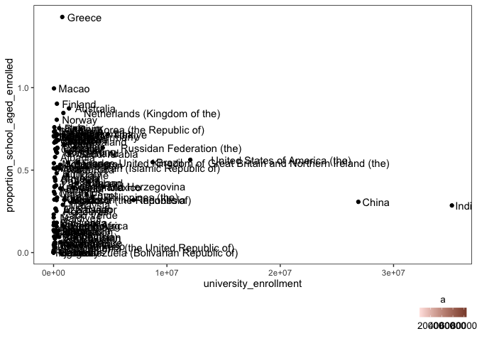
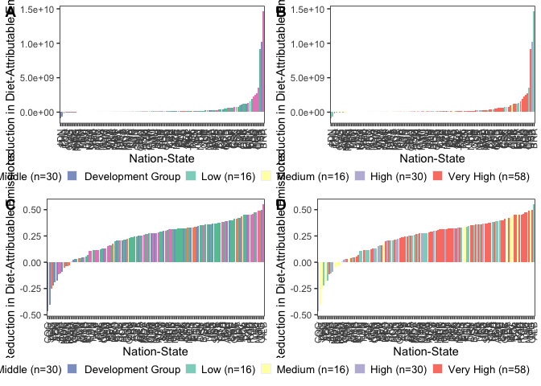
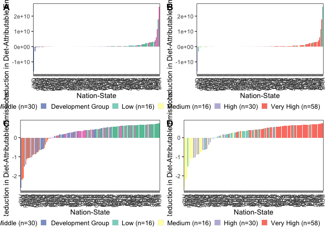

Data Analysis and Visualization
================
Last updated: June 12, 2024

## Package Loading

Here, we list the packages that will be required to support our
analytical and visualization procedures.

``` r
library(tidyverse)
```

    ## ── Attaching packages ─────────────────────────────────────── tidyverse 1.3.2 ──
    ## ✔ ggplot2 3.4.1      ✔ purrr   0.3.4 
    ## ✔ tibble  3.1.8      ✔ dplyr   1.0.10
    ## ✔ tidyr   1.2.1      ✔ stringr 1.4.1 
    ## ✔ readr   2.1.2      ✔ forcats 0.5.2 
    ## ── Conflicts ────────────────────────────────────────── tidyverse_conflicts() ──
    ## ✖ dplyr::filter() masks stats::filter()
    ## ✖ dplyr::lag()    masks stats::lag()

``` r
library(viridis)
```

    ## Loading required package: viridisLite

``` r
library(RColorBrewer)
library(colorspace)
library(ggpubr)
library(ggridges)
library(forcats)
library(lazyeval)
```

    ## 
    ## Attaching package: 'lazyeval'
    ## 
    ## The following objects are masked from 'package:purrr':
    ## 
    ##     is_atomic, is_formula

## Data Loading

The below code chunk loads in the data in the two formats we specified
at the end of our cleaning script: one suited for spatial visualization
and analysis and one not.

``` r
impact_data <- read.csv("/Users/kenjinchang/github/university-impact-model/data/model-output/university-impact-model.csv")
spatial_impact_data <- read.csv("/Users/kenjinchang/github/university-impact-model/data/model-output/university-impact-model-shapefile.csv")
```

## Methods-Section Figures

### Nation-State Inclusion

As specified in the manuscript, we will need to generate a figure
separating the nation-states included within our analysis from those
that were omitted for the various reasons cited in our cleaning script.

We will eventually also have to create a complementary flow diagram
documenting this exclusion process, whereby nation-states were excluded
either (1) because they did not have complete dietary-footprint data for
the nine dietary scenarios across the two identified sources (i.e.,
publication data for Kim et al. (2020) and publication data for Semba et
al. (2020)), (2) because they did not have the \_\_\_

For now, we focus on creating a choropleth map using
`spatial_impact_data` indicating which and how many nation-states are
being factored into our country-level and global results.

``` r
spatial_impact_data <- spatial_impact_data %>%
  mutate(inclusion=case_when(university_enrollment>0~"Included")) 
impact_data<- impact_data %>%
  mutate(inclusion=case_when(university_enrollment>0~"Included")) 
```

``` r
ggplot(spatial_impact_data,aes(x=long,y=lat,fill=inclusion,group=group)) + 
  geom_polygon(color="black",linewidth=0.125) +
  scale_fill_brewer(palette="Pastel2",na.value="white",name="Inclusion Outcomes",labels=c("Included (n=120)","NA")) +
  xlab("") + 
  ylab("") +
  labs(caption="") +
  theme(legend.position="bottom",legend.justification="right",legend.box.spacing=unit(-15,"pt"),legend.key.size=unit(10,"pt"),panel.grid=element_blank(),panel.background=element_rect(fill="white"),panel.border=element_rect(fill=NA),axis.text=element_blank(),axis.ticks=element_blank(),legend.title=element_text(size=10),legend.text=element_text(size=10),plot.title=element_text(size=10))
```

<!-- -->

## Descriptive Results

### Enrollment Indicators

To provide readers with a sense of scale and context, we perform a
series of calculations to derive a few relevant statistics. These
include:

- The mean proportion of the national population that is between the
  ages of 18 and 23 across the 120 included nation-states (i.e., 7.30%)

``` r
impact_data %>%
  select(country,proportion_school_aged) %>%
  summarise(mean(proportion_school_aged))
```

    ##   mean(proportion_school_aged)
    ## 1                   0.07302653

- The mean proportion of the school-aged population that is thought to
  be enrolled in college or university programs across the 120 included
  nation-states (i.e., 41.50%)

``` r
impact_data %>%
  select(country,proportion_school_aged_enrolled) %>%
  summarise(mean(proportion_school_aged_enrolled))
```

    ##   mean(proportion_school_aged_enrolled)
    ## 1                              0.414998

- The global sum of people enrolled in college and university programs
  across the 120 included nation-states (i.e., 168,167,205)

``` r
impact_data %>%
  summarize(sum(university_enrollment))
```

    ##   sum(university_enrollment)
    ## 1                  168167205

- The global sum of people of all ages residing in the 120 included
  nation-states (i.e., 6,592,823,027)

``` r
impact_data %>%
  summarise(sum(national_population))
```

    ##   sum(national_population)
    ## 1               6592823027

- The proportion of that sum enrollees account for (i.e., 2.55%)

``` r
168167205 / 6592823027
```

    ## [1] 0.02550762

This final statistic, in particular, will provide us with a more
complete understanding of the size and proportion of the population that
the expected reductions in carbon emissions are being modeled from.

``` r
impact_data %>% 
  ggplot(aes(x=university_enrollment,y=proportion_school_aged_enrolled)) + 
  geom_point() +
  theme(legend.position="bottom",legend.justification="right",legend.box.spacing=unit(0,"pt"),legend.key.size=unit(10,"pt"),panel.grid=element_blank(),panel.background=element_rect(fill="white"),panel.border=element_rect(fill=NA),legend.title=element_text(size=10),legend.text=element_text(size=10),plot.title=element_text(size=10))
```

<!-- -->

ggplot(aes(baseline_population_kg_co2e,fill=factor(development_group,levels=c(“Low”,“Medium”,“High”,“Very
High”,“NA”)),color=factor(development_group,levels=c(“Low”,“Medium”,“High”,“Very
High”,“NA”)))) + geom_density(alpha=0.75) +
scale_color_brewer(palette=“Set3”,name=“Development Group”,labels=c(“Low
(n=16)”,“Medium (n=16)”,“High (n=30)”,“Very High (n=58)”,“NA”)) +
scale_fill_brewer(palette=“Set3”,name=“Development Group”,labels=c(“Low
(n=16)”,“Medium (n=16)”,“High (n=30)”,“Very High (n=58)”,“NA”)) +
xlim(-400,1500) + xlab(bquote(‘Annual Population-Level,
Diet-Attributable Emissions at Baseline (Million kg CO’\[2\]\*‘e)’)) +
ylab(“Density”) +
theme(legend.position=“bottom”,legend.justification=“right”,legend.box.spacing=unit(0,“pt”),legend.key.size=unit(10,“pt”),panel.grid=element_blank(),panel.background=element_rect(fill=“white”),panel.border=element_rect(fill=NA),legend.title=element_text(size=10),legend.text=element_text(size=10),plot.title=element_text(size=10))

absolute

``` r
spatial_impact_data %>%
  ggplot(aes(x=long,y=lat,fill=university_enrollment,group=group)) + 
  geom_polygon(color="black",linewidth=0.125,alpha=0.8) +
  scale_fill_gradient(low="lavender",high="mediumpurple4",na.value="white",name="Individuals Enrolled in College and University Programs",guide=guide_colourbar(reverse=FALSE,title.position="top")) +
  xlab("") + 
  ylab("") +
  labs(caption="") +
  theme(legend.key.width=unit(3,"lines"),legend.position="bottom",legend.justification="right",legend.box.spacing=unit(-15,"pt"),legend.key.size=unit(10,"pt"),panel.grid=element_blank(),panel.background=element_rect(fill="white"),panel.border=element_rect(fill=NA),axis.text=element_blank(),axis.ticks=element_blank(),legend.title=element_text(size=10),legend.text=element_text(size=10),plot.title=element_text(size=10))
```

<!-- -->
scale_fill_gradient(low=“palegreen”,high=“palegreen4”,na.value=“white”) +
guides(fill=guide_colorbar(reverse=TRUE,title.position=“top”,title.hjust=0.5)) +
relative

ggplot(spatial_impact_data,aes(x=long,y=lat,fill=eat_lancet_population_percent_reduction_kg_co2e
,group=group)) + geom_polygon(color=“black”,size=0.125,alpha=0.66) +
scale_fill_gradient(low=“palegreen”,high=“palegreen4”,na.value=“white”) +
guides(fill=guide_colorbar(reverse=TRUE,title.position=“top”,title.hjust=0.5)) +
xlab(““) + ylab(”“) + labs(caption=”“) + ggtitle(”Diet-Attributable
Greenhouse Gas Footprint at Baseline”) +
theme(legend.position=“bottom”,panel.grid=element_blank(),panel.background=element_rect(fill=“white”),panel.border=element_rect(fill=NA),axis.text=element_blank(),axis.ticks=element_blank(),legend.key.width=unit(3.5,“cm”))

``` r
spatial_impact_data %>%
  ggplot(aes(x=long,y=lat,fill=proportion_school_aged_enrolled,group=group)) + 
  geom_polygon(color="black",linewidth=0.125,alpha=0.8) +
  scale_fill_gradient(low="lavender",high="mediumpurple4",na.value="white",name="Proportion of School-Aged Population Enrolled",guide=guide_colourbar(reverse=FALSE)) +
  xlab("") + 
  ylab("") +
  labs(caption="") +
  theme(legend.key.width=unit(3,"lines"),legend.position="bottom",legend.justification="right",legend.box.spacing=unit(-15,"pt"),legend.key.size=unit(10,"pt"),panel.grid=element_blank(),panel.background=element_rect(fill="white"),panel.border=element_rect(fill=NA),axis.text=element_blank(),axis.ticks=element_blank(),legend.title=element_text(size=10),legend.text=element_text(size=10),plot.title=element_text(size=10))
```

<!-- -->

### Lending- and Development-Group Membership

``` r
impact_data %>%
  count(lending_group)
```

    ##   lending_group  n
    ## 1          High 46
    ## 2           Low 13
    ## 3  Lower-Middle 30
    ## 4  Upper-Middle 31

``` r
lending_group_membership <- spatial_impact_data %>%
  ggplot(aes(x=long,y=lat,group=group,fill=factor(lending_group,levels=c("Low","Lower-Middle","Upper-Middle","High","NA")))) + 
  geom_polygon(color="black",size=0.125) +
  scale_fill_brewer(palette="Set2",na.value="white",name="Lending Group",labels=c("Low (n=13)","Lower Middle (n=30)","Upper Middle (n=31)","High (n=46)","NA")) +
  xlab("") + 
  ylab("") +
  labs(caption="") +
  theme(legend.position="bottom",legend.justification="right",legend.box.spacing=unit(-15,"pt"),legend.key.size=unit(10,"pt"),panel.grid=element_blank(),panel.background=element_rect(fill="white"),panel.border=element_rect(fill=NA),axis.text=element_blank(),axis.ticks=element_blank(),legend.title=element_text(size=10),legend.text=element_text(size=10),plot.title=element_text(size=10))
```

    ## Warning: Using `size` aesthetic for lines was deprecated in ggplot2 3.4.0.
    ## ℹ Please use `linewidth` instead.

``` r
impact_data %>%
  count(development_group)
```

    ##   development_group  n
    ## 1              High 30
    ## 2               Low 16
    ## 3            Medium 16
    ## 4         Very High 58

``` r
development_group_membership <- spatial_impact_data %>%
  ggplot(aes(x=long,y=lat,group=group,fill=factor(development_group,levels=c("Low","Medium","High","Very High","NA")))) + 
  geom_polygon(color="black",size=0.125) +
  scale_fill_brewer(palette="Set3",na.value="white",name="Development Group",labels=c("Low (n=16)","Medium (n=16)","High (n=30)","Very High (n=58)","NA")) +
  xlab("") + 
  ylab("") +
  labs(caption="") +
  theme(legend.position="bottom",legend.justification="right",legend.box.spacing=unit(-15,"pt"),legend.key.size=unit(10,"pt"),panel.grid=element_blank(),panel.background=element_rect(fill="white"),panel.border=element_rect(fill=NA),axis.text=element_blank(),axis.ticks=element_blank(),legend.title=element_text(size=10),legend.text=element_text(size=10),plot.title=element_text(size=10))
```

ggtitle(“Figure X. Choropleth map sorting the 120 nation-states included
in our analyses into their corresponding lending- and development-group
categories.”) +

``` r
ggarrange(lending_group_membership,development_group_membership,
          nrow=2,
          labels=c("A","B"))
```

<!-- -->

### Technical Potential

Because the average reduction across the nine arbitrarily chosen
scenarios may not be particularly useful, we may want to, instead, look
at the returns associated with the most impactful scenarios across the
various nation-states included within our analysis.

For now, though, let us look first at the top ten performing
nation-states when taking the average across the scenarios.

``` r
impact_data %>%
  mutate(mean_population_reduction_kg_co2e=(meatless_day_population_reduction_kg_co2e+low_red_meat_population_reduction_kg_co2e+no_red_meat_population_reduction_kg_co2e+no_dairy_population_reduction_kg_co2e+pescetarian_population_reduction_kg_co2e+lacto_ovo_vegetarian_population_reduction_kg_co2e+eat_lancet_population_reduction_kg_co2e+two_thirds_vegan_population_reduction_kg_co2e+vegan_population_reduction_kg_co2e)/9) %>%
  select(country,mean_population_reduction_kg_co2e) %>%
  arrange(desc(mean_population_reduction_kg_co2e)) %>%
  head(10)
```

    ##                              country mean_population_reduction_kg_co2e
    ## 1                              India                        5632272574
    ## 2                          Indonesia                         506837429
    ## 3                        Afghanistan                         143370304
    ## 4                         Madagascar                          66781849
    ## 5                          Sri Lanka                          54824513
    ## 6                      Côte d'Ivoire                          49753037
    ## 7                           Ethiopia                          40789605
    ## 8                            Senegal                          40784690
    ## 9                           Zimbabwe                          35329195
    ## 10 Tanzania (the United Republic of)                          25518567

``` r
lending_group_mean_percent_reduction <- impact_data %>%
  mutate(mean_population_percent_reduction_kg_co2e=(meatless_day_population_percent_reduction_kg_co2e+low_red_meat_population_percent_reduction_kg_co2e+no_red_meat_day_population_percent_reduction_kg_co2e+no_dairy_population_percent_reduction_kg_co2e+pescetarian_population_percent_reduction_kg_co2e+lacto_ovo_vegetarian_population_percent_reduction_kg_co2e+eat_lancet_population_percent_reduction_kg_co2e+two_thirds_vegan_population_percent_reduction_kg_co2e+vegan_population_percent_reduction_kg_co2e)/9) %>%
  ggplot(aes(x=fct_reorder(country_alpha_three,mean_population_percent_reduction_kg_co2e),y=mean_population_percent_reduction_kg_co2e,fill=development_group)) +
  geom_col() + 
  xlab("Nation-State") + 
  ylab("Average Percent-Reduction in Diet-Attributable Emissions") + 
  scale_fill_brewer(palette="Set2",name="Lending Group",labels=c("Low (n=13)","Lower Middle (n=30)","Upper Middle (n=31)","High (n=46)","NA")) + 
  theme(axis.text.x=element_text(angle=90,vjust=0.5,hjust=1),legend.position="bottom",legend.justification="right",legend.box.spacing=unit(0,"pt"),legend.key.size=unit(10,"pt"),panel.grid=element_blank(),panel.background=element_rect(fill="white"),panel.border=element_rect(fill=NA),legend.title=element_text(size=10),legend.text=element_text(size=10),plot.title=element_text(size=10))
```

``` r
development_group_mean_percent_reduction <- impact_data %>%
  mutate(mean_population_percent_reduction_kg_co2e=(meatless_day_population_percent_reduction_kg_co2e+low_red_meat_population_percent_reduction_kg_co2e+no_red_meat_day_population_percent_reduction_kg_co2e+no_dairy_population_percent_reduction_kg_co2e+pescetarian_population_percent_reduction_kg_co2e+lacto_ovo_vegetarian_population_percent_reduction_kg_co2e+eat_lancet_population_percent_reduction_kg_co2e+two_thirds_vegan_population_percent_reduction_kg_co2e+vegan_population_percent_reduction_kg_co2e)/9) %>%
  ggplot(aes(x=fct_reorder(country_alpha_three,mean_population_percent_reduction_kg_co2e),y=mean_population_percent_reduction_kg_co2e,fill=lending_group)) +
  geom_col() + 
  xlab("Nation-State") + 
  ylab("Average Percent-Reduction in Diet-Attributable Emissions") + 
  scale_fill_brewer(palette="Set3",name="Development Group",labels=c("Low (n=16)","Medium (n=16)","High (n=30)","Very High (n=58)","NA")) + 
  theme(axis.text.x=element_text(angle=90,vjust=0.5,hjust=1),legend.position="bottom",legend.justification="right",legend.box.spacing=unit(0,"pt"),legend.key.size=unit(10,"pt"),panel.grid=element_blank(),panel.background=element_rect(fill="white"),panel.border=element_rect(fill=NA),legend.title=element_text(size=10),legend.text=element_text(size=10),plot.title=element_text(size=10))
```

``` r
ggarrange(lending_group_mean_percent_reduction,development_group_mean_percent_reduction,
          nrow=2,
          labels=c("A","B"))
```

<!-- -->

``` r
lending_group_mean_absolute_reduction <- impact_data %>%
  mutate(mean_population_reduction_kg_co2e=(meatless_day_population_reduction_kg_co2e+low_red_meat_population_reduction_kg_co2e+no_red_meat_population_reduction_kg_co2e+no_dairy_population_reduction_kg_co2e+pescetarian_population_reduction_kg_co2e+lacto_ovo_vegetarian_population_reduction_kg_co2e+eat_lancet_population_reduction_kg_co2e+two_thirds_vegan_population_reduction_kg_co2e+vegan_population_reduction_kg_co2e)/9) %>%
  ggplot(aes(x=fct_reorder(country_alpha_three,mean_population_reduction_kg_co2e),y=mean_population_reduction_kg_co2e,fill=lending_group)) +
  geom_col() + 
  xlab("Nation-State") + 
  ylab("Average Reduction in Diet-Attributable Emissions") + 
  scale_fill_brewer(palette="Set2",name="Lending Group",labels=c("Low (n=13)","Lower Middle (n=30)","Upper Middle (n=31)","High (n=46)","NA")) + 
  theme(axis.text.x=element_text(angle=90,vjust=0.5,hjust=1),legend.position="bottom",legend.justification="right",legend.box.spacing=unit(0,"pt"),legend.key.size=unit(10,"pt"),panel.grid=element_blank(),panel.background=element_rect(fill="white"),panel.border=element_rect(fill=NA),legend.title=element_text(size=10),legend.text=element_text(size=10),plot.title=element_text(size=10))
```

``` r
development_group_mean_absolute_reduction <- impact_data %>%
  mutate(mean_population_reduction_kg_co2e=(meatless_day_population_reduction_kg_co2e+low_red_meat_population_reduction_kg_co2e+no_red_meat_population_reduction_kg_co2e+no_dairy_population_reduction_kg_co2e+pescetarian_population_reduction_kg_co2e+lacto_ovo_vegetarian_population_reduction_kg_co2e+eat_lancet_population_reduction_kg_co2e+two_thirds_vegan_population_reduction_kg_co2e+vegan_population_reduction_kg_co2e)/9) %>%
  ggplot(aes(x=fct_reorder(country_alpha_three,mean_population_reduction_kg_co2e),y=mean_population_reduction_kg_co2e,fill=development_group)) +
  geom_col() + 
  xlab("Nation-State") + 
  ylab("Average Reduction in Diet-Attributable Emissions") + 
  scale_fill_brewer(palette="Set3",name="Development Group",labels=c("Low (n=16)","Medium (n=16)","High (n=30)","Very High (n=58)","NA")) + 
  theme(axis.text.x=element_text(angle=90,vjust=0.5,hjust=1),legend.position="bottom",legend.justification="right",legend.box.spacing=unit(0,"pt"),legend.key.size=unit(10,"pt"),panel.grid=element_blank(),panel.background=element_rect(fill="white"),panel.border=element_rect(fill=NA),legend.title=element_text(size=10),legend.text=element_text(size=10),plot.title=element_text(size=10))
```

``` r
ggarrange(lending_group_mean_absolute_reduction,development_group_mean_absolute_reduction,
          nrow=2,
          labels=c("A","B"))
```

<!-- --> As
described previously, we will now run a similar set of analyses for the
120 included nation-states - this time, for each of their optimal change
scenarios. - should spot check this

``` r
impact_data <- impact_data %>%
  mutate(greatest_population_reduction_kg_co2e=pmax(meatless_day_population_reduction_kg_co2e,low_red_meat_population_reduction_kg_co2e,no_red_meat_population_reduction_kg_co2e,no_dairy_population_reduction_kg_co2e,pescetarian_population_reduction_kg_co2e,lacto_ovo_vegetarian_population_reduction_kg_co2e,eat_lancet_population_reduction_kg_co2e,two_thirds_vegan_population_reduction_kg_co2e,vegan_population_reduction_kg_co2e))
```

``` r
impact_data <- impact_data %>%
  mutate(greatest_reduction_diet=case_when(greatest_population_reduction_kg_co2e==meatless_day_population_reduction_kg_co2e~"Meatless Day",
                                           greatest_population_reduction_kg_co2e==low_red_meat_population_reduction_kg_co2e~"Low Red Meat",
                                           greatest_population_reduction_kg_co2e==no_red_meat_population_reduction_kg_co2e~"No Red Meat",
                                           greatest_population_reduction_kg_co2e==no_dairy_population_reduction_kg_co2e~"No Dairy",
                                           greatest_population_reduction_kg_co2e==pescetarian_population_reduction_kg_co2e~"Pescetarian",
                                           greatest_population_reduction_kg_co2e==lacto_ovo_vegetarian_population_reduction_kg_co2e~"Lacto-Ovo Vegetarian",
                                           greatest_population_reduction_kg_co2e==eat_lancet_population_reduction_kg_co2e~"EAT Lancet",
                                           greatest_population_reduction_kg_co2e==two_thirds_vegan_population_reduction_kg_co2e~"Two-Thirds Vegan",
                                           greatest_population_reduction_kg_co2e==vegan_population_reduction_kg_co2e~"Vegan"))
```

With this complete, we can now calculate the “technical potential” of
university-based dietary interventions, which is to say, the total
reductions in diet-attributable greenhouse gas emission (represented in
kg CO2e) if the target populations were to change their behaviors as
intended, per Nielsen and colleagues (2024).

``` r
impact_data %>%
  summarize(sum(greatest_population_reduction_kg_co2e))
```

    ##   sum(greatest_population_reduction_kg_co2e)
    ## 1                                -1387410136

We can also identify the top 10 performing nation-states, as we did
before - this time, for the optimized scenarios.

``` r
impact_data %>%
  select(country,greatest_population_reduction_kg_co2e) %>%
  arrange(desc(greatest_population_reduction_kg_co2e)) %>%
  head(10)
```

    ##              country greatest_population_reduction_kg_co2e
    ## 1              India                           17545637941
    ## 2          Indonesia                            3073334989
    ## 3           Colombia                            1134569816
    ## 4           Pakistan                            1102548993
    ## 5  Philippines (the)                             859745216
    ## 6        Afghanistan                             474366684
    ## 7           Ethiopia                             473875009
    ## 8           Thailand                             410833184
    ## 9           Malaysia                             343323755
    ## 10           Ecuador                             267953160

Will have to move this to the most appropriate section later, BUT, we’ll
want to use similar code to look at how this varies across groupings

``` r
impact_data %>%
  select(country,lending_group,greatest_population_reduction_kg_co2e) %>%
  group_by(lending_group) %>%
  arrange(desc(greatest_population_reduction_kg_co2e)) 
```

    ## # A tibble: 120 × 3
    ## # Groups:   lending_group [4]
    ##    country           lending_group greatest_population_reduction_kg_co2e
    ##    <chr>             <chr>                                         <dbl>
    ##  1 India             Lower-Middle                           17545637941.
    ##  2 Indonesia         Lower-Middle                            3073334989.
    ##  3 Colombia          Upper-Middle                            1134569816.
    ##  4 Pakistan          Lower-Middle                            1102548993.
    ##  5 Philippines (the) Lower-Middle                             859745216.
    ##  6 Afghanistan       Low                                      474366684.
    ##  7 Ethiopia          Low                                      473875009.
    ##  8 Thailand          Upper-Middle                             410833184.
    ##  9 Malaysia          Upper-Middle                             343323755.
    ## 10 Ecuador           Upper-Middle                             267953160.
    ## # … with 110 more rows

estimates the total global impact if the most ideal dietary change
occurred - should do same for relative change (percent reduction)

``` r
lending_group_optimized_absolute_reduction <- impact_data %>%
  ggplot(aes(x=fct_reorder(country_alpha_three,greatest_population_reduction_kg_co2e),y=greatest_population_reduction_kg_co2e,fill=lending_group)) +
  geom_col() + 
  xlab("Nation-State") + 
  ylab("Reduction in Diet-Attributable Emissions") + 
  scale_fill_brewer(palette="Set2",name="Lending Group",labels=c("Low (n=13)","Lower Middle (n=30)","Upper Middle (n=31)","High (n=46)","NA")) + 
  theme(axis.text.x=element_text(angle=90,vjust=0.5,hjust=1),legend.position="bottom",legend.justification="right",legend.box.spacing=unit(0,"pt"),legend.key.size=unit(10,"pt"),panel.grid=element_blank(),panel.background=element_rect(fill="white"),panel.border=element_rect(fill=NA),legend.title=element_text(size=10),legend.text=element_text(size=10),plot.title=element_text(size=10))
```

``` r
development_group_optimized_absolute_reduction <- impact_data %>%
  ggplot(aes(x=fct_reorder(country_alpha_three,greatest_population_reduction_kg_co2e),y=greatest_population_reduction_kg_co2e,fill=development_group)) +
  geom_col() + 
  xlab("Nation-State") + 
  ylab("Reduction in Diet-Attributable Emissions") + 
  scale_fill_brewer(palette="Set3",name="Development Group",labels=c("Low (n=16)","Medium (n=16)","High (n=30)","Very High (n=58)","NA")) + 
  theme(axis.text.x=element_text(angle=90,vjust=0.5,hjust=1),legend.position="bottom",legend.justification="right",legend.box.spacing=unit(0,"pt"),legend.key.size=unit(10,"pt"),panel.grid=element_blank(),panel.background=element_rect(fill="white"),panel.border=element_rect(fill=NA),legend.title=element_text(size=10),legend.text=element_text(size=10),plot.title=element_text(size=10))
```

``` r
ggarrange(lending_group_optimized_absolute_reduction,development_group_optimized_absolute_reduction,
          nrow=2,
          labels=c("A","B"))
```

<!-- -->

``` r
lending_group_optimized_percent_reduction <- impact_data %>% 
  mutate(optimal_diet_population_percent_reduction_kg_co2e=(baseline_population_kg_co2e-greatest_population_reduction_kg_co2e)/baseline_population_kg_co2e) %>%
  ggplot(aes(x=fct_reorder(country_alpha_three,optimal_diet_population_percent_reduction_kg_co2e),y=optimal_diet_population_percent_reduction_kg_co2e,fill=development_group)) +
  geom_col() + 
  xlab("Nation-State") + 
  ylab("Average Percent-Reduction in Diet-Attributable Emissions") + 
  scale_fill_brewer(palette="Set2",name="Lending Group",labels=c("Low (n=13)","Lower Middle (n=30)","Upper Middle (n=31)","High (n=46)","NA")) + 
  theme(axis.text.x=element_text(angle=90,vjust=0.5,hjust=1),legend.position="bottom",legend.justification="right",legend.box.spacing=unit(0,"pt"),legend.key.size=unit(10,"pt"),panel.grid=element_blank(),panel.background=element_rect(fill="white"),panel.border=element_rect(fill=NA),legend.title=element_text(size=10),legend.text=element_text(size=10),plot.title=element_text(size=10))
```

``` r
development_group_optimized_percent_reduction <- impact_data %>% 
  mutate(optimal_diet_population_percent_reduction_kg_co2e=(baseline_population_kg_co2e-greatest_population_reduction_kg_co2e)/baseline_population_kg_co2e) %>%
  ggplot(aes(x=fct_reorder(country_alpha_three,optimal_diet_population_percent_reduction_kg_co2e),y=optimal_diet_population_percent_reduction_kg_co2e,fill=development_group)) +
  geom_col() + 
  xlab("Nation-State") + 
  ylab("Average Percent-Reduction in Diet-Attributable Emissions") + 
  scale_fill_brewer(palette="Set3",name="Development Group",labels=c("Low (n=16)","Medium (n=16)","High (n=30)","Very High (n=58)","NA")) + 
  theme(axis.text.x=element_text(angle=90,vjust=0.5,hjust=1),legend.position="bottom",legend.justification="right",legend.box.spacing=unit(0,"pt"),legend.key.size=unit(10,"pt"),panel.grid=element_blank(),panel.background=element_rect(fill="white"),panel.border=element_rect(fill=NA),legend.title=element_text(size=10),legend.text=element_text(size=10),plot.title=element_text(size=10))
```

``` r
ggarrange(lending_group_optimized_percent_reduction,development_group_optimized_percent_reduction,
          nrow=2,
          labels=c("A","B"))
```

<!-- -->

Might be good to spot check after changing percent-decrease calculation
in cleaning script, now that vegan is not mirrored with optimal

``` r
impact_data %>%
  mutate(optimal_diet_population_percent_reduction_kg_co2e=(baseline_population_kg_co2e-greatest_population_reduction_kg_co2e)/baseline_population_kg_co2e) %>%
  select(country,vegan_population_percent_reduction_kg_co2e,optimal_diet_population_percent_reduction_kg_co2e,vegan_population_reduction_kg_co2e,greatest_population_reduction_kg_co2e) %>%
  head(10)
```

    ##        country vegan_population_percent_reduction_kg_co2e
    ## 1  Afghanistan                                 -0.7155515
    ## 2      Albania                                 -0.8195048
    ## 3      Algeria                                 -0.7403464
    ## 4    Argentina                                 -0.8544103
    ## 5      Armenia                                 -0.7715800
    ## 6    Australia                                 -0.9057310
    ## 7      Austria                                 -0.8278999
    ## 8   Azerbaijan                                 -0.8284002
    ## 9     Barbados                                 -0.8105018
    ## 10     Belarus                                 -0.7864728
    ##    optimal_diet_population_percent_reduction_kg_co2e
    ## 1                                         -0.4247003
    ## 2                                          1.1367018
    ## 3                                          0.9017895
    ## 4                                          1.2728629
    ## 5                                          1.0061507
    ## 6                                          1.1613395
    ## 7                                          1.1980944
    ## 8                                          0.9308701
    ## 9                                          1.0240826
    ## 10                                         1.1214162
    ##    vegan_population_reduction_kg_co2e greatest_population_reduction_kg_co2e
    ## 1                        -238249237.6                          4.743667e+08
    ## 2                        -222416772.5                         -3.710140e+07
    ## 3                        -816936907.5                          1.083706e+08
    ## 4                       -7551041800.2                         -2.411487e+09
    ## 5                        -103434565.4                         -8.245313e+05
    ## 6                       -3869783490.4                         -6.893313e+08
    ## 7                        -465337434.2                         -1.113429e+08
    ## 8                        -252326863.7                          2.105665e+07
    ## 9                           -170485.2                         -5.065656e+03
    ## 10                       -351998020.1                         -5.434171e+07

NEXT STEP WILL BE TO LOOK AT RELATIVE CHANGE FROM OPTIMIZED SCENARIO AND
ALSO PROBABLY MOVE DICHOTOMIZED TO LOWER SECTIONS -

scale_fill_brewer(palette=“Set2”,name=“Lending Group”,labels=c(“Low
(n=13)”,“Lower Middle (n=30)”,“Upper Middle (n=31)”,“High
(n=46)”,“NA”)) + scale_fill_brewer(palette=“Set3”,name=“Development
Group”,labels=c(“Low (n=16)”,“Medium (n=16)”,“High (n=30)”,“Very High
(n=58)”,“NA”)) +

scale_fill_brewer(palette=“Set2”,name=“Lending Group”,labels=c(“Low
(n=13)”,“Lower Middle (n=30)”,“Upper Middle (n=31)”,“High
(n=46)”,“NA”)) + scale_fill_brewer(palette=“Set3”,name=“Development
Group”,labels=c(“Low (n=16)”,“Medium (n=16)”,“High (n=30)”,“Very High
(n=58)”,“NA”)) +

xlab(“Nation-State”) + ylab(“Average Reduction in Diet-Attributable
Emissions”) +

theme(axis.text.x=element_text(angle=90,vjust=0.5,hjust=1),legend.position=“bottom”,legend.justification=“right”,legend.box.spacing=unit(0,“pt”),legend.key.size=unit(10,“pt”),panel.grid=element_blank(),panel.background=element_rect(fill=“white”),panel.border=element_rect(fill=NA),legend.title=element_text(size=10),legend.text=element_text(size=10),plot.title=element_text(size=10))

## Lending- and Development-Group Distributions

First, change population figures to millions kg Co2e

``` r
impact_data <- impact_data %>%
  mutate(baseline_population_kg_co2e=baseline_population_kg_co2e/1000000) %>%
  mutate(baseline_adjusted_population_kg_co2e=baseline_adjusted_population_kg_co2e/1000000) %>%
  mutate(baseline_oecd_population_kg_co2e=baseline_oecd_population_kg_co2e/1000000) %>%
  mutate(meatless_day_population_kg_co2e=meatless_day_population_kg_co2e/1000000) %>%
  mutate(low_red_meat_population_kg_co2e=low_red_meat_population_kg_co2e/1000000) %>%
  mutate(no_red_meat_population_kg_co2e=no_red_meat_population_kg_co2e/1000000) %>%
  mutate(no_dairy_population_kg_co2e=no_dairy_population_kg_co2e/1000000) %>%
  mutate(pescetarian_population_kg_co2e=pescetarian_population_kg_co2e/1000000) %>%
  mutate(lacto_ovo_vegetarian_population_kg_co2e=lacto_ovo_vegetarian_population_kg_co2e/1000000) %>%
  mutate(eat_lancet_population_kg_co2e=eat_lancet_population_kg_co2e/1000000) %>%
  mutate(two_thirds_vegan_population_kg_co2e=two_thirds_vegan_population_kg_co2e/1000000) %>%
  mutate(vegan_population_kg_co2e=vegan_population_kg_co2e/1000000) %>%
  mutate(baseline_adjusted_population_reduction_kg_co2e=baseline_adjusted_population_reduction_kg_co2e/1000000) %>%
  mutate(baseline_oecd_population_reduction_kg_co2e=baseline_oecd_population_reduction_kg_co2e/1000000) %>%
  mutate(meatless_day_population_reduction_kg_co2e=meatless_day_population_reduction_kg_co2e/1000000) %>%
  mutate(low_red_meat_population_reduction_kg_co2e=low_red_meat_population_reduction_kg_co2e/1000000) %>%
  mutate(no_red_meat_population_reduction_kg_co2e=no_red_meat_population_reduction_kg_co2e/1000000) %>%
  mutate(no_dairy_population_reduction_kg_co2e=no_dairy_population_reduction_kg_co2e/1000000) %>%
  mutate(pescetarian_population_reduction_kg_co2e=pescetarian_population_reduction_kg_co2e/1000000) %>%
  mutate(lacto_ovo_vegetarian_population_reduction_kg_co2e=lacto_ovo_vegetarian_population_reduction_kg_co2e/1000000) %>%
  mutate(eat_lancet_population_reduction_kg_co2e=eat_lancet_population_reduction_kg_co2e/1000000) %>%
  mutate(two_thirds_vegan_population_reduction_kg_co2e=two_thirds_vegan_population_reduction_kg_co2e/1000000) %>%
  mutate(vegan_population_reduction_kg_co2e=vegan_population_reduction_kg_co2e/1000000)
```

``` r
lending_group_baseline_distribution <- impact_data %>%
  ggplot(aes(baseline_population_kg_co2e,fill=factor(lending_group,levels=c("Low","Lower-Middle","Upper-Middle","High","NA")),color=factor(lending_group,levels=c("Low","Lower-Middle","Upper-Middle","High","NA")))) + 
  geom_density(alpha=0.75) +
  scale_color_brewer(palette="Set2",name="Lending Group",labels=c("Low (n=13)","Lower Middle (n=30)","Upper Middle (n=31)","High (n=46)","NA")) +
  scale_fill_brewer(palette="Set2",name="Lending Group",labels=c("Low (n=13)","Lower Middle (n=30)","Upper Middle (n=31)","High (n=46)","NA")) + 
  xlim(-800,2500) + 
  xlab(bquote('Annual Population-Level, Diet-Attributable Emissions at Baseline (Million kg CO'[2]*'e)')) +
  ylab("Density") +
  theme(legend.position="bottom",legend.justification="right",legend.box.spacing=unit(0,"pt"),legend.key.size=unit(10,"pt"),panel.grid=element_blank(),panel.background=element_rect(fill="white"),panel.border=element_rect(fill=NA),legend.title=element_text(size=10),legend.text=element_text(size=10),plot.title=element_text(size=10))
```

``` r
development_group_baseline_distribution <- impact_data %>%
  ggplot(aes(baseline_population_kg_co2e,fill=factor(development_group,levels=c("Low","Medium","High","Very High","NA")),color=factor(development_group,levels=c("Low","Medium","High","Very High","NA")))) + 
  geom_density(alpha=0.75) +
  scale_color_brewer(palette="Set3",name="Development Group",labels=c("Low (n=16)","Medium (n=16)","High (n=30)","Very High (n=58)","NA")) +
  scale_fill_brewer(palette="Set3",name="Development Group",labels=c("Low (n=16)","Medium (n=16)","High (n=30)","Very High (n=58)","NA")) + 
  xlim(-400,1500) +
  xlab(bquote('Annual Population-Level, Diet-Attributable Emissions at Baseline (Million kg CO'[2]*'e)')) +
  ylab("Density") +
  theme(legend.position="bottom",legend.justification="right",legend.box.spacing=unit(0,"pt"),legend.key.size=unit(10,"pt"),panel.grid=element_blank(),panel.background=element_rect(fill="white"),panel.border=element_rect(fill=NA),legend.title=element_text(size=10),legend.text=element_text(size=10),plot.title=element_text(size=10))
```

``` r
ggarrange(lending_group_baseline_distribution,development_group_baseline_distribution,
          nrow=2,
          labels=c("A","B"))
```

    ## Warning: Removed 23 rows containing non-finite values (`stat_density()`).

    ## Warning: Removed 29 rows containing non-finite values (`stat_density()`).

<!-- -->

``` r
impact_data %>%
  group_by(lending_group) %>%
  summarize(mean=mean(baseline_population_kg_co2e),sd=sd(baseline_population_kg_co2e)) 
```

    ## # A tibble: 4 × 3
    ##   lending_group  mean    sd
    ##   <chr>         <dbl> <dbl>
    ## 1 High          1721. 3767.
    ## 2 Low            149.  165.
    ## 3 Lower-Middle  1647. 5061.
    ## 4 Upper-Middle  3768. 8923.

``` r
impact_data %>%
  group_by(development_group) %>%
  summarize(mean=mean(baseline_population_kg_co2e),sd=sd(baseline_population_kg_co2e)) 
```

    ## # A tibble: 4 × 3
    ##   development_group  mean    sd
    ##   <chr>             <dbl> <dbl>
    ## 1 High              3473. 8991.
    ## 2 Low                265.  611.
    ## 3 Medium            1952. 6859.
    ## 4 Very High         1855. 3625.

## Groupwise Comparisons

``` r
impact_data %>%
  group_by(lending_group) %>%
  summarize(mean=mean(greatest_population_reduction_kg_co2e),sd=sd(greatest_population_reduction_kg_co2e))
```

    ## # A tibble: 4 × 3
    ##   lending_group        mean          sd
    ##   <chr>               <dbl>       <dbl>
    ## 1 High          -262902537.  792934802.
    ## 2 Low            134493035.  166009124.
    ## 3 Lower-Middle   804599333. 3219378457.
    ## 4 Upper-Middle  -489686545. 1907549558.

``` r
impact_data %>%
  group_by(development_group) %>%
  summarize(mean=mean(greatest_population_reduction_kg_co2e),sd=sd(greatest_population_reduction_kg_co2e))
```

    ## # A tibble: 4 × 3
    ##   development_group        mean          sd
    ##   <chr>                   <dbl>       <dbl>
    ## 1 High              -262912948. 2014815524.
    ## 2 Low                190218792.  287506094.
    ## 3 Medium            1184291457. 4363898242.
    ## 4 Very High         -267106650.  781061871.

``` r
lending_group_reductions_optimized <- impact_data %>%
  ggplot(aes(greatest_population_reduction_kg_co2e,fill=factor(lending_group,levels=c("Low","Lower-Middle","Upper-Middle","High","NA")),color=factor(lending_group,levels=c("Low","Lower-Middle","Upper-Middle","High","NA")))) + 
  geom_density(alpha=0.75) +
  scale_color_brewer(palette="Set2",name="Lending Group",labels=c("Low (n=13)","Lower Middle (n=30)","Upper Middle (n=31)","High (n=46)","NA")) +
  scale_fill_brewer(palette="Set2",name="Lending Group",labels=c("Low (n=13)","Lower Middle (n=30)","Upper Middle (n=31)","High (n=46)","NA")) + 
  xlim(-300,3000) + 
  xlab(bquote('Optimized Annual Population-Level Reductions in Diet-Attributable Emissions (Million kg CO'[2]*'e)')) +
  ylab("Density") +
  theme(legend.position="bottom",legend.justification="right",legend.box.spacing=unit(0,"pt"),legend.key.size=unit(10,"pt"),panel.grid=element_blank(),panel.background=element_rect(fill="white"),panel.border=element_rect(fill=NA),legend.title=element_text(size=10),legend.text=element_text(size=10),plot.title=element_text(size=10))
```

``` r
development_group_reductions_optimized <- impact_data %>%
  ggplot(aes(greatest_population_reduction_kg_co2e,fill=factor(development_group,levels=c("Low","Medium","High","Very High","NA")),color=factor(development_group,levels=c("Low","Medium","High","Very High","NA")))) + 
  geom_density(alpha=0.75) +
  scale_color_brewer(palette="Set3",name="Development Group",labels=c("Low (n=16)","Medium (n=16)","High (n=30)","Very High (n=58)","NA")) +
  scale_fill_brewer(palette="Set3",name="Development Group",labels=c("Low (n=16)","Medium (n=16)","High (n=30)","Very High (n=58)","NA")) + 
  xlim(-300,3000) +
  xlab(bquote('Optimized Annual Population-Level Reductions in Diet-Attributable Emissions (Million kg CO'[2]*'e)')) +
  ylab("Density") +
  theme(legend.position="bottom",legend.justification="right",legend.box.spacing=unit(0,"pt"),legend.key.size=unit(10,"pt"),panel.grid=element_blank(),panel.background=element_rect(fill="white"),panel.border=element_rect(fill=NA),legend.title=element_text(size=10),legend.text=element_text(size=10),plot.title=element_text(size=10))
```

``` r
ggarrange(lending_group_reductions_optimized,development_group_reductions_optimized,
          nrow=2,
          labels=c("A","B"))
```

    ## Warning: Removed 120 rows containing non-finite values (`stat_density()`).
    ## Removed 120 rows containing non-finite values (`stat_density()`).

<!-- --> \##
Lending- and Development-Group Membership, Dichotomized

``` r
impact_data %>%
  count(lending_group_dichotomy)
```

    ##   lending_group_dichotomy  n
    ## 1                  Higher 77
    ## 2                   Lower 43

``` r
lending_group_membership_dichotomized <- spatial_impact_data %>%
  ggplot(aes(x=long,y=lat,group=group,fill=factor(lending_group_dichotomy,levels=c("Lower","Higher","NA")))) + 
  geom_polygon(color="black",size=0.125) +
  scale_fill_brewer(palette="Set2",na.value="white",name="Lending Group",labels=c("Lower (n=43)","Higher (n=77)","NA")) +
  xlab("") + 
  ylab("") +
  labs(caption="") +
  theme(legend.position="bottom",legend.justification="right",legend.box.spacing=unit(-15,"pt"),legend.key.size=unit(10,"pt"),panel.grid=element_blank(),panel.background=element_rect(fill="white"),panel.border=element_rect(fill=NA),axis.text=element_blank(),axis.ticks=element_blank(),legend.title=element_text(size=10),legend.text=element_text(size=10),plot.title=element_text(size=10))
```

``` r
impact_data %>%
  count(development_group_dichotomy)
```

    ##   development_group_dichotomy  n
    ## 1                Global North 58
    ## 2                Global South 62

``` r
development_group_membership_dichotomized <- spatial_impact_data %>%
  ggplot(aes(x=long,y=lat,group=group,fill=factor(development_group_dichotomy,levels=c("Global South","Global North","NA")))) + 
  geom_polygon(color="black",size=0.125,alpha=0.75) +
  scale_fill_brewer(palette="Set3",na.value="white",name="Development Group",labels=c("Global South (n=62)","Global North (n=58)","NA")) +
  xlab("") + 
  ylab("") +
  labs(caption="") +
  theme(legend.position="bottom",legend.justification="right",legend.box.spacing=unit(-15,"pt"),legend.key.size=unit(10,"pt"),panel.grid=element_blank(),panel.background=element_rect(fill="white"),panel.border=element_rect(fill=NA),axis.text=element_blank(),axis.ticks=element_blank(),legend.title=element_text(size=10),legend.text=element_text(size=10),plot.title=element_text(size=10))
```

``` r
ggarrange(lending_group_membership_dichotomized,development_group_membership_dichotomized,
          nrow=2,
          labels=c("A","B"))
```

<!-- -->

## Lending- and Development-Group Distributions, Dichotomized

lending_group_distribution_dichotomized

``` r
lending_group_baseline_distribution_dichotomized <- impact_data %>%
  ggplot(aes(baseline_population_kg_co2e,fill=factor(lending_group_dichotomy,levels=c("Lower","Higher","NA")),color=factor(lending_group_dichotomy,levels=c("Lower","Higher","NA")))) + 
  geom_density(alpha=0.75) +
  scale_color_brewer(palette="Set2",name="Lending Group",labels=c("Lower (n=43)","Higher (n=77)","NA")) +
  scale_fill_brewer(palette="Set2",name="Lending Group",labels=c("Lower (n=43)","Higher (n=77)","NA")) + 
  xlim(-800,2500) + 
  xlab(bquote('Annual Population-Level, Diet-Attributable Emissions at Baseline (Millions of kg CO'[2]*'e)')) +
  ylab("Density") +
  theme(legend.position="bottom",legend.justification="right",legend.box.spacing=unit(0,"pt"),legend.key.size=unit(10,"pt"),panel.grid=element_blank(),panel.background=element_rect(fill="white"),panel.border=element_rect(fill=NA),legend.title=element_text(size=10),legend.text=element_text(size=10),plot.title=element_text(size=10))
```

``` r
development_group_baseline_distribution_dichotomized <- impact_data %>%
  ggplot(aes(baseline_population_kg_co2e,fill=factor(development_group_dichotomy,levels=c("Global South","Global North","NA")),color=factor(development_group_dichotomy,levels=c("Global South","Global North","NA")))) + 
  geom_density(alpha=0.75) +
  scale_color_brewer(palette="Set3",name="Development Group",labels=c("Global South (n=62)","Global North (n=58)","NA")) +
  scale_fill_brewer(palette="Set3",name="Development Group",labels=c("Global South (n=62)","Global North (n=58)","NA")) + 
  xlim(-400,1500) +
  xlab(bquote('Annual Population-Level, Diet-Attributable Emissions at Baseline (Millions of kg CO'[2]*'e)')) +
  ylab("Density") +
  theme(legend.position="bottom",legend.justification="right",legend.box.spacing=unit(0,"pt"),legend.key.size=unit(10,"pt"),panel.grid=element_blank(),panel.background=element_rect(fill="white"),panel.border=element_rect(fill=NA),legend.title=element_text(size=10),legend.text=element_text(size=10),plot.title=element_text(size=10))
```

``` r
ggarrange(lending_group_baseline_distribution_dichotomized,development_group_baseline_distribution_dichotomized,
          nrow=2,
          labels=c("A","B"))
```

    ## Warning: Removed 23 rows containing non-finite values (`stat_density()`).

    ## Warning: Removed 29 rows containing non-finite values (`stat_density()`).

<!-- -->

## Groupwise Comparisons, Dichotomized

``` r
lending_group_reductions_distribution_dichotomized <- impact_data %>%
  ggplot(aes(greatest_population_reduction_kg_co2e,fill=factor(lending_group_dichotomy,levels=c("Lower","Higher","NA")),color=factor(lending_group_dichotomy,levels=c("Lower","Higher","NA")))) + 
  geom_density(alpha=0.75) +
  scale_color_brewer(palette="Set2",name="Lending Group",labels=c("Lower (n=43)","Higher (n=77)","NA")) +
  scale_fill_brewer(palette="Set2",name="Lending Group",labels=c("Lower (n=43)","Higher (n=77)","NA")) + 
  xlim(-300,3000) + 
  xlab(bquote('Optimized Annual Population-Level Reductions in Diet-Attributable Emissions (Million kg CO'[2]*'e)')) +
  ylab("Density") +
  theme(legend.position="bottom",legend.justification="right",legend.box.spacing=unit(0,"pt"),legend.key.size=unit(10,"pt"),panel.grid=element_blank(),panel.background=element_rect(fill="white"),panel.border=element_rect(fill=NA),legend.title=element_text(size=10),legend.text=element_text(size=10),plot.title=element_text(size=10))
```

``` r
development_group_reductions_distribution_dichotomized <- impact_data %>%
  ggplot(aes(greatest_population_reduction_kg_co2e,fill=factor(development_group_dichotomy,levels=c("Global South","Global North","NA")),color=factor(development_group_dichotomy,levels=c("Global South","Global North","NA")))) + 
  geom_density(alpha=0.75) +
  scale_color_brewer(palette="Set3",name="Development Group",labels=c("Global South (n=62)","Global North (n=58)","NA")) +
  scale_fill_brewer(palette="Set3",name="Development Group",labels=c("Global South (n=62)","Global North (n=58)","NA")) + 
  xlim(-300,3000) +
  xlab(bquote('Optimized Annual Population-Level Reductions in Diet-Attributable Emissions (Million kg CO'[2]*'e)')) +
  ylab("Density") +
  theme(legend.position="bottom",legend.justification="right",legend.box.spacing=unit(0,"pt"),legend.key.size=unit(10,"pt"),panel.grid=element_blank(),panel.background=element_rect(fill="white"),panel.border=element_rect(fill=NA),legend.title=element_text(size=10),legend.text=element_text(size=10),plot.title=element_text(size=10))
```

``` r
ggarrange(lending_group_reductions_distribution_dichotomized,development_group_reductions_distribution_dichotomized,
          nrow=2,
          labels=c("A","B"))
```

    ## Warning: Removed 120 rows containing non-finite values (`stat_density()`).
    ## Removed 120 rows containing non-finite values (`stat_density()`).

<!-- -->

``` r
impact_data %>%
  group_by(lending_group_dichotomy) %>%
  summarize(mean=mean(greatest_population_reduction_kg_co2e),sd=sd(greatest_population_reduction_kg_co2e))
```

    ## # A tibble: 2 × 3
    ##   lending_group_dichotomy        mean          sd
    ##   <chr>                         <dbl>       <dbl>
    ## 1 Higher                  -354205189. 1349504718.
    ## 2 Lower                    602009057. 2694663822.

``` r
impact_data %>%
  group_by(development_group_dichotomy) %>%
  summarize(mean=mean(greatest_population_reduction_kg_co2e),sd=sd(greatest_population_reduction_kg_co2e))
```

    ## # A tibble: 2 × 3
    ##   development_group_dichotomy        mean          sd
    ##   <chr>                             <dbl>       <dbl>
    ## 1 Global North                -267106650.  781061871.
    ## 2 Global South                 227496380. 2644212867.

## Global

## Choropleths

## Residual Code Chunks

``` r
impact_data %>%
  ggplot(aes(factor(lending_group),baseline_population_kg_co2e)) + 
  geom_violin(scale="width") + 
  stat_summary(fun.y=mean, geom="point", shape=21, size=2) +
  coord_flip()
```

    ## Warning: The `fun.y` argument of `stat_summary()` is deprecated as of ggplot2 3.3.0.
    ## ℹ Please use the `fun` argument instead.

<!-- -->

``` r
impact_data %>%
  ggplot(aes(factor(development_group),baseline_population_kg_co2e)) + 
  geom_violin(scale="width") + 
  stat_summary(fun.y=mean, geom="point", shape=21, size=2) +
  coord_flip()
```

<!-- -->

``` r
impact_data %>% 
ggplot(aes(x=baseline_population_kg_co2e,y=development_group,fill=stat(x))) +
  geom_density_ridges_gradient() +
  scale_fill_viridis_c(option="C")
```

    ## Warning: `stat(x)` was deprecated in ggplot2 3.4.0.
    ## ℹ Please use `after_stat(x)` instead.

    ## Picking joint bandwidth of 375

<!-- -->

``` r
impact_data %>% 
ggplot(aes(x=baseline_population_kg_co2e,y=lending_group,fill=stat(x))) +
  geom_density_ridges_gradient(alpha=0.1) +
  scale_fill_viridis_c(option="C")
```

    ## Picking joint bandwidth of 394

<!-- -->

### Average Reduction

``` r
ggplot(spatial_impact_data,aes(x=long,y=lat,fill=proportion_school_aged_enrolled,group=group)) + 
  geom_polygon(color="black",size=0.125,alpha=0.66) + 
  scale_fill_continuous_sequential(labels=function(x)x/1000000,name="Millions Enrolled",palette="Purple-Blue",na.value="white",breaks=c(0,6000000,12000000,18000000,24000000,30000000),alpha=0.66) +
  guides(fill=guide_colorbar(title.position="top",title.hjust=0.5)) +
  xlab("") + 
  ylab("") +
  labs(caption="") +
  ggtitle("Enrollment Total") +
  theme(legend.position="bottom",panel.grid=element_blank(),panel.background=element_rect(fill="white"),panel.border=element_rect(fill=NA),axis.text=element_blank(),axis.ticks=element_blank(),legend.key.width=unit(3.5,"cm"))
```

<!-- -->

scale_fill_gradient(alpha=0.66,name=bquote(‘Kilograms
CO’\[2\]\*‘e’),colors=“z2”,trans=“reverse”,na.value=“white”,labels=scales::comma,breaks=c(750,1500,2250,3000,3750)) +
guides(fill=guide_colorbar(reverse=TRUE,title.position=“top”,title.hjust=0.5))
+

``` r
ggplot(spatial_impact_data,aes(x=long,y=lat,fill=eat_lancet_population_percent_reduction_kg_co2e
,group=group)) + 
  geom_polygon(color="black",size=0.125,alpha=0.66) + 
  scale_fill_gradient(low="palegreen",high="palegreen4",na.value="white") +
  guides(fill=guide_colorbar(reverse=TRUE,title.position="top",title.hjust=0.5)) +
  xlab("") + 
  ylab("") +
  labs(caption="") +
  ggtitle("Diet-Attributable Greenhouse Gas Footprint at Baseline") +
  theme(legend.position="bottom",panel.grid=element_blank(),panel.background=element_rect(fill="white"),panel.border=element_rect(fill=NA),axis.text=element_blank(),axis.ticks=element_blank(),legend.key.width=unit(3.5,"cm"))
```

<!-- -->

``` r
ggplot(spatial_impact_data,aes(x=long,y=lat,fill=eat_lancet_population_reduction_kg_co2e
,group=group)) + 
  geom_polygon(color="black",size=0.125,alpha=0.66) + 
  scale_fill_viridis_c(alpha=0.66,name=bquote('Kilograms CO'[2]*'e'),option="F",trans="reverse",na.value="white",labels=scales::comma,breaks=c(750,1500,2250,3000,3750)) +
  guides(fill=guide_colorbar(reverse=TRUE,title.position="top",title.hjust=0.5)) +
  xlab("") + 
  ylab("") +
  labs(caption="") +
  ggtitle("Diet-Attributable Greenhouse Gas Footprint at Baseline") +
  theme(legend.position="bottom",panel.grid=element_blank(),panel.background=element_rect(fill="white"),panel.border=element_rect(fill=NA),axis.text=element_blank(),axis.ticks=element_blank(),legend.key.width=unit(3.5,"cm"))
```

<!-- -->
