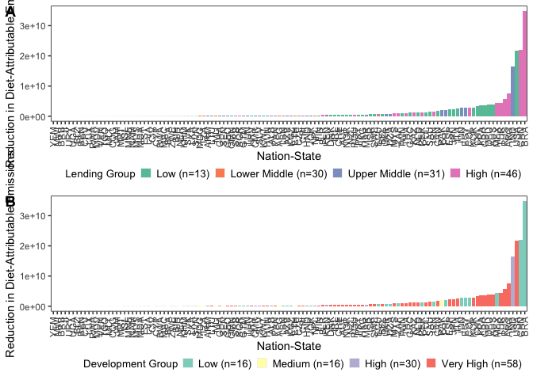
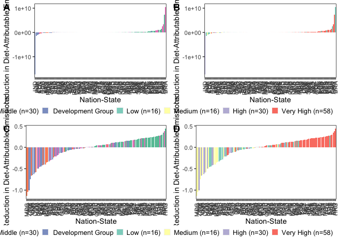

Data Analysis and Visualization
================
Last updated: June 12, 2024

## Package Loading

Here, we load in the various packages that will be required to support
our analyses and the corresponding visualizations we will develop.

``` r
library(tidyverse)
```

    ## ── Attaching packages ─────────────────────────────────────── tidyverse 1.3.2 ──
    ## ✔ ggplot2 3.4.1      ✔ purrr   0.3.4 
    ## ✔ tibble  3.1.8      ✔ dplyr   1.0.10
    ## ✔ tidyr   1.2.1      ✔ stringr 1.4.1 
    ## ✔ readr   2.1.2      ✔ forcats 0.5.2 
    ## ── Conflicts ────────────────────────────────────────── tidyverse_conflicts() ──
    ## ✖ dplyr::filter() masks stats::filter()
    ## ✖ dplyr::lag()    masks stats::lag()

``` r
library(viridis)
```

    ## Loading required package: viridisLite

``` r
library(RColorBrewer)
library(colorspace)
library(ggpubr)
library(ggridges)
library(forcats)
library(lazyeval)
```

    ## 
    ## Attaching package: 'lazyeval'
    ## 
    ## The following objects are masked from 'package:purrr':
    ## 
    ##     is_atomic, is_formula

## Data Loading

Here, we load in the data in the two formats we provided at the end of
our cleaning script: one suited for spatial visualization and analysis
and one not.

``` r
impact_data <- read.csv("/Users/kenjinchang/github/university-impact-model/data/model-output/university-impact-model.csv")
spatial_impact_data <- read.csv("/Users/kenjinchang/github/university-impact-model/data/model-output/university-impact-model-shapefile.csv")
```

## Nation-State Inclusion

First, we will generate a figure separating the nation-states included
within our analysis from those that were omitted for the various reasons
cited in our cleaning script. We will eventually also have to create a
complementary flow diagram documenting this exclusion process, whereby
nation-states were excluded either (1) because they did not have
complete dietary-footprint data across the two identified sources (i.e.,
publication data for Kim et al. (2020) and publication data for Semba et
al. (2020)), (2) because they did not have the

``` r
spatial_impact_data %>%
  mutate(inclusion=ifelse(university_enrollment>0,country)) %>%
  ggplot(aes(x=long,y=lat,fill=inclusion,group=group)) + 
  geom_polygon(color="black",size=0.125,alpha=0.75) +
  scale_fill_discrete(h=c(260,260),na.value="white") +
  guides(fill="none") +
  xlab("") + 
  ylab("") +
  labs(caption="") +
  ggtitle("Figure X. Choropleth map indicating the 120 nation-states included in our analyses.") +
  theme(legend.position="bottom",legend.justification="right",legend.box.spacing=unit(-15,"pt"),legend.key.size=unit(10,"pt"),panel.grid=element_blank(),panel.background=element_rect(fill="white"),panel.border=element_rect(fill=NA),axis.text=element_blank(),axis.ticks=element_blank(),legend.title=element_text(size=10),legend.text=element_text(size=10),plot.title=element_text(size=10))
```

    ## Warning: Using `size` aesthetic for lines was deprecated in ggplot2 3.4.0.
    ## ℹ Please use `linewidth` instead.

<!-- -->

## Lending- and Development-Group Membership

``` r
impact_data %>%
  count(lending_group)
```

    ##   lending_group  n
    ## 1          High 46
    ## 2           Low 13
    ## 3  Lower-Middle 30
    ## 4  Upper-Middle 31

``` r
lending_group_membership <- spatial_impact_data %>%
  ggplot(aes(x=long,y=lat,group=group,fill=factor(lending_group,levels=c("Low","Lower-Middle","Upper-Middle","High","NA")))) + 
  geom_polygon(color="black",size=0.125) +
  scale_fill_brewer(palette="Set2",na.value="white",name="Lending Group",labels=c("Low (n=13)","Lower Middle (n=30)","Upper Middle (n=31)","High (n=46)","NA")) +
  xlab("") + 
  ylab("") +
  labs(caption="") +
  theme(legend.position="bottom",legend.justification="right",legend.box.spacing=unit(-15,"pt"),legend.key.size=unit(10,"pt"),panel.grid=element_blank(),panel.background=element_rect(fill="white"),panel.border=element_rect(fill=NA),axis.text=element_blank(),axis.ticks=element_blank(),legend.title=element_text(size=10),legend.text=element_text(size=10),plot.title=element_text(size=10))
```

``` r
impact_data %>%
  count(development_group)
```

    ##   development_group  n
    ## 1              High 30
    ## 2               Low 16
    ## 3            Medium 16
    ## 4         Very High 58

``` r
development_group_membership <- spatial_impact_data %>%
  ggplot(aes(x=long,y=lat,group=group,fill=factor(development_group,levels=c("Low","Medium","High","Very High","NA")))) + 
  geom_polygon(color="black",size=0.125) +
  scale_fill_brewer(palette="Set3",na.value="white",name="Development Group",labels=c("Low (n=16)","Medium (n=16)","High (n=30)","Very High (n=58)","NA")) +
  xlab("") + 
  ylab("") +
  labs(caption="") +
  theme(legend.position="bottom",legend.justification="right",legend.box.spacing=unit(-15,"pt"),legend.key.size=unit(10,"pt"),panel.grid=element_blank(),panel.background=element_rect(fill="white"),panel.border=element_rect(fill=NA),axis.text=element_blank(),axis.ticks=element_blank(),legend.title=element_text(size=10),legend.text=element_text(size=10),plot.title=element_text(size=10))
```

ggtitle(“Figure X. Choropleth map sorting the 120 nation-states included
in our analyses into their corresponding lending- and development-group
categories.”) +

``` r
ggarrange(lending_group_membership,development_group_membership,
          nrow=2,
          labels=c("A","B"))
```

<!-- -->

## Lending- and Development-Group Distributions

First, change population figures to millions kg Co2e

``` r
impact_data <- impact_data %>%
  mutate(baseline_population_kg_co2e=baseline_population_kg_co2e/1000000) %>%
  mutate(baseline_adjusted_population_kg_co2e=baseline_adjusted_population_kg_co2e/1000000) %>%
  mutate(baseline_oecd_population_kg_co2e=baseline_oecd_population_kg_co2e/1000000) %>%
  mutate(meatless_day_population_kg_co2e=meatless_day_population_kg_co2e/1000000) %>%
  mutate(low_red_meat_population_kg_co2e=low_red_meat_population_kg_co2e/1000000) %>%
  mutate(no_red_meat_population_kg_co2e=no_red_meat_population_kg_co2e/1000000) %>%
  mutate(no_dairy_population_kg_co2e=no_dairy_population_kg_co2e/1000000) %>%
  mutate(pescetarian_population_kg_co2e=pescetarian_population_kg_co2e/1000000) %>%
  mutate(lacto_ovo_vegetarian_population_kg_co2e=lacto_ovo_vegetarian_population_kg_co2e/1000000) %>%
  mutate(eat_lancet_population_kg_co2e=eat_lancet_population_kg_co2e/1000000) %>%
  mutate(two_thirds_vegan_population_kg_co2e=two_thirds_vegan_population_kg_co2e/1000000) %>%
  mutate(vegan_population_kg_co2e=vegan_population_kg_co2e/1000000) %>%
  mutate(baseline_adjusted_population_reduction_kg_co2e=baseline_adjusted_population_reduction_kg_co2e/1000000) %>%
  mutate(baseline_oecd_population_reduction_kg_co2e=baseline_oecd_population_reduction_kg_co2e/1000000) %>%
  mutate(meatless_day_population_reduction_kg_co2e=meatless_day_population_reduction_kg_co2e/1000000) %>%
  mutate(low_red_meat_population_reduction_kg_co2e=low_red_meat_population_reduction_kg_co2e/1000000) %>%
  mutate(no_red_meat_population_reduction_kg_co2e=no_red_meat_population_reduction_kg_co2e/1000000) %>%
  mutate(no_dairy_population_reduction_kg_co2e=no_dairy_population_reduction_kg_co2e/1000000) %>%
  mutate(pescetarian_population_reduction_kg_co2e=pescetarian_population_reduction_kg_co2e/1000000) %>%
  mutate(lacto_ovo_vegetarian_population_reduction_kg_co2e=lacto_ovo_vegetarian_population_reduction_kg_co2e/1000000) %>%
  mutate(eat_lancet_population_reduction_kg_co2e=eat_lancet_population_reduction_kg_co2e/1000000) %>%
  mutate(two_thirds_vegan_population_reduction_kg_co2e=two_thirds_vegan_population_reduction_kg_co2e/1000000) %>%
  mutate(vegan_population_reduction_kg_co2e=vegan_population_reduction_kg_co2e/1000000)
```

``` r
lending_group_baseline_distribution <- impact_data %>%
  ggplot(aes(baseline_population_kg_co2e,fill=factor(lending_group,levels=c("Low","Lower-Middle","Upper-Middle","High","NA")),color=factor(lending_group,levels=c("Low","Lower-Middle","Upper-Middle","High","NA")))) + 
  geom_density(alpha=0.75) +
  scale_color_brewer(palette="Set2",name="Lending Group",labels=c("Low (n=13)","Lower Middle (n=30)","Upper Middle (n=31)","High (n=46)","NA")) +
  scale_fill_brewer(palette="Set2",name="Lending Group",labels=c("Low (n=13)","Lower Middle (n=30)","Upper Middle (n=31)","High (n=46)","NA")) + 
  xlim(-800,2500) + 
  xlab(bquote('Annual Population-Level, Diet-Attributable Emissions at Baseline (Million kg CO'[2]*'e)')) +
  ylab("Density") +
  theme(legend.position="bottom",legend.justification="right",legend.box.spacing=unit(0,"pt"),legend.key.size=unit(10,"pt"),panel.grid=element_blank(),panel.background=element_rect(fill="white"),panel.border=element_rect(fill=NA),legend.title=element_text(size=10),legend.text=element_text(size=10),plot.title=element_text(size=10))
```

``` r
development_group_baseline_distribution <- impact_data %>%
  ggplot(aes(baseline_population_kg_co2e,fill=factor(development_group,levels=c("Low","Medium","High","Very High","NA")),color=factor(development_group,levels=c("Low","Medium","High","Very High","NA")))) + 
  geom_density(alpha=0.75) +
  scale_color_brewer(palette="Set3",name="Development Group",labels=c("Low (n=16)","Medium (n=16)","High (n=30)","Very High (n=58)","NA")) +
  scale_fill_brewer(palette="Set3",name="Development Group",labels=c("Low (n=16)","Medium (n=16)","High (n=30)","Very High (n=58)","NA")) + 
  xlim(-400,1500) +
  xlab(bquote('Annual Population-Level, Diet-Attributable Emissions at Baseline (Million kg CO'[2]*'e)')) +
  ylab("Density") +
  theme(legend.position="bottom",legend.justification="right",legend.box.spacing=unit(0,"pt"),legend.key.size=unit(10,"pt"),panel.grid=element_blank(),panel.background=element_rect(fill="white"),panel.border=element_rect(fill=NA),legend.title=element_text(size=10),legend.text=element_text(size=10),plot.title=element_text(size=10))
```

``` r
ggarrange(lending_group_baseline_distribution,development_group_baseline_distribution,
          nrow=2,
          labels=c("A","B"))
```

    ## Warning: Removed 23 rows containing non-finite values (`stat_density()`).

    ## Warning: Removed 29 rows containing non-finite values (`stat_density()`).

<!-- -->

``` r
impact_data %>%
  group_by(lending_group) %>%
  summarize(mean=mean(baseline_population_kg_co2e),sd=sd(baseline_population_kg_co2e)) 
```

    ## # A tibble: 4 × 3
    ##   lending_group  mean    sd
    ##   <chr>         <dbl> <dbl>
    ## 1 High          1721. 3767.
    ## 2 Low            149.  165.
    ## 3 Lower-Middle  1647. 5061.
    ## 4 Upper-Middle  3768. 8923.

``` r
impact_data %>%
  group_by(development_group) %>%
  summarize(mean=mean(baseline_population_kg_co2e),sd=sd(baseline_population_kg_co2e)) 
```

    ## # A tibble: 4 × 3
    ##   development_group  mean    sd
    ##   <chr>             <dbl> <dbl>
    ## 1 High              3473. 8991.
    ## 2 Low                265.  611.
    ## 3 Medium            1952. 6859.
    ## 4 Very High         1855. 3625.

## Descriptive Results

``` r
impact_data %>%
  select(country,proportion_school_aged) %>%
  summarise(mean(proportion_school_aged))
```

    ##   mean(proportion_school_aged)
    ## 1                   0.07188393

``` r
lending_group_mean_percent_reduction <- impact_data %>%
  mutate(mean_population_percent_reduction_kg_co2e=(meatless_day_population_percent_reduction_kg_co2e+low_red_meat_population_percent_reduction_kg_co2e+no_red_meat_day_population_percent_reduction_kg_co2e+no_dairy_population_percent_reduction_kg_co2e+pescetarian_population_percent_reduction_kg_co2e+lacto_ovo_vegetarian_population_percent_reduction_kg_co2e+eat_lancet_population_percent_reduction_kg_co2e+two_thirds_vegan_population_percent_reduction_kg_co2e+vegan_population_percent_reduction_kg_co2e)/9) %>%
  ggplot(aes(x=fct_reorder(country_alpha_three,mean_population_percent_reduction_kg_co2e),y=mean_population_percent_reduction_kg_co2e,fill=development_group)) +
  geom_col() + 
  xlab("Nation-State") + 
  ylab("Average Percent-Reduction in Diet-Attributable Emissions") + 
  scale_fill_brewer(palette="Set2",name="Lending Group",labels=c("Low (n=13)","Lower Middle (n=30)","Upper Middle (n=31)","High (n=46)","NA")) + 
  theme(axis.text.x=element_text(angle=90,vjust=0.5,hjust=1),legend.position="bottom",legend.justification="right",legend.box.spacing=unit(0,"pt"),legend.key.size=unit(10,"pt"),panel.grid=element_blank(),panel.background=element_rect(fill="white"),panel.border=element_rect(fill=NA),legend.title=element_text(size=10),legend.text=element_text(size=10),plot.title=element_text(size=10))
```

``` r
development_group_mean_percent_reduction <- impact_data %>%
  mutate(mean_population_percent_reduction_kg_co2e=(meatless_day_population_percent_reduction_kg_co2e+low_red_meat_population_percent_reduction_kg_co2e+no_red_meat_day_population_percent_reduction_kg_co2e+no_dairy_population_percent_reduction_kg_co2e+pescetarian_population_percent_reduction_kg_co2e+lacto_ovo_vegetarian_population_percent_reduction_kg_co2e+eat_lancet_population_percent_reduction_kg_co2e+two_thirds_vegan_population_percent_reduction_kg_co2e+vegan_population_percent_reduction_kg_co2e)/9) %>%
  ggplot(aes(x=fct_reorder(country_alpha_three,mean_population_percent_reduction_kg_co2e),y=mean_population_percent_reduction_kg_co2e,fill=lending_group)) +
  geom_col() + 
  xlab("Nation-State") + 
  ylab("Average Percent-Reduction in Diet-Attributable Emissions") + 
  scale_fill_brewer(palette="Set3",name="Development Group",labels=c("Low (n=16)","Medium (n=16)","High (n=30)","Very High (n=58)","NA")) + 
  theme(axis.text.x=element_text(angle=90,vjust=0.5,hjust=1),legend.position="bottom",legend.justification="right",legend.box.spacing=unit(0,"pt"),legend.key.size=unit(10,"pt"),panel.grid=element_blank(),panel.background=element_rect(fill="white"),panel.border=element_rect(fill=NA),legend.title=element_text(size=10),legend.text=element_text(size=10),plot.title=element_text(size=10))
```

``` r
ggarrange(lending_group_mean_percent_reduction,development_group_mean_percent_reduction,
          nrow=2,
          labels=c("A","B"))
```

<!-- -->

``` r
lending_group_mean_absolute_reduction <- impact_data %>%
  mutate(mean_population_reduction_kg_co2e=(meatless_day_population_reduction_kg_co2e+low_red_meat_population_reduction_kg_co2e+no_red_meat_population_reduction_kg_co2e+no_dairy_population_reduction_kg_co2e+pescetarian_population_reduction_kg_co2e+lacto_ovo_vegetarian_population_reduction_kg_co2e+eat_lancet_population_reduction_kg_co2e+two_thirds_vegan_population_reduction_kg_co2e+vegan_population_reduction_kg_co2e)/9) %>%
  ggplot(aes(x=fct_reorder(country_alpha_three,mean_population_reduction_kg_co2e),y=mean_population_reduction_kg_co2e,fill=lending_group)) +
  geom_col() + 
  xlab("Nation-State") + 
  ylab("Average Reduction in Diet-Attributable Emissions") + 
  scale_fill_brewer(palette="Set2",name="Lending Group",labels=c("Low (n=13)","Lower Middle (n=30)","Upper Middle (n=31)","High (n=46)","NA")) + 
  theme(axis.text.x=element_text(angle=90,vjust=0.5,hjust=1),legend.position="bottom",legend.justification="right",legend.box.spacing=unit(0,"pt"),legend.key.size=unit(10,"pt"),panel.grid=element_blank(),panel.background=element_rect(fill="white"),panel.border=element_rect(fill=NA),legend.title=element_text(size=10),legend.text=element_text(size=10),plot.title=element_text(size=10))
```

``` r
development_group_mean_absolute_reduction <- impact_data %>%
  mutate(mean_population_reduction_kg_co2e=(meatless_day_population_reduction_kg_co2e+low_red_meat_population_reduction_kg_co2e+no_red_meat_population_reduction_kg_co2e+no_dairy_population_reduction_kg_co2e+pescetarian_population_reduction_kg_co2e+lacto_ovo_vegetarian_population_reduction_kg_co2e+eat_lancet_population_reduction_kg_co2e+two_thirds_vegan_population_reduction_kg_co2e+vegan_population_reduction_kg_co2e)/9) %>%
  ggplot(aes(x=fct_reorder(country_alpha_three,mean_population_reduction_kg_co2e),y=mean_population_reduction_kg_co2e,fill=development_group)) +
  geom_col() + 
  xlab("Nation-State") + 
  ylab("Average Reduction in Diet-Attributable Emissions") + 
  scale_fill_brewer(palette="Set3",name="Development Group",labels=c("Low (n=16)","Medium (n=16)","High (n=30)","Very High (n=58)","NA")) + 
  theme(axis.text.x=element_text(angle=90,vjust=0.5,hjust=1),legend.position="bottom",legend.justification="right",legend.box.spacing=unit(0,"pt"),legend.key.size=unit(10,"pt"),panel.grid=element_blank(),panel.background=element_rect(fill="white"),panel.border=element_rect(fill=NA),legend.title=element_text(size=10),legend.text=element_text(size=10),plot.title=element_text(size=10))
```

``` r
ggarrange(lending_group_mean_absolute_reduction,development_group_mean_absolute_reduction,
          nrow=2,
          labels=c("A","B"))
```

<!-- -->

Because the average reduction across the nine arbitrarily chosen
scenarios may not be particularly useful, we may want to, instead, look
at the returns associated with the most impactful scenarios across the
various nation-states included within our analysis.

For now, though, let us look first at the top ten performing
nation-states when taking the average across the scenarios.

``` r
impact_data %>%
  mutate(mean_population_reduction_kg_co2e=(meatless_day_population_reduction_kg_co2e+low_red_meat_population_reduction_kg_co2e+no_red_meat_population_reduction_kg_co2e+no_dairy_population_reduction_kg_co2e+pescetarian_population_reduction_kg_co2e+lacto_ovo_vegetarian_population_reduction_kg_co2e+eat_lancet_population_reduction_kg_co2e+two_thirds_vegan_population_reduction_kg_co2e+vegan_population_reduction_kg_co2e)/9) %>%
  select(country,mean_population_reduction_kg_co2e) %>%
  arrange(desc(mean_population_reduction_kg_co2e)) %>%
  head(10)
```

    ##                              country mean_population_reduction_kg_co2e
    ## 1                              India                        5632.27257
    ## 2                          Indonesia                         506.83743
    ## 3                        Afghanistan                         143.37030
    ## 4                         Madagascar                          66.78185
    ## 5                          Sri Lanka                          54.82451
    ## 6                      Côte d'Ivoire                          49.75304
    ## 7                           Ethiopia                          40.78961
    ## 8                            Senegal                          40.78469
    ## 9                           Zimbabwe                          35.32920
    ## 10 Tanzania (the United Republic of)                          25.51857

As described previously, we will now run a similar set of analyses for
the 120 included nation-states - this time, for each of their optimal
change scenarios. - should spot check this

``` r
impact_data <- impact_data %>%
  mutate(greatest_population_reduction_kg_co2e=pmax(meatless_day_population_reduction_kg_co2e,low_red_meat_population_reduction_kg_co2e,no_red_meat_population_reduction_kg_co2e,no_dairy_population_reduction_kg_co2e,pescetarian_population_reduction_kg_co2e,lacto_ovo_vegetarian_population_reduction_kg_co2e,eat_lancet_population_reduction_kg_co2e,two_thirds_vegan_population_reduction_kg_co2e,vegan_population_reduction_kg_co2e))
```

``` r
impact_data <- impact_data %>%
  mutate(greatest_reduction_diet=case_when(greatest_population_reduction_kg_co2e==meatless_day_population_reduction_kg_co2e~"Meatless Day",
                                           greatest_population_reduction_kg_co2e==low_red_meat_population_reduction_kg_co2e~"Low Red Meat",
                                           greatest_population_reduction_kg_co2e==no_red_meat_population_reduction_kg_co2e~"No Red Meat",
                                           greatest_population_reduction_kg_co2e==no_dairy_population_reduction_kg_co2e~"No Dairy",
                                           greatest_population_reduction_kg_co2e==pescetarian_population_reduction_kg_co2e~"Pescetarian",
                                           greatest_population_reduction_kg_co2e==lacto_ovo_vegetarian_population_reduction_kg_co2e~"Lacto-Ovo Vegetarian",
                                           greatest_population_reduction_kg_co2e==eat_lancet_population_reduction_kg_co2e~"EAT Lancet",
                                           greatest_population_reduction_kg_co2e==two_thirds_vegan_population_reduction_kg_co2e~"Two-Thirds Vegan",
                                           greatest_population_reduction_kg_co2e==vegan_population_reduction_kg_co2e~"Vegan"))
```

With this complete, we can now calculate the “technical potential” of
university-based dietary interventions, which is to say, the total
reductions in diet-attributable greenhouse gas emission (represented in
kg CO2e) if the target populations were to change their behaviors as
intended, per Nielsen and colleagues (2024).

``` r
impact_data %>%
  summarize(sum(greatest_population_reduction_kg_co2e))
```

    ##   sum(greatest_population_reduction_kg_co2e)
    ## 1                                   -1387.41

We can also identify the top 10 performing nation-states, as we did
before - this time, for the optimized scenarios.

``` r
impact_data %>%
  select(country,greatest_population_reduction_kg_co2e) %>%
  arrange(desc(greatest_population_reduction_kg_co2e)) %>%
  head(10)
```

    ##              country greatest_population_reduction_kg_co2e
    ## 1              India                            17545.6379
    ## 2          Indonesia                             3073.3350
    ## 3           Colombia                             1134.5698
    ## 4           Pakistan                             1102.5490
    ## 5  Philippines (the)                              859.7452
    ## 6        Afghanistan                              474.3667
    ## 7           Ethiopia                              473.8750
    ## 8           Thailand                              410.8332
    ## 9           Malaysia                              343.3238
    ## 10           Ecuador                              267.9532

Will have to move this to the most appropriate section later, BUT, we’ll
want to use similar code to look at how this varies across groupings

``` r
impact_data %>%
  select(country,lending_group,greatest_population_reduction_kg_co2e) %>%
  group_by(lending_group) %>%
  arrange(desc(greatest_population_reduction_kg_co2e)) 
```

    ## # A tibble: 120 × 3
    ## # Groups:   lending_group [4]
    ##    country           lending_group greatest_population_reduction_kg_co2e
    ##    <chr>             <chr>                                         <dbl>
    ##  1 India             Lower-Middle                                 17546.
    ##  2 Indonesia         Lower-Middle                                  3073.
    ##  3 Colombia          Upper-Middle                                  1135.
    ##  4 Pakistan          Lower-Middle                                  1103.
    ##  5 Philippines (the) Lower-Middle                                   860.
    ##  6 Afghanistan       Low                                            474.
    ##  7 Ethiopia          Low                                            474.
    ##  8 Thailand          Upper-Middle                                   411.
    ##  9 Malaysia          Upper-Middle                                   343.
    ## 10 Ecuador           Upper-Middle                                   268.
    ## # … with 110 more rows

estimates the total global impact if the most ideal dietary change
occurred - should do same for relative change (percent reduction)

``` r
lending_group_optimized_absolute_reduction <- impact_data %>%
  ggplot(aes(x=fct_reorder(country_alpha_three,greatest_population_reduction_kg_co2e),y=greatest_population_reduction_kg_co2e,fill=lending_group)) +
  geom_col() + 
  xlab("Nation-State") + 
  ylab("Reduction in Diet-Attributable Emissions") + 
  scale_fill_brewer(palette="Set2",name="Lending Group",labels=c("Low (n=13)","Lower Middle (n=30)","Upper Middle (n=31)","High (n=46)","NA")) + 
  theme(axis.text.x=element_text(angle=90,vjust=0.5,hjust=1),legend.position="bottom",legend.justification="right",legend.box.spacing=unit(0,"pt"),legend.key.size=unit(10,"pt"),panel.grid=element_blank(),panel.background=element_rect(fill="white"),panel.border=element_rect(fill=NA),legend.title=element_text(size=10),legend.text=element_text(size=10),plot.title=element_text(size=10))
```

``` r
development_group_optimized_absolute_reduction <- impact_data %>%
  ggplot(aes(x=fct_reorder(country_alpha_three,greatest_population_reduction_kg_co2e),y=greatest_population_reduction_kg_co2e,fill=development_group)) +
  geom_col() + 
  xlab("Nation-State") + 
  ylab("Reduction in Diet-Attributable Emissions") + 
  scale_fill_brewer(palette="Set3",name="Development Group",labels=c("Low (n=16)","Medium (n=16)","High (n=30)","Very High (n=58)","NA")) + 
  theme(axis.text.x=element_text(angle=90,vjust=0.5,hjust=1),legend.position="bottom",legend.justification="right",legend.box.spacing=unit(0,"pt"),legend.key.size=unit(10,"pt"),panel.grid=element_blank(),panel.background=element_rect(fill="white"),panel.border=element_rect(fill=NA),legend.title=element_text(size=10),legend.text=element_text(size=10),plot.title=element_text(size=10))
```

``` r
ggarrange(lending_group_optimized_absolute_reduction,development_group_optimized_absolute_reduction,
          nrow=2,
          labels=c("A","B"))
```

<!-- -->

``` r
lending_group_optimized_percent_reduction <- impact_data %>% 
  mutate(optimal_diet_population_percent_reduction_kg_co2e=(baseline_population_kg_co2e-greatest_population_reduction_kg_co2e)/baseline_population_kg_co2e) %>%
  ggplot(aes(x=fct_reorder(country_alpha_three,optimal_diet_population_percent_reduction_kg_co2e),y=optimal_diet_population_percent_reduction_kg_co2e,fill=development_group)) +
  geom_col() + 
  xlab("Nation-State") + 
  ylab("Average Percent-Reduction in Diet-Attributable Emissions") + 
  scale_fill_brewer(palette="Set2",name="Lending Group",labels=c("Low (n=13)","Lower Middle (n=30)","Upper Middle (n=31)","High (n=46)","NA")) + 
  theme(axis.text.x=element_text(angle=90,vjust=0.5,hjust=1),legend.position="bottom",legend.justification="right",legend.box.spacing=unit(0,"pt"),legend.key.size=unit(10,"pt"),panel.grid=element_blank(),panel.background=element_rect(fill="white"),panel.border=element_rect(fill=NA),legend.title=element_text(size=10),legend.text=element_text(size=10),plot.title=element_text(size=10))
```

``` r
development_group_optimized_percent_reduction <- impact_data %>% 
  mutate(optimal_diet_population_percent_reduction_kg_co2e=(baseline_population_kg_co2e-greatest_population_reduction_kg_co2e)/baseline_population_kg_co2e) %>%
  ggplot(aes(x=fct_reorder(country_alpha_three,optimal_diet_population_percent_reduction_kg_co2e),y=optimal_diet_population_percent_reduction_kg_co2e,fill=development_group)) +
  geom_col() + 
  xlab("Nation-State") + 
  ylab("Average Percent-Reduction in Diet-Attributable Emissions") + 
  scale_fill_brewer(palette="Set3",name="Development Group",labels=c("Low (n=16)","Medium (n=16)","High (n=30)","Very High (n=58)","NA")) + 
  theme(axis.text.x=element_text(angle=90,vjust=0.5,hjust=1),legend.position="bottom",legend.justification="right",legend.box.spacing=unit(0,"pt"),legend.key.size=unit(10,"pt"),panel.grid=element_blank(),panel.background=element_rect(fill="white"),panel.border=element_rect(fill=NA),legend.title=element_text(size=10),legend.text=element_text(size=10),plot.title=element_text(size=10))
```

``` r
ggarrange(lending_group_optimized_percent_reduction,development_group_optimized_percent_reduction,
          nrow=2,
          labels=c("A","B"))
```

<!-- -->

Might be good to spot check after changing percent-decrease calculation
in cleaning script, now that vegan is not mirrored with optimal

``` r
impact_data %>%
  mutate(optimal_diet_population_percent_reduction_kg_co2e=(baseline_population_kg_co2e-greatest_population_reduction_kg_co2e)/baseline_population_kg_co2e) %>%
  select(country,vegan_population_percent_reduction_kg_co2e,optimal_diet_population_percent_reduction_kg_co2e,vegan_population_reduction_kg_co2e,greatest_population_reduction_kg_co2e)
```

    ##                                                        country
    ## 1                                                  Afghanistan
    ## 2                                                      Albania
    ## 3                                                      Algeria
    ## 4                                                    Argentina
    ## 5                                                      Armenia
    ## 6                                                    Australia
    ## 7                                                      Austria
    ## 8                                                   Azerbaijan
    ## 9                                                     Barbados
    ## 10                                                     Belarus
    ## 11                                                     Belgium
    ## 12                                                      Belize
    ## 13                                                       Benin
    ## 14                                      Bosnia and Herzegovina
    ## 15                                                    Botswana
    ## 16                                                      Brazil
    ## 17                                                    Bulgaria
    ## 18                                                Burkina Faso
    ## 19                                                  Cabo Verde
    ## 20                                                    Cambodia
    ## 21                                                    Cameroon
    ## 22                                                      Canada
    ## 23                                                       Chile
    ## 24                                                       China
    ## 25                                                    Colombia
    ## 26                                                 Congo (the)
    ## 27                                                  Costa Rica
    ## 28                                               Côte d'Ivoire
    ## 29                                                     Croatia
    ## 30                                                      Cyprus
    ## 31                                                     Czechia
    ## 32                                                     Denmark
    ## 33                                                     Ecuador
    ## 34                                                       Egypt
    ## 35                                                 El Salvador
    ## 36                                                     Estonia
    ## 37                                                    Ethiopia
    ## 38                                                        Fiji
    ## 39                                                     Finland
    ## 40                                                      France
    ## 41                                                     Georgia
    ## 42                                                     Germany
    ## 43                                                       Ghana
    ## 44                                                      Greece
    ## 45                                                   Guatemala
    ## 46                                                    Honduras
    ## 47                                                   Hong Kong
    ## 48                                                     Hungary
    ## 49                                                     Iceland
    ## 50                                                       India
    ## 51                                                   Indonesia
    ## 52                                  Iran (Islamic Republic of)
    ## 53                                                     Ireland
    ## 54                                                      Israel
    ## 55                                                       Italy
    ## 56                                                     Jamaica
    ## 57                                                       Japan
    ## 58                                                      Jordan
    ## 59                                                  Kazakhstan
    ## 60                                                       Kenya
    ## 61                                     Korea (the Republic of)
    ## 62                                                      Kuwait
    ## 63                                                  Kyrgyzstan
    ## 64                                                      Latvia
    ## 65                                                     Lebanon
    ## 66                                                   Lithuania
    ## 67                                                  Luxembourg
    ## 68                                                       Macao
    ## 69                                                  Madagascar
    ## 70                                                      Malawi
    ## 71                                                    Malaysia
    ## 72                                                    Maldives
    ## 73                                                        Mali
    ## 74                                                       Malta
    ## 75                                                  Mauritania
    ## 76                                                   Mauritius
    ## 77                                                      Mexico
    ## 78                                   Moldova (the Republic of)
    ## 79                                                  Montenegro
    ## 80                                                     Morocco
    ## 81                                                     Namibia
    ## 82                                                       Nepal
    ## 83                                Netherlands (Kingdom of the)
    ## 84                                                 New Zealand
    ## 85                                                 Niger (the)
    ## 86                                                      Norway
    ## 87                                                        Oman
    ## 88                                                    Pakistan
    ## 89                                                      Panama
    ## 90                                                        Peru
    ## 91                                           Philippines (the)
    ## 92                                                      Poland
    ## 93                                                    Portugal
    ## 94                                                     Romania
    ## 95                                   Russidan Federation (the)
    ## 96                                                      Rwanda
    ## 97                                                Saudi Arabia
    ## 98                                                     Senegal
    ## 99                                                      Serbia
    ## 100                                                   Slovakia
    ## 101                                                   Slovenia
    ## 102                                               South Africa
    ## 103                                                      Spain
    ## 104                                                  Sri Lanka
    ## 105                                                     Sweden
    ## 106                                                Switzerland
    ## 107                          Tanzania (the United Republic of)
    ## 108                                                   Thailand
    ## 109                                                       Togo
    ## 110                                                    Tunisia
    ## 111                                                    Türkiye
    ## 112                                                     Uganda
    ## 113                                                    Ukraine
    ## 114 United Kingdom of Great Britain and Northern Ireland (the)
    ## 115                             United States of America (the)
    ## 116                                                    Uruguay
    ## 117                         Venezuela (Bolivarian Republic of)
    ## 118                                                      Yemen
    ## 119                                                   Zimbabwe
    ## 120                                                     Taiwan
    ##     vegan_population_percent_reduction_kg_co2e
    ## 1                                   -0.7155515
    ## 2                                   -0.8195048
    ## 3                                   -0.7403464
    ## 4                                   -0.8544103
    ## 5                                   -0.7715800
    ## 6                                   -0.9057310
    ## 7                                   -0.8278999
    ## 8                                   -0.8284002
    ## 9                                   -0.8105018
    ## 10                                  -0.7864728
    ## 11                                  -0.8272629
    ## 12                                  -0.7118481
    ## 13                                  -0.6952565
    ## 14                                  -0.7213866
    ## 15                                  -0.8294476
    ## 16                                  -0.9131037
    ## 17                                  -0.6958731
    ## 18                                  -0.7420608
    ## 19                                  -0.7474384
    ## 20                                  -0.4111208
    ## 21                                  -0.7058260
    ## 22                                  -0.8312357
    ## 23                                  -0.9196676
    ## 24                                  -0.6463033
    ## 25                                  -0.8442002
    ## 26                                  -0.6603645
    ## 27                                  -0.8658401
    ## 28                                  -0.5874029
    ## 29                                  -0.7854329
    ## 30                                  -0.8025293
    ## 31                                  -0.7649548
    ## 32                                  -0.8064261
    ## 33                                  -0.7693147
    ## 34                                  -0.7609460
    ## 35                                  -0.8215695
    ## 36                                  -0.7540578
    ## 37                                  -0.6712277
    ## 38                                  -0.7914046
    ## 39                                  -0.8051068
    ## 40                                  -0.8464504
    ## 41                                  -0.7726094
    ## 42                                  -0.7963225
    ## 43                                  -0.6340723
    ## 44                                  -0.8330585
    ## 45                                  -0.7174106
    ## 46                                  -0.8393132
    ## 47                                  -0.8840900
    ## 48                                  -0.7302649
    ## 49                                  -0.8810478
    ## 50                                  -0.5929624
    ## 51                                  -0.5560983
    ## 52                                  -0.6434111
    ## 53                                  -0.8942809
    ## 54                                  -0.8767554
    ## 55                                  -0.8289415
    ## 56                                  -0.7607965
    ## 57                                  -0.6969716
    ## 58                                  -0.7780178
    ## 59                                  -0.8577484
    ## 60                                  -0.7455879
    ## 61                                  -0.7263207
    ## 62                                  -0.8851304
    ## 63                                  -0.8424626
    ## 64                                  -0.6851422
    ## 65                                  -0.7895480
    ## 66                                  -0.7600077
    ## 67                                  -0.8587330
    ## 68                                  -0.8209302
    ## 69                                  -0.6864942
    ## 70                                  -0.5240622
    ## 71                                  -0.7822596
    ## 72                                  -0.8109703
    ## 73                                  -0.8288612
    ## 74                                  -0.8161484
    ## 75                                  -0.8576518
    ## 76                                  -0.7496753
    ## 77                                  -0.8081597
    ## 78                                  -0.6560942
    ## 79                                  -0.8193424
    ## 80                                  -0.6882841
    ## 81                                  -0.7612928
    ## 82                                  -0.6867862
    ## 83                                  -0.8521547
    ## 84                                  -0.8881717
    ## 85                                  -0.8066927
    ## 86                                  -0.8657201
    ## 87                                  -0.8342612
    ## 88                                  -0.8086614
    ## 89                                  -0.7959219
    ## 90                                  -0.6562687
    ## 91                                  -0.6647772
    ## 92                                  -0.7678107
    ## 93                                  -0.7919308
    ## 94                                  -0.7606582
    ## 95                                  -0.8034384
    ## 96                                  -0.3798840
    ## 97                                  -0.8015371
    ## 98                                  -0.6892660
    ## 99                                  -0.6978198
    ## 100                                 -0.6598271
    ## 101                                 -0.7743791
    ## 102                                 -0.8144341
    ## 103                                 -0.8052943
    ## 104                                 -0.4961039
    ## 105                                 -0.8590698
    ## 106                                 -0.8412446
    ## 107                                 -0.7204488
    ## 108                                 -0.5804306
    ## 109                                 -0.3888183
    ## 110                                 -0.6584446
    ## 111                                 -0.7172086
    ## 112                                 -0.7117769
    ## 113                                 -0.6592881
    ## 114                                 -0.8640692
    ## 115                                 -0.8710565
    ## 116                                 -0.7857098
    ## 117                                 -0.8823069
    ## 118                                 -0.6054721
    ## 119                                 -0.7062633
    ## 120                                 -0.6828878
    ##     optimal_diet_population_percent_reduction_kg_co2e
    ## 1                                         -0.42470034
    ## 2                                          1.13670181
    ## 3                                          0.90178950
    ## 4                                          1.27286289
    ## 5                                          1.00615067
    ## 6                                          1.16133946
    ## 7                                          1.19809441
    ## 8                                          0.93087009
    ## 9                                          1.02408257
    ## 10                                         1.12141624
    ## 11                                         1.12636088
    ## 12                                         0.93534314
    ## 13                                        -1.19810856
    ## 14                                         0.97705481
    ## 15                                         0.46583959
    ## 16                                         1.26268905
    ## 17                                         0.96034467
    ## 18                                         0.27009623
    ## 19                                         0.85398674
    ## 20                                         0.12086592
    ## 21                                         0.13341995
    ## 22                                         1.20879075
    ## 23                                         1.12237922
    ## 24                                         1.07615330
    ## 25                                         0.66591188
    ## 26                                         0.35668282
    ## 27                                         0.85010968
    ## 28                                        -1.62619564
    ## 29                                         0.94947292
    ## 30                                         0.88474182
    ## 31                                         0.98188234
    ## 32                                         1.13568412
    ## 33                                         0.69853617
    ## 34                                         1.15972956
    ## 35                                         0.88234104
    ## 36                                         1.03187865
    ## 37                                        -0.12454327
    ## 38                                         0.88646081
    ## 39                                         1.11848349
    ## 40                                         1.20022392
    ## 41                                         0.27188234
    ## 42                                         1.16047702
    ## 43                                        -0.03604382
    ## 44                                         1.19291640
    ## 45                                         0.63613613
    ## 46                                         0.68965437
    ## 47                                         1.18680991
    ## 48                                         0.95460658
    ## 49                                         1.17315845
    ## 50                                         0.36567466
    ## 51                                         0.38122004
    ## 52                                         0.96088486
    ## 53                                         1.18691613
    ## 54                                         1.24720278
    ## 55                                         1.16180836
    ## 56                                         0.74015977
    ## 57                                         0.92610394
    ## 58                                         0.82289414
    ## 59                                         1.17227624
    ## 60                                         0.57707505
    ## 61                                         1.12754532
    ## 62                                         1.22980388
    ## 63                                         0.95543606
    ## 64                                         1.01453102
    ## 65                                         0.92358296
    ## 66                                         1.11922977
    ## 67                                         1.12653785
    ## 68                                         1.02807528
    ## 69                                        -0.46713833
    ## 70                                        -0.05180893
    ## 71                                         0.70125283
    ## 72                                         0.89096620
    ## 73                                         0.81922497
    ## 74                                         1.14971716
    ## 75                                         0.97240405
    ## 76                                         1.09327801
    ## 77                                         1.14514971
    ## 78                                         0.03369697
    ## 79                                         1.16939320
    ## 80                                         1.00115880
    ## 81                                         0.49854387
    ## 82                                         0.58193805
    ## 83                                         1.13586140
    ## 84                                         1.09452612
    ## 85                                         0.87904160
    ## 86                                         1.13622434
    ## 87                                         1.03072889
    ## 88                                         0.56102741
    ## 89                                         0.96505861
    ## 90                                         0.89287305
    ## 91                                         0.72050368
    ## 92                                         1.06749201
    ## 93                                         1.12309089
    ## 94                                         1.06631536
    ## 95                                         1.11169870
    ## 96                                        -0.39913973
    ## 97                                         1.03692956
    ## 98                                        -0.08439848
    ## 99                                         0.98084394
    ## 100                                        0.70090403
    ## 101                                        1.14077519
    ## 102                                        1.04805349
    ## 103                                        1.12517112
    ## 104                                       -0.50502383
    ## 105                                        1.13768659
    ## 106                                        1.08124762
    ## 107                                        0.06644533
    ## 108                                        0.78885595
    ## 109                                       -1.11807074
    ## 110                                        1.09522280
    ## 111                                        1.12968393
    ## 112                                       -0.04126832
    ## 113                                        1.03276249
    ## 114                                        1.14463209
    ## 115                                        1.21300425
    ## 116                                        1.22769989
    ## 117                                        0.94056667
    ## 118                                        0.22897322
    ## 119                                       -0.10521327
    ## 120                                        1.07624661
    ##     vegan_population_reduction_kg_co2e greatest_population_reduction_kg_co2e
    ## 1                        -2.382492e+02                          4.743667e+02
    ## 2                        -2.224168e+02                         -3.710140e+01
    ## 3                        -8.169369e+02                          1.083706e+02
    ## 4                        -7.551042e+03                         -2.411487e+03
    ## 5                        -1.034346e+02                         -8.245313e-01
    ## 6                        -3.869783e+03                         -6.893313e+02
    ## 7                        -4.653374e+02                         -1.113429e+02
    ## 8                        -2.523269e+02                          2.105665e+01
    ## 9                        -1.704852e-01                         -5.065656e-03
    ## 10                       -3.519980e+02                         -5.434171e+01
    ## 11                       -7.203365e+02                         -1.100283e+02
    ## 12                       -4.159258e+00                          3.777836e-01
    ## 13                       -8.408969e+00                          2.658562e+01
    ## 14                       -6.653903e+01                          2.116411e+00
    ## 15                       -4.852504e+01                          3.124990e+01
    ## 16                       -3.484779e+04                         -1.002529e+04
    ## 17                       -1.626827e+02                          9.270708e+00
    ## 18                       -6.374448e+01                          6.270017e+01
    ## 19                       -9.354440e+00                          1.827405e+00
    ## 20                       -7.802642e+01                          1.668504e+02
    ## 21                       -1.912447e+02                          2.348013e+02
    ## 22                       -1.738881e+03                         -4.367742e+02
    ## 23                       -3.251034e+03                         -4.326118e+02
    ## 24                       -2.187124e+04                         -2.577067e+03
    ## 25                       -2.866920e+03                          1.134570e+03
    ## 26                       -1.881045e+01                          1.832485e+01
    ## 27                       -3.140508e+02                          5.436705e+01
    ## 28                       -4.661566e+01                          2.084121e+02
    ## 29                       -1.732409e+02                          1.114462e+01
    ## 30                       -4.816972e+01                          6.918070e+00
    ## 31                       -2.876457e+02                          6.812779e+00
    ## 32                       -3.931628e+02                         -6.615107e+01
    ## 33                       -6.837978e+02                          2.679532e+02
    ## 34                       -2.845578e+03                         -5.973130e+02
    ## 35                       -1.939556e+02                          2.777685e+01
    ## 36                       -3.880898e+01                         -1.640694e+00
    ## 37                       -2.828509e+02                          4.738750e+02
    ## 38                       -1.799386e-01                          2.581496e-02
    ## 39                       -3.440093e+02                         -5.062611e+01
    ## 40                       -3.503323e+03                         -8.286948e+02
    ## 41                       -1.383489e+02                          1.303819e+02
    ## 42                       -3.816081e+03                         -7.690267e+02
    ## 43                       -1.178684e+02                          1.925913e+02
    ## 44                       -1.151244e+03                         -2.666005e+02
    ## 45                       -1.706868e+02                          8.657075e+01
    ## 46                       -3.148487e+02                          1.164189e+02
    ## 47                       -5.499678e+02                         -1.162092e+02
    ## 48                       -2.074666e+02                          1.289617e+01
    ## 49                       -3.379471e+01                         -6.641909e+00
    ## 50                       -1.640153e+04                          1.754564e+04
    ## 51                       -2.762010e+03                          3.073335e+03
    ## 52                       -1.624729e+03                          9.877280e+01
    ## 53                       -4.436534e+02                         -9.272922e+01
    ## 54                       -6.478475e+02                         -1.826618e+02
    ## 55                       -2.671469e+03                         -5.214675e+02
    ## 56                       -2.694084e+01                          9.201297e+00
    ## 57                       -2.366295e+03                          2.508852e+02
    ## 58                       -3.195912e+02                          7.275089e+01
    ## 59                       -1.198857e+03                         -2.407870e+02
    ## 60                       -3.868322e+02                          2.194255e+02
    ## 61                       -2.931393e+03                         -5.147664e+02
    ## 62                       -1.968489e+02                         -5.110731e+01
    ## 63                       -2.632781e+02                          1.392668e+01
    ## 64                       -4.642913e+01                         -9.847042e-01
    ## 65                       -2.448547e+02                          2.369846e+01
    ## 66                       -1.090809e+02                         -1.711258e+01
    ## 67                       -1.155295e+01                         -1.702374e+00
    ## 68                       -4.958738e+01                         -1.695856e+00
    ## 69                       -9.336093e+01                          1.995259e+02
    ## 70                       -4.240230e-02                          8.510272e-02
    ## 71                       -8.989819e+02                          3.433238e+02
    ## 72                       -1.246811e+01                          1.676320e+00
    ## 73                       -1.171489e+02                          2.555023e+01
    ## 74                       -1.749289e+01                         -3.208958e+00
    ## 75                       -2.847099e+01                          9.160874e-01
    ## 76                       -3.652356e+01                         -4.544427e+00
    ## 77                       -4.321383e+03                         -7.761431e+02
    ## 78                       -3.876213e+01                          5.708931e+01
    ## 79                       -3.413418e+01                         -7.056998e+00
    ## 80                       -5.939574e+02                         -9.999915e-01
    ## 81                       -3.638614e+01                          2.396720e+01
    ## 82                       -3.437216e+02                          2.092310e+02
    ## 83                       -1.341297e+03                         -2.138467e+02
    ## 84                       -5.068869e+02                         -5.394683e+01
    ## 85                       -6.846633e+01                          1.026609e+01
    ## 86                       -4.692507e+02                         -7.383838e+01
    ## 87                       -1.610995e+02                         -5.933886e+00
    ## 88                       -2.031081e+03                          1.102549e+03
    ## 89                       -2.307351e+02                          1.012939e+01
    ## 90                       -1.353050e+03                          2.208670e+02
    ## 91                       -2.044889e+03                          8.597452e+02
    ## 92                       -1.384221e+03                         -1.216757e+02
    ## 93                       -5.233876e+02                         -8.135085e+01
    ## 94                       -5.169304e+02                         -4.506679e+01
    ## 95                       -5.744411e+03                         -7.986217e+02
    ## 96                       -1.214555e+01                          4.473292e+01
    ## 97                       -1.594862e+03                         -7.348078e+01
    ## 98                       -1.234153e+02                          1.941650e+02
    ## 99                       -1.616047e+02                          4.436258e+00
    ## 100                      -7.973310e+01                          3.614257e+01
    ## 101                      -8.293563e+01                         -1.507695e+01
    ## 102                      -9.451890e+02                         -5.576833e+01
    ## 103                      -2.201914e+03                         -3.422550e+02
    ## 104                      -8.088383e+01                          2.453762e+02
    ## 105                      -6.638370e+02                         -1.063958e+02
    ## 106                      -4.618460e+02                         -4.460520e+01
    ## 107                      -1.032551e+02                          1.337976e+02
    ## 108                      -1.129372e+03                          4.108332e+02
    ## 109                      -1.577602e+01                          8.593920e+01
    ## 110                      -1.728782e+02                         -2.500126e+01
    ## 111                      -4.339457e+03                         -7.846502e+02
    ## 112                      -1.198930e+00                          1.753931e+00
    ## 113                      -8.001481e+02                         -3.976235e+01
    ## 114                      -3.712083e+03                         -6.213464e+02
    ## 115                      -2.162688e+04                         -5.288541e+03
    ## 116                      -1.907185e-01                         -5.527050e-02
    ## 117                      -1.393444e+01                          9.386420e-01
    ## 118                      -2.667051e-02                          3.396305e-02
    ## 119                      -6.616969e+01                          1.035473e+02
    ## 120                      -1.011844e+03                         -1.129757e+02

NEXT STEP WILL BE TO LOOK AT RELATIVE CHANGE FROM OPTIMIZED SCENARIO AND
ALSO PROBABLY MOVE DICHOTOMIZED TO LOWER SECTIONS -

scale_fill_brewer(palette=“Set2”,name=“Lending Group”,labels=c(“Low
(n=13)”,“Lower Middle (n=30)”,“Upper Middle (n=31)”,“High
(n=46)”,“NA”)) + scale_fill_brewer(palette=“Set3”,name=“Development
Group”,labels=c(“Low (n=16)”,“Medium (n=16)”,“High (n=30)”,“Very High
(n=58)”,“NA”)) +

scale_fill_brewer(palette=“Set2”,name=“Lending Group”,labels=c(“Low
(n=13)”,“Lower Middle (n=30)”,“Upper Middle (n=31)”,“High
(n=46)”,“NA”)) + scale_fill_brewer(palette=“Set3”,name=“Development
Group”,labels=c(“Low (n=16)”,“Medium (n=16)”,“High (n=30)”,“Very High
(n=58)”,“NA”)) +

xlab(“Nation-State”) + ylab(“Average Reduction in Diet-Attributable
Emissions”) +

theme(axis.text.x=element_text(angle=90,vjust=0.5,hjust=1),legend.position=“bottom”,legend.justification=“right”,legend.box.spacing=unit(0,“pt”),legend.key.size=unit(10,“pt”),panel.grid=element_blank(),panel.background=element_rect(fill=“white”),panel.border=element_rect(fill=NA),legend.title=element_text(size=10),legend.text=element_text(size=10),plot.title=element_text(size=10))

## Groupwise Comparisons

``` r
impact_data %>%
  group_by(lending_group) %>%
  summarize(mean=mean(greatest_population_reduction_kg_co2e),sd=sd(greatest_population_reduction_kg_co2e))
```

    ## # A tibble: 4 × 3
    ##   lending_group  mean    sd
    ##   <chr>         <dbl> <dbl>
    ## 1 High          -263.  793.
    ## 2 Low            134.  166.
    ## 3 Lower-Middle   805. 3219.
    ## 4 Upper-Middle  -490. 1908.

``` r
impact_data %>%
  group_by(development_group) %>%
  summarize(mean=mean(greatest_population_reduction_kg_co2e),sd=sd(greatest_population_reduction_kg_co2e))
```

    ## # A tibble: 4 × 3
    ##   development_group  mean    sd
    ##   <chr>             <dbl> <dbl>
    ## 1 High              -263. 2015.
    ## 2 Low                190.  288.
    ## 3 Medium            1184. 4364.
    ## 4 Very High         -267.  781.

``` r
lending_group_reductions_optimized <- impact_data %>%
  ggplot(aes(greatest_population_reduction_kg_co2e,fill=factor(lending_group,levels=c("Low","Lower-Middle","Upper-Middle","High","NA")),color=factor(lending_group,levels=c("Low","Lower-Middle","Upper-Middle","High","NA")))) + 
  geom_density(alpha=0.75) +
  scale_color_brewer(palette="Set2",name="Lending Group",labels=c("Low (n=13)","Lower Middle (n=30)","Upper Middle (n=31)","High (n=46)","NA")) +
  scale_fill_brewer(palette="Set2",name="Lending Group",labels=c("Low (n=13)","Lower Middle (n=30)","Upper Middle (n=31)","High (n=46)","NA")) + 
  xlim(-300,3000) + 
  xlab(bquote('Optimized Annual Population-Level Reductions in Diet-Attributable Emissions (Million kg CO'[2]*'e)')) +
  ylab("Density") +
  theme(legend.position="bottom",legend.justification="right",legend.box.spacing=unit(0,"pt"),legend.key.size=unit(10,"pt"),panel.grid=element_blank(),panel.background=element_rect(fill="white"),panel.border=element_rect(fill=NA),legend.title=element_text(size=10),legend.text=element_text(size=10),plot.title=element_text(size=10))
```

``` r
development_group_reductions_optimized <- impact_data %>%
  ggplot(aes(greatest_population_reduction_kg_co2e,fill=factor(development_group,levels=c("Low","Medium","High","Very High","NA")),color=factor(development_group,levels=c("Low","Medium","High","Very High","NA")))) + 
  geom_density(alpha=0.75) +
  scale_color_brewer(palette="Set3",name="Development Group",labels=c("Low (n=16)","Medium (n=16)","High (n=30)","Very High (n=58)","NA")) +
  scale_fill_brewer(palette="Set3",name="Development Group",labels=c("Low (n=16)","Medium (n=16)","High (n=30)","Very High (n=58)","NA")) + 
  xlim(-300,3000) +
  xlab(bquote('Optimized Annual Population-Level Reductions in Diet-Attributable Emissions (Million kg CO'[2]*'e)')) +
  ylab("Density") +
  theme(legend.position="bottom",legend.justification="right",legend.box.spacing=unit(0,"pt"),legend.key.size=unit(10,"pt"),panel.grid=element_blank(),panel.background=element_rect(fill="white"),panel.border=element_rect(fill=NA),legend.title=element_text(size=10),legend.text=element_text(size=10),plot.title=element_text(size=10))
```

``` r
ggarrange(lending_group_reductions_optimized,development_group_reductions_optimized,
          nrow=2,
          labels=c("A","B"))
```

    ## Warning: Removed 19 rows containing non-finite values (`stat_density()`).
    ## Removed 19 rows containing non-finite values (`stat_density()`).

<!-- --> \##
Lending- and Development-Group Membership, Dichotomized

``` r
impact_data %>%
  count(lending_group_dichotomy)
```

    ##   lending_group_dichotomy  n
    ## 1                  Higher 77
    ## 2                   Lower 43

``` r
lending_group_membership_dichotomized <- spatial_impact_data %>%
  ggplot(aes(x=long,y=lat,group=group,fill=factor(lending_group_dichotomy,levels=c("Lower","Higher","NA")))) + 
  geom_polygon(color="black",size=0.125) +
  scale_fill_brewer(palette="Set2",na.value="white",name="Lending Group",labels=c("Lower (n=43)","Higher (n=77)","NA")) +
  xlab("") + 
  ylab("") +
  labs(caption="") +
  theme(legend.position="bottom",legend.justification="right",legend.box.spacing=unit(-15,"pt"),legend.key.size=unit(10,"pt"),panel.grid=element_blank(),panel.background=element_rect(fill="white"),panel.border=element_rect(fill=NA),axis.text=element_blank(),axis.ticks=element_blank(),legend.title=element_text(size=10),legend.text=element_text(size=10),plot.title=element_text(size=10))
```

``` r
impact_data %>%
  count(development_group_dichotomy)
```

    ##   development_group_dichotomy  n
    ## 1                Global North 58
    ## 2                Global South 62

``` r
development_group_membership_dichotomized <- spatial_impact_data %>%
  ggplot(aes(x=long,y=lat,group=group,fill=factor(development_group_dichotomy,levels=c("Global South","Global North","NA")))) + 
  geom_polygon(color="black",size=0.125,alpha=0.75) +
  scale_fill_brewer(palette="Set3",na.value="white",name="Development Group",labels=c("Global South (n=62)","Global North (n=58)","NA")) +
  xlab("") + 
  ylab("") +
  labs(caption="") +
  theme(legend.position="bottom",legend.justification="right",legend.box.spacing=unit(-15,"pt"),legend.key.size=unit(10,"pt"),panel.grid=element_blank(),panel.background=element_rect(fill="white"),panel.border=element_rect(fill=NA),axis.text=element_blank(),axis.ticks=element_blank(),legend.title=element_text(size=10),legend.text=element_text(size=10),plot.title=element_text(size=10))
```

``` r
ggarrange(lending_group_membership_dichotomized,development_group_membership_dichotomized,
          nrow=2,
          labels=c("A","B"))
```

<!-- -->

## Lending- and Development-Group Distributions, Dichotomized

lending_group_distribution_dichotomized

``` r
lending_group_baseline_distribution_dichotomized <- impact_data %>%
  ggplot(aes(baseline_population_kg_co2e,fill=factor(lending_group_dichotomy,levels=c("Lower","Higher","NA")),color=factor(lending_group_dichotomy,levels=c("Lower","Higher","NA")))) + 
  geom_density(alpha=0.75) +
  scale_color_brewer(palette="Set2",name="Lending Group",labels=c("Lower (n=43)","Higher (n=77)","NA")) +
  scale_fill_brewer(palette="Set2",name="Lending Group",labels=c("Lower (n=43)","Higher (n=77)","NA")) + 
  xlim(-800,2500) + 
  xlab(bquote('Annual Population-Level, Diet-Attributable Emissions at Baseline (Millions of kg CO'[2]*'e)')) +
  ylab("Density") +
  theme(legend.position="bottom",legend.justification="right",legend.box.spacing=unit(0,"pt"),legend.key.size=unit(10,"pt"),panel.grid=element_blank(),panel.background=element_rect(fill="white"),panel.border=element_rect(fill=NA),legend.title=element_text(size=10),legend.text=element_text(size=10),plot.title=element_text(size=10))
```

``` r
development_group_baseline_distribution_dichotomized <- impact_data %>%
  ggplot(aes(baseline_population_kg_co2e,fill=factor(development_group_dichotomy,levels=c("Global South","Global North","NA")),color=factor(development_group_dichotomy,levels=c("Global South","Global North","NA")))) + 
  geom_density(alpha=0.75) +
  scale_color_brewer(palette="Set3",name="Development Group",labels=c("Global South (n=62)","Global North (n=58)","NA")) +
  scale_fill_brewer(palette="Set3",name="Development Group",labels=c("Global South (n=62)","Global North (n=58)","NA")) + 
  xlim(-400,1500) +
  xlab(bquote('Annual Population-Level, Diet-Attributable Emissions at Baseline (Millions of kg CO'[2]*'e)')) +
  ylab("Density") +
  theme(legend.position="bottom",legend.justification="right",legend.box.spacing=unit(0,"pt"),legend.key.size=unit(10,"pt"),panel.grid=element_blank(),panel.background=element_rect(fill="white"),panel.border=element_rect(fill=NA),legend.title=element_text(size=10),legend.text=element_text(size=10),plot.title=element_text(size=10))
```

``` r
ggarrange(lending_group_baseline_distribution_dichotomized,development_group_baseline_distribution_dichotomized,
          nrow=2,
          labels=c("A","B"))
```

    ## Warning: Removed 23 rows containing non-finite values (`stat_density()`).

    ## Warning: Removed 29 rows containing non-finite values (`stat_density()`).

<!-- -->

## Groupwise Comparisons, Dichotomized

``` r
lending_group_reductions_distribution_dichotomized <- impact_data %>%
  ggplot(aes(greatest_population_reduction_kg_co2e,fill=factor(lending_group_dichotomy,levels=c("Lower","Higher","NA")),color=factor(lending_group_dichotomy,levels=c("Lower","Higher","NA")))) + 
  geom_density(alpha=0.75) +
  scale_color_brewer(palette="Set2",name="Lending Group",labels=c("Lower (n=43)","Higher (n=77)","NA")) +
  scale_fill_brewer(palette="Set2",name="Lending Group",labels=c("Lower (n=43)","Higher (n=77)","NA")) + 
  xlim(-300,3000) + 
  xlab(bquote('Optimized Annual Population-Level Reductions in Diet-Attributable Emissions (Million kg CO'[2]*'e)')) +
  ylab("Density") +
  theme(legend.position="bottom",legend.justification="right",legend.box.spacing=unit(0,"pt"),legend.key.size=unit(10,"pt"),panel.grid=element_blank(),panel.background=element_rect(fill="white"),panel.border=element_rect(fill=NA),legend.title=element_text(size=10),legend.text=element_text(size=10),plot.title=element_text(size=10))
```

``` r
development_group_reductions_distribution_dichotomized <- impact_data %>%
  ggplot(aes(greatest_population_reduction_kg_co2e,fill=factor(development_group_dichotomy,levels=c("Global South","Global North","NA")),color=factor(development_group_dichotomy,levels=c("Global South","Global North","NA")))) + 
  geom_density(alpha=0.75) +
  scale_color_brewer(palette="Set3",name="Development Group",labels=c("Global South (n=62)","Global North (n=58)","NA")) +
  scale_fill_brewer(palette="Set3",name="Development Group",labels=c("Global South (n=62)","Global North (n=58)","NA")) + 
  xlim(-300,3000) +
  xlab(bquote('Optimized Annual Population-Level Reductions in Diet-Attributable Emissions (Million kg CO'[2]*'e)')) +
  ylab("Density") +
  theme(legend.position="bottom",legend.justification="right",legend.box.spacing=unit(0,"pt"),legend.key.size=unit(10,"pt"),panel.grid=element_blank(),panel.background=element_rect(fill="white"),panel.border=element_rect(fill=NA),legend.title=element_text(size=10),legend.text=element_text(size=10),plot.title=element_text(size=10))
```

``` r
ggarrange(lending_group_reductions_distribution_dichotomized,development_group_reductions_distribution_dichotomized,
          nrow=2,
          labels=c("A","B"))
```

    ## Warning: Removed 19 rows containing non-finite values (`stat_density()`).
    ## Removed 19 rows containing non-finite values (`stat_density()`).

<!-- -->

``` r
impact_data %>%
  group_by(lending_group_dichotomy) %>%
  summarize(mean=mean(greatest_population_reduction_kg_co2e),sd=sd(greatest_population_reduction_kg_co2e))
```

    ## # A tibble: 2 × 3
    ##   lending_group_dichotomy  mean    sd
    ##   <chr>                   <dbl> <dbl>
    ## 1 Higher                  -354. 1350.
    ## 2 Lower                    602. 2695.

``` r
impact_data %>%
  group_by(development_group_dichotomy) %>%
  summarize(mean=mean(greatest_population_reduction_kg_co2e),sd=sd(greatest_population_reduction_kg_co2e))
```

    ## # A tibble: 2 × 3
    ##   development_group_dichotomy  mean    sd
    ##   <chr>                       <dbl> <dbl>
    ## 1 Global North                -267.  781.
    ## 2 Global South                 227. 2644.

## Global

## Choropleths

## Residual Code Chunks

``` r
impact_data %>%
  ggplot(aes(factor(lending_group),baseline_population_kg_co2e)) + 
  geom_violin(scale="width") + 
  stat_summary(fun.y=mean, geom="point", shape=21, size=2) +
  coord_flip()
```

    ## Warning: The `fun.y` argument of `stat_summary()` is deprecated as of ggplot2 3.3.0.
    ## ℹ Please use the `fun` argument instead.

<!-- -->

``` r
impact_data %>%
  ggplot(aes(factor(development_group),baseline_population_kg_co2e)) + 
  geom_violin(scale="width") + 
  stat_summary(fun.y=mean, geom="point", shape=21, size=2) +
  coord_flip()
```

<!-- -->

``` r
impact_data %>% 
ggplot(aes(x=baseline_population_kg_co2e,y=development_group,fill=stat(x))) +
  geom_density_ridges_gradient() +
  scale_fill_viridis_c(option="C")
```

    ## Warning: `stat(x)` was deprecated in ggplot2 3.4.0.
    ## ℹ Please use `after_stat(x)` instead.

    ## Picking joint bandwidth of 375

<!-- -->

``` r
impact_data %>% 
ggplot(aes(x=baseline_population_kg_co2e,y=lending_group,fill=stat(x))) +
  geom_density_ridges_gradient(alpha=0.1) +
  scale_fill_viridis_c(option="C")
```

    ## Picking joint bandwidth of 394

<!-- -->

### Average Reduction

``` r
ggplot(spatial_impact_data,aes(x=long,y=lat,fill=proportion_school_aged_enrolled,group=group)) + 
  geom_polygon(color="black",size=0.125,alpha=0.66) + 
  scale_fill_continuous_sequential(labels=function(x)x/1000000,name="Millions Enrolled",palette="Purple-Blue",na.value="white",breaks=c(0,6000000,12000000,18000000,24000000,30000000),alpha=0.66) +
  guides(fill=guide_colorbar(title.position="top",title.hjust=0.5)) +
  xlab("") + 
  ylab("") +
  labs(caption="") +
  ggtitle("Enrollment Total") +
  theme(legend.position="bottom",panel.grid=element_blank(),panel.background=element_rect(fill="white"),panel.border=element_rect(fill=NA),axis.text=element_blank(),axis.ticks=element_blank(),legend.key.width=unit(3.5,"cm"))
```

<!-- -->

scale_fill_gradient(alpha=0.66,name=bquote(‘Kilograms
CO’\[2\]\*‘e’),colors=“z2”,trans=“reverse”,na.value=“white”,labels=scales::comma,breaks=c(750,1500,2250,3000,3750)) +
guides(fill=guide_colorbar(reverse=TRUE,title.position=“top”,title.hjust=0.5))
+

``` r
ggplot(spatial_impact_data,aes(x=long,y=lat,fill=eat_lancet_population_percent_reduction_kg_co2e
,group=group)) + 
  geom_polygon(color="black",size=0.125,alpha=0.66) + 
  scale_fill_gradient(low="palegreen",high="palegreen4",na.value="white") +
  guides(fill=guide_colorbar(reverse=TRUE,title.position="top",title.hjust=0.5)) +
  xlab("") + 
  ylab("") +
  labs(caption="") +
  ggtitle("Diet-Attributable Greenhouse Gas Footprint at Baseline") +
  theme(legend.position="bottom",panel.grid=element_blank(),panel.background=element_rect(fill="white"),panel.border=element_rect(fill=NA),axis.text=element_blank(),axis.ticks=element_blank(),legend.key.width=unit(3.5,"cm"))
```

<!-- -->

``` r
ggplot(spatial_impact_data,aes(x=long,y=lat,fill=eat_lancet_population_reduction_kg_co2e
,group=group)) + 
  geom_polygon(color="black",size=0.125,alpha=0.66) + 
  scale_fill_viridis_c(alpha=0.66,name=bquote('Kilograms CO'[2]*'e'),option="F",trans="reverse",na.value="white",labels=scales::comma,breaks=c(750,1500,2250,3000,3750)) +
  guides(fill=guide_colorbar(reverse=TRUE,title.position="top",title.hjust=0.5)) +
  xlab("") + 
  ylab("") +
  labs(caption="") +
  ggtitle("Diet-Attributable Greenhouse Gas Footprint at Baseline") +
  theme(legend.position="bottom",panel.grid=element_blank(),panel.background=element_rect(fill="white"),panel.border=element_rect(fill=NA),axis.text=element_blank(),axis.ticks=element_blank(),legend.key.width=unit(3.5,"cm"))
```

<!-- -->
