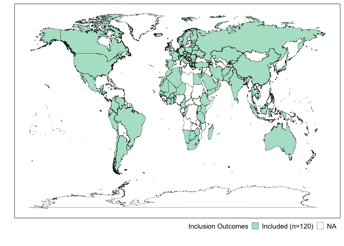
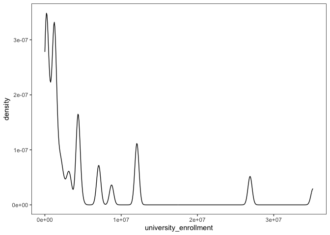
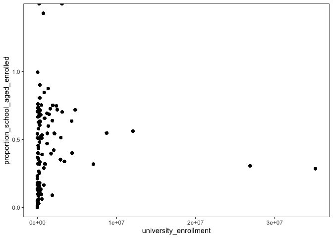
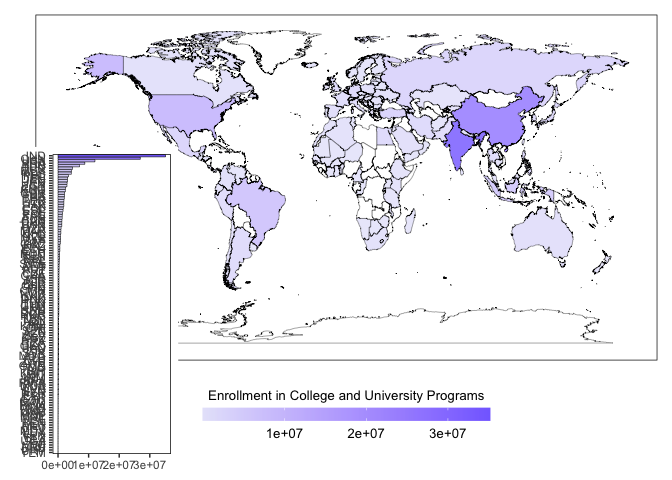
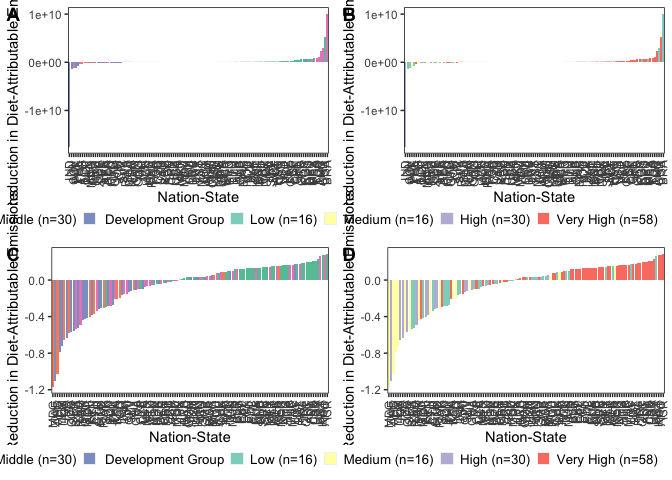
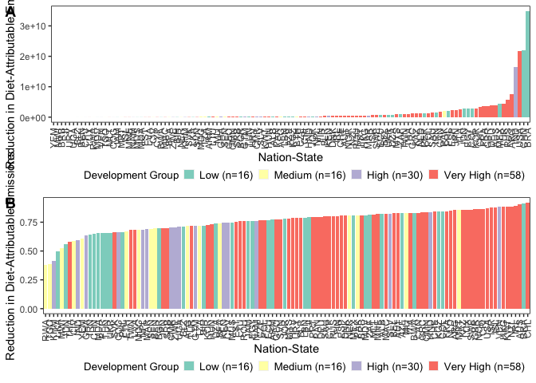

Data Analysis and Visualization
================
Last updated: June 12, 2024

## Package Loading

Here, we list the packages that will be required to support our
analytical and visualization procedures.

``` r
library(tidyverse)
```

    ## ── Attaching packages ─────────────────────────────────────── tidyverse 1.3.2 ──
    ## ✔ ggplot2 3.4.1      ✔ purrr   0.3.4 
    ## ✔ tibble  3.1.8      ✔ dplyr   1.0.10
    ## ✔ tidyr   1.2.1      ✔ stringr 1.4.1 
    ## ✔ readr   2.1.2      ✔ forcats 0.5.2 
    ## ── Conflicts ────────────────────────────────────────── tidyverse_conflicts() ──
    ## ✖ dplyr::filter() masks stats::filter()
    ## ✖ dplyr::lag()    masks stats::lag()

``` r
library(viridis)
```

    ## Loading required package: viridisLite

``` r
library(RColorBrewer)
library(colorspace)
library(ggpubr)
library(ggridges)
library(forcats)
library(lazyeval)
```

    ## 
    ## Attaching package: 'lazyeval'
    ## 
    ## The following objects are masked from 'package:purrr':
    ## 
    ##     is_atomic, is_formula

## Data Loading

The below code chunk loads in the data in the two formats we specified
at the end of our cleaning script: one suited for spatial visualization
and analysis and one not.

``` r
impact_data <- read.csv("/Users/kenjinchang/github/university-impact-model/data/model-output/university-impact-model.csv")
spatial_impact_data <- read.csv("/Users/kenjinchang/github/university-impact-model/data/model-output/university-impact-model-shapefile.csv")
```

## Methods-Section Figures

### Nation-State Inclusion

As specified in the manuscript, we will need to generate a figure
separating the nation-states included within our analysis from those
that were omitted for the various reasons cited in our cleaning script.

We will eventually also have to create a complementary flow diagram
documenting this exclusion process, whereby nation-states were excluded
either (1) because they did not have complete dietary-footprint data for
the nine dietary scenarios across the two identified sources (i.e.,
publication data for Kim et al. (2020) and publication data for Semba et
al. (2020)), (2) because they did not have the \_\_\_

For now, we focus on creating a choropleth map using
`spatial_impact_data` indcating which and how many nation-states are
being factored into our country-level and global results.

``` r
spatial_impact_data<- spatial_impact_data %>%
  mutate(inclusion=case_when(university_enrollment>0~"Included")) 
impact_data<- spatial_impact_data %>%
  mutate(inclusion=case_when(university_enrollment>0~"Included")) 
```

``` r
ggplot(spatial_impact_data,aes(x=long,y=lat,fill=inclusion,group=group)) + 
  geom_polygon(color="black",linewidth=0.125) +
  scale_fill_brewer(palette="Pastel2",na.value="white",name="Inclusion Outcomes",labels=c("Included (n=120)","NA")) +
  xlab("") + 
  ylab("") +
  labs(caption="") +
  theme(legend.position="bottom",legend.justification="right",legend.box.spacing=unit(-15,"pt"),legend.key.size=unit(10,"pt"),panel.grid=element_blank(),panel.background=element_rect(fill="white"),panel.border=element_rect(fill=NA),axis.text=element_blank(),axis.ticks=element_blank(),legend.title=element_text(size=10),legend.text=element_text(size=10),plot.title=element_text(size=10))
```

<!-- -->

## Descriptive Results

### Enrollment Indicators

To provide readers with a sense of how

``` r
impact_data %>%
  select(country,proportion_school_aged) %>%
  summarise(mean(proportion_school_aged))
```

    ##   mean(proportion_school_aged)
    ## 1                           NA

``` r
impact_data %>% 
  ggplot(aes(university_enrollment),fill=inclusion,color=inclusion) + 
  geom_density(alpha=0.75) +
  scale_color_brewer(palette="Purples") + 
  scale_fill_brewer(palette="Purples") + 
  theme(legend.position="bottom",legend.justification="right",legend.box.spacing=unit(0,"pt"),legend.key.size=unit(10,"pt"),panel.grid=element_blank(),panel.background=element_rect(fill="white"),panel.border=element_rect(fill=NA),legend.title=element_text(size=10),legend.text=element_text(size=10),plot.title=element_text(size=10))
```

    ## Warning: Removed 24328 rows containing non-finite values (`stat_density()`).

<!-- -->
ggplot(aes(baseline_population_kg_co2e,fill=factor(development_group,levels=c(“Low”,“Medium”,“High”,“Very
High”,“NA”)),color=factor(development_group,levels=c(“Low”,“Medium”,“High”,“Very
High”,“NA”)))) + geom_density(alpha=0.75) +
scale_color_brewer(palette=“Set3”,name=“Development Group”,labels=c(“Low
(n=16)”,“Medium (n=16)”,“High (n=30)”,“Very High (n=58)”,“NA”)) +
scale_fill_brewer(palette=“Set3”,name=“Development Group”,labels=c(“Low
(n=16)”,“Medium (n=16)”,“High (n=30)”,“Very High (n=58)”,“NA”)) +
xlim(-400,1500) + xlab(bquote(‘Annual Population-Level,
Diet-Attributable Emissions at Baseline (Million kg CO’\[2\]\*‘e)’)) +
ylab(“Density”) +
theme(legend.position=“bottom”,legend.justification=“right”,legend.box.spacing=unit(0,“pt”),legend.key.size=unit(10,“pt”),panel.grid=element_blank(),panel.background=element_rect(fill=“white”),panel.border=element_rect(fill=NA),legend.title=element_text(size=10),legend.text=element_text(size=10),plot.title=element_text(size=10))

absolute

``` r
spatial_impact_data %>%
  ggplot(aes(x=long,y=lat,fill=university_enrollment,group=group)) + 
  geom_polygon(color="black",linewidth=0.125,alpha=0.8) +
  scale_fill_distiller(palette="Purples",na.value="white",guide=guide_colourbar(reverse=TRUE)) +
  xlab("") + 
  ylab("") +
  labs(caption="") +
  theme(legend.position="bottom",legend.justification="right",legend.box.spacing=unit(-15,"pt"),legend.key.size=unit(10,"pt"),panel.grid=element_blank(),panel.background=element_rect(fill="white"),panel.border=element_rect(fill=NA),axis.text=element_blank(),axis.ticks=element_blank(),legend.title=element_text(size=10),legend.text=element_text(size=10),plot.title=element_text(size=10))
```

<!-- -->

relative

``` r
spatial_impact_data %>%
  ggplot(aes(x=long,y=lat,fill=proportion_school_aged_enrolled,group=group)) + 
  geom_polygon(color="black",linewidth=0.125,alpha=0.8) +
  scale_fill_distiller(palette="Purples",na.value="white",guide=guide_colourbar(reverse=TRUE)) +
  xlab("") + 
  ylab("") +
  labs(caption="") +
  theme(legend.position="bottom",legend.justification="right",legend.box.spacing=unit(-15,"pt"),legend.key.size=unit(10,"pt"),panel.grid=element_blank(),panel.background=element_rect(fill="white"),panel.border=element_rect(fill=NA),axis.text=element_blank(),axis.ticks=element_blank(),legend.title=element_text(size=10),legend.text=element_text(size=10),plot.title=element_text(size=10))
```

<!-- -->

### Lending- and Development-Group Membership

``` r
impact_data %>%
  count(lending_group)
```

    ##   lending_group     n
    ## 1          High 36146
    ## 2           Low  3331
    ## 3  Lower-Middle 13281
    ## 4  Upper-Middle 22381
    ## 5          <NA> 24328

``` r
lending_group_membership <- spatial_impact_data %>%
  ggplot(aes(x=long,y=lat,group=group,fill=factor(lending_group,levels=c("Low","Lower-Middle","Upper-Middle","High","NA")))) + 
  geom_polygon(color="black",size=0.125) +
  scale_fill_brewer(palette="Set2",na.value="white",name="Lending Group",labels=c("Low (n=13)","Lower Middle (n=30)","Upper Middle (n=31)","High (n=46)","NA")) +
  xlab("") + 
  ylab("") +
  labs(caption="") +
  theme(legend.position="bottom",legend.justification="right",legend.box.spacing=unit(-15,"pt"),legend.key.size=unit(10,"pt"),panel.grid=element_blank(),panel.background=element_rect(fill="white"),panel.border=element_rect(fill=NA),axis.text=element_blank(),axis.ticks=element_blank(),legend.title=element_text(size=10),legend.text=element_text(size=10),plot.title=element_text(size=10))
```

    ## Warning: Using `size` aesthetic for lines was deprecated in ggplot2 3.4.0.
    ## ℹ Please use `linewidth` instead.

``` r
impact_data %>%
  count(development_group)
```

    ##   development_group     n
    ## 1              High 16898
    ## 2               Low  4603
    ## 3            Medium  5059
    ## 4         Very High 48579
    ## 5              <NA> 24328

``` r
development_group_membership <- spatial_impact_data %>%
  ggplot(aes(x=long,y=lat,group=group,fill=factor(development_group,levels=c("Low","Medium","High","Very High","NA")))) + 
  geom_polygon(color="black",size=0.125) +
  scale_fill_brewer(palette="Set3",na.value="white",name="Development Group",labels=c("Low (n=16)","Medium (n=16)","High (n=30)","Very High (n=58)","NA")) +
  xlab("") + 
  ylab("") +
  labs(caption="") +
  theme(legend.position="bottom",legend.justification="right",legend.box.spacing=unit(-15,"pt"),legend.key.size=unit(10,"pt"),panel.grid=element_blank(),panel.background=element_rect(fill="white"),panel.border=element_rect(fill=NA),axis.text=element_blank(),axis.ticks=element_blank(),legend.title=element_text(size=10),legend.text=element_text(size=10),plot.title=element_text(size=10))
```

ggtitle(“Figure X. Choropleth map sorting the 120 nation-states included
in our analyses into their corresponding lending- and development-group
categories.”) +

``` r
ggarrange(lending_group_membership,development_group_membership,
          nrow=2,
          labels=c("A","B"))
```

<!-- -->

### Technical Potential

Because the average reduction across the nine arbitrarily chosen
scenarios may not be particularly useful, we may want to, instead, look
at the returns associated with the most impactful scenarios across the
various nation-states included within our analysis.

For now, though, let us look first at the top ten performing
nation-states when taking the average across the scenarios.

``` r
impact_data %>%
  mutate(mean_population_reduction_kg_co2e=(meatless_day_population_reduction_kg_co2e+low_red_meat_population_reduction_kg_co2e+no_red_meat_population_reduction_kg_co2e+no_dairy_population_reduction_kg_co2e+pescetarian_population_reduction_kg_co2e+lacto_ovo_vegetarian_population_reduction_kg_co2e+eat_lancet_population_reduction_kg_co2e+two_thirds_vegan_population_reduction_kg_co2e+vegan_population_reduction_kg_co2e)/9) %>%
  select(country,mean_population_reduction_kg_co2e) %>%
  arrange(desc(mean_population_reduction_kg_co2e)) %>%
  head(10)
```

    ##    country mean_population_reduction_kg_co2e
    ## 1    India                        5632272574
    ## 2    India                        5632272574
    ## 3    India                        5632272574
    ## 4    India                        5632272574
    ## 5    India                        5632272574
    ## 6    India                        5632272574
    ## 7    India                        5632272574
    ## 8    India                        5632272574
    ## 9    India                        5632272574
    ## 10   India                        5632272574

``` r
lending_group_mean_percent_reduction <- impact_data %>%
  mutate(mean_population_percent_reduction_kg_co2e=(meatless_day_population_percent_reduction_kg_co2e+low_red_meat_population_percent_reduction_kg_co2e+no_red_meat_day_population_percent_reduction_kg_co2e+no_dairy_population_percent_reduction_kg_co2e+pescetarian_population_percent_reduction_kg_co2e+lacto_ovo_vegetarian_population_percent_reduction_kg_co2e+eat_lancet_population_percent_reduction_kg_co2e+two_thirds_vegan_population_percent_reduction_kg_co2e+vegan_population_percent_reduction_kg_co2e)/9) %>%
  ggplot(aes(x=fct_reorder(country_alpha_three,mean_population_percent_reduction_kg_co2e),y=mean_population_percent_reduction_kg_co2e,fill=development_group)) +
  geom_col() + 
  xlab("Nation-State") + 
  ylab("Average Percent-Reduction in Diet-Attributable Emissions") + 
  scale_fill_brewer(palette="Set2",name="Lending Group",labels=c("Low (n=13)","Lower Middle (n=30)","Upper Middle (n=31)","High (n=46)","NA")) + 
  theme(axis.text.x=element_text(angle=90,vjust=0.5,hjust=1),legend.position="bottom",legend.justification="right",legend.box.spacing=unit(0,"pt"),legend.key.size=unit(10,"pt"),panel.grid=element_blank(),panel.background=element_rect(fill="white"),panel.border=element_rect(fill=NA),legend.title=element_text(size=10),legend.text=element_text(size=10),plot.title=element_text(size=10))
```

``` r
development_group_mean_percent_reduction <- impact_data %>%
  mutate(mean_population_percent_reduction_kg_co2e=(meatless_day_population_percent_reduction_kg_co2e+low_red_meat_population_percent_reduction_kg_co2e+no_red_meat_day_population_percent_reduction_kg_co2e+no_dairy_population_percent_reduction_kg_co2e+pescetarian_population_percent_reduction_kg_co2e+lacto_ovo_vegetarian_population_percent_reduction_kg_co2e+eat_lancet_population_percent_reduction_kg_co2e+two_thirds_vegan_population_percent_reduction_kg_co2e+vegan_population_percent_reduction_kg_co2e)/9) %>%
  ggplot(aes(x=fct_reorder(country_alpha_three,mean_population_percent_reduction_kg_co2e),y=mean_population_percent_reduction_kg_co2e,fill=lending_group)) +
  geom_col() + 
  xlab("Nation-State") + 
  ylab("Average Percent-Reduction in Diet-Attributable Emissions") + 
  scale_fill_brewer(palette="Set3",name="Development Group",labels=c("Low (n=16)","Medium (n=16)","High (n=30)","Very High (n=58)","NA")) + 
  theme(axis.text.x=element_text(angle=90,vjust=0.5,hjust=1),legend.position="bottom",legend.justification="right",legend.box.spacing=unit(0,"pt"),legend.key.size=unit(10,"pt"),panel.grid=element_blank(),panel.background=element_rect(fill="white"),panel.border=element_rect(fill=NA),legend.title=element_text(size=10),legend.text=element_text(size=10),plot.title=element_text(size=10))
```

``` r
ggarrange(lending_group_mean_percent_reduction,development_group_mean_percent_reduction,
          nrow=2,
          labels=c("A","B"))
```

    ## Warning: Removed 24328 rows containing missing values (`position_stack()`).
    ## Removed 24328 rows containing missing values (`position_stack()`).

<!-- -->

``` r
lending_group_mean_absolute_reduction <- impact_data %>%
  mutate(mean_population_reduction_kg_co2e=(meatless_day_population_reduction_kg_co2e+low_red_meat_population_reduction_kg_co2e+no_red_meat_population_reduction_kg_co2e+no_dairy_population_reduction_kg_co2e+pescetarian_population_reduction_kg_co2e+lacto_ovo_vegetarian_population_reduction_kg_co2e+eat_lancet_population_reduction_kg_co2e+two_thirds_vegan_population_reduction_kg_co2e+vegan_population_reduction_kg_co2e)/9) %>%
  ggplot(aes(x=fct_reorder(country_alpha_three,mean_population_reduction_kg_co2e),y=mean_population_reduction_kg_co2e,fill=lending_group)) +
  geom_col() + 
  xlab("Nation-State") + 
  ylab("Average Reduction in Diet-Attributable Emissions") + 
  scale_fill_brewer(palette="Set2",name="Lending Group",labels=c("Low (n=13)","Lower Middle (n=30)","Upper Middle (n=31)","High (n=46)","NA")) + 
  theme(axis.text.x=element_text(angle=90,vjust=0.5,hjust=1),legend.position="bottom",legend.justification="right",legend.box.spacing=unit(0,"pt"),legend.key.size=unit(10,"pt"),panel.grid=element_blank(),panel.background=element_rect(fill="white"),panel.border=element_rect(fill=NA),legend.title=element_text(size=10),legend.text=element_text(size=10),plot.title=element_text(size=10))
```

``` r
development_group_mean_absolute_reduction <- impact_data %>%
  mutate(mean_population_reduction_kg_co2e=(meatless_day_population_reduction_kg_co2e+low_red_meat_population_reduction_kg_co2e+no_red_meat_population_reduction_kg_co2e+no_dairy_population_reduction_kg_co2e+pescetarian_population_reduction_kg_co2e+lacto_ovo_vegetarian_population_reduction_kg_co2e+eat_lancet_population_reduction_kg_co2e+two_thirds_vegan_population_reduction_kg_co2e+vegan_population_reduction_kg_co2e)/9) %>%
  ggplot(aes(x=fct_reorder(country_alpha_three,mean_population_reduction_kg_co2e),y=mean_population_reduction_kg_co2e,fill=development_group)) +
  geom_col() + 
  xlab("Nation-State") + 
  ylab("Average Reduction in Diet-Attributable Emissions") + 
  scale_fill_brewer(palette="Set3",name="Development Group",labels=c("Low (n=16)","Medium (n=16)","High (n=30)","Very High (n=58)","NA")) + 
  theme(axis.text.x=element_text(angle=90,vjust=0.5,hjust=1),legend.position="bottom",legend.justification="right",legend.box.spacing=unit(0,"pt"),legend.key.size=unit(10,"pt"),panel.grid=element_blank(),panel.background=element_rect(fill="white"),panel.border=element_rect(fill=NA),legend.title=element_text(size=10),legend.text=element_text(size=10),plot.title=element_text(size=10))
```

``` r
ggarrange(lending_group_mean_absolute_reduction,development_group_mean_absolute_reduction,
          nrow=2,
          labels=c("A","B"))
```

    ## Warning: Removed 24328 rows containing missing values (`position_stack()`).
    ## Removed 24328 rows containing missing values (`position_stack()`).

<!-- --> As
described previously, we will now run a similar set of analyses for the
120 included nation-states - this time, for each of their optimal change
scenarios. - should spot check this

``` r
impact_data <- impact_data %>%
  mutate(greatest_population_reduction_kg_co2e=pmax(meatless_day_population_reduction_kg_co2e,low_red_meat_population_reduction_kg_co2e,no_red_meat_population_reduction_kg_co2e,no_dairy_population_reduction_kg_co2e,pescetarian_population_reduction_kg_co2e,lacto_ovo_vegetarian_population_reduction_kg_co2e,eat_lancet_population_reduction_kg_co2e,two_thirds_vegan_population_reduction_kg_co2e,vegan_population_reduction_kg_co2e))
```

``` r
impact_data <- impact_data %>%
  mutate(greatest_reduction_diet=case_when(greatest_population_reduction_kg_co2e==meatless_day_population_reduction_kg_co2e~"Meatless Day",
                                           greatest_population_reduction_kg_co2e==low_red_meat_population_reduction_kg_co2e~"Low Red Meat",
                                           greatest_population_reduction_kg_co2e==no_red_meat_population_reduction_kg_co2e~"No Red Meat",
                                           greatest_population_reduction_kg_co2e==no_dairy_population_reduction_kg_co2e~"No Dairy",
                                           greatest_population_reduction_kg_co2e==pescetarian_population_reduction_kg_co2e~"Pescetarian",
                                           greatest_population_reduction_kg_co2e==lacto_ovo_vegetarian_population_reduction_kg_co2e~"Lacto-Ovo Vegetarian",
                                           greatest_population_reduction_kg_co2e==eat_lancet_population_reduction_kg_co2e~"EAT Lancet",
                                           greatest_population_reduction_kg_co2e==two_thirds_vegan_population_reduction_kg_co2e~"Two-Thirds Vegan",
                                           greatest_population_reduction_kg_co2e==vegan_population_reduction_kg_co2e~"Vegan"))
```

With this complete, we can now calculate the “technical potential” of
university-based dietary interventions, which is to say, the total
reductions in diet-attributable greenhouse gas emission (represented in
kg CO2e) if the target populations were to change their behaviors as
intended, per Nielsen and colleagues (2024).

``` r
impact_data %>%
  summarize(sum(greatest_population_reduction_kg_co2e))
```

    ##   sum(greatest_population_reduction_kg_co2e)
    ## 1                                         NA

We can also identify the top 10 performing nation-states, as we did
before - this time, for the optimized scenarios.

``` r
impact_data %>%
  select(country,greatest_population_reduction_kg_co2e) %>%
  arrange(desc(greatest_population_reduction_kg_co2e)) %>%
  head(10)
```

    ##    country greatest_population_reduction_kg_co2e
    ## 1    India                           17545637941
    ## 2    India                           17545637941
    ## 3    India                           17545637941
    ## 4    India                           17545637941
    ## 5    India                           17545637941
    ## 6    India                           17545637941
    ## 7    India                           17545637941
    ## 8    India                           17545637941
    ## 9    India                           17545637941
    ## 10   India                           17545637941

Will have to move this to the most appropriate section later, BUT, we’ll
want to use similar code to look at how this varies across groupings

``` r
impact_data %>%
  select(country,lending_group,greatest_population_reduction_kg_co2e) %>%
  group_by(lending_group) %>%
  arrange(desc(greatest_population_reduction_kg_co2e)) 
```

    ## # A tibble: 99,467 × 3
    ## # Groups:   lending_group [5]
    ##    country lending_group greatest_population_reduction_kg_co2e
    ##    <chr>   <chr>                                         <dbl>
    ##  1 India   Lower-Middle                           17545637941.
    ##  2 India   Lower-Middle                           17545637941.
    ##  3 India   Lower-Middle                           17545637941.
    ##  4 India   Lower-Middle                           17545637941.
    ##  5 India   Lower-Middle                           17545637941.
    ##  6 India   Lower-Middle                           17545637941.
    ##  7 India   Lower-Middle                           17545637941.
    ##  8 India   Lower-Middle                           17545637941.
    ##  9 India   Lower-Middle                           17545637941.
    ## 10 India   Lower-Middle                           17545637941.
    ## # … with 99,457 more rows

estimates the total global impact if the most ideal dietary change
occurred - should do same for relative change (percent reduction)

``` r
lending_group_optimized_absolute_reduction <- impact_data %>%
  ggplot(aes(x=fct_reorder(country_alpha_three,greatest_population_reduction_kg_co2e),y=greatest_population_reduction_kg_co2e,fill=lending_group)) +
  geom_col() + 
  xlab("Nation-State") + 
  ylab("Reduction in Diet-Attributable Emissions") + 
  scale_fill_brewer(palette="Set2",name="Lending Group",labels=c("Low (n=13)","Lower Middle (n=30)","Upper Middle (n=31)","High (n=46)","NA")) + 
  theme(axis.text.x=element_text(angle=90,vjust=0.5,hjust=1),legend.position="bottom",legend.justification="right",legend.box.spacing=unit(0,"pt"),legend.key.size=unit(10,"pt"),panel.grid=element_blank(),panel.background=element_rect(fill="white"),panel.border=element_rect(fill=NA),legend.title=element_text(size=10),legend.text=element_text(size=10),plot.title=element_text(size=10))
```

``` r
development_group_optimized_absolute_reduction <- impact_data %>%
  ggplot(aes(x=fct_reorder(country_alpha_three,greatest_population_reduction_kg_co2e),y=greatest_population_reduction_kg_co2e,fill=development_group)) +
  geom_col() + 
  xlab("Nation-State") + 
  ylab("Reduction in Diet-Attributable Emissions") + 
  scale_fill_brewer(palette="Set3",name="Development Group",labels=c("Low (n=16)","Medium (n=16)","High (n=30)","Very High (n=58)","NA")) + 
  theme(axis.text.x=element_text(angle=90,vjust=0.5,hjust=1),legend.position="bottom",legend.justification="right",legend.box.spacing=unit(0,"pt"),legend.key.size=unit(10,"pt"),panel.grid=element_blank(),panel.background=element_rect(fill="white"),panel.border=element_rect(fill=NA),legend.title=element_text(size=10),legend.text=element_text(size=10),plot.title=element_text(size=10))
```

``` r
ggarrange(lending_group_optimized_absolute_reduction,development_group_optimized_absolute_reduction,
          nrow=2,
          labels=c("A","B"))
```

    ## Warning: Removed 24328 rows containing missing values (`position_stack()`).
    ## Removed 24328 rows containing missing values (`position_stack()`).

<!-- -->

``` r
lending_group_optimized_percent_reduction <- impact_data %>% 
  mutate(optimal_diet_population_percent_reduction_kg_co2e=(baseline_population_kg_co2e-greatest_population_reduction_kg_co2e)/baseline_population_kg_co2e) %>%
  ggplot(aes(x=fct_reorder(country_alpha_three,optimal_diet_population_percent_reduction_kg_co2e),y=optimal_diet_population_percent_reduction_kg_co2e,fill=development_group)) +
  geom_col() + 
  xlab("Nation-State") + 
  ylab("Average Percent-Reduction in Diet-Attributable Emissions") + 
  scale_fill_brewer(palette="Set2",name="Lending Group",labels=c("Low (n=13)","Lower Middle (n=30)","Upper Middle (n=31)","High (n=46)","NA")) + 
  theme(axis.text.x=element_text(angle=90,vjust=0.5,hjust=1),legend.position="bottom",legend.justification="right",legend.box.spacing=unit(0,"pt"),legend.key.size=unit(10,"pt"),panel.grid=element_blank(),panel.background=element_rect(fill="white"),panel.border=element_rect(fill=NA),legend.title=element_text(size=10),legend.text=element_text(size=10),plot.title=element_text(size=10))
```

``` r
development_group_optimized_percent_reduction <- impact_data %>% 
  mutate(optimal_diet_population_percent_reduction_kg_co2e=(baseline_population_kg_co2e-greatest_population_reduction_kg_co2e)/baseline_population_kg_co2e) %>%
  ggplot(aes(x=fct_reorder(country_alpha_three,optimal_diet_population_percent_reduction_kg_co2e),y=optimal_diet_population_percent_reduction_kg_co2e,fill=development_group)) +
  geom_col() + 
  xlab("Nation-State") + 
  ylab("Average Percent-Reduction in Diet-Attributable Emissions") + 
  scale_fill_brewer(palette="Set3",name="Development Group",labels=c("Low (n=16)","Medium (n=16)","High (n=30)","Very High (n=58)","NA")) + 
  theme(axis.text.x=element_text(angle=90,vjust=0.5,hjust=1),legend.position="bottom",legend.justification="right",legend.box.spacing=unit(0,"pt"),legend.key.size=unit(10,"pt"),panel.grid=element_blank(),panel.background=element_rect(fill="white"),panel.border=element_rect(fill=NA),legend.title=element_text(size=10),legend.text=element_text(size=10),plot.title=element_text(size=10))
```

``` r
ggarrange(lending_group_optimized_percent_reduction,development_group_optimized_percent_reduction,
          nrow=2,
          labels=c("A","B"))
```

    ## Warning: Removed 24328 rows containing missing values (`position_stack()`).
    ## Removed 24328 rows containing missing values (`position_stack()`).

<!-- -->

Might be good to spot check after changing percent-decrease calculation
in cleaning script, now that vegan is not mirrored with optimal

``` r
impact_data %>%
  mutate(optimal_diet_population_percent_reduction_kg_co2e=(baseline_population_kg_co2e-greatest_population_reduction_kg_co2e)/baseline_population_kg_co2e) %>%
  select(country,vegan_population_percent_reduction_kg_co2e,optimal_diet_population_percent_reduction_kg_co2e,vegan_population_reduction_kg_co2e,greatest_population_reduction_kg_co2e) %>%
  head(10)
```

    ##        country vegan_population_percent_reduction_kg_co2e
    ## 1  Afghanistan                                 -0.7155515
    ## 2  Afghanistan                                 -0.7155515
    ## 3  Afghanistan                                 -0.7155515
    ## 4  Afghanistan                                 -0.7155515
    ## 5  Afghanistan                                 -0.7155515
    ## 6  Afghanistan                                 -0.7155515
    ## 7  Afghanistan                                 -0.7155515
    ## 8  Afghanistan                                 -0.7155515
    ## 9  Afghanistan                                 -0.7155515
    ## 10 Afghanistan                                 -0.7155515
    ##    optimal_diet_population_percent_reduction_kg_co2e
    ## 1                                         -0.4247003
    ## 2                                         -0.4247003
    ## 3                                         -0.4247003
    ## 4                                         -0.4247003
    ## 5                                         -0.4247003
    ## 6                                         -0.4247003
    ## 7                                         -0.4247003
    ## 8                                         -0.4247003
    ## 9                                         -0.4247003
    ## 10                                        -0.4247003
    ##    vegan_population_reduction_kg_co2e greatest_population_reduction_kg_co2e
    ## 1                          -238249238                             474366684
    ## 2                          -238249238                             474366684
    ## 3                          -238249238                             474366684
    ## 4                          -238249238                             474366684
    ## 5                          -238249238                             474366684
    ## 6                          -238249238                             474366684
    ## 7                          -238249238                             474366684
    ## 8                          -238249238                             474366684
    ## 9                          -238249238                             474366684
    ## 10                         -238249238                             474366684

NEXT STEP WILL BE TO LOOK AT RELATIVE CHANGE FROM OPTIMIZED SCENARIO AND
ALSO PROBABLY MOVE DICHOTOMIZED TO LOWER SECTIONS -

scale_fill_brewer(palette=“Set2”,name=“Lending Group”,labels=c(“Low
(n=13)”,“Lower Middle (n=30)”,“Upper Middle (n=31)”,“High
(n=46)”,“NA”)) + scale_fill_brewer(palette=“Set3”,name=“Development
Group”,labels=c(“Low (n=16)”,“Medium (n=16)”,“High (n=30)”,“Very High
(n=58)”,“NA”)) +

scale_fill_brewer(palette=“Set2”,name=“Lending Group”,labels=c(“Low
(n=13)”,“Lower Middle (n=30)”,“Upper Middle (n=31)”,“High
(n=46)”,“NA”)) + scale_fill_brewer(palette=“Set3”,name=“Development
Group”,labels=c(“Low (n=16)”,“Medium (n=16)”,“High (n=30)”,“Very High
(n=58)”,“NA”)) +

xlab(“Nation-State”) + ylab(“Average Reduction in Diet-Attributable
Emissions”) +

theme(axis.text.x=element_text(angle=90,vjust=0.5,hjust=1),legend.position=“bottom”,legend.justification=“right”,legend.box.spacing=unit(0,“pt”),legend.key.size=unit(10,“pt”),panel.grid=element_blank(),panel.background=element_rect(fill=“white”),panel.border=element_rect(fill=NA),legend.title=element_text(size=10),legend.text=element_text(size=10),plot.title=element_text(size=10))

## Lending- and Development-Group Distributions

First, change population figures to millions kg Co2e

``` r
impact_data <- impact_data %>%
  mutate(baseline_population_kg_co2e=baseline_population_kg_co2e/1000000) %>%
  mutate(baseline_adjusted_population_kg_co2e=baseline_adjusted_population_kg_co2e/1000000) %>%
  mutate(baseline_oecd_population_kg_co2e=baseline_oecd_population_kg_co2e/1000000) %>%
  mutate(meatless_day_population_kg_co2e=meatless_day_population_kg_co2e/1000000) %>%
  mutate(low_red_meat_population_kg_co2e=low_red_meat_population_kg_co2e/1000000) %>%
  mutate(no_red_meat_population_kg_co2e=no_red_meat_population_kg_co2e/1000000) %>%
  mutate(no_dairy_population_kg_co2e=no_dairy_population_kg_co2e/1000000) %>%
  mutate(pescetarian_population_kg_co2e=pescetarian_population_kg_co2e/1000000) %>%
  mutate(lacto_ovo_vegetarian_population_kg_co2e=lacto_ovo_vegetarian_population_kg_co2e/1000000) %>%
  mutate(eat_lancet_population_kg_co2e=eat_lancet_population_kg_co2e/1000000) %>%
  mutate(two_thirds_vegan_population_kg_co2e=two_thirds_vegan_population_kg_co2e/1000000) %>%
  mutate(vegan_population_kg_co2e=vegan_population_kg_co2e/1000000) %>%
  mutate(baseline_adjusted_population_reduction_kg_co2e=baseline_adjusted_population_reduction_kg_co2e/1000000) %>%
  mutate(baseline_oecd_population_reduction_kg_co2e=baseline_oecd_population_reduction_kg_co2e/1000000) %>%
  mutate(meatless_day_population_reduction_kg_co2e=meatless_day_population_reduction_kg_co2e/1000000) %>%
  mutate(low_red_meat_population_reduction_kg_co2e=low_red_meat_population_reduction_kg_co2e/1000000) %>%
  mutate(no_red_meat_population_reduction_kg_co2e=no_red_meat_population_reduction_kg_co2e/1000000) %>%
  mutate(no_dairy_population_reduction_kg_co2e=no_dairy_population_reduction_kg_co2e/1000000) %>%
  mutate(pescetarian_population_reduction_kg_co2e=pescetarian_population_reduction_kg_co2e/1000000) %>%
  mutate(lacto_ovo_vegetarian_population_reduction_kg_co2e=lacto_ovo_vegetarian_population_reduction_kg_co2e/1000000) %>%
  mutate(eat_lancet_population_reduction_kg_co2e=eat_lancet_population_reduction_kg_co2e/1000000) %>%
  mutate(two_thirds_vegan_population_reduction_kg_co2e=two_thirds_vegan_population_reduction_kg_co2e/1000000) %>%
  mutate(vegan_population_reduction_kg_co2e=vegan_population_reduction_kg_co2e/1000000)
```

``` r
lending_group_baseline_distribution <- impact_data %>%
  ggplot(aes(baseline_population_kg_co2e,fill=factor(lending_group,levels=c("Low","Lower-Middle","Upper-Middle","High","NA")),color=factor(lending_group,levels=c("Low","Lower-Middle","Upper-Middle","High","NA")))) + 
  geom_density(alpha=0.75) +
  scale_color_brewer(palette="Set2",name="Lending Group",labels=c("Low (n=13)","Lower Middle (n=30)","Upper Middle (n=31)","High (n=46)","NA")) +
  scale_fill_brewer(palette="Set2",name="Lending Group",labels=c("Low (n=13)","Lower Middle (n=30)","Upper Middle (n=31)","High (n=46)","NA")) + 
  xlim(-800,2500) + 
  xlab(bquote('Annual Population-Level, Diet-Attributable Emissions at Baseline (Million kg CO'[2]*'e)')) +
  ylab("Density") +
  theme(legend.position="bottom",legend.justification="right",legend.box.spacing=unit(0,"pt"),legend.key.size=unit(10,"pt"),panel.grid=element_blank(),panel.background=element_rect(fill="white"),panel.border=element_rect(fill=NA),legend.title=element_text(size=10),legend.text=element_text(size=10),plot.title=element_text(size=10))
```

``` r
development_group_baseline_distribution <- impact_data %>%
  ggplot(aes(baseline_population_kg_co2e,fill=factor(development_group,levels=c("Low","Medium","High","Very High","NA")),color=factor(development_group,levels=c("Low","Medium","High","Very High","NA")))) + 
  geom_density(alpha=0.75) +
  scale_color_brewer(palette="Set3",name="Development Group",labels=c("Low (n=16)","Medium (n=16)","High (n=30)","Very High (n=58)","NA")) +
  scale_fill_brewer(palette="Set3",name="Development Group",labels=c("Low (n=16)","Medium (n=16)","High (n=30)","Very High (n=58)","NA")) + 
  xlim(-400,1500) +
  xlab(bquote('Annual Population-Level, Diet-Attributable Emissions at Baseline (Million kg CO'[2]*'e)')) +
  ylab("Density") +
  theme(legend.position="bottom",legend.justification="right",legend.box.spacing=unit(0,"pt"),legend.key.size=unit(10,"pt"),panel.grid=element_blank(),panel.background=element_rect(fill="white"),panel.border=element_rect(fill=NA),legend.title=element_text(size=10),legend.text=element_text(size=10),plot.title=element_text(size=10))
```

``` r
ggarrange(lending_group_baseline_distribution,development_group_baseline_distribution,
          nrow=2,
          labels=c("A","B"))
```

    ## Warning: Removed 61500 rows containing non-finite values (`stat_density()`).

    ## Warning: Removed 75274 rows containing non-finite values (`stat_density()`).

<!-- -->

``` r
impact_data %>%
  group_by(lending_group) %>%
  summarize(mean=mean(baseline_population_kg_co2e),sd=sd(baseline_population_kg_co2e)) 
```

    ## # A tibble: 5 × 3
    ##   lending_group   mean     sd
    ##   <chr>          <dbl>  <dbl>
    ## 1 High           5703.  8408.
    ## 2 Low             173.   151.
    ## 3 Lower-Middle   5201.  8299.
    ## 4 Upper-Middle  10821. 12858.
    ## 5 <NA>             NA     NA

``` r
impact_data %>%
  group_by(development_group) %>%
  summarize(mean=mean(baseline_population_kg_co2e),sd=sd(baseline_population_kg_co2e)) 
```

    ## # A tibble: 5 × 3
    ##   development_group   mean     sd
    ##   <chr>              <dbl>  <dbl>
    ## 1 High              11719. 14647.
    ## 2 Low                 432.   791.
    ## 3 Medium             8474. 12565.
    ## 4 Very High          5662.  7394.
    ## 5 <NA>                 NA     NA

## Groupwise Comparisons

``` r
impact_data %>%
  group_by(lending_group) %>%
  summarize(mean=mean(greatest_population_reduction_kg_co2e),sd=sd(greatest_population_reduction_kg_co2e))
```

    ## # A tibble: 5 × 3
    ##   lending_group         mean          sd
    ##   <chr>                <dbl>       <dbl>
    ## 1 High          -1114236123. 1830247977.
    ## 2 Low             160158715.  176210802.
    ## 3 Lower-Middle   3015819708. 5373116585.
    ## 4 Upper-Middle  -1531287329. 2735207201.
    ## 5 <NA>                   NA          NA

``` r
impact_data %>%
  group_by(development_group) %>%
  summarize(mean=mean(greatest_population_reduction_kg_co2e),sd=sd(greatest_population_reduction_kg_co2e))
```

    ## # A tibble: 5 × 3
    ##   development_group         mean          sd
    ##   <chr>                    <dbl>       <dbl>
    ## 1 High               -780242444. 3724780498.
    ## 2 Low                 267047738.  351251297.
    ## 3 Medium             5327666240. 8000834971.
    ## 4 Very High         -1007795093. 1622756488.
    ## 5 <NA>                       NA          NA

``` r
lending_group_reductions_optimized <- impact_data %>%
  ggplot(aes(greatest_population_reduction_kg_co2e,fill=factor(lending_group,levels=c("Low","Lower-Middle","Upper-Middle","High","NA")),color=factor(lending_group,levels=c("Low","Lower-Middle","Upper-Middle","High","NA")))) + 
  geom_density(alpha=0.75) +
  scale_color_brewer(palette="Set2",name="Lending Group",labels=c("Low (n=13)","Lower Middle (n=30)","Upper Middle (n=31)","High (n=46)","NA")) +
  scale_fill_brewer(palette="Set2",name="Lending Group",labels=c("Low (n=13)","Lower Middle (n=30)","Upper Middle (n=31)","High (n=46)","NA")) + 
  xlim(-300,3000) + 
  xlab(bquote('Optimized Annual Population-Level Reductions in Diet-Attributable Emissions (Million kg CO'[2]*'e)')) +
  ylab("Density") +
  theme(legend.position="bottom",legend.justification="right",legend.box.spacing=unit(0,"pt"),legend.key.size=unit(10,"pt"),panel.grid=element_blank(),panel.background=element_rect(fill="white"),panel.border=element_rect(fill=NA),legend.title=element_text(size=10),legend.text=element_text(size=10),plot.title=element_text(size=10))
```

``` r
development_group_reductions_optimized <- impact_data %>%
  ggplot(aes(greatest_population_reduction_kg_co2e,fill=factor(development_group,levels=c("Low","Medium","High","Very High","NA")),color=factor(development_group,levels=c("Low","Medium","High","Very High","NA")))) + 
  geom_density(alpha=0.75) +
  scale_color_brewer(palette="Set3",name="Development Group",labels=c("Low (n=16)","Medium (n=16)","High (n=30)","Very High (n=58)","NA")) +
  scale_fill_brewer(palette="Set3",name="Development Group",labels=c("Low (n=16)","Medium (n=16)","High (n=30)","Very High (n=58)","NA")) + 
  xlim(-300,3000) +
  xlab(bquote('Optimized Annual Population-Level Reductions in Diet-Attributable Emissions (Million kg CO'[2]*'e)')) +
  ylab("Density") +
  theme(legend.position="bottom",legend.justification="right",legend.box.spacing=unit(0,"pt"),legend.key.size=unit(10,"pt"),panel.grid=element_blank(),panel.background=element_rect(fill="white"),panel.border=element_rect(fill=NA),legend.title=element_text(size=10),legend.text=element_text(size=10),plot.title=element_text(size=10))
```

``` r
ggarrange(lending_group_reductions_optimized,development_group_reductions_optimized,
          nrow=2,
          labels=c("A","B"))
```

    ## Warning: Removed 99467 rows containing non-finite values (`stat_density()`).
    ## Removed 99467 rows containing non-finite values (`stat_density()`).

<!-- --> \##
Lending- and Development-Group Membership, Dichotomized

``` r
impact_data %>%
  count(lending_group_dichotomy)
```

    ##   lending_group_dichotomy     n
    ## 1                  Higher 58527
    ## 2                   Lower 16612
    ## 3                    <NA> 24328

``` r
lending_group_membership_dichotomized <- spatial_impact_data %>%
  ggplot(aes(x=long,y=lat,group=group,fill=factor(lending_group_dichotomy,levels=c("Lower","Higher","NA")))) + 
  geom_polygon(color="black",size=0.125) +
  scale_fill_brewer(palette="Set2",na.value="white",name="Lending Group",labels=c("Lower (n=43)","Higher (n=77)","NA")) +
  xlab("") + 
  ylab("") +
  labs(caption="") +
  theme(legend.position="bottom",legend.justification="right",legend.box.spacing=unit(-15,"pt"),legend.key.size=unit(10,"pt"),panel.grid=element_blank(),panel.background=element_rect(fill="white"),panel.border=element_rect(fill=NA),axis.text=element_blank(),axis.ticks=element_blank(),legend.title=element_text(size=10),legend.text=element_text(size=10),plot.title=element_text(size=10))
```

``` r
impact_data %>%
  count(development_group_dichotomy)
```

    ##   development_group_dichotomy     n
    ## 1                Global North 48579
    ## 2                Global South 26560
    ## 3                        <NA> 24328

``` r
development_group_membership_dichotomized <- spatial_impact_data %>%
  ggplot(aes(x=long,y=lat,group=group,fill=factor(development_group_dichotomy,levels=c("Global South","Global North","NA")))) + 
  geom_polygon(color="black",size=0.125,alpha=0.75) +
  scale_fill_brewer(palette="Set3",na.value="white",name="Development Group",labels=c("Global South (n=62)","Global North (n=58)","NA")) +
  xlab("") + 
  ylab("") +
  labs(caption="") +
  theme(legend.position="bottom",legend.justification="right",legend.box.spacing=unit(-15,"pt"),legend.key.size=unit(10,"pt"),panel.grid=element_blank(),panel.background=element_rect(fill="white"),panel.border=element_rect(fill=NA),axis.text=element_blank(),axis.ticks=element_blank(),legend.title=element_text(size=10),legend.text=element_text(size=10),plot.title=element_text(size=10))
```

``` r
ggarrange(lending_group_membership_dichotomized,development_group_membership_dichotomized,
          nrow=2,
          labels=c("A","B"))
```

<!-- -->

## Lending- and Development-Group Distributions, Dichotomized

lending_group_distribution_dichotomized

``` r
lending_group_baseline_distribution_dichotomized <- impact_data %>%
  ggplot(aes(baseline_population_kg_co2e,fill=factor(lending_group_dichotomy,levels=c("Lower","Higher","NA")),color=factor(lending_group_dichotomy,levels=c("Lower","Higher","NA")))) + 
  geom_density(alpha=0.75) +
  scale_color_brewer(palette="Set2",name="Lending Group",labels=c("Lower (n=43)","Higher (n=77)","NA")) +
  scale_fill_brewer(palette="Set2",name="Lending Group",labels=c("Lower (n=43)","Higher (n=77)","NA")) + 
  xlim(-800,2500) + 
  xlab(bquote('Annual Population-Level, Diet-Attributable Emissions at Baseline (Millions of kg CO'[2]*'e)')) +
  ylab("Density") +
  theme(legend.position="bottom",legend.justification="right",legend.box.spacing=unit(0,"pt"),legend.key.size=unit(10,"pt"),panel.grid=element_blank(),panel.background=element_rect(fill="white"),panel.border=element_rect(fill=NA),legend.title=element_text(size=10),legend.text=element_text(size=10),plot.title=element_text(size=10))
```

``` r
development_group_baseline_distribution_dichotomized <- impact_data %>%
  ggplot(aes(baseline_population_kg_co2e,fill=factor(development_group_dichotomy,levels=c("Global South","Global North","NA")),color=factor(development_group_dichotomy,levels=c("Global South","Global North","NA")))) + 
  geom_density(alpha=0.75) +
  scale_color_brewer(palette="Set3",name="Development Group",labels=c("Global South (n=62)","Global North (n=58)","NA")) +
  scale_fill_brewer(palette="Set3",name="Development Group",labels=c("Global South (n=62)","Global North (n=58)","NA")) + 
  xlim(-400,1500) +
  xlab(bquote('Annual Population-Level, Diet-Attributable Emissions at Baseline (Millions of kg CO'[2]*'e)')) +
  ylab("Density") +
  theme(legend.position="bottom",legend.justification="right",legend.box.spacing=unit(0,"pt"),legend.key.size=unit(10,"pt"),panel.grid=element_blank(),panel.background=element_rect(fill="white"),panel.border=element_rect(fill=NA),legend.title=element_text(size=10),legend.text=element_text(size=10),plot.title=element_text(size=10))
```

``` r
ggarrange(lending_group_baseline_distribution_dichotomized,development_group_baseline_distribution_dichotomized,
          nrow=2,
          labels=c("A","B"))
```

    ## Warning: Removed 61500 rows containing non-finite values (`stat_density()`).

    ## Warning: Removed 75274 rows containing non-finite values (`stat_density()`).

<!-- -->

## Groupwise Comparisons, Dichotomized

``` r
lending_group_reductions_distribution_dichotomized <- impact_data %>%
  ggplot(aes(greatest_population_reduction_kg_co2e,fill=factor(lending_group_dichotomy,levels=c("Lower","Higher","NA")),color=factor(lending_group_dichotomy,levels=c("Lower","Higher","NA")))) + 
  geom_density(alpha=0.75) +
  scale_color_brewer(palette="Set2",name="Lending Group",labels=c("Lower (n=43)","Higher (n=77)","NA")) +
  scale_fill_brewer(palette="Set2",name="Lending Group",labels=c("Lower (n=43)","Higher (n=77)","NA")) + 
  xlim(-300,3000) + 
  xlab(bquote('Optimized Annual Population-Level Reductions in Diet-Attributable Emissions (Million kg CO'[2]*'e)')) +
  ylab("Density") +
  theme(legend.position="bottom",legend.justification="right",legend.box.spacing=unit(0,"pt"),legend.key.size=unit(10,"pt"),panel.grid=element_blank(),panel.background=element_rect(fill="white"),panel.border=element_rect(fill=NA),legend.title=element_text(size=10),legend.text=element_text(size=10),plot.title=element_text(size=10))
```

``` r
development_group_reductions_distribution_dichotomized <- impact_data %>%
  ggplot(aes(greatest_population_reduction_kg_co2e,fill=factor(development_group_dichotomy,levels=c("Global South","Global North","NA")),color=factor(development_group_dichotomy,levels=c("Global South","Global North","NA")))) + 
  geom_density(alpha=0.75) +
  scale_color_brewer(palette="Set3",name="Development Group",labels=c("Global South (n=62)","Global North (n=58)","NA")) +
  scale_fill_brewer(palette="Set3",name="Development Group",labels=c("Global South (n=62)","Global North (n=58)","NA")) + 
  xlim(-300,3000) +
  xlab(bquote('Optimized Annual Population-Level Reductions in Diet-Attributable Emissions (Million kg CO'[2]*'e)')) +
  ylab("Density") +
  theme(legend.position="bottom",legend.justification="right",legend.box.spacing=unit(0,"pt"),legend.key.size=unit(10,"pt"),panel.grid=element_blank(),panel.background=element_rect(fill="white"),panel.border=element_rect(fill=NA),legend.title=element_text(size=10),legend.text=element_text(size=10),plot.title=element_text(size=10))
```

``` r
ggarrange(lending_group_reductions_distribution_dichotomized,development_group_reductions_distribution_dichotomized,
          nrow=2,
          labels=c("A","B"))
```

    ## Warning: Removed 99467 rows containing non-finite values (`stat_density()`).
    ## Removed 99467 rows containing non-finite values (`stat_density()`).

<!-- -->

``` r
impact_data %>%
  group_by(lending_group_dichotomy) %>%
  summarize(mean=mean(greatest_population_reduction_kg_co2e),sd=sd(greatest_population_reduction_kg_co2e))
```

    ## # A tibble: 3 × 3
    ##   lending_group_dichotomy         mean          sd
    ##   <chr>                          <dbl>       <dbl>
    ## 1 Higher                  -1273718465. 2229508837.
    ## 2 Lower                    2443209139. 4939090297.
    ## 3 <NA>                             NA          NA

``` r
impact_data %>%
  group_by(development_group_dichotomy) %>%
  summarize(mean=mean(greatest_population_reduction_kg_co2e),sd=sd(greatest_population_reduction_kg_co2e))
```

    ## # A tibble: 3 × 3
    ##   development_group_dichotomy         mean          sd
    ##   <chr>                              <dbl>       <dbl>
    ## 1 Global North                -1007795093. 1622756488.
    ## 2 Global South                  564659166. 5150390719.
    ## 3 <NA>                                 NA          NA

## Global

## Choropleths

## Residual Code Chunks

``` r
impact_data %>%
  ggplot(aes(factor(lending_group),baseline_population_kg_co2e)) + 
  geom_violin(scale="width") + 
  stat_summary(fun.y=mean, geom="point", shape=21, size=2) +
  coord_flip()
```

    ## Warning: The `fun.y` argument of `stat_summary()` is deprecated as of ggplot2 3.3.0.
    ## ℹ Please use the `fun` argument instead.

    ## Warning: Removed 24328 rows containing non-finite values (`stat_ydensity()`).

    ## Warning: Removed 24328 rows containing non-finite values (`stat_summary()`).

<!-- -->

``` r
impact_data %>%
  ggplot(aes(factor(development_group),baseline_population_kg_co2e)) + 
  geom_violin(scale="width") + 
  stat_summary(fun.y=mean, geom="point", shape=21, size=2) +
  coord_flip()
```

    ## Warning: Removed 24328 rows containing non-finite values (`stat_ydensity()`).

    ## Warning: Removed 24328 rows containing non-finite values (`stat_summary()`).

<!-- -->

``` r
impact_data %>% 
ggplot(aes(x=baseline_population_kg_co2e,y=development_group,fill=stat(x))) +
  geom_density_ridges_gradient() +
  scale_fill_viridis_c(option="C")
```

    ## Warning: `stat(x)` was deprecated in ggplot2 3.4.0.
    ## ℹ Please use `after_stat(x)` instead.

    ## Picking joint bandwidth of 1100

<!-- -->

``` r
impact_data %>% 
ggplot(aes(x=baseline_population_kg_co2e,y=lending_group,fill=stat(x))) +
  geom_density_ridges_gradient(alpha=0.1) +
  scale_fill_viridis_c(option="C")
```

    ## Picking joint bandwidth of 302

<!-- -->

### Average Reduction

``` r
ggplot(spatial_impact_data,aes(x=long,y=lat,fill=proportion_school_aged_enrolled,group=group)) + 
  geom_polygon(color="black",size=0.125,alpha=0.66) + 
  scale_fill_continuous_sequential(labels=function(x)x/1000000,name="Millions Enrolled",palette="Purple-Blue",na.value="white",breaks=c(0,6000000,12000000,18000000,24000000,30000000),alpha=0.66) +
  guides(fill=guide_colorbar(title.position="top",title.hjust=0.5)) +
  xlab("") + 
  ylab("") +
  labs(caption="") +
  ggtitle("Enrollment Total") +
  theme(legend.position="bottom",panel.grid=element_blank(),panel.background=element_rect(fill="white"),panel.border=element_rect(fill=NA),axis.text=element_blank(),axis.ticks=element_blank(),legend.key.width=unit(3.5,"cm"))
```

<!-- -->

scale_fill_gradient(alpha=0.66,name=bquote(‘Kilograms
CO’\[2\]\*‘e’),colors=“z2”,trans=“reverse”,na.value=“white”,labels=scales::comma,breaks=c(750,1500,2250,3000,3750)) +
guides(fill=guide_colorbar(reverse=TRUE,title.position=“top”,title.hjust=0.5))
+

``` r
ggplot(spatial_impact_data,aes(x=long,y=lat,fill=eat_lancet_population_percent_reduction_kg_co2e
,group=group)) + 
  geom_polygon(color="black",size=0.125,alpha=0.66) + 
  scale_fill_gradient(low="palegreen",high="palegreen4",na.value="white") +
  guides(fill=guide_colorbar(reverse=TRUE,title.position="top",title.hjust=0.5)) +
  xlab("") + 
  ylab("") +
  labs(caption="") +
  ggtitle("Diet-Attributable Greenhouse Gas Footprint at Baseline") +
  theme(legend.position="bottom",panel.grid=element_blank(),panel.background=element_rect(fill="white"),panel.border=element_rect(fill=NA),axis.text=element_blank(),axis.ticks=element_blank(),legend.key.width=unit(3.5,"cm"))
```

<!-- -->

``` r
ggplot(spatial_impact_data,aes(x=long,y=lat,fill=eat_lancet_population_reduction_kg_co2e
,group=group)) + 
  geom_polygon(color="black",size=0.125,alpha=0.66) + 
  scale_fill_viridis_c(alpha=0.66,name=bquote('Kilograms CO'[2]*'e'),option="F",trans="reverse",na.value="white",labels=scales::comma,breaks=c(750,1500,2250,3000,3750)) +
  guides(fill=guide_colorbar(reverse=TRUE,title.position="top",title.hjust=0.5)) +
  xlab("") + 
  ylab("") +
  labs(caption="") +
  ggtitle("Diet-Attributable Greenhouse Gas Footprint at Baseline") +
  theme(legend.position="bottom",panel.grid=element_blank(),panel.background=element_rect(fill="white"),panel.border=element_rect(fill=NA),axis.text=element_blank(),axis.ticks=element_blank(),legend.key.width=unit(3.5,"cm"))
```

<!-- -->
