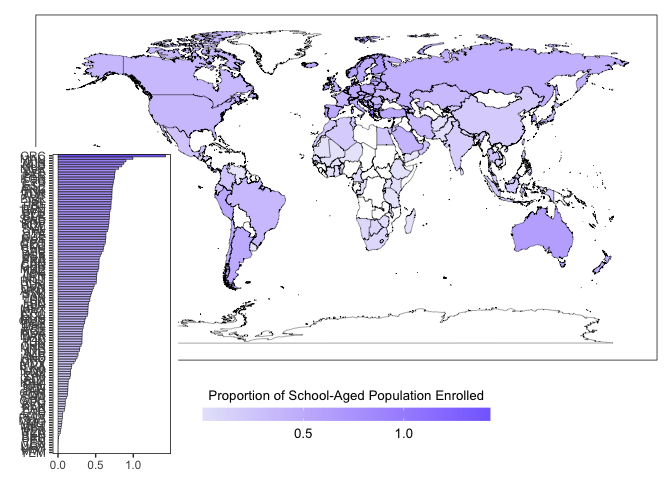
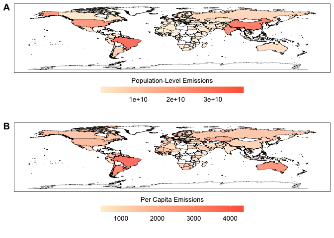
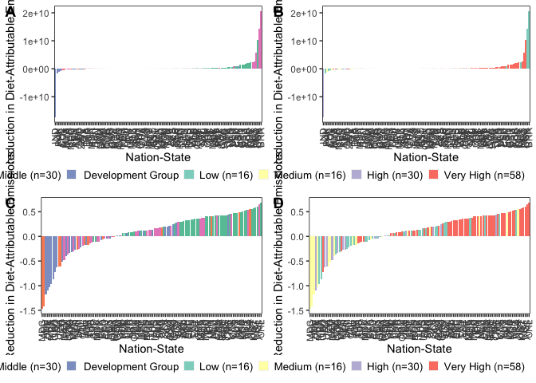
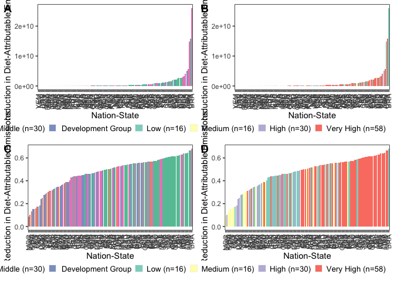

Data Analysis and Visualization
================
Last updated: July 9, 2024

# Package Loading

Here, we list the packages that will be required to support our
analytical and visualization procedures.

``` r
library(tidyverse)
```

    ## ── Attaching packages ─────────────────────────────────────── tidyverse 1.3.2 ──
    ## ✔ ggplot2 3.4.1      ✔ purrr   0.3.4 
    ## ✔ tibble  3.1.8      ✔ dplyr   1.0.10
    ## ✔ tidyr   1.2.1      ✔ stringr 1.4.1 
    ## ✔ readr   2.1.2      ✔ forcats 0.5.2 
    ## ── Conflicts ────────────────────────────────────────── tidyverse_conflicts() ──
    ## ✖ dplyr::filter() masks stats::filter()
    ## ✖ dplyr::lag()    masks stats::lag()

``` r
library(viridis)
```

    ## Loading required package: viridisLite

``` r
library(RColorBrewer)
library(colorspace)
library(ggpubr)
library(ggridges)
library(forcats)
library(lazyeval)
```

    ## 
    ## Attaching package: 'lazyeval'
    ## 
    ## The following objects are masked from 'package:purrr':
    ## 
    ##     is_atomic, is_formula

``` r
library(patchwork)
```

# Data Loading

The below code chunk loads in the data in the two formats we specified
at the end of our cleaning script: one suited for spatial visualization
and analysis and one not.

``` r
impact_data <- read.csv("/Users/kenjinchang/github/university-impact-model/data/model-output/university-impact-model.csv")
spatial_impact_data <- read.csv("/Users/kenjinchang/github/university-impact-model/data/model-output/university-impact-model-shapefile.csv")
```

# Methods-Section Figures

## Nation-State Inclusion

As specified in the manuscript, we will need to generate a figure
separating the nation-states included within our analysis from those
that were omitted for the various reasons cited in our cleaning script.

We will eventually also have to create a complementary flow diagram
documenting this exclusion process, whereby nation-states were excluded
either (1) because they did not have complete dietary-footprint data for
the nine dietary scenarios across the two identified sources (i.e.,
publication data for Kim et al. (2020) and publication data for Semba et
al. (2020)), (2) because they did not have the \_\_\_

For now, we focus on creating a choropleth map using
`spatial_impact_data` indicating which and how many nation-states are
being factored into our country-level and global results.

``` r
spatial_impact_data <- spatial_impact_data %>%
  mutate(inclusion=case_when(university_enrollment>0~"Included")) 
impact_data<- impact_data %>%
  mutate(inclusion=case_when(university_enrollment>0~"Included")) 
```

``` r
ggplot(spatial_impact_data,aes(x=long,y=lat,fill=inclusion,group=group)) + 
  geom_polygon(color="black",linewidth=0.125) +
  scale_fill_brewer(palette="Pastel2",na.value="white",name="Inclusion Outcomes",labels=c("Included (n=120)","NA")) +
  xlab("") + 
  ylab("") +
  labs(caption="") +
  theme(legend.position="bottom",legend.justification="right",legend.box.spacing=unit(-15,"pt"),legend.key.size=unit(10,"pt"),panel.grid=element_blank(),panel.background=element_rect(fill="white"),panel.border=element_rect(fill=NA),axis.text=element_blank(),axis.ticks=element_blank(),legend.title=element_text(size=10),legend.text=element_text(size=10),plot.title=element_text(size=10))
```

<!-- -->

# Descriptive Results

## Enrollment Indicators

To provide readers with a sense of scale and context, we perform a
series of calculations to derive a few relevant statistics. These
include:

- The mean proportion of the national population that is between the
  ages of 18 and 23 across the 120 included nation-states (i.e., 7.30%)

``` r
impact_data %>%
  select(country,proportion_school_aged) %>%
  summarise(mean(proportion_school_aged))
```

    ##   mean(proportion_school_aged)
    ## 1                   0.07302653

- The mean proportion of the school-aged population that is thought to
  be enrolled in college or university programs across the 120 included
  nation-states (i.e., 41.50%)

``` r
impact_data %>%
  select(country,proportion_school_aged_enrolled) %>%
  summarise(mean(proportion_school_aged_enrolled))
```

    ##   mean(proportion_school_aged_enrolled)
    ## 1                              0.414998

- The global sum of people enrolled in college and university programs
  across the 120 included nation-states (i.e., 168,167,205)

``` r
impact_data %>%
  summarize(sum(university_enrollment))
```

    ##   sum(university_enrollment)
    ## 1                  168167205

- The global sum of people of all ages residing in the 120 included
  nation-states (i.e., 6,592,823,027)

``` r
impact_data %>%
  summarise(sum(national_population))
```

    ##   sum(national_population)
    ## 1               6592823027

- The proportion of that sum enrollees account for (i.e., 2.55%)

``` r
168167205 / 6592823027
```

    ## [1] 0.02550762

This final statistic, in particular, will provide us with a more
complete understanding of the size and proportion of the population that
the expected reductions in carbon emissions are being modeled from.

``` r
university_enrollment_absolute_polygon <- spatial_impact_data %>%
  ggplot(aes(x=long,y=lat,fill=university_enrollment,group=group)) + 
  geom_polygon(color="black",linewidth=0.125,alpha=0.8) +
  scale_fill_gradient(low="lavender",high="lightslateblue",na.value="white",name="Enrollment in College and University Programs",guide=guide_colourbar(reverse=FALSE,title.position="top",title.hjust=0.5)) +
  xlab("") + 
  ylab("") +
  labs(caption="") +
  theme(legend.key.width=unit(3,"lines"),legend.position="bottom",legend.justification="center",legend.box.spacing=unit(-15,"pt"),legend.key.size=unit(10,"pt"),panel.grid=element_blank(),panel.background=element_rect(fill="white"),panel.border=element_rect(fill=NA),axis.text=element_blank(),axis.ticks=element_blank(),legend.title=element_text(size=10),legend.text=element_text(size=10),plot.title=element_text(size=10))
```

``` r
university_enrollment_relative_polygon <- spatial_impact_data %>%
  ggplot(aes(x=long,y=lat,fill=proportion_school_aged_enrolled,group=group)) + 
  geom_polygon(color="black",linewidth=0.125,alpha=0.8) +
  scale_fill_gradient(low="lavender",high="lightslateblue",na.value="white",name="Proportion of School-Aged Population Enrolled",guide=guide_colourbar(reverse=FALSE,title.position="top",title.hjust=0.5)) +
  xlab("") + 
  ylab("") +
  labs(caption="") +
  theme(legend.key.width=unit(3,"lines"),legend.position="bottom",legend.justification="center",legend.box.spacing=unit(-15,"pt"),legend.key.size=unit(10,"pt"),panel.grid=element_blank(),panel.background=element_rect(fill="white"),panel.border=element_rect(fill=NA),axis.text=element_blank(),axis.ticks=element_blank(),legend.title=element_text(size=10),legend.text=element_text(size=10),plot.title=element_text(size=10))
```

``` r
ggarrange(university_enrollment_absolute_polygon,university_enrollment_relative_polygon,
          nrow=2,
          labels=c("A","B"))
```

<!-- -->

``` r
university_enrollment_absolute_col <- impact_data %>%
  ggplot(aes(x=fct_reorder(country_alpha_three,university_enrollment),y=university_enrollment,fill=university_enrollment)) +
  geom_col(color="black",linewidth=0.2) +
  xlab("") + 
  ylab("") + 
  scale_fill_gradient(low="lavender",high="lightslateblue",na.value="white",name="Enrollment in College and University Programs",guide=guide_colourbar(reverse=FALSE,title.position="top",title.hjust=0.5)) +
  theme(axis.text.x=element_text(angle=90,vjust=0.5,hjust=1),legend.position="none",legend.justification="right",legend.box.spacing=unit(0,"pt"),legend.key.size=unit(10,"pt"),panel.grid=element_blank(),panel.background=element_rect(fill="white"),panel.border=element_rect(fill=NA),legend.title=element_text(size=10),legend.text=element_text(size=10),plot.title=element_text(size=10))
```

``` r
university_enrollment_absolute_col_flip <- impact_data %>%
  ggplot(aes(y=fct_reorder(country_alpha_three,university_enrollment),x=university_enrollment,fill=university_enrollment)) +
  geom_col(color="black",linewidth=0.2) +
  xlab("") + 
  ylab("") + 
  scale_fill_gradient(low="lavender",high="lightslateblue",na.value="white",name="Enrollment in College and University Programs",guide=guide_colourbar(reverse=FALSE,title.position="top",title.hjust=0.5)) +
  theme(legend.position="none",legend.justification="right",legend.box.spacing=unit(0,"pt"),legend.key.size=unit(10,"pt"),panel.grid=element_blank(),panel.background=element_rect(fill="white"),panel.border=element_rect(fill=NA),legend.title=element_text(size=10),legend.text=element_text(size=10),plot.title=element_text(size=10))
```

``` r
university_enrollment_relative_col <- impact_data %>%
  ggplot(aes(x=fct_reorder(country_alpha_three,proportion_school_aged_enrolled),y=proportion_school_aged_enrolled,fill=proportion_school_aged_enrolled)) +
  geom_col(color="black",linewidth=0.2) + 
  xlab("") + 
  ylab("") + 
  scale_fill_gradient(low="lavender",high="lightslateblue",na.value="white",name="Proportion of School-Aged Population Enrolled",guide=guide_colourbar(reverse=FALSE,title.position="top",title.hjust=0.5)) +
  theme(axis.text.x=element_text(angle=90,vjust=0.5,hjust=1),legend.position="none",legend.justification="right",legend.box.spacing=unit(0,"pt"),legend.key.size=unit(10,"pt"),panel.grid=element_blank(),panel.background=element_rect(fill="white"),panel.border=element_rect(fill=NA),legend.title=element_text(size=10),legend.text=element_text(size=10),plot.title=element_text(size=10))
```

``` r
university_enrollment_relative_col_flip <- impact_data %>%
  ggplot(aes(y=fct_reorder(country_alpha_three,proportion_school_aged_enrolled),x=proportion_school_aged_enrolled,fill=proportion_school_aged_enrolled)) +
  geom_col(color="black",linewidth=0.2) + 
  xlab("") + 
  ylab("") + 
  scale_fill_gradient(low="lavender",high="lightslateblue",na.value="white",name="Proportion of School-Aged Population Enrolled",guide=guide_colourbar(reverse=FALSE,title.position="top",title.hjust=0.5)) +
  theme(legend.position="none",legend.justification="right",legend.box.spacing=unit(0,"pt"),legend.key.size=unit(10,"pt"),panel.grid=element_blank(),panel.background=element_rect(fill="white"),panel.border=element_rect(fill=NA),legend.title=element_text(size=10),legend.text=element_text(size=10),plot.title=element_text(size=10))
```

``` r
university_enrollment_absolute_polygon + inset_element(university_enrollment_absolute_col_flip,-0.02,-0.05,0.26,.7, align_to="full")
```

<!-- -->

``` r
university_enrollment_relative_polygon + inset_element(university_enrollment_relative_col_flip,-0.02,-0.05,0.26,.7, align_to="full")
```

<!-- -->

``` r
ggarrange(university_enrollment_absolute_polygon,university_enrollment_absolute_col_flip,university_enrollment_relative_polygon,university_enrollment_relative_col_flip,
          nrow=2,
          ncol=2,
          common.legend=TRUE,
          widths=c(1,.2),
          legend="none",
          labels=c("A","B","C","D"))
```

<!-- -->

## Lending- and Development-Group Membership

``` r
impact_data %>%
  count(lending_group)
```

    ##   lending_group  n
    ## 1          High 46
    ## 2           Low 13
    ## 3  Lower-Middle 30
    ## 4  Upper-Middle 31

``` r
impact_data %>%
  count(development_group)
```

    ##   development_group  n
    ## 1              High 30
    ## 2               Low 16
    ## 3            Medium 16
    ## 4         Very High 58

``` r
lending_group_membership <- spatial_impact_data %>%
  ggplot(aes(x=long,y=lat,group=group,fill=factor(lending_group,levels=c("Low","Lower-Middle","Upper-Middle","High","NA")))) + 
  geom_polygon(color="black",linewidth=0.125) +
  scale_fill_brewer(palette="Set2",na.value="white",name="Lending Group",labels=c("Low (n=13)","Lower Middle (n=30)","Upper Middle (n=31)","High (n=46)","NA")) +
  xlab("") + 
  ylab("") +
  labs(caption="") +
  theme(legend.position="bottom",legend.justification="right",legend.box.spacing=unit(-15,"pt"),legend.key.size=unit(10,"pt"),panel.grid=element_blank(),panel.background=element_rect(fill="white"),panel.border=element_rect(fill=NA),axis.text=element_blank(),axis.ticks=element_blank(),legend.title=element_text(size=10),legend.text=element_text(size=10),plot.title=element_text(size=10))
```

``` r
development_group_membership <- spatial_impact_data %>%
  ggplot(aes(x=long,y=lat,group=group,fill=factor(development_group,levels=c("Low","Medium","High","Very High","NA")))) + 
  geom_polygon(color="black",linewidth=0.125) +
  scale_fill_brewer(palette="Set3",na.value="white",name="Development Group",labels=c("Low (n=16)","Medium (n=16)","High (n=30)","Very High (n=58)","NA")) +
  xlab("") + 
  ylab("") +
  labs(caption="") +
  theme(legend.position="bottom",legend.justification="right",legend.box.spacing=unit(-15,"pt"),legend.key.size=unit(10,"pt"),panel.grid=element_blank(),panel.background=element_rect(fill="white"),panel.border=element_rect(fill=NA),axis.text=element_blank(),axis.ticks=element_blank(),legend.title=element_text(size=10),legend.text=element_text(size=10),plot.title=element_text(size=10))
```

``` r
ggarrange(lending_group_membership,development_group_membership,
          nrow=2,
          labels=c("A","B"))
```

<!-- -->

## Diet-Attributable Emissions at Baseline

``` r
lending_group_baseline_population <- impact_data %>%
  ggplot(aes(x=fct_reorder(country_alpha_three,baseline_population_kg_co2e),y=baseline_population_kg_co2e,fill=lending_group)) +
  geom_col() + 
  xlab("Nation-State") + 
  ylab("Diet-Attributable Emissions at Baseline") + 
  scale_fill_brewer(palette="Set2",name="Lending Group",labels=c("Low (n=13)","Lower Middle (n=30)","Upper Middle (n=31)","High (n=46)","NA")) + 
  theme(axis.text.x=element_text(angle=90,vjust=0.5,hjust=1),legend.position="bottom",legend.justification="right",legend.box.spacing=unit(0,"pt"),legend.key.size=unit(10,"pt"),panel.grid=element_blank(),panel.background=element_rect(fill="white"),panel.border=element_rect(fill=NA),legend.title=element_text(size=10),legend.text=element_text(size=10),plot.title=element_text(size=10))
```

``` r
lending_group_baseline_per_capita <- impact_data %>%
  ggplot(aes(x=fct_reorder(country_alpha_three,baseline_per_capita_kg_co2e),y=baseline_per_capita_kg_co2e,fill=lending_group)) +
  geom_col() + 
  xlab("Nation-State") + 
  ylab("Diet-Attributable Emissions at Baseline") + 
  scale_fill_brewer(palette="Set2",name="Lending Group",labels=c("Low (n=13)","Lower Middle (n=30)","Upper Middle (n=31)","High (n=46)","NA")) + 
  theme(axis.text.x=element_text(angle=90,vjust=0.5,hjust=1),legend.position="bottom",legend.justification="right",legend.box.spacing=unit(0,"pt"),legend.key.size=unit(10,"pt"),panel.grid=element_blank(),panel.background=element_rect(fill="white"),panel.border=element_rect(fill=NA),legend.title=element_text(size=10),legend.text=element_text(size=10),plot.title=element_text(size=10))
```

``` r
development_group_baseline_population <- impact_data %>%
  ggplot(aes(x=fct_reorder(country_alpha_three,baseline_population_kg_co2e),y=baseline_population_kg_co2e,fill=development_group)) +
  geom_col() + 
  xlab("Nation-State") + 
  ylab("Diet-Attributable Emissions at Baseline") + 
  scale_fill_brewer(palette="Set3",na.value="white",name="Development Group",labels=c("Low (n=16)","Medium (n=16)","High (n=30)","Very High (n=58)","NA")) +
  theme(axis.text.x=element_text(angle=90,vjust=0.5,hjust=1),legend.position="bottom",legend.justification="right",legend.box.spacing=unit(0,"pt"),legend.key.size=unit(10,"pt"),panel.grid=element_blank(),panel.background=element_rect(fill="white"),panel.border=element_rect(fill=NA),legend.title=element_text(size=10),legend.text=element_text(size=10),plot.title=element_text(size=10))
```

``` r
development_group_baseline_per_capita <- impact_data %>%
  ggplot(aes(x=fct_reorder(country_alpha_three,baseline_per_capita_kg_co2e),y=baseline_per_capita_kg_co2e,fill=development_group)) +
  geom_col() + 
  xlab("Nation-State") + 
  ylab("Diet-Attributable Emissions at Baseline") + 
  scale_fill_brewer(palette="Set3",na.value="white",name="Development Group",labels=c("Low (n=16)","Medium (n=16)","High (n=30)","Very High (n=58)","NA")) +
  theme(axis.text.x=element_text(angle=90,vjust=0.5,hjust=1),legend.position="bottom",legend.justification="right",legend.box.spacing=unit(0,"pt"),legend.key.size=unit(10,"pt"),panel.grid=element_blank(),panel.background=element_rect(fill="white"),panel.border=element_rect(fill=NA),legend.title=element_text(size=10),legend.text=element_text(size=10),plot.title=element_text(size=10))
```

``` r
ggarrange(lending_group_baseline_population,development_group_baseline_population,lending_group_baseline_per_capita,development_group_baseline_per_capita,
          nrow=2,
          ncol=2,
          labels=c("A","B","C","D"))
```

<!-- -->

``` r
baseline_population <- spatial_impact_data %>%
  ggplot(aes(x=long,y=lat,fill=baseline_population_kg_co2e,group=group)) + 
  geom_polygon(color="black",linewidth=0.125,alpha=0.8) +
  scale_fill_gradient(low="papayawhip",high="tomato",na.value="white",name="Population-Level Emissions",guide=guide_colourbar(reverse=FALSE,title.position="top",title.hjust=0.5)) +
  xlab("") + 
  ylab("") +
  labs(caption="") +
  theme(legend.key.width=unit(3,"lines"),legend.position="bottom",legend.justification="center",legend.box.spacing=unit(-15,"pt"),legend.key.size=unit(10,"pt"),panel.grid=element_blank(),panel.background=element_rect(fill="white"),panel.border=element_rect(fill=NA),axis.text=element_blank(),axis.ticks=element_blank(),legend.title=element_text(size=10),legend.text=element_text(size=10),plot.title=element_text(size=10))
```

``` r
baseline_per_capita <- spatial_impact_data %>%
  ggplot(aes(x=long,y=lat,fill=baseline_per_capita_kg_co2e,group=group)) + 
  geom_polygon(color="black",linewidth=0.125,alpha=0.8) +
  scale_fill_gradient(low="papayawhip",high="tomato",na.value="white",name="Per Capita Emissions",guide=guide_colourbar(reverse=FALSE,title.position="top",title.hjust=0.5)) +
  xlab("") + 
  ylab("") +
  labs(caption="") +
  theme(legend.key.width=unit(3,"lines"),legend.position="bottom",legend.justification="center",legend.box.spacing=unit(-15,"pt"),legend.key.size=unit(10,"pt"),panel.grid=element_blank(),panel.background=element_rect(fill="white"),panel.border=element_rect(fill=NA),axis.text=element_blank(),axis.ticks=element_blank(),legend.title=element_text(size=10),legend.text=element_text(size=10),plot.title=element_text(size=10))
```

``` r
ggarrange(baseline_population,baseline_per_capita,
          nrow=2,
          labels=c("A","B"))
```

<!-- -->

## Technical Potential

Because the mean reduction across the nine dietary change scenarios may
not be particularly meaningful, we may want to, instead, look at the
returns associated with the scenario yielding the greatest reductions,
instead.

For now, though, let us look at each scenario, individually.

### Meatless Day

``` r
impact_data %>%
  ggplot(aes(x=fct_reorder(country_alpha_three,meatless_day_population_reduction_kg_co2e),y=meatless_day_population_reduction_kg_co2e,fill=meatless_day_population_reduction_kg_co2e)) +
  geom_col(color="black",linewidth=0.2) + 
  xlab("Nation-State") + 
  ylab("Reduction in Diet-Attributable Emissions") + 
  scale_fill_gradient2(low="coral",mid="lightyellow",high="mediumaquamarine",na.value="white",name="Reduction Potential",guide=guide_colourbar(reverse=FALSE,title.position="top",title.hjust=0.5)) +
  theme(axis.text.x=element_text(angle=90,vjust=0.5,hjust=1),legend.position="bottom",legend.justification="right",legend.box.spacing=unit(0,"pt"),legend.key.size=unit(10,"pt"),panel.grid=element_blank(),panel.background=element_rect(fill="white"),panel.border=element_rect(fill=NA),legend.title=element_text(size=10),legend.text=element_text(size=10),plot.title=element_text(size=10))
```

<!-- -->

``` r
impact_data %>%
  ggplot(aes(x=fct_reorder(country_alpha_three,meatless_day_population_percent_reduction_kg_co2e),y=meatless_day_population_percent_reduction_kg_co2e,fill=meatless_day_population_percent_reduction_kg_co2e)) +
  geom_col(color="black",linewidth=0.2) + 
  xlab("Nation-State") + 
  ylab("Reduction in Diet-Attributable Emissions") + 
  scale_fill_gradient2(low="coral",mid="lightyellow",high="mediumaquamarine",na.value="white",name="Reduction Potential",guide=guide_colourbar(reverse=FALSE,title.position="top",title.hjust=0.5)) +
  theme(axis.text.x=element_text(angle=90,vjust=0.5,hjust=1),legend.position="bottom",legend.justification="right",legend.box.spacing=unit(0,"pt"),legend.key.size=unit(10,"pt"),panel.grid=element_blank(),panel.background=element_rect(fill="white"),panel.border=element_rect(fill=NA),legend.title=element_text(size=10),legend.text=element_text(size=10),plot.title=element_text(size=10))
```

<!-- -->

``` r
lending_group_meatless_day_absolute_reduction <- impact_data %>%
  ggplot(aes(x=fct_reorder(country_alpha_three,meatless_day_population_reduction_kg_co2e),y=meatless_day_population_reduction_kg_co2e,fill=lending_group)) +
  geom_col() + 
  xlab("Nation-State") + 
  ylab("Reduction in Diet-Attributable Emissions") + 
  scale_fill_brewer(palette="Set2",name="Lending Group",labels=c("Low (n=13)","Lower Middle (n=30)","Upper Middle (n=31)","High (n=46)","NA")) + 
  theme(axis.text.x=element_text(angle=90,vjust=0.5,hjust=1),legend.position="bottom",legend.justification="right",legend.box.spacing=unit(0,"pt"),legend.key.size=unit(10,"pt"),panel.grid=element_blank(),panel.background=element_rect(fill="white"),panel.border=element_rect(fill=NA),legend.title=element_text(size=10),legend.text=element_text(size=10),plot.title=element_text(size=10))
```

``` r
lending_group_meatless_day_relative_reduction <- impact_data %>%
  ggplot(aes(x=fct_reorder(country_alpha_three,meatless_day_population_percent_reduction_kg_co2e),y=meatless_day_population_percent_reduction_kg_co2e,fill=lending_group)) +
  geom_col() + 
  xlab("Nation-State") + 
  ylab("Reduction in Diet-Attributable Emissions") + 
  scale_fill_brewer(palette="Set2",name="Lending Group",labels=c("Low (n=13)","Lower Middle (n=30)","Upper Middle (n=31)","High (n=46)","NA")) + 
  theme(axis.text.x=element_text(angle=90,vjust=0.5,hjust=1),legend.position="bottom",legend.justification="right",legend.box.spacing=unit(0,"pt"),legend.key.size=unit(10,"pt"),panel.grid=element_blank(),panel.background=element_rect(fill="white"),panel.border=element_rect(fill=NA),legend.title=element_text(size=10),legend.text=element_text(size=10),plot.title=element_text(size=10))
```

``` r
development_group_meatless_day_absolute_reduction <- impact_data %>%
  ggplot(aes(x=fct_reorder(country_alpha_three,meatless_day_population_reduction_kg_co2e),y=meatless_day_population_reduction_kg_co2e,fill=development_group)) +
  geom_col() + 
  xlab("Nation-State") + 
  ylab("Reduction in Diet-Attributable Emissions") + 
  scale_fill_brewer(palette="Set3",name="Development Group",labels=c("Low (n=16)","Medium (n=16)","High (n=30)","Very High (n=58)","NA")) + 
  theme(axis.text.x=element_text(angle=90,vjust=0.5,hjust=1),legend.position="bottom",legend.justification="right",legend.box.spacing=unit(0,"pt"),legend.key.size=unit(10,"pt"),panel.grid=element_blank(),panel.background=element_rect(fill="white"),panel.border=element_rect(fill=NA),legend.title=element_text(size=10),legend.text=element_text(size=10),plot.title=element_text(size=10))
```

``` r
development_group_meatless_day_relative_reduction <- impact_data %>%
  ggplot(aes(x=fct_reorder(country_alpha_three,meatless_day_population_percent_reduction_kg_co2e),y=meatless_day_population_percent_reduction_kg_co2e,fill=development_group)) +
  geom_col() + 
  xlab("Nation-State") + 
  ylab("Reduction in Diet-Attributable Emissions") + 
  scale_fill_brewer(palette="Set3",name="Development Group",labels=c("Low (n=16)","Medium (n=16)","High (n=30)","Very High (n=58)","NA")) + 
  theme(axis.text.x=element_text(angle=90,vjust=0.5,hjust=1),legend.position="bottom",legend.justification="right",legend.box.spacing=unit(0,"pt"),legend.key.size=unit(10,"pt"),panel.grid=element_blank(),panel.background=element_rect(fill="white"),panel.border=element_rect(fill=NA),legend.title=element_text(size=10),legend.text=element_text(size=10),plot.title=element_text(size=10))
```

``` r
ggarrange(lending_group_meatless_day_absolute_reduction,development_group_meatless_day_absolute_reduction,lending_group_meatless_day_relative_reduction,development_group_meatless_day_relative_reduction,
          nrow=2,
          ncol=2,
          labels=c("A","B","C","D"))
```

<!-- -->

``` r
impact_data %>%
  summarise(mean(meatless_day_population_reduction_kg_co2e))
```

    ##   mean(meatless_day_population_reduction_kg_co2e)
    ## 1                                        58219906

``` r
impact_data %>%
  summarise(mean(meatless_day_population_percent_reduction_kg_co2e))
```

    ##   mean(meatless_day_population_percent_reduction_kg_co2e)
    ## 1                                             -0.07017579

### Low Red Meat

``` r
lending_group_low_red_meat_absolute_reduction <- impact_data %>%
  ggplot(aes(x=fct_reorder(country_alpha_three,low_red_meat_population_reduction_kg_co2e),y=low_red_meat_population_reduction_kg_co2e,fill=lending_group)) +
  geom_col() + 
  xlab("Nation-State") + 
  ylab("Reduction in Diet-Attributable Emissions") + 
  scale_fill_brewer(palette="Set2",name="Lending Group",labels=c("Low (n=13)","Lower Middle (n=30)","Upper Middle (n=31)","High (n=46)","NA")) + 
  theme(axis.text.x=element_text(angle=90,vjust=0.5,hjust=1),legend.position="bottom",legend.justification="right",legend.box.spacing=unit(0,"pt"),legend.key.size=unit(10,"pt"),panel.grid=element_blank(),panel.background=element_rect(fill="white"),panel.border=element_rect(fill=NA),legend.title=element_text(size=10),legend.text=element_text(size=10),plot.title=element_text(size=10))
```

``` r
lending_group_low_red_meat_relative_reduction <- impact_data %>%
  ggplot(aes(x=fct_reorder(country_alpha_three,low_red_meat_population_percent_reduction_kg_co2e),y=low_red_meat_population_percent_reduction_kg_co2e,fill=lending_group)) +
  geom_col() + 
  xlab("Nation-State") + 
  ylab("Reduction in Diet-Attributable Emissions") + 
  scale_fill_brewer(palette="Set2",name="Lending Group",labels=c("Low (n=13)","Lower Middle (n=30)","Upper Middle (n=31)","High (n=46)","NA")) + 
  theme(axis.text.x=element_text(angle=90,vjust=0.5,hjust=1),legend.position="bottom",legend.justification="right",legend.box.spacing=unit(0,"pt"),legend.key.size=unit(10,"pt"),panel.grid=element_blank(),panel.background=element_rect(fill="white"),panel.border=element_rect(fill=NA),legend.title=element_text(size=10),legend.text=element_text(size=10),plot.title=element_text(size=10))
```

``` r
development_group_low_red_meat_absolute_reduction <- impact_data %>%
  ggplot(aes(x=fct_reorder(country_alpha_three,low_red_meat_population_reduction_kg_co2e),y=low_red_meat_population_reduction_kg_co2e,fill=development_group)) +
  geom_col() + 
  xlab("Nation-State") + 
  ylab("Reduction in Diet-Attributable Emissions") + 
  scale_fill_brewer(palette="Set3",name="Development Group",labels=c("Low (n=16)","Medium (n=16)","High (n=30)","Very High (n=58)","NA")) + 
  theme(axis.text.x=element_text(angle=90,vjust=0.5,hjust=1),legend.position="bottom",legend.justification="right",legend.box.spacing=unit(0,"pt"),legend.key.size=unit(10,"pt"),panel.grid=element_blank(),panel.background=element_rect(fill="white"),panel.border=element_rect(fill=NA),legend.title=element_text(size=10),legend.text=element_text(size=10),plot.title=element_text(size=10))
```

``` r
development_group_low_red_meat_relative_reduction <- impact_data %>%
  ggplot(aes(x=fct_reorder(country_alpha_three,low_red_meat_population_percent_reduction_kg_co2e),y=low_red_meat_population_percent_reduction_kg_co2e,fill=development_group)) +
  geom_col() + 
  xlab("Nation-State") + 
  ylab("Reduction in Diet-Attributable Emissions") + 
  scale_fill_brewer(palette="Set3",name="Development Group",labels=c("Low (n=16)","Medium (n=16)","High (n=30)","Very High (n=58)","NA")) + 
  theme(axis.text.x=element_text(angle=90,vjust=0.5,hjust=1),legend.position="bottom",legend.justification="right",legend.box.spacing=unit(0,"pt"),legend.key.size=unit(10,"pt"),panel.grid=element_blank(),panel.background=element_rect(fill="white"),panel.border=element_rect(fill=NA),legend.title=element_text(size=10),legend.text=element_text(size=10),plot.title=element_text(size=10))
```

``` r
ggarrange(lending_group_low_red_meat_absolute_reduction,development_group_low_red_meat_absolute_reduction,lending_group_low_red_meat_relative_reduction,development_group_low_red_meat_relative_reduction,
          nrow=2,
          ncol=2,
          labels=c("A","B","C","D"))
```

<!-- -->

``` r
impact_data %>%
  summarise(mean(low_red_meat_population_reduction_kg_co2e))
```

    ##   mean(low_red_meat_population_reduction_kg_co2e)
    ## 1                                       111972194

``` r
impact_data %>%
  summarise(mean(low_red_meat_population_percent_reduction_kg_co2e))
```

    ##   mean(low_red_meat_population_percent_reduction_kg_co2e)
    ## 1                                             -0.03805768

### No Red Meat

``` r
lending_group_no_red_meat_absolute_reduction <- impact_data %>%
  ggplot(aes(x=fct_reorder(country_alpha_three,no_red_meat_population_reduction_kg_co2e),y=no_red_meat_population_reduction_kg_co2e,fill=lending_group)) +
  geom_col() + 
  xlab("Nation-State") + 
  ylab("Reduction in Diet-Attributable Emissions") + 
  scale_fill_brewer(palette="Set2",name="Lending Group",labels=c("Low (n=13)","Lower Middle (n=30)","Upper Middle (n=31)","High (n=46)","NA")) + 
  theme(axis.text.x=element_text(angle=90,vjust=0.5,hjust=1),legend.position="bottom",legend.justification="right",legend.box.spacing=unit(0,"pt"),legend.key.size=unit(10,"pt"),panel.grid=element_blank(),panel.background=element_rect(fill="white"),panel.border=element_rect(fill=NA),legend.title=element_text(size=10),legend.text=element_text(size=10),plot.title=element_text(size=10))
```

``` r
lending_group_no_red_meat_relative_reduction <- impact_data %>%
  ggplot(aes(x=fct_reorder(country_alpha_three,no_red_meat_population_percent_reduction_kg_co2e),y=no_red_meat_population_percent_reduction_kg_co2e,fill=lending_group)) +
  geom_col() + 
  xlab("Nation-State") + 
  ylab("Reduction in Diet-Attributable Emissions") + 
  scale_fill_brewer(palette="Set2",name="Lending Group",labels=c("Low (n=13)","Lower Middle (n=30)","Upper Middle (n=31)","High (n=46)","NA")) +  
  theme(axis.text.x=element_text(angle=90,vjust=0.5,hjust=1),legend.position="bottom",legend.justification="right",legend.box.spacing=unit(0,"pt"),legend.key.size=unit(10,"pt"),panel.grid=element_blank(),panel.background=element_rect(fill="white"),panel.border=element_rect(fill=NA),legend.title=element_text(size=10),legend.text=element_text(size=10),plot.title=element_text(size=10))
```

``` r
development_group_no_red_meat_absolute_reduction <- impact_data %>%
  ggplot(aes(x=fct_reorder(country_alpha_three,no_red_meat_population_reduction_kg_co2e),y=no_red_meat_population_reduction_kg_co2e,fill=development_group)) +
  geom_col() + 
  xlab("Nation-State") + 
  ylab("Reduction in Diet-Attributable Emissions") + 
  scale_fill_brewer(palette="Set3",name="Development Group",labels=c("Low (n=16)","Medium (n=16)","High (n=30)","Very High (n=58)","NA")) + 
  theme(axis.text.x=element_text(angle=90,vjust=0.5,hjust=1),legend.position="bottom",legend.justification="right",legend.box.spacing=unit(0,"pt"),legend.key.size=unit(10,"pt"),panel.grid=element_blank(),panel.background=element_rect(fill="white"),panel.border=element_rect(fill=NA),legend.title=element_text(size=10),legend.text=element_text(size=10),plot.title=element_text(size=10))
```

``` r
development_group_no_red_meat_relative_reduction <- impact_data %>%
  ggplot(aes(x=fct_reorder(country_alpha_three,no_red_meat_population_percent_reduction_kg_co2e),y=no_red_meat_population_percent_reduction_kg_co2e,fill=development_group)) +
  geom_col() + 
  xlab("Nation-State") + 
  ylab("Reduction in Diet-Attributable Emissions") + 
  scale_fill_brewer(palette="Set3",name="Development Group",labels=c("Low (n=16)","Medium (n=16)","High (n=30)","Very High (n=58)","NA")) + 
  theme(axis.text.x=element_text(angle=90,vjust=0.5,hjust=1),legend.position="bottom",legend.justification="right",legend.box.spacing=unit(0,"pt"),legend.key.size=unit(10,"pt"),panel.grid=element_blank(),panel.background=element_rect(fill="white"),panel.border=element_rect(fill=NA),legend.title=element_text(size=10),legend.text=element_text(size=10),plot.title=element_text(size=10))
```

``` r
ggarrange(lending_group_no_red_meat_absolute_reduction,development_group_no_red_meat_absolute_reduction,lending_group_no_red_meat_relative_reduction,development_group_no_red_meat_relative_reduction,
          nrow=2,
          ncol=2,
          labels=c("A","B","C","D"))
```

<!-- -->

``` r
impact_data %>%
  summarise(mean(no_red_meat_population_reduction_kg_co2e))
```

    ##   mean(no_red_meat_population_reduction_kg_co2e)
    ## 1                                      681312062

``` r
impact_data %>%
  summarise(mean(no_red_meat_population_percent_reduction_kg_co2e))
```

    ##   mean(no_red_meat_population_percent_reduction_kg_co2e)
    ## 1                                              0.2270722

### No Dairy

``` r
lending_group_no_dairy_absolute_reduction <- impact_data %>%
  ggplot(aes(x=fct_reorder(country_alpha_three,no_dairy_population_reduction_kg_co2e),y=no_dairy_population_reduction_kg_co2e,fill=lending_group)) +
  geom_col() + 
  xlab("Nation-State") + 
  ylab("Reduction in Diet-Attributable Emissions") + 
  scale_fill_brewer(palette="Set2",name="Lending Group",labels=c("Low (n=13)","Lower Middle (n=30)","Upper Middle (n=31)","High (n=46)","NA")) + 
  theme(axis.text.x=element_text(angle=90,vjust=0.5,hjust=1),legend.position="bottom",legend.justification="right",legend.box.spacing=unit(0,"pt"),legend.key.size=unit(10,"pt"),panel.grid=element_blank(),panel.background=element_rect(fill="white"),panel.border=element_rect(fill=NA),legend.title=element_text(size=10),legend.text=element_text(size=10),plot.title=element_text(size=10))
```

``` r
lending_group_no_dairy_relative_reduction <- impact_data %>%
  ggplot(aes(x=fct_reorder(country_alpha_three,no_dairy_population_percent_reduction_kg_co2e),y=no_dairy_population_percent_reduction_kg_co2e,fill=lending_group)) +
  geom_col() + 
  xlab("Nation-State") + 
  ylab("Reduction in Diet-Attributable Emissions") + 
  scale_fill_brewer(palette="Set2",name="Lending Group",labels=c("Low (n=13)","Lower Middle (n=30)","Upper Middle (n=31)","High (n=46)","NA")) + 
  theme(axis.text.x=element_text(angle=90,vjust=0.5,hjust=1),legend.position="bottom",legend.justification="right",legend.box.spacing=unit(0,"pt"),legend.key.size=unit(10,"pt"),panel.grid=element_blank(),panel.background=element_rect(fill="white"),panel.border=element_rect(fill=NA),legend.title=element_text(size=10),legend.text=element_text(size=10),plot.title=element_text(size=10))
```

``` r
development_group_no_dairy_absolute_reduction <- impact_data %>%
  ggplot(aes(x=fct_reorder(country_alpha_three,no_dairy_population_reduction_kg_co2e),y=no_dairy_population_reduction_kg_co2e,fill=development_group)) +
  geom_col() + 
  xlab("Nation-State") + 
  ylab("Reduction in Diet-Attributable Emissions") + 
  scale_fill_brewer(palette="Set3",name="Development Group",labels=c("Low (n=16)","Medium (n=16)","High (n=30)","Very High (n=58)","NA")) + 
  theme(axis.text.x=element_text(angle=90,vjust=0.5,hjust=1),legend.position="bottom",legend.justification="right",legend.box.spacing=unit(0,"pt"),legend.key.size=unit(10,"pt"),panel.grid=element_blank(),panel.background=element_rect(fill="white"),panel.border=element_rect(fill=NA),legend.title=element_text(size=10),legend.text=element_text(size=10),plot.title=element_text(size=10))
```

``` r
development_group_no_dairy_relative_reduction <- impact_data %>%
  ggplot(aes(x=fct_reorder(country_alpha_three,no_dairy_population_percent_reduction_kg_co2e),y=no_dairy_population_percent_reduction_kg_co2e,fill=development_group)) +
  geom_col() + 
  xlab("Nation-State") + 
  ylab("Reduction in Diet-Attributable Emissions") + 
  scale_fill_brewer(palette="Set3",name="Development Group",labels=c("Low (n=16)","Medium (n=16)","High (n=30)","Very High (n=58)","NA")) + 
  theme(axis.text.x=element_text(angle=90,vjust=0.5,hjust=1),legend.position="bottom",legend.justification="right",legend.box.spacing=unit(0,"pt"),legend.key.size=unit(10,"pt"),panel.grid=element_blank(),panel.background=element_rect(fill="white"),panel.border=element_rect(fill=NA),legend.title=element_text(size=10),legend.text=element_text(size=10),plot.title=element_text(size=10))
```

``` r
ggarrange(lending_group_no_dairy_absolute_reduction,development_group_no_dairy_absolute_reduction,lending_group_no_dairy_relative_reduction,development_group_no_dairy_relative_reduction,
          nrow=2,
          ncol=2,
          labels=c("A","B","C","D"))
```

<!-- -->

``` r
impact_data %>%
  summarise(mean(no_dairy_population_reduction_kg_co2e))
```

    ##   mean(no_dairy_population_reduction_kg_co2e)
    ## 1                                   566602985

``` r
impact_data %>%
  summarise(mean(no_dairy_population_percent_reduction_kg_co2e))
```

    ##   mean(no_dairy_population_percent_reduction_kg_co2e)
    ## 1                                           0.2341686

### Pescetarian

``` r
lending_group_pescetarian_absolute_reduction <- impact_data %>%
  ggplot(aes(x=fct_reorder(country_alpha_three,pescetarian_population_reduction_kg_co2e),y=pescetarian_population_reduction_kg_co2e,fill=lending_group)) +
  geom_col() + 
  xlab("Nation-State") + 
  ylab("Reduction in Diet-Attributable Emissions") + 
  scale_fill_brewer(palette="Set2",name="Lending Group",labels=c("Low (n=13)","Lower Middle (n=30)","Upper Middle (n=31)","High (n=46)","NA")) + 
  theme(axis.text.x=element_text(angle=90,vjust=0.5,hjust=1),legend.position="bottom",legend.justification="right",legend.box.spacing=unit(0,"pt"),legend.key.size=unit(10,"pt"),panel.grid=element_blank(),panel.background=element_rect(fill="white"),panel.border=element_rect(fill=NA),legend.title=element_text(size=10),legend.text=element_text(size=10),plot.title=element_text(size=10))
```

``` r
lending_group_pescetarian_relative_reduction <- impact_data %>%
  ggplot(aes(x=fct_reorder(country_alpha_three,pescetarian_population_percent_reduction_kg_co2e),y=pescetarian_population_percent_reduction_kg_co2e,fill=lending_group)) +
  geom_col() + 
  xlab("Nation-State") + 
  ylab("Reduction in Diet-Attributable Emissions") + 
  scale_fill_brewer(palette="Set2",name="Lending Group",labels=c("Low (n=13)","Lower Middle (n=30)","Upper Middle (n=31)","High (n=46)","NA")) + 
  theme(axis.text.x=element_text(angle=90,vjust=0.5,hjust=1),legend.position="bottom",legend.justification="right",legend.box.spacing=unit(0,"pt"),legend.key.size=unit(10,"pt"),panel.grid=element_blank(),panel.background=element_rect(fill="white"),panel.border=element_rect(fill=NA),legend.title=element_text(size=10),legend.text=element_text(size=10),plot.title=element_text(size=10))
```

``` r
development_group_pescetarian_absolute_reduction <- impact_data %>%
  ggplot(aes(x=fct_reorder(country_alpha_three,pescetarian_population_reduction_kg_co2e),y=pescetarian_population_reduction_kg_co2e,fill=development_group)) +
  geom_col() + 
  xlab("Nation-State") + 
  ylab("Reduction in Diet-Attributable Emissions") + 
  scale_fill_brewer(palette="Set3",name="Development Group",labels=c("Low (n=16)","Medium (n=16)","High (n=30)","Very High (n=58)","NA")) + 
  theme(axis.text.x=element_text(angle=90,vjust=0.5,hjust=1),legend.position="bottom",legend.justification="right",legend.box.spacing=unit(0,"pt"),legend.key.size=unit(10,"pt"),panel.grid=element_blank(),panel.background=element_rect(fill="white"),panel.border=element_rect(fill=NA),legend.title=element_text(size=10),legend.text=element_text(size=10),plot.title=element_text(size=10))
```

``` r
development_group_pescetarian_relative_reduction <- impact_data %>%
  ggplot(aes(x=fct_reorder(country_alpha_three,pescetarian_population_percent_reduction_kg_co2e),y=pescetarian_population_percent_reduction_kg_co2e,fill=development_group)) +
  geom_col() + 
  xlab("Nation-State") + 
  ylab("Reduction in Diet-Attributable Emissions") + 
  scale_fill_brewer(palette="Set3",name="Development Group",labels=c("Low (n=16)","Medium (n=16)","High (n=30)","Very High (n=58)","NA")) + 
  theme(axis.text.x=element_text(angle=90,vjust=0.5,hjust=1),legend.position="bottom",legend.justification="right",legend.box.spacing=unit(0,"pt"),legend.key.size=unit(10,"pt"),panel.grid=element_blank(),panel.background=element_rect(fill="white"),panel.border=element_rect(fill=NA),legend.title=element_text(size=10),legend.text=element_text(size=10),plot.title=element_text(size=10))
```

``` r
ggarrange(lending_group_pescetarian_absolute_reduction,development_group_pescetarian_absolute_reduction,lending_group_pescetarian_relative_reduction,development_group_pescetarian_relative_reduction,
          nrow=2,
          ncol=2,
          labels=c("A","B","C","D"))
```

<!-- -->

``` r
impact_data %>%
  summarise(mean(pescetarian_population_reduction_kg_co2e))
```

    ##   mean(pescetarian_population_reduction_kg_co2e)
    ## 1                                      960289228

``` r
impact_data %>%
  summarise(mean(pescetarian_population_percent_reduction_kg_co2e))
```

    ##   mean(pescetarian_population_percent_reduction_kg_co2e)
    ## 1                                              0.3803753

### Lacto-Ovo Vegetarian

``` r
lending_group_lacto_ovo_vegetarian_absolute_reduction <- impact_data %>%
  ggplot(aes(x=fct_reorder(country_alpha_three,lacto_ovo_vegetarian_population_reduction_kg_co2e),y=lacto_ovo_vegetarian_population_reduction_kg_co2e,fill=lending_group)) +
  geom_col() + 
  xlab("Nation-State") + 
  ylab("Reduction in Diet-Attributable Emissions") + 
  scale_fill_brewer(palette="Set2",name="Lending Group",labels=c("Low (n=13)","Lower Middle (n=30)","Upper Middle (n=31)","High (n=46)","NA")) + 
  theme(axis.text.x=element_text(angle=90,vjust=0.5,hjust=1),legend.position="bottom",legend.justification="right",legend.box.spacing=unit(0,"pt"),legend.key.size=unit(10,"pt"),panel.grid=element_blank(),panel.background=element_rect(fill="white"),panel.border=element_rect(fill=NA),legend.title=element_text(size=10),legend.text=element_text(size=10),plot.title=element_text(size=10))
```

``` r
lending_group_lacto_ovo_vegetarian_relative_reduction <- impact_data %>%
  ggplot(aes(x=fct_reorder(country_alpha_three,lacto_ovo_vegetarian_population_percent_reduction_kg_co2e),y=lacto_ovo_vegetarian_population_percent_reduction_kg_co2e,fill=lending_group)) +
  geom_col() + 
  xlab("Nation-State") + 
  ylab("Reduction in Diet-Attributable Emissions") + 
  scale_fill_brewer(palette="Set2",name="Lending Group",labels=c("Low (n=13)","Lower Middle (n=30)","Upper Middle (n=31)","High (n=46)","NA")) + 
  theme(axis.text.x=element_text(angle=90,vjust=0.5,hjust=1),legend.position="bottom",legend.justification="right",legend.box.spacing=unit(0,"pt"),legend.key.size=unit(10,"pt"),panel.grid=element_blank(),panel.background=element_rect(fill="white"),panel.border=element_rect(fill=NA),legend.title=element_text(size=10),legend.text=element_text(size=10),plot.title=element_text(size=10))
```

``` r
development_group_lacto_ovo_vegetarian_absolute_reduction <- impact_data %>%
  ggplot(aes(x=fct_reorder(country_alpha_three,lacto_ovo_vegetarian_population_reduction_kg_co2e),y=lacto_ovo_vegetarian_population_reduction_kg_co2e,fill=development_group)) +
  geom_col() + 
  xlab("Nation-State") + 
  ylab("Reduction in Diet-Attributable Emissions") + 
  scale_fill_brewer(palette="Set3",name="Development Group",labels=c("Low (n=16)","Medium (n=16)","High (n=30)","Very High (n=58)","NA")) + 
  theme(axis.text.x=element_text(angle=90,vjust=0.5,hjust=1),legend.position="bottom",legend.justification="right",legend.box.spacing=unit(0,"pt"),legend.key.size=unit(10,"pt"),panel.grid=element_blank(),panel.background=element_rect(fill="white"),panel.border=element_rect(fill=NA),legend.title=element_text(size=10),legend.text=element_text(size=10),plot.title=element_text(size=10))
```

``` r
development_group_lacto_ovo_vegetarian_relative_reduction <- impact_data %>%
  ggplot(aes(x=fct_reorder(country_alpha_three,lacto_ovo_vegetarian_population_percent_reduction_kg_co2e),y=lacto_ovo_vegetarian_population_percent_reduction_kg_co2e,fill=development_group)) +
  geom_col() + 
  xlab("Nation-State") + 
  ylab("Reduction in Diet-Attributable Emissions") + 
  scale_fill_brewer(palette="Set3",name="Development Group",labels=c("Low (n=16)","Medium (n=16)","High (n=30)","Very High (n=58)","NA")) + 
  theme(axis.text.x=element_text(angle=90,vjust=0.5,hjust=1),legend.position="bottom",legend.justification="right",legend.box.spacing=unit(0,"pt"),legend.key.size=unit(10,"pt"),panel.grid=element_blank(),panel.background=element_rect(fill="white"),panel.border=element_rect(fill=NA),legend.title=element_text(size=10),legend.text=element_text(size=10),plot.title=element_text(size=10))
```

``` r
ggarrange(lending_group_lacto_ovo_vegetarian_absolute_reduction,development_group_lacto_ovo_vegetarian_absolute_reduction,lending_group_lacto_ovo_vegetarian_relative_reduction,development_group_lacto_ovo_vegetarian_relative_reduction,
          nrow=2,
          ncol=2,
          labels=c("A","B","C","D"))
```

<!-- -->

``` r
impact_data %>%
  summarise(mean(lacto_ovo_vegetarian_population_reduction_kg_co2e))
```

    ##   mean(lacto_ovo_vegetarian_population_reduction_kg_co2e)
    ## 1                                               466622089

``` r
impact_data %>%
  summarise(mean(lacto_ovo_vegetarian_population_percent_reduction_kg_co2e))
```

    ##   mean(lacto_ovo_vegetarian_population_percent_reduction_kg_co2e)
    ## 1                                                      0.07134065

### EAT-Lancet

``` r
lending_group_eat_lancet_absolute_reduction <- impact_data %>%
  ggplot(aes(x=fct_reorder(country_alpha_three,eat_lancet_population_reduction_kg_co2e),y=eat_lancet_population_reduction_kg_co2e,fill=lending_group)) +
  geom_col() + 
  xlab("Nation-State") + 
  ylab("Reduction in Diet-Attributable Emissions") + 
  scale_fill_brewer(palette="Set2",name="Lending Group",labels=c("Low (n=13)","Lower Middle (n=30)","Upper Middle (n=31)","High (n=46)","NA")) + 
  theme(axis.text.x=element_text(angle=90,vjust=0.5,hjust=1),legend.position="bottom",legend.justification="right",legend.box.spacing=unit(0,"pt"),legend.key.size=unit(10,"pt"),panel.grid=element_blank(),panel.background=element_rect(fill="white"),panel.border=element_rect(fill=NA),legend.title=element_text(size=10),legend.text=element_text(size=10),plot.title=element_text(size=10))
```

``` r
lending_group_eat_lancet_relative_reduction <- impact_data %>%
  ggplot(aes(x=fct_reorder(country_alpha_three,eat_lancet_population_percent_reduction_kg_co2e),y=eat_lancet_population_percent_reduction_kg_co2e,fill=lending_group)) +
  geom_col() + 
  xlab("Nation-State") + 
  ylab("Reduction in Diet-Attributable Emissions") + 
  scale_fill_brewer(palette="Set2",name="Lending Group",labels=c("Low (n=13)","Lower Middle (n=30)","Upper Middle (n=31)","High (n=46)","NA")) + 
  theme(axis.text.x=element_text(angle=90,vjust=0.5,hjust=1),legend.position="bottom",legend.justification="right",legend.box.spacing=unit(0,"pt"),legend.key.size=unit(10,"pt"),panel.grid=element_blank(),panel.background=element_rect(fill="white"),panel.border=element_rect(fill=NA),legend.title=element_text(size=10),legend.text=element_text(size=10),plot.title=element_text(size=10))
```

``` r
development_group_eat_lancet_absolute_reduction <- impact_data %>%
  ggplot(aes(x=fct_reorder(country_alpha_three,eat_lancet_population_reduction_kg_co2e),y=eat_lancet_population_reduction_kg_co2e,fill=development_group)) +
  geom_col() + 
  xlab("Nation-State") + 
  ylab("Reduction in Diet-Attributable Emissions") + 
  scale_fill_brewer(palette="Set3",name="Development Group",labels=c("Low (n=16)","Medium (n=16)","High (n=30)","Very High (n=58)","NA")) + 
  theme(axis.text.x=element_text(angle=90,vjust=0.5,hjust=1),legend.position="bottom",legend.justification="right",legend.box.spacing=unit(0,"pt"),legend.key.size=unit(10,"pt"),panel.grid=element_blank(),panel.background=element_rect(fill="white"),panel.border=element_rect(fill=NA),legend.title=element_text(size=10),legend.text=element_text(size=10),plot.title=element_text(size=10))
```

``` r
development_group_eat_lancet_relative_reduction <- impact_data %>%
  ggplot(aes(x=fct_reorder(country_alpha_three,eat_lancet_population_percent_reduction_kg_co2e),y=eat_lancet_population_percent_reduction_kg_co2e,fill=development_group)) +
  geom_col() + 
  xlab("Nation-State") + 
  ylab("Reduction in Diet-Attributable Emissions") + 
  scale_fill_brewer(palette="Set3",name="Development Group",labels=c("Low (n=16)","Medium (n=16)","High (n=30)","Very High (n=58)","NA")) + 
  theme(axis.text.x=element_text(angle=90,vjust=0.5,hjust=1),legend.position="bottom",legend.justification="right",legend.box.spacing=unit(0,"pt"),legend.key.size=unit(10,"pt"),panel.grid=element_blank(),panel.background=element_rect(fill="white"),panel.border=element_rect(fill=NA),legend.title=element_text(size=10),legend.text=element_text(size=10),plot.title=element_text(size=10))
```

``` r
ggarrange(lending_group_eat_lancet_absolute_reduction,development_group_eat_lancet_absolute_reduction,lending_group_eat_lancet_relative_reduction,development_group_eat_lancet_relative_reduction,
          nrow=2,
          ncol=2,
          labels=c("A","B","C","D"))
```

<!-- -->

``` r
impact_data %>%
  summarise(mean(eat_lancet_population_reduction_kg_co2e))
```

    ##   mean(eat_lancet_population_reduction_kg_co2e)
    ## 1                                     764569579

``` r
impact_data %>%
  summarise(mean(eat_lancet_population_percent_reduction_kg_co2e))
```

    ##   mean(eat_lancet_population_percent_reduction_kg_co2e)
    ## 1                                             0.1717508

### Two-Thirds Vegan

``` r
lending_group_two_thirds_vegan_absolute_reduction <- impact_data %>%
  ggplot(aes(x=fct_reorder(country_alpha_three,two_thirds_vegan_population_reduction_kg_co2e),y=two_thirds_vegan_population_reduction_kg_co2e,fill=lending_group)) +
  geom_col() + 
  xlab("Nation-State") + 
  ylab("Reduction in Diet-Attributable Emissions") + 
  scale_fill_brewer(palette="Set2",name="Lending Group",labels=c("Low (n=13)","Lower Middle (n=30)","Upper Middle (n=31)","High (n=46)","NA")) + 
  theme(axis.text.x=element_text(angle=90,vjust=0.5,hjust=1),legend.position="bottom",legend.justification="right",legend.box.spacing=unit(0,"pt"),legend.key.size=unit(10,"pt"),panel.grid=element_blank(),panel.background=element_rect(fill="white"),panel.border=element_rect(fill=NA),legend.title=element_text(size=10),legend.text=element_text(size=10),plot.title=element_text(size=10))
```

``` r
lending_group_two_thirds_vegan_relative_reduction <- impact_data %>%
  ggplot(aes(x=fct_reorder(country_alpha_three,two_thirds_vegan_population_percent_reduction_kg_co2e),y=two_thirds_vegan_population_percent_reduction_kg_co2e,fill=lending_group)) +
  geom_col() + 
  xlab("Nation-State") + 
  ylab("Reduction in Diet-Attributable Emissions") + 
  scale_fill_brewer(palette="Set2",name="Lending Group",labels=c("Low (n=13)","Lower Middle (n=30)","Upper Middle (n=31)","High (n=46)","NA")) + 
  theme(axis.text.x=element_text(angle=90,vjust=0.5,hjust=1),legend.position="bottom",legend.justification="right",legend.box.spacing=unit(0,"pt"),legend.key.size=unit(10,"pt"),panel.grid=element_blank(),panel.background=element_rect(fill="white"),panel.border=element_rect(fill=NA),legend.title=element_text(size=10),legend.text=element_text(size=10),plot.title=element_text(size=10))
```

``` r
development_group_two_thirds_vegan_absolute_reduction <- impact_data %>%
  ggplot(aes(x=fct_reorder(country_alpha_three,two_thirds_vegan_population_reduction_kg_co2e),y=two_thirds_vegan_population_reduction_kg_co2e,fill=development_group)) +
  geom_col() + 
  xlab("Nation-State") + 
  ylab("Reduction in Diet-Attributable Emissions") + 
  scale_fill_brewer(palette="Set3",name="Development Group",labels=c("Low (n=16)","Medium (n=16)","High (n=30)","Very High (n=58)","NA")) + 
  theme(axis.text.x=element_text(angle=90,vjust=0.5,hjust=1),legend.position="bottom",legend.justification="right",legend.box.spacing=unit(0,"pt"),legend.key.size=unit(10,"pt"),panel.grid=element_blank(),panel.background=element_rect(fill="white"),panel.border=element_rect(fill=NA),legend.title=element_text(size=10),legend.text=element_text(size=10),plot.title=element_text(size=10))
```

``` r
development_group_two_thirds_vegan_relative_reduction <- impact_data %>%
  ggplot(aes(x=fct_reorder(country_alpha_three,two_thirds_vegan_population_percent_reduction_kg_co2e),y=two_thirds_vegan_population_percent_reduction_kg_co2e,fill=development_group)) +
  geom_col() + 
  xlab("Nation-State") + 
  ylab("Reduction in Diet-Attributable Emissions") + 
  scale_fill_brewer(palette="Set3",name="Development Group",labels=c("Low (n=16)","Medium (n=16)","High (n=30)","Very High (n=58)","NA")) + 
  theme(axis.text.x=element_text(angle=90,vjust=0.5,hjust=1),legend.position="bottom",legend.justification="right",legend.box.spacing=unit(0,"pt"),legend.key.size=unit(10,"pt"),panel.grid=element_blank(),panel.background=element_rect(fill="white"),panel.border=element_rect(fill=NA),legend.title=element_text(size=10),legend.text=element_text(size=10),plot.title=element_text(size=10))
```

``` r
ggarrange(lending_group_two_thirds_vegan_absolute_reduction,development_group_two_thirds_vegan_absolute_reduction,lending_group_two_thirds_vegan_relative_reduction,development_group_two_thirds_vegan_relative_reduction,
          nrow=2,
          ncol=2,
          labels=c("A","B","C","D"))
```

<!-- -->

``` r
impact_data %>%
  summarise(mean(two_thirds_vegan_population_reduction_kg_co2e))
```

    ##   mean(two_thirds_vegan_population_reduction_kg_co2e)
    ## 1                                          1055205877

``` r
impact_data %>%
  summarise(mean(two_thirds_vegan_population_percent_reduction_kg_co2e))
```

    ##   mean(two_thirds_vegan_population_percent_reduction_kg_co2e)
    ## 1                                                   0.4737966

### Vegan

``` r
lending_group_vegan_absolute_reduction <- impact_data %>%
  ggplot(aes(x=fct_reorder(country_alpha_three,vegan_population_reduction_kg_co2e),y=vegan_population_reduction_kg_co2e,fill=lending_group)) +
  geom_col() + 
  xlab("Nation-State") + 
  ylab("Reduction in Diet-Attributable Emissions") + 
  scale_fill_brewer(palette="Set2",name="Lending Group",labels=c("Low (n=13)","Lower Middle (n=30)","Upper Middle (n=31)","High (n=46)","NA")) + 
  theme(axis.text.x=element_text(angle=90,vjust=0.5,hjust=1),legend.position="bottom",legend.justification="right",legend.box.spacing=unit(0,"pt"),legend.key.size=unit(10,"pt"),panel.grid=element_blank(),panel.background=element_rect(fill="white"),panel.border=element_rect(fill=NA),legend.title=element_text(size=10),legend.text=element_text(size=10),plot.title=element_text(size=10))
```

``` r
lending_group_vegan_relative_reduction <- impact_data %>%
  ggplot(aes(x=fct_reorder(country_alpha_three,vegan_population_percent_reduction_kg_co2e),y=vegan_population_percent_reduction_kg_co2e,fill=lending_group)) +
  geom_col() + 
  xlab("Nation-State") + 
  ylab("Reduction in Diet-Attributable Emissions") + 
  scale_fill_brewer(palette="Set2",name="Lending Group",labels=c("Low (n=13)","Lower Middle (n=30)","Upper Middle (n=31)","High (n=46)","NA")) + 
  theme(axis.text.x=element_text(angle=90,vjust=0.5,hjust=1),legend.position="bottom",legend.justification="right",legend.box.spacing=unit(0,"pt"),legend.key.size=unit(10,"pt"),panel.grid=element_blank(),panel.background=element_rect(fill="white"),panel.border=element_rect(fill=NA),legend.title=element_text(size=10),legend.text=element_text(size=10),plot.title=element_text(size=10))
```

``` r
development_group_vegan_absolute_reduction <- impact_data %>%
  ggplot(aes(x=fct_reorder(country_alpha_three,vegan_population_reduction_kg_co2e),y=vegan_population_reduction_kg_co2e,fill=development_group)) +
  geom_col() + 
  xlab("Nation-State") + 
  ylab("Reduction in Diet-Attributable Emissions") + 
  scale_fill_brewer(palette="Set3",name="Development Group",labels=c("Low (n=16)","Medium (n=16)","High (n=30)","Very High (n=58)","NA")) + 
  theme(axis.text.x=element_text(angle=90,vjust=0.5,hjust=1),legend.position="bottom",legend.justification="right",legend.box.spacing=unit(0,"pt"),legend.key.size=unit(10,"pt"),panel.grid=element_blank(),panel.background=element_rect(fill="white"),panel.border=element_rect(fill=NA),legend.title=element_text(size=10),legend.text=element_text(size=10),plot.title=element_text(size=10))
```

``` r
development_group_vegan_relative_reduction <- impact_data %>%
  ggplot(aes(x=fct_reorder(country_alpha_three,vegan_population_percent_reduction_kg_co2e),y=vegan_population_percent_reduction_kg_co2e,fill=development_group)) +
  geom_col() + 
  xlab("Nation-State") + 
  ylab("Reduction in Diet-Attributable Emissions") + 
  scale_fill_brewer(palette="Set3",name="Development Group",labels=c("Low (n=16)","Medium (n=16)","High (n=30)","Very High (n=58)","NA")) + 
  theme(axis.text.x=element_text(angle=90,vjust=0.5,hjust=1),legend.position="bottom",legend.justification="right",legend.box.spacing=unit(0,"pt"),legend.key.size=unit(10,"pt"),panel.grid=element_blank(),panel.background=element_rect(fill="white"),panel.border=element_rect(fill=NA),legend.title=element_text(size=10),legend.text=element_text(size=10),plot.title=element_text(size=10))
```

``` r
ggarrange(lending_group_vegan_absolute_reduction,development_group_vegan_absolute_reduction,lending_group_vegan_relative_reduction,development_group_vegan_relative_reduction,
          nrow=2,
          ncol=2,
          labels=c("A","B","C","D"))
```

<!-- -->

``` r
impact_data %>%
  summarise(mean(vegan_population_reduction_kg_co2e))
```

    ##   mean(vegan_population_reduction_kg_co2e)
    ## 1                               1587733217

``` r
impact_data %>%
  summarise(mean(vegan_population_percent_reduction_kg_co2e))
```

    ##   mean(vegan_population_percent_reduction_kg_co2e)
    ## 1                                        0.7575757

### Distributions of countries across diets, not split by income group (but can use color points to represent)

``` r
impact_data %>%
  select(country,lending_group,development_group,meatless_day_population_reduction_kg_co2e,low_red_meat_population_reduction_kg_co2e,no_red_meat_population_reduction_kg_co2e,no_dairy_population_reduction_kg_co2e,pescetarian_population_reduction_kg_co2e,lacto_ovo_vegetarian_population_reduction_kg_co2e,eat_lancet_population_reduction_kg_co2e,two_thirds_vegan_population_reduction_kg_co2e,vegan_population_reduction_kg_co2e) %>%
  pivot_longer(cols=ends_with("kg_co2e"),names_to="diet",values_to="value") %>%
  mutate(across(diet,str_replace,"meatless_day_population_reduction_kg_co2e","Meatless Day")) %>%
  mutate(across(diet,str_replace,"low_red_meat_population_reduction_kg_co2e","Low Red Meat")) %>%
  mutate(across(diet,str_replace,"no_red_meat_population_reduction_kg_co2e","No Red Meat")) %>%
  mutate(across(diet,str_replace,"no_dairy_population_reduction_kg_co2e","No Dairy")) %>%
  mutate(across(diet,str_replace,"pescetarian_population_reduction_kg_co2e","Pescetarian")) %>%
  mutate(across(diet,str_replace,"lacto_ovo_vegetarian_population_reduction_kg_co2e","Lacto-Ovo Vegetarian")) %>%
  mutate(across(diet,str_replace,"eat_lancet_population_reduction_kg_co2e","EAT-Lancet")) %>%
  mutate(across(diet,str_replace,"two_thirds_vegan_population_reduction_kg_co2e","Two-Thirds Vegan")) %>%
  mutate(across(diet,str_replace,"vegan_population_reduction_kg_co2e","Vegan")) %>%
  mutate(count_zero_and_above=case_when(value>=0~1,
                                 value<0~0)) %>%
  group_by(diet) %>%
  summarise(sum(count_zero_and_above))
```

    ## # A tibble: 9 × 2
    ##   diet                 `sum(count_zero_and_above)`
    ##   <chr>                                      <dbl>
    ## 1 EAT-Lancet                                    92
    ## 2 Lacto-Ovo Vegetarian                          80
    ## 3 Low Red Meat                                  69
    ## 4 Meatless Day                                  64
    ## 5 No Dairy                                     107
    ## 6 No Red Meat                                   97
    ## 7 Pescetarian                                  117
    ## 8 Two-Thirds Vegan                             120
    ## 9 Vegan                                        120

mutate(development_group=case_when(development_index_score\<0.550~“Low”,
development_index_score\>=0.550&development_index_score\<=0.699~“Medium”,
development_index_score\>=0.700&development_index_score\<=0.799~“High”,
development_index_score\>=0.800~“Very High”))

``` r
impact_data %>%
  select(country,lending_group,development_group,meatless_day_population_reduction_kg_co2e,low_red_meat_population_reduction_kg_co2e,no_red_meat_population_reduction_kg_co2e,no_dairy_population_reduction_kg_co2e,pescetarian_population_reduction_kg_co2e,lacto_ovo_vegetarian_population_reduction_kg_co2e,eat_lancet_population_reduction_kg_co2e,two_thirds_vegan_population_reduction_kg_co2e,vegan_population_reduction_kg_co2e) %>%
  pivot_longer(cols=ends_with("kg_co2e"),names_to="diet",values_to="value") %>%
  mutate(across(diet,str_replace,"meatless_day_population_reduction_kg_co2e","Meatless Day")) %>%
  mutate(across(diet,str_replace,"low_red_meat_population_reduction_kg_co2e","Low Red Meat")) %>%
  mutate(across(diet,str_replace,"no_red_meat_population_reduction_kg_co2e","No Red Meat")) %>%
  mutate(across(diet,str_replace,"no_dairy_population_reduction_kg_co2e","No Dairy")) %>%
  mutate(across(diet,str_replace,"pescetarian_population_reduction_kg_co2e","Pescetarian")) %>%
  mutate(across(diet,str_replace,"lacto_ovo_vegetarian_population_reduction_kg_co2e","Lacto-Ovo Vegetarian")) %>%
  mutate(across(diet,str_replace,"eat_lancet_population_reduction_kg_co2e","EAT-Lancet")) %>%
  mutate(across(diet,str_replace,"two_thirds_vegan_population_reduction_kg_co2e","Two-Thirds Vegan")) %>%
  mutate(across(diet,str_replace,"vegan_population_reduction_kg_co2e","Vegan")) %>%
  ggplot(aes(x=value,y=fct_reorder(diet,value,.fun="mean"),fill=diet,color=diet)) + 
  geom_violin(draw_quantiles=0.5,adjust=50,alpha=0.5) + 
  geom_vline(xintercept=0,linetype="dashed",size=0.3) + 
  scale_fill_brewer(palette="Paired") + 
  scale_color_brewer(palette="Paired") +
  stat_summary(fun.y=mean,geom="point",shape=20,size=3,color="black",fill="white") +
  theme(legend.position="none",legend.justification="right",legend.box.spacing=unit(0,"pt"),legend.key.size=unit(10,"pt"),panel.grid=element_blank(),panel.background=element_rect(fill="white"),panel.border=element_rect(fill=NA),legend.title=element_text(size=10),legend.text=element_text(size=10),plot.title=element_text(size=10))
```

    ## Warning: Using `size` aesthetic for lines was deprecated in ggplot2 3.4.0.
    ## ℹ Please use `linewidth` instead.

    ## Warning: The `fun.y` argument of `stat_summary()` is deprecated as of ggplot2 3.3.0.
    ## ℹ Please use the `fun` argument instead.

<!-- -->

``` r
impact_data %>%
  select(country,lending_group,development_group,meatless_day_population_percent_reduction_kg_co2e,low_red_meat_population_percent_reduction_kg_co2e,no_red_meat_population_percent_reduction_kg_co2e,no_dairy_population_percent_reduction_kg_co2e,pescetarian_population_percent_reduction_kg_co2e,lacto_ovo_vegetarian_population_percent_reduction_kg_co2e,eat_lancet_population_percent_reduction_kg_co2e,two_thirds_vegan_population_percent_reduction_kg_co2e,vegan_population_percent_reduction_kg_co2e) %>%
  pivot_longer(cols=ends_with("kg_co2e"),names_to="diet",values_to="value" )%>%
  mutate(across(diet,str_replace,"meatless_day_population_percent_reduction_kg_co2e","Meatless Day")) %>%
  mutate(across(diet,str_replace,"low_red_meat_population_percent_reduction_kg_co2e","Low Red Meat")) %>%
  mutate(across(diet,str_replace,"no_red_meat_population_percent_reduction_kg_co2e","No Red Meat")) %>%
  mutate(across(diet,str_replace,"no_dairy_population_percent_reduction_kg_co2e","No Dairy")) %>%
  mutate(across(diet,str_replace,"pescetarian_population_percent_reduction_kg_co2e","Pescetarian")) %>%
  mutate(across(diet,str_replace,"lacto_ovo_vegetarian_population_percent_reduction_kg_co2e","Lacto-Ovo Vegetarian")) %>%
  mutate(across(diet,str_replace,"eat_lancet_population_percent_reduction_kg_co2e","EAT-Lancet")) %>%
  mutate(across(diet,str_replace,"two_thirds_vegan_population_percent_reduction_kg_co2e","Two-Thirds Vegan")) %>%
  mutate(across(diet,str_replace,"vegan_population_percent_reduction_kg_co2e","Vegan")) %>%
  ggplot(aes(x=value,y=fct_reorder(diet,value,.fun="mean"),fill=diet,color=diet)) + 
  geom_violin(draw_quantiles=0.5,adjust=5,alpha=0.5) + 
  geom_vline(xintercept=0,linetype="dashed",size=0.3) + 
  scale_fill_brewer(palette="Paired") + 
  scale_color_brewer(palette="Paired") +
  stat_summary(fun.y=mean,geom="point",shape=20,size=3,color="black",fill="white") +
  theme(legend.position="none",legend.justification="right",legend.box.spacing=unit(0,"pt"),legend.key.size=unit(10,"pt"),panel.grid=element_blank(),panel.background=element_rect(fill="white"),panel.border=element_rect(fill=NA),legend.title=element_text(size=10),legend.text=element_text(size=10),plot.title=element_text(size=10))
```

<!-- -->

``` r
impact_data %>%
  select(country,lending_group,development_group,meatless_day_population_reduction_kg_co2e,low_red_meat_population_reduction_kg_co2e,no_red_meat_population_reduction_kg_co2e,no_dairy_population_reduction_kg_co2e,pescetarian_population_reduction_kg_co2e,lacto_ovo_vegetarian_population_reduction_kg_co2e,eat_lancet_population_reduction_kg_co2e,two_thirds_vegan_population_reduction_kg_co2e,vegan_population_reduction_kg_co2e) %>%
  pivot_longer(cols=ends_with("kg_co2e"),names_to="diet",values_to="value") %>%
  mutate(across(diet,str_replace,"meatless_day_population_reduction_kg_co2e","Meatless Day")) %>%
  mutate(across(diet,str_replace,"low_red_meat_population_reduction_kg_co2e","Low Red Meat")) %>%
  mutate(across(diet,str_replace,"no_red_meat_population_reduction_kg_co2e","No Red Meat")) %>%
  mutate(across(diet,str_replace,"no_dairy_population_reduction_kg_co2e","No Dairy")) %>%
  mutate(across(diet,str_replace,"pescetarian_population_reduction_kg_co2e","Pescetarian")) %>%
  mutate(across(diet,str_replace,"lacto_ovo_vegetarian_population_reduction_kg_co2e","Lacto-Ovo Vegetarian")) %>%
  mutate(across(diet,str_replace,"eat_lancet_population_reduction_kg_co2e","EAT-Lancet")) %>%
  mutate(across(diet,str_replace,"two_thirds_vegan_population_reduction_kg_co2e","Two-Thirds Vegan")) %>%
  mutate(across(diet,str_replace,"vegan_population_reduction_kg_co2e","Vegan")) %>%
  ggplot(aes(x=value,y=fct_reorder(diet,value,.fun="mean"),fill=diet,color=diet)) + 
  geom_boxplot(outlier.shape=NA,alpha=0.5) +
  geom_vline(xintercept=0,linetype="dashed",size=0.3) + 
  scale_fill_brewer(palette="Paired") + 
  scale_color_brewer(palette="Paired") +
  stat_summary(fun.y=mean,geom="point",shape=20,size=3,color="black",fill="white") +
  coord_cartesian(xlim=c(-500000000,3000000000)) +
  theme(legend.position="none",legend.justification="right",legend.box.spacing=unit(0,"pt"),legend.key.size=unit(10,"pt"),panel.grid=element_blank(),panel.background=element_rect(fill="white"),panel.border=element_rect(fill=NA),legend.title=element_text(size=10),legend.text=element_text(size=10),plot.title=element_text(size=10))
```

<!-- -->

``` r
impact_data %>%
  select(country,lending_group,development_group,meatless_day_population_percent_reduction_kg_co2e,low_red_meat_population_percent_reduction_kg_co2e,no_red_meat_population_percent_reduction_kg_co2e,no_dairy_population_percent_reduction_kg_co2e,pescetarian_population_percent_reduction_kg_co2e,lacto_ovo_vegetarian_population_percent_reduction_kg_co2e,eat_lancet_population_percent_reduction_kg_co2e,two_thirds_vegan_population_percent_reduction_kg_co2e,vegan_population_percent_reduction_kg_co2e) %>%
  pivot_longer(cols=ends_with("kg_co2e"),names_to="diet",values_to="value" )%>%
  mutate(across(diet,str_replace,"meatless_day_population_percent_reduction_kg_co2e","Meatless Day")) %>%
  mutate(across(diet,str_replace,"low_red_meat_population_percent_reduction_kg_co2e","Low Red Meat")) %>%
  mutate(across(diet,str_replace,"no_red_meat_population_percent_reduction_kg_co2e","No Red Meat")) %>%
  mutate(across(diet,str_replace,"no_dairy_population_percent_reduction_kg_co2e","No Dairy")) %>%
  mutate(across(diet,str_replace,"pescetarian_population_percent_reduction_kg_co2e","Pescetarian")) %>%
  mutate(across(diet,str_replace,"lacto_ovo_vegetarian_population_percent_reduction_kg_co2e","Lacto-Ovo Vegetarian")) %>%
  mutate(across(diet,str_replace,"eat_lancet_population_percent_reduction_kg_co2e","EAT-Lancet")) %>%
  mutate(across(diet,str_replace,"two_thirds_vegan_population_percent_reduction_kg_co2e","Two-Thirds Vegan")) %>%
  mutate(across(diet,str_replace,"vegan_population_percent_reduction_kg_co2e","Vegan")) %>%
  ggplot(aes(x=value,y=fct_reorder(diet,value,.fun="mean"),fill=diet,color=diet)) + 
  geom_boxplot(outlier.shape=NA,alpha=0.5) + 
  geom_vline(xintercept=0,linetype="dashed",size=0.3) + 
  scale_fill_brewer(palette="Paired") + 
  scale_color_brewer(palette="Paired") +
  stat_summary(fun.y=mean,geom="point",shape=20,size=3,color="black",fill="white") +
  coord_cartesian(xlim=c(-1,1)) +
  theme(legend.position="none",legend.justification="right",legend.box.spacing=unit(0,"pt"),legend.key.size=unit(10,"pt"),panel.grid=element_blank(),panel.background=element_rect(fill="white"),panel.border=element_rect(fill=NA),legend.title=element_text(size=10),legend.text=element_text(size=10),plot.title=element_text(size=10))
```

<!-- -->

add proportion above 0

geom_point with development and lending group color designatinos

``` r
impact_data %>%
  select(country,lending_group,development_group,meatless_day_population_percent_reduction_kg_co2e,low_red_meat_population_percent_reduction_kg_co2e,no_red_meat_population_percent_reduction_kg_co2e,no_dairy_population_percent_reduction_kg_co2e,pescetarian_population_percent_reduction_kg_co2e,lacto_ovo_vegetarian_population_percent_reduction_kg_co2e,eat_lancet_population_percent_reduction_kg_co2e,two_thirds_vegan_population_percent_reduction_kg_co2e,vegan_population_percent_reduction_kg_co2e) %>%
  pivot_longer(cols=ends_with("kg_co2e"),names_to="diet",values_to="value" )%>%
  ggplot(aes(value,fill=factor(diet,levels=c("meatless_day_population_percent_reduction_kg_co2e","low_red_meat_population_percent_reduction_kg_co2e","no_red_meat_population_percent_reduction_kg_co2e","no_dairy_population_percent_reduction_kg_co2e","pescetarian_population_percent_reduction_kg_co2e","lacto_ovo_vegetarian_population_percent_reduction_kg_co2e","eat_lancet_population_percent_reduction_kg_co2e","two_thirds_vegan_population_percent_reduction_kg_co2e","vegan_population_percent_reduction_kg_co2e")),color=factor(diet,levels=c("meatless_day_population_percent_reduction_kg_co2e","low_red_meat_population_percent_reduction_kg_co2e","no_red_meat_population_percent_reduction_kg_co2e","no_dairy_population_percent_reduction_kg_co2e","pescetarian_population_percent_reduction_kg_co2e","lacto_ovo_vegetarian_population_percent_reduction_kg_co2e","eat_lancet_population_percent_reduction_kg_co2e","two_thirds_vegan_population_percent_reduction_kg_co2e","vegan_population_percent_reduction_kg_co2e")))) + 
  geom_density(alpha=0.4) + 
  theme(legend.position="bottom",legend.justification="right",legend.box.spacing=unit(0,"pt"),legend.key.size=unit(10,"pt"),panel.grid=element_blank(),panel.background=element_rect(fill="white"),panel.border=element_rect(fill=NA),legend.title=element_text(size=10),legend.text=element_text(size=10),plot.title=element_text(size=10))
```

<!-- -->

### Optimized

As described previously, we will now run a similar set of analyses for
the 120 included nation-states - this time, for each of their optimal
change scenarios. - should spot check this

``` r
impact_data <- impact_data %>%
  mutate(greatest_population_reduction_kg_co2e=pmax(baseline_population_reduction_kg_co2e,baseline_adjusted_population_reduction_kg_co2e,baseline_oecd_population_reduction_kg_co2e,meatless_day_population_reduction_kg_co2e,low_red_meat_population_reduction_kg_co2e,no_red_meat_population_reduction_kg_co2e,no_dairy_population_reduction_kg_co2e,pescetarian_population_reduction_kg_co2e,lacto_ovo_vegetarian_population_reduction_kg_co2e,eat_lancet_population_reduction_kg_co2e,two_thirds_vegan_population_reduction_kg_co2e,vegan_population_reduction_kg_co2e))
```

``` r
impact_data <- impact_data %>%
  mutate(greatest_reduction_diet=case_when(greatest_population_reduction_kg_co2e==baseline_population_reduction_kg_co2e~"Baseline",
  greatest_population_reduction_kg_co2e==baseline_adjusted_population_reduction_kg_co2e~"Baseline Adjusted",
  greatest_population_reduction_kg_co2e==baseline_oecd_population_reduction_kg_co2e~"Baseline OECD",
  greatest_population_reduction_kg_co2e==meatless_day_population_reduction_kg_co2e~"Meatless Day",
  greatest_population_reduction_kg_co2e==low_red_meat_population_reduction_kg_co2e~"Low Red Meat",
  greatest_population_reduction_kg_co2e==no_red_meat_population_reduction_kg_co2e~"No Red Meat",
  greatest_population_reduction_kg_co2e==no_dairy_population_reduction_kg_co2e~"No Dairy",
  greatest_population_reduction_kg_co2e==pescetarian_population_reduction_kg_co2e~"Pescetarian",
  greatest_population_reduction_kg_co2e==lacto_ovo_vegetarian_population_reduction_kg_co2e~"Lacto-Ovo Vegetarian",
  greatest_population_reduction_kg_co2e==eat_lancet_population_reduction_kg_co2e~"EAT Lancet",
  greatest_population_reduction_kg_co2e==two_thirds_vegan_population_reduction_kg_co2e~"Two-Thirds Vegan",
  greatest_population_reduction_kg_co2e==vegan_population_reduction_kg_co2e~"Vegan"))
```

``` r
impact_data %>%
  select(country,greatest_population_reduction_kg_co2e) %>%
  arrange(desc(greatest_population_reduction_kg_co2e)) %>%
  head(10)
```

    ##                           country greatest_population_reduction_kg_co2e
    ## 1                          Brazil                           34847788634
    ## 2                           China                           21871238023
    ## 3  United States of America (the)                           21626881750
    ## 4                           India                           16401526704
    ## 5                       Argentina                            7551041800
    ## 6       Russidan Federation (the)                            5744411407
    ## 7                         Türkiye                            4339457474
    ## 8                          Mexico                            4321383315
    ## 9                       Australia                            3869783490
    ## 10                        Germany                            3816080800

With this complete, we can now calculate the “technical potential” of
university-based dietary interventions, which is to say, the total
reductions in diet-attributable greenhouse gas emission (represented in
kg CO2e) if the target populations were to change their behaviors as
intended, per Nielsen and colleagues (2024).

``` r
impact_data %>%
  summarize(sum(greatest_population_reduction_kg_co2e))
```

    ##   sum(greatest_population_reduction_kg_co2e)
    ## 1                                1.90528e+11

We can also identify the top 10 performing nation-states, as we did
before - this time, for the optimized scenarios.

``` r
impact_data %>%
  select(country,greatest_population_reduction_kg_co2e) %>%
  arrange(desc(greatest_population_reduction_kg_co2e)) %>%
  head(10)
```

    ##                           country greatest_population_reduction_kg_co2e
    ## 1                          Brazil                           34847788634
    ## 2                           China                           21871238023
    ## 3  United States of America (the)                           21626881750
    ## 4                           India                           16401526704
    ## 5                       Argentina                            7551041800
    ## 6       Russidan Federation (the)                            5744411407
    ## 7                         Türkiye                            4339457474
    ## 8                          Mexico                            4321383315
    ## 9                       Australia                            3869783490
    ## 10                        Germany                            3816080800

Will have to move this to the most appropriate section later, BUT, we’ll
want to use similar code to look at how this varies across groupings

``` r
impact_data %>%
  select(country,lending_group,greatest_population_reduction_kg_co2e) %>%
  group_by(lending_group) %>%
  arrange(desc(greatest_population_reduction_kg_co2e)) 
```

    ## # A tibble: 120 × 3
    ## # Groups:   lending_group [4]
    ##    country                        lending_group greatest_population_reduction_…¹
    ##    <chr>                          <chr>                                    <dbl>
    ##  1 Brazil                         Upper-Middle                      34847788634.
    ##  2 China                          Upper-Middle                      21871238023.
    ##  3 United States of America (the) High                              21626881750.
    ##  4 India                          Lower-Middle                      16401526704.
    ##  5 Argentina                      Upper-Middle                       7551041800.
    ##  6 Russidan Federation (the)      Upper-Middle                       5744411407.
    ##  7 Türkiye                        Upper-Middle                       4339457474.
    ##  8 Mexico                         Upper-Middle                       4321383315.
    ##  9 Australia                      High                               3869783490.
    ## 10 Germany                        High                               3816080800.
    ## # … with 110 more rows, and abbreviated variable name
    ## #   ¹​greatest_population_reduction_kg_co2e

estimates the total global impact if the most ideal dietary change
occurred - should do same for relative change (percent reduction)

``` r
lending_group_optimized_absolute_reduction <- impact_data %>%
  ggplot(aes(x=fct_reorder(country_alpha_three,greatest_population_reduction_kg_co2e),y=greatest_population_reduction_kg_co2e,fill=lending_group)) +
  geom_col() + 
  xlab("Nation-State") + 
  ylab("Reduction in Diet-Attributable Emissions") + 
  scale_fill_brewer(palette="Set2",name="Lending Group",labels=c("Low (n=13)","Lower Middle (n=30)","Upper Middle (n=31)","High (n=46)","NA")) + 
  theme(axis.text.x=element_text(angle=90,vjust=0.5,hjust=1),legend.position="bottom",legend.justification="right",legend.box.spacing=unit(0,"pt"),legend.key.size=unit(10,"pt"),panel.grid=element_blank(),panel.background=element_rect(fill="white"),panel.border=element_rect(fill=NA),legend.title=element_text(size=10),legend.text=element_text(size=10),plot.title=element_text(size=10))
```

``` r
development_group_optimized_absolute_reduction <- impact_data %>%
  ggplot(aes(x=fct_reorder(country_alpha_three,greatest_population_reduction_kg_co2e),y=greatest_population_reduction_kg_co2e,fill=development_group)) +
  geom_col() + 
  xlab("Nation-State") + 
  ylab("Reduction in Diet-Attributable Emissions") + 
  scale_fill_brewer(palette="Set3",name="Development Group",labels=c("Low (n=16)","Medium (n=16)","High (n=30)","Very High (n=58)","NA")) + 
  theme(axis.text.x=element_text(angle=90,vjust=0.5,hjust=1),legend.position="bottom",legend.justification="right",legend.box.spacing=unit(0,"pt"),legend.key.size=unit(10,"pt"),panel.grid=element_blank(),panel.background=element_rect(fill="white"),panel.border=element_rect(fill=NA),legend.title=element_text(size=10),legend.text=element_text(size=10),plot.title=element_text(size=10))
```

``` r
ggarrange(lending_group_optimized_absolute_reduction,development_group_optimized_absolute_reduction,
          nrow=2,
          labels=c("A","B"))
```

<!-- -->

``` r
lending_group_optimized_percent_reduction <- impact_data %>% 
  mutate(optimal_diet_population_percent_reduction_kg_co2e=(baseline_population_kg_co2e-greatest_population_reduction_kg_co2e)/baseline_population_kg_co2e) %>%
  ggplot(aes(x=fct_reorder(country_alpha_three,optimal_diet_population_percent_reduction_kg_co2e),y=optimal_diet_population_percent_reduction_kg_co2e,fill=development_group)) +
  geom_col() + 
  xlab("Nation-State") + 
  ylab("Average Percent-Reduction in Diet-Attributable Emissions") + 
  scale_fill_brewer(palette="Set2",name="Lending Group",labels=c("Low (n=13)","Lower Middle (n=30)","Upper Middle (n=31)","High (n=46)","NA")) + 
  theme(axis.text.x=element_text(angle=90,vjust=0.5,hjust=1),legend.position="bottom",legend.justification="right",legend.box.spacing=unit(0,"pt"),legend.key.size=unit(10,"pt"),panel.grid=element_blank(),panel.background=element_rect(fill="white"),panel.border=element_rect(fill=NA),legend.title=element_text(size=10),legend.text=element_text(size=10),plot.title=element_text(size=10))
```

``` r
development_group_optimized_percent_reduction <- impact_data %>% 
  mutate(optimal_diet_population_percent_reduction_kg_co2e=(baseline_population_kg_co2e-greatest_population_reduction_kg_co2e)/baseline_population_kg_co2e) %>%
  ggplot(aes(x=fct_reorder(country_alpha_three,optimal_diet_population_percent_reduction_kg_co2e),y=optimal_diet_population_percent_reduction_kg_co2e,fill=development_group)) +
  geom_col() + 
  xlab("Nation-State") + 
  ylab("Average Percent-Reduction in Diet-Attributable Emissions") + 
  scale_fill_brewer(palette="Set3",name="Development Group",labels=c("Low (n=16)","Medium (n=16)","High (n=30)","Very High (n=58)","NA")) + 
  theme(axis.text.x=element_text(angle=90,vjust=0.5,hjust=1),legend.position="bottom",legend.justification="right",legend.box.spacing=unit(0,"pt"),legend.key.size=unit(10,"pt"),panel.grid=element_blank(),panel.background=element_rect(fill="white"),panel.border=element_rect(fill=NA),legend.title=element_text(size=10),legend.text=element_text(size=10),plot.title=element_text(size=10))
```

``` r
ggarrange(lending_group_optimized_percent_reduction,development_group_optimized_percent_reduction,
          nrow=2,
          labels=c("A","B"))
```

<!-- -->

Might be good to spot check after changing percent-decrease calculation
in cleaning script, now that vegan is not mirrored with optimal

``` r
impact_data %>%
  mutate(optimal_diet_population_percent_reduction_kg_co2e=(baseline_population_kg_co2e-greatest_population_reduction_kg_co2e)/baseline_population_kg_co2e) %>%
  select(country,vegan_population_percent_reduction_kg_co2e,optimal_diet_population_percent_reduction_kg_co2e,vegan_population_reduction_kg_co2e,greatest_population_reduction_kg_co2e) %>%
  head(10)
```

    ##        country vegan_population_percent_reduction_kg_co2e
    ## 1  Afghanistan                                  0.7155515
    ## 2      Albania                                  0.8195048
    ## 3      Algeria                                  0.7403464
    ## 4    Argentina                                  0.8544103
    ## 5      Armenia                                  0.7715800
    ## 6    Australia                                  0.9057310
    ## 7      Austria                                  0.8278999
    ## 8   Azerbaijan                                  0.8284002
    ## 9     Barbados                                  0.8105018
    ## 10     Belarus                                  0.7864728
    ##    optimal_diet_population_percent_reduction_kg_co2e
    ## 1                                         0.28444855
    ## 2                                         0.18049517
    ## 3                                         0.25965360
    ## 4                                         0.14558974
    ## 5                                         0.22842004
    ## 6                                         0.09426896
    ## 7                                         0.17210010
    ## 8                                         0.17159984
    ## 9                                         0.18949825
    ## 10                                        0.21352724
    ##    vegan_population_reduction_kg_co2e greatest_population_reduction_kg_co2e
    ## 1                         238249237.6                           238249237.6
    ## 2                         222416772.5                           222416772.5
    ## 3                         816936907.5                           816936907.5
    ## 4                        7551041800.2                          7551041800.2
    ## 5                         103434565.4                           103434565.4
    ## 6                        3869783490.4                          3869783490.4
    ## 7                         465337434.2                           465337434.2
    ## 8                         252326863.7                           252326863.7
    ## 9                            170485.2                              170485.2
    ## 10                        351998020.1                           351998020.1

NEXT STEP WILL BE TO LOOK AT RELATIVE CHANGE FROM OPTIMIZED SCENARIO AND
ALSO PROBABLY MOVE DICHOTOMIZED TO LOWER SECTIONS -

scale_fill_brewer(palette=“Set2”,name=“Lending Group”,labels=c(“Low
(n=13)”,“Lower Middle (n=30)”,“Upper Middle (n=31)”,“High
(n=46)”,“NA”)) + scale_fill_brewer(palette=“Set3”,name=“Development
Group”,labels=c(“Low (n=16)”,“Medium (n=16)”,“High (n=30)”,“Very High
(n=58)”,“NA”)) +

scale_fill_brewer(palette=“Set2”,name=“Lending Group”,labels=c(“Low
(n=13)”,“Lower Middle (n=30)”,“Upper Middle (n=31)”,“High
(n=46)”,“NA”)) + scale_fill_brewer(palette=“Set3”,name=“Development
Group”,labels=c(“Low (n=16)”,“Medium (n=16)”,“High (n=30)”,“Very High
(n=58)”,“NA”)) +

xlab(“Nation-State”) + ylab(“Average Reduction in Diet-Attributable
Emissions”) +

theme(axis.text.x=element_text(angle=90,vjust=0.5,hjust=1),legend.position=“bottom”,legend.justification=“right”,legend.box.spacing=unit(0,“pt”),legend.key.size=unit(10,“pt”),panel.grid=element_blank(),panel.background=element_rect(fill=“white”),panel.border=element_rect(fill=NA),legend.title=element_text(size=10),legend.text=element_text(size=10),plot.title=element_text(size=10))

## Lending- and Development-Group Distributions

First, change population figures to millions kg Co2e

``` r
impact_data <- impact_data %>%
  mutate(baseline_population_kg_co2e=baseline_population_kg_co2e/1000000) %>%
  mutate(baseline_adjusted_population_kg_co2e=baseline_adjusted_population_kg_co2e/1000000) %>%
  mutate(baseline_oecd_population_kg_co2e=baseline_oecd_population_kg_co2e/1000000) %>%
  mutate(meatless_day_population_kg_co2e=meatless_day_population_kg_co2e/1000000) %>%
  mutate(low_red_meat_population_kg_co2e=low_red_meat_population_kg_co2e/1000000) %>%
  mutate(no_red_meat_population_kg_co2e=no_red_meat_population_kg_co2e/1000000) %>%
  mutate(no_dairy_population_kg_co2e=no_dairy_population_kg_co2e/1000000) %>%
  mutate(pescetarian_population_kg_co2e=pescetarian_population_kg_co2e/1000000) %>%
  mutate(lacto_ovo_vegetarian_population_kg_co2e=lacto_ovo_vegetarian_population_kg_co2e/1000000) %>%
  mutate(eat_lancet_population_kg_co2e=eat_lancet_population_kg_co2e/1000000) %>%
  mutate(two_thirds_vegan_population_kg_co2e=two_thirds_vegan_population_kg_co2e/1000000) %>%
  mutate(vegan_population_kg_co2e=vegan_population_kg_co2e/1000000) %>%
  mutate(baseline_adjusted_population_reduction_kg_co2e=baseline_adjusted_population_reduction_kg_co2e/1000000) %>%
  mutate(baseline_oecd_population_reduction_kg_co2e=baseline_oecd_population_reduction_kg_co2e/1000000) %>%
  mutate(meatless_day_population_reduction_kg_co2e=meatless_day_population_reduction_kg_co2e/1000000) %>%
  mutate(low_red_meat_population_reduction_kg_co2e=low_red_meat_population_reduction_kg_co2e/1000000) %>%
  mutate(no_red_meat_population_reduction_kg_co2e=no_red_meat_population_reduction_kg_co2e/1000000) %>%
  mutate(no_dairy_population_reduction_kg_co2e=no_dairy_population_reduction_kg_co2e/1000000) %>%
  mutate(pescetarian_population_reduction_kg_co2e=pescetarian_population_reduction_kg_co2e/1000000) %>%
  mutate(lacto_ovo_vegetarian_population_reduction_kg_co2e=lacto_ovo_vegetarian_population_reduction_kg_co2e/1000000) %>%
  mutate(eat_lancet_population_reduction_kg_co2e=eat_lancet_population_reduction_kg_co2e/1000000) %>%
  mutate(two_thirds_vegan_population_reduction_kg_co2e=two_thirds_vegan_population_reduction_kg_co2e/1000000) %>%
  mutate(vegan_population_reduction_kg_co2e=vegan_population_reduction_kg_co2e/1000000)
```

``` r
lending_group_baseline_distribution <- impact_data %>%
  ggplot(aes(baseline_population_kg_co2e,fill=factor(lending_group,levels=c("Low","Lower-Middle","Upper-Middle","High","NA")),color=factor(lending_group,levels=c("Low","Lower-Middle","Upper-Middle","High","NA")))) + 
  geom_density(alpha=0.75) +
  scale_color_brewer(palette="Set2",name="Lending Group",labels=c("Low (n=13)","Lower Middle (n=30)","Upper Middle (n=31)","High (n=46)","NA")) +
  scale_fill_brewer(palette="Set2",name="Lending Group",labels=c("Low (n=13)","Lower Middle (n=30)","Upper Middle (n=31)","High (n=46)","NA")) + 
  xlim(-800,2500) + 
  xlab(bquote('Annual Population-Level, Diet-Attributable Emissions at Baseline (Million kg CO'[2]*'e)')) +
  ylab("Density") +
  theme(legend.position="bottom",legend.justification="right",legend.box.spacing=unit(0,"pt"),legend.key.size=unit(10,"pt"),panel.grid=element_blank(),panel.background=element_rect(fill="white"),panel.border=element_rect(fill=NA),legend.title=element_text(size=10),legend.text=element_text(size=10),plot.title=element_text(size=10))
```

``` r
development_group_baseline_distribution <- impact_data %>%
  ggplot(aes(baseline_population_kg_co2e,fill=factor(development_group,levels=c("Low","Medium","High","Very High","NA")),color=factor(development_group,levels=c("Low","Medium","High","Very High","NA")))) + 
  geom_density(alpha=0.75) +
  scale_color_brewer(palette="Set3",name="Development Group",labels=c("Low (n=16)","Medium (n=16)","High (n=30)","Very High (n=58)","NA")) +
  scale_fill_brewer(palette="Set3",name="Development Group",labels=c("Low (n=16)","Medium (n=16)","High (n=30)","Very High (n=58)","NA")) + 
  xlim(-400,1500) +
  xlab(bquote('Annual Population-Level, Diet-Attributable Emissions at Baseline (Million kg CO'[2]*'e)')) +
  ylab("Density") +
  theme(legend.position="bottom",legend.justification="right",legend.box.spacing=unit(0,"pt"),legend.key.size=unit(10,"pt"),panel.grid=element_blank(),panel.background=element_rect(fill="white"),panel.border=element_rect(fill=NA),legend.title=element_text(size=10),legend.text=element_text(size=10),plot.title=element_text(size=10))
```

``` r
ggarrange(lending_group_baseline_distribution,development_group_baseline_distribution,
          nrow=2,
          labels=c("A","B"))
```

    ## Warning: Removed 23 rows containing non-finite values (`stat_density()`).

    ## Warning: Removed 29 rows containing non-finite values (`stat_density()`).

<!-- -->

``` r
impact_data %>%
  group_by(lending_group) %>%
  summarize(mean=mean(baseline_population_kg_co2e),sd=sd(baseline_population_kg_co2e)) 
```

    ## # A tibble: 4 × 3
    ##   lending_group  mean    sd
    ##   <chr>         <dbl> <dbl>
    ## 1 High          1721. 3767.
    ## 2 Low            149.  165.
    ## 3 Lower-Middle  1647. 5061.
    ## 4 Upper-Middle  3768. 8923.

``` r
impact_data %>%
  group_by(development_group) %>%
  summarize(mean=mean(baseline_population_kg_co2e),sd=sd(baseline_population_kg_co2e)) 
```

    ## # A tibble: 4 × 3
    ##   development_group  mean    sd
    ##   <chr>             <dbl> <dbl>
    ## 1 High              3473. 8991.
    ## 2 Low                265.  611.
    ## 3 Medium            1952. 6859.
    ## 4 Very High         1855. 3625.

## Groupwise Comparisons

``` r
impact_data %>%
  group_by(lending_group) %>%
  summarize(mean=mean(greatest_population_reduction_kg_co2e),sd=sd(greatest_population_reduction_kg_co2e))
```

    ## # A tibble: 4 × 3
    ##   lending_group        mean          sd
    ##   <chr>               <dbl>       <dbl>
    ## 1 High          1437763339. 3266812075.
    ## 2 Low            103720722.  114520494.
    ## 3 Lower-Middle  1047065233. 3008671363.
    ## 4 Upper-Middle  2955824067. 7228721490.

``` r
impact_data %>%
  group_by(development_group) %>%
  summarize(mean=mean(greatest_population_reduction_kg_co2e),sd=sd(greatest_population_reduction_kg_co2e))
```

    ## # A tibble: 4 × 3
    ##   development_group        mean          sd
    ##   <chr>                   <dbl>       <dbl>
    ## 1 High              2661336768. 7274440193.
    ## 2 Low                202066138.  494590722.
    ## 3 Medium            1183657669. 4061548942.
    ## 4 Very High         1526143139. 3115181231.

``` r
lending_group_reductions_optimized <- impact_data %>%
  ggplot(aes(greatest_population_reduction_kg_co2e,fill=factor(lending_group,levels=c("Low","Lower-Middle","Upper-Middle","High","NA")),color=factor(lending_group,levels=c("Low","Lower-Middle","Upper-Middle","High","NA")))) + 
  geom_density(alpha=0.75) +
  scale_color_brewer(palette="Set2",name="Lending Group",labels=c("Low (n=13)","Lower Middle (n=30)","Upper Middle (n=31)","High (n=46)","NA")) +
  scale_fill_brewer(palette="Set2",name="Lending Group",labels=c("Low (n=13)","Lower Middle (n=30)","Upper Middle (n=31)","High (n=46)","NA")) + 
  xlim(-300,3000) + 
  xlab(bquote('Optimized Annual Population-Level Reductions in Diet-Attributable Emissions (Million kg CO'[2]*'e)')) +
  ylab("Density") +
  theme(legend.position="bottom",legend.justification="right",legend.box.spacing=unit(0,"pt"),legend.key.size=unit(10,"pt"),panel.grid=element_blank(),panel.background=element_rect(fill="white"),panel.border=element_rect(fill=NA),legend.title=element_text(size=10),legend.text=element_text(size=10),plot.title=element_text(size=10))
```

``` r
development_group_reductions_optimized <- impact_data %>%
  ggplot(aes(greatest_population_reduction_kg_co2e,fill=factor(development_group,levels=c("Low","Medium","High","Very High","NA")),color=factor(development_group,levels=c("Low","Medium","High","Very High","NA")))) + 
  geom_density(alpha=0.75) +
  scale_color_brewer(palette="Set3",name="Development Group",labels=c("Low (n=16)","Medium (n=16)","High (n=30)","Very High (n=58)","NA")) +
  scale_fill_brewer(palette="Set3",name="Development Group",labels=c("Low (n=16)","Medium (n=16)","High (n=30)","Very High (n=58)","NA")) + 
  xlim(-300,3000) +
  xlab(bquote('Optimized Annual Population-Level Reductions in Diet-Attributable Emissions (Million kg CO'[2]*'e)')) +
  ylab("Density") +
  theme(legend.position="bottom",legend.justification="right",legend.box.spacing=unit(0,"pt"),legend.key.size=unit(10,"pt"),panel.grid=element_blank(),panel.background=element_rect(fill="white"),panel.border=element_rect(fill=NA),legend.title=element_text(size=10),legend.text=element_text(size=10),plot.title=element_text(size=10))
```

``` r
ggarrange(lending_group_reductions_optimized,development_group_reductions_optimized,
          nrow=2,
          labels=c("A","B"))
```

    ## Warning: Removed 120 rows containing non-finite values (`stat_density()`).
    ## Removed 120 rows containing non-finite values (`stat_density()`).

<!-- -->
\## Lending- and Development-Group Membership, Dichotomized

``` r
impact_data %>%
  count(lending_group_dichotomy)
```

    ##   lending_group_dichotomy  n
    ## 1                  Higher 77
    ## 2                   Lower 43

``` r
lending_group_membership_dichotomized <- spatial_impact_data %>%
  ggplot(aes(x=long,y=lat,group=group,fill=factor(lending_group_dichotomy,levels=c("Lower","Higher","NA")))) + 
  geom_polygon(color="black",size=0.125) +
  scale_fill_brewer(palette="Set2",na.value="white",name="Lending Group",labels=c("Lower (n=43)","Higher (n=77)","NA")) +
  xlab("") + 
  ylab("") +
  labs(caption="") +
  theme(legend.position="bottom",legend.justification="right",legend.box.spacing=unit(-15,"pt"),legend.key.size=unit(10,"pt"),panel.grid=element_blank(),panel.background=element_rect(fill="white"),panel.border=element_rect(fill=NA),axis.text=element_blank(),axis.ticks=element_blank(),legend.title=element_text(size=10),legend.text=element_text(size=10),plot.title=element_text(size=10))
```

``` r
impact_data %>%
  count(development_group_dichotomy)
```

    ##   development_group_dichotomy  n
    ## 1                Global North 58
    ## 2                Global South 62

``` r
development_group_membership_dichotomized <- spatial_impact_data %>%
  ggplot(aes(x=long,y=lat,group=group,fill=factor(development_group_dichotomy,levels=c("Global South","Global North","NA")))) + 
  geom_polygon(color="black",size=0.125,alpha=0.75) +
  scale_fill_brewer(palette="Set3",na.value="white",name="Development Group",labels=c("Global South (n=62)","Global North (n=58)","NA")) +
  xlab("") + 
  ylab("") +
  labs(caption="") +
  theme(legend.position="bottom",legend.justification="right",legend.box.spacing=unit(-15,"pt"),legend.key.size=unit(10,"pt"),panel.grid=element_blank(),panel.background=element_rect(fill="white"),panel.border=element_rect(fill=NA),axis.text=element_blank(),axis.ticks=element_blank(),legend.title=element_text(size=10),legend.text=element_text(size=10),plot.title=element_text(size=10))
```

``` r
ggarrange(lending_group_membership_dichotomized,development_group_membership_dichotomized,
          nrow=2,
          labels=c("A","B"))
```

<!-- -->

## Lending- and Development-Group Distributions, Dichotomized

lending_group_distribution_dichotomized

``` r
lending_group_baseline_distribution_dichotomized <- impact_data %>%
  ggplot(aes(baseline_population_kg_co2e,fill=factor(lending_group_dichotomy,levels=c("Lower","Higher","NA")),color=factor(lending_group_dichotomy,levels=c("Lower","Higher","NA")))) + 
  geom_density(alpha=0.75) +
  scale_color_brewer(palette="Set2",name="Lending Group",labels=c("Lower (n=43)","Higher (n=77)","NA")) +
  scale_fill_brewer(palette="Set2",name="Lending Group",labels=c("Lower (n=43)","Higher (n=77)","NA")) + 
  xlim(-800,2500) + 
  xlab(bquote('Annual Population-Level, Diet-Attributable Emissions at Baseline (Millions of kg CO'[2]*'e)')) +
  ylab("Density") +
  theme(legend.position="bottom",legend.justification="right",legend.box.spacing=unit(0,"pt"),legend.key.size=unit(10,"pt"),panel.grid=element_blank(),panel.background=element_rect(fill="white"),panel.border=element_rect(fill=NA),legend.title=element_text(size=10),legend.text=element_text(size=10),plot.title=element_text(size=10))
```

``` r
development_group_baseline_distribution_dichotomized <- impact_data %>%
  ggplot(aes(baseline_population_kg_co2e,fill=factor(development_group_dichotomy,levels=c("Global South","Global North","NA")),color=factor(development_group_dichotomy,levels=c("Global South","Global North","NA")))) + 
  geom_density(alpha=0.75) +
  scale_color_brewer(palette="Set3",name="Development Group",labels=c("Global South (n=62)","Global North (n=58)","NA")) +
  scale_fill_brewer(palette="Set3",name="Development Group",labels=c("Global South (n=62)","Global North (n=58)","NA")) + 
  xlim(-400,1500) +
  xlab(bquote('Annual Population-Level, Diet-Attributable Emissions at Baseline (Millions of kg CO'[2]*'e)')) +
  ylab("Density") +
  theme(legend.position="bottom",legend.justification="right",legend.box.spacing=unit(0,"pt"),legend.key.size=unit(10,"pt"),panel.grid=element_blank(),panel.background=element_rect(fill="white"),panel.border=element_rect(fill=NA),legend.title=element_text(size=10),legend.text=element_text(size=10),plot.title=element_text(size=10))
```

``` r
ggarrange(lending_group_baseline_distribution_dichotomized,development_group_baseline_distribution_dichotomized,
          nrow=2,
          labels=c("A","B"))
```

    ## Warning: Removed 23 rows containing non-finite values (`stat_density()`).

    ## Warning: Removed 29 rows containing non-finite values (`stat_density()`).

<!-- -->

## Groupwise Comparisons, Dichotomized

``` r
lending_group_reductions_distribution_dichotomized <- impact_data %>%
  ggplot(aes(greatest_population_reduction_kg_co2e,fill=factor(lending_group_dichotomy,levels=c("Lower","Higher","NA")),color=factor(lending_group_dichotomy,levels=c("Lower","Higher","NA")))) + 
  geom_density(alpha=0.75) +
  scale_color_brewer(palette="Set2",name="Lending Group",labels=c("Lower (n=43)","Higher (n=77)","NA")) +
  scale_fill_brewer(palette="Set2",name="Lending Group",labels=c("Lower (n=43)","Higher (n=77)","NA")) + 
  xlim(-300,3000) + 
  xlab(bquote('Optimized Annual Population-Level Reductions in Diet-Attributable Emissions (Million kg CO'[2]*'e)')) +
  ylab("Density") +
  theme(legend.position="bottom",legend.justification="right",legend.box.spacing=unit(0,"pt"),legend.key.size=unit(10,"pt"),panel.grid=element_blank(),panel.background=element_rect(fill="white"),panel.border=element_rect(fill=NA),legend.title=element_text(size=10),legend.text=element_text(size=10),plot.title=element_text(size=10))
```

``` r
development_group_reductions_distribution_dichotomized <- impact_data %>%
  ggplot(aes(greatest_population_reduction_kg_co2e,fill=factor(development_group_dichotomy,levels=c("Global South","Global North","NA")),color=factor(development_group_dichotomy,levels=c("Global South","Global North","NA")))) + 
  geom_density(alpha=0.75) +
  scale_color_brewer(palette="Set3",name="Development Group",labels=c("Global South (n=62)","Global North (n=58)","NA")) +
  scale_fill_brewer(palette="Set3",name="Development Group",labels=c("Global South (n=62)","Global North (n=58)","NA")) + 
  xlim(-300,3000) +
  xlab(bquote('Optimized Annual Population-Level Reductions in Diet-Attributable Emissions (Million kg CO'[2]*'e)')) +
  ylab("Density") +
  theme(legend.position="bottom",legend.justification="right",legend.box.spacing=unit(0,"pt"),legend.key.size=unit(10,"pt"),panel.grid=element_blank(),panel.background=element_rect(fill="white"),panel.border=element_rect(fill=NA),legend.title=element_text(size=10),legend.text=element_text(size=10),plot.title=element_text(size=10))
```

``` r
ggarrange(lending_group_reductions_distribution_dichotomized,development_group_reductions_distribution_dichotomized,
          nrow=2,
          labels=c("A","B"))
```

    ## Warning: Removed 120 rows containing non-finite values (`stat_density()`).
    ## Removed 120 rows containing non-finite values (`stat_density()`).

<!-- -->

``` r
impact_data %>%
  group_by(lending_group_dichotomy) %>%
  summarize(mean=mean(greatest_population_reduction_kg_co2e),sd=sd(greatest_population_reduction_kg_co2e))
```

    ## # A tibble: 2 × 3
    ##   lending_group_dichotomy        mean          sd
    ##   <chr>                         <dbl>       <dbl>
    ## 1 Higher                  2048930645. 5244738567.
    ## 2 Lower                    761868055. 2538932813.

``` r
impact_data %>%
  group_by(development_group_dichotomy) %>%
  summarize(mean=mean(greatest_population_reduction_kg_co2e),sd=sd(greatest_population_reduction_kg_co2e))
```

    ## # A tibble: 2 × 3
    ##   development_group_dichotomy        mean          sd
    ##   <chr>                             <dbl>       <dbl>
    ## 1 Global North                1526143139. 3115181231.
    ## 2 Global South                1645349741. 5512170504.

## Global

## Choropleths

## Residual Code Chunks

``` r
impact_data %>%
  ggplot(aes(factor(lending_group),baseline_population_kg_co2e)) + 
  geom_violin(scale="width") + 
  stat_summary(fun.y=mean, geom="point", shape=21, size=2) +
  coord_flip()
```

<!-- -->

``` r
impact_data %>%
  ggplot(aes(factor(development_group),baseline_population_kg_co2e)) + 
  geom_violin(scale="width") + 
  stat_summary(fun.y=mean, geom="point", shape=21, size=2) +
  coord_flip()
```

<!-- -->

``` r
impact_data %>% 
ggplot(aes(x=baseline_population_kg_co2e,y=development_group,fill=stat(x))) +
  geom_density_ridges_gradient() +
  scale_fill_viridis_c(option="C")
```

    ## Warning: `stat(x)` was deprecated in ggplot2 3.4.0.
    ## ℹ Please use `after_stat(x)` instead.

    ## Picking joint bandwidth of 375

<!-- -->

``` r
impact_data %>% 
ggplot(aes(x=baseline_population_kg_co2e,y=lending_group,fill=stat(x))) +
  geom_density_ridges_gradient(alpha=0.1) +
  scale_fill_viridis_c(option="C")
```

    ## Picking joint bandwidth of 394

<!-- -->

### Average Reduction

``` r
ggplot(spatial_impact_data,aes(x=long,y=lat,fill=proportion_school_aged_enrolled,group=group)) + 
  geom_polygon(color="black",size=0.125,alpha=0.66) + 
  scale_fill_continuous_sequential(labels=function(x)x/1000000,name="Millions Enrolled",palette="Purple-Blue",na.value="white",breaks=c(0,6000000,12000000,18000000,24000000,30000000),alpha=0.66) +
  guides(fill=guide_colorbar(title.position="top",title.hjust=0.5)) +
  xlab("") + 
  ylab("") +
  labs(caption="") +
  ggtitle("Enrollment Total") +
  theme(legend.position="bottom",panel.grid=element_blank(),panel.background=element_rect(fill="white"),panel.border=element_rect(fill=NA),axis.text=element_blank(),axis.ticks=element_blank(),legend.key.width=unit(3.5,"cm"))
```

<!-- -->

scale_fill_gradient(alpha=0.66,name=bquote(‘Kilograms
CO’\[2\]\*‘e’),colors=“z2”,trans=“reverse”,na.value=“white”,labels=scales::comma,breaks=c(750,1500,2250,3000,3750)) +
guides(fill=guide_colorbar(reverse=TRUE,title.position=“top”,title.hjust=0.5))
+

``` r
ggplot(spatial_impact_data,aes(x=long,y=lat,fill=eat_lancet_population_percent_reduction_kg_co2e
,group=group)) + 
  geom_polygon(color="black",size=0.125,alpha=0.66) + 
  scale_fill_gradient(low="palegreen",high="palegreen4",na.value="white") +
  guides(fill=guide_colorbar(reverse=TRUE,title.position="top",title.hjust=0.5)) +
  xlab("") + 
  ylab("") +
  labs(caption="") +
  ggtitle("Diet-Attributable Greenhouse Gas Footprint at Baseline") +
  theme(legend.position="bottom",panel.grid=element_blank(),panel.background=element_rect(fill="white"),panel.border=element_rect(fill=NA),axis.text=element_blank(),axis.ticks=element_blank(),legend.key.width=unit(3.5,"cm"))
```

<!-- -->

``` r
ggplot(spatial_impact_data,aes(x=long,y=lat,fill=eat_lancet_population_reduction_kg_co2e
,group=group)) + 
  geom_polygon(color="black",size=0.125,alpha=0.66) + 
  scale_fill_viridis_c(alpha=0.66,name=bquote('Kilograms CO'[2]*'e'),option="F",trans="reverse",na.value="white",labels=scales::comma,breaks=c(750,1500,2250,3000,3750)) +
  guides(fill=guide_colorbar(reverse=TRUE,title.position="top",title.hjust=0.5)) +
  xlab("") + 
  ylab("") +
  labs(caption="") +
  ggtitle("Diet-Attributable Greenhouse Gas Footprint at Baseline") +
  theme(legend.position="bottom",panel.grid=element_blank(),panel.background=element_rect(fill="white"),panel.border=element_rect(fill=NA),axis.text=element_blank(),axis.ticks=element_blank(),legend.key.width=unit(3.5,"cm"))
```

<!-- -->
